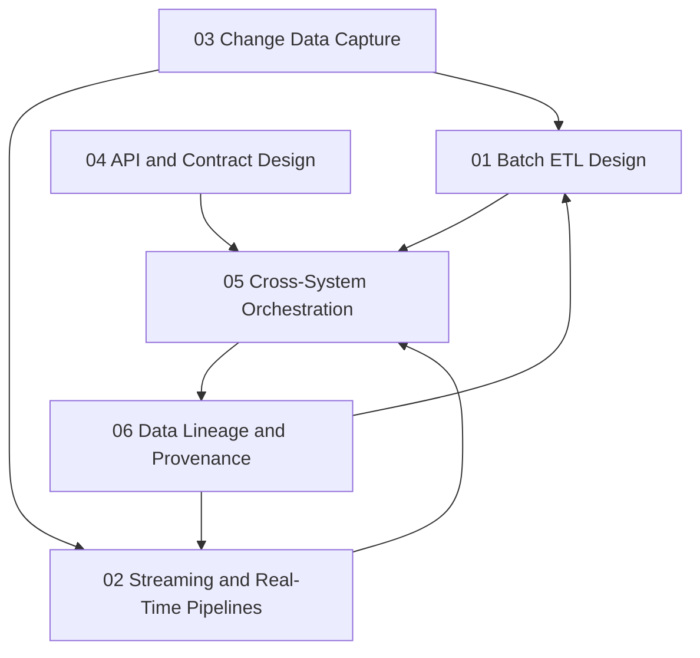

# Data Integration and Interoperability

> **Core idea:** Designing, building, and operating reliable data movement and consolidation systems that connect heterogeneous sources to consumers while preserving correctness, timeliness, and provenance.

## What This Means at Specialist Level

A mid-level engineer writes ETL jobs. A senior data engineer **designs the integration architecture, chooses the interaction model, and owns the end-to-end reliability contract** for data flowing across the organization.

Data integration is the circulatory system of any data-driven organization. Without it, analytics are stale, models train on drift, and operational systems operate on inconsistent state. The senior engineer is accountable for ensuring that data arrives correctly, on time, and with full traceability.

## Topic Notes

| # | Topic | Focus | Status | File |
|---|---|---|---|---|
| 01 | Batch ETL Design | Orchestration, idempotency, error handling, backfill | ✅ Done | `01_Batch_ETL_Design.md` |
| 02 | Streaming and Real-Time Pipelines | Event sourcing, exactly-once, windowing, late data | ✅ Done | `02_Streaming_and_Real_Time_Pipelines.md` |
| 03 | Change Data Capture | CDC patterns, log-based vs query-based, schema propagation | ✅ Done | `03_Change_Data_Capture.md` |
| 04 | API and Contract Design | Data API versioning, GraphQL vs REST, contract testing | ✅ Done | `04_API_and_Contract_Design.md` |
| 05 | Cross-System Orchestration | DAG design, dependency management, SLA cascading | ✅ Done | `05_Cross_System_Orchestration.md` |
| 06 | Data Lineage and Provenance | End-to-end lineage, impact analysis, compliance lineage | ✅ Done | `06_Data_Lineage_and_Provenance.md` |

**Completion:** 6/6 : 100%

## How the Topics Connect

**Reading order:** Start with Batch ETL Design to understand the foundational pipeline pattern. Then Streaming and Real-Time Pipelines for low-latency scenarios. Change Data Capture bridges batch and streaming. API and Contract Design covers how producers and consumers agree on interfaces. Cross-System Orchestration ties individual pipelines into enterprise workflows. Data Lineage and Provenance closes the loop with traceability.

## Existing Vault Anchors

These topic notes **do not duplicate** the existing knowledge base. They layer specialist-level application on top of it:

| Specialist topic | Existing foundation notes |
|---|---|
| Batch ETL Design | [[06_Data_Integration_and_Interoperability]] |
| Streaming Pipelines | [[06_Data_Integration_and_Interoperability]] |
| Change Data Capture | [[06_Data_Integration_and_Interoperability]] |
| API and Contract Design | [[software-engineering-note/06_Software_Engineering_Operations/08_Service_Operations_and_Support]] |
| Cross-System Orchestration | [[06_Data_Integration_and_Interoperability]] |
| Data Lineage | [[DMBoK v2 - Overview]] |

## Self-Assessment Checklist

- [ ] I can choose between ETL and ELT based on transformation complexity and target capabilities
- [ ] I have designed a pipeline that is idempotent and safe to re-run
- [ ] I can explain exactly-once semantics and when at-least-once is acceptable
- [ ] I have implemented CDC with log-based capture and schema evolution handling
- [ ] I have defined data contracts with versioning and breaking-change policies
- [ ] I can design a DAG that cascades SLAs and recovers from partial failure
- [ ] I can trace any data point from consumption back to its origin system

## Related

- [[00_overview|Data and ML Engineer Overview]]
- [[04_Data_Quality/00_overview|Data Quality]] : quality depends on integration correctness
- [[01_Data_Architecture/00_overview|Data Architecture]] : architecture defines what to integrate
- [[career-path/02_Senior_Software_Engineer/03_Architecture_and_Design_Judgment/00_overview|Architecture and Design Judgment]] : general architecture decision-making
