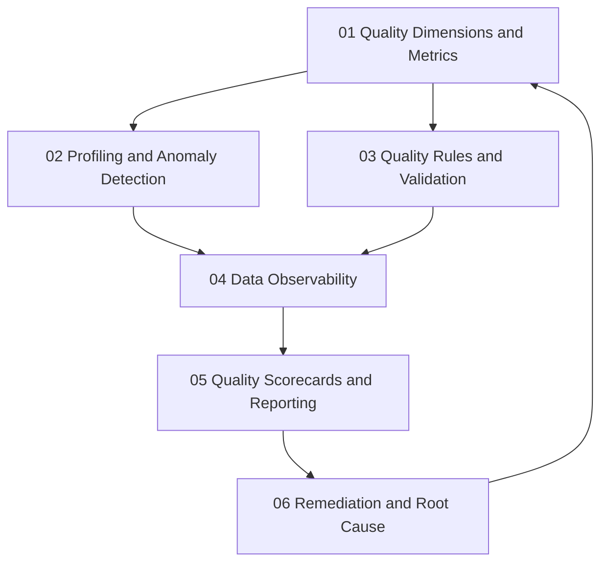

# Data Quality

> **Core idea:** Defining, measuring, monitoring, and improving data fitness for purpose through systematic quality dimensions, rules, observability, and remediation.

## What This Means at Specialist Level

A mid-level engineer writes validation checks that fail pipelines. A senior data engineer **defines quality dimensions aligned with business impact, designs observability systems that detect drift before it causes harm, and leads root-cause remediation** that prevents recurrence.

Data quality is not about perfection: it is about fitness for purpose. The senior engineer understands that different consumers have different quality requirements, that quality degrades over time without active monitoring, and that prevention is always cheaper than correction.

## Topic Notes

| # | Topic | Focus | Status | File |
|---|---|---|---|---|
| 01 | Quality Dimensions and Metrics | Completeness, accuracy, timeliness, consistency | ✅ Done | `01_Quality_Dimensions_and_Metrics.md` |
| 02 | Profiling and Anomaly Detection | Statistical profiling, drift detection, outliers | ✅ Done | `02_Profiling_and_Anomaly_Detection.md` |
| 03 | Quality Rules and Validation | Declarative rules, schema validation, custom checks | ✅ Done | `03_Quality_Rules_and_Validation.md` |
| 04 | Data Observability | Monitoring freshness, volume, schema drift, lineage impact | ✅ Done | `04_Data_Observability.md` |
| 05 | Quality Scorecards and Reporting | Dashboards, SLA tracking, trend analysis | ✅ Done | `05_Quality_Scorecards_and_Reporting.md` |
| 06 | Remediation and Root Cause | Fixing at source, feedback loops, prevention | ✅ Done | `06_Remediation_and_Root_Cause.md` |

**Completion:** 6/6 : 100%

## How the Topics Connect

**Reading order:** Start with Quality Dimensions and Metrics to understand what quality means in measurable terms. Then Profiling and Anomaly Detection to discover current state. Quality Rules and Validation shows how to encode expectations. Data Observability covers continuous monitoring. Quality Scorecards and Reporting makes quality visible to stakeholders. Remediation and Root Cause closes the loop with systematic improvement.

## Existing Vault Anchors

These topic notes **do not duplicate** the existing knowledge base. They layer specialist-level application on top of it:

| Specialist topic | Existing foundation notes |
|---|---|
| Quality Dimensions | [[11_Data_Quality]] |
| Profiling | [[11_Data_Quality]] |
| Quality Rules | [[11_Data_Quality]] |
| Data Observability | [[career-path/07_SRE_and_Platform_Engineer/02_Observability/00_overview]] |
| Scorecards | [[11_Data_Quality]] |
| Remediation | [[11_Data_Quality]] |

## Self-Assessment Checklist

- [ ] I can name the six core quality dimensions and define measurable targets for each
- [ ] I have profiled a data set and identified anomalies using statistical methods
- [ ] I have written declarative quality rules that run automatically in pipelines
- [ ] I can detect schema drift and distribution shift before they cause downstream failures
- [ ] I have built a quality scorecard that stakeholders actually read and act on
- [ ] I have traced a quality issue to its root cause and implemented a preventive fix
- [ ] I can explain the cost of poor data quality in business terms, not just technical terms

## Related

- [[00_overview|Data and ML Engineer Overview]]
- [[03_Data_Integration_and_Interoperability/00_overview|Data Integration and Interoperability]] : integration correctness affects quality
- [[02_Data_Modeling_and_Design/00_overview|Data Modeling and Design]] : model design constrains quality
- [[career-path/02_Senior_Software_Engineer/05_Quality_Reliability_Security/00_overview|Quality, Reliability, and Security]] : general quality engineering principles
