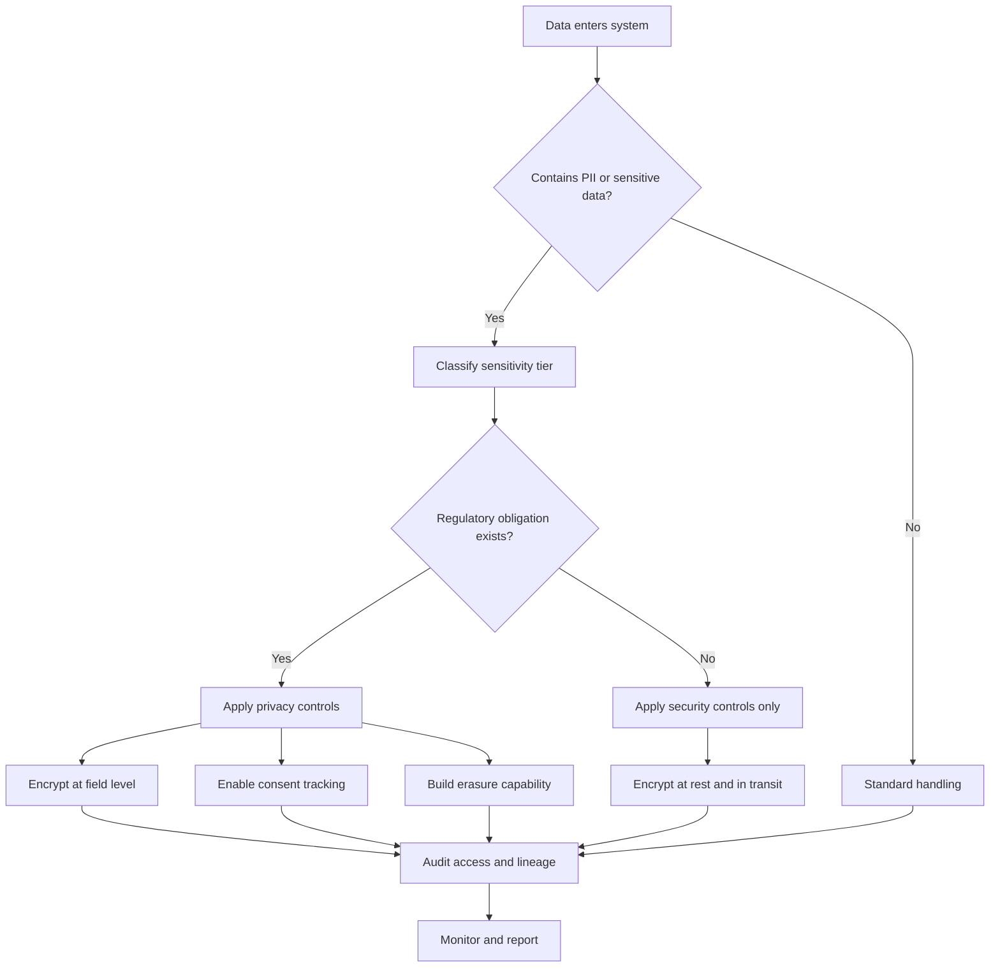

# Data Security and Privacy

> **Capability area:** Protecting data throughout its lifecycle while meeting privacy obligations and regulatory requirements.

## Why This Matters at Senior Level

A mid-level engineer implements security controls as specified. A senior data/ML engineer decides which controls are appropriate, balances security against usability and cost, and takes accountability when data is shared across organizational boundaries.

Senior judgment shows in:
- Choosing encryption granularity based on threat models and performance budgets
- Designing access control that scales without blocking legitimate analytics
- Building privacy-compliant pipelines that survive regulatory audits
- Establishing audit trails that prove compliance without degrading pipeline performance

## Topics in This Area

| # | Topic | Senior Focus |
|---|-------|-------------|
| 01 | [[01_Data_Classification_and_Sensitivity]] | Defining sensitivity tiers and handling rules |
| 02 | [[02_Encryption_and_Tokenization]] | Choosing encryption scope and managing key lifecycle |
| 03 | [[03_Access_Control_for_Data]] | Designing row-level and attribute-based access |
| 04 | [[04_Privacy_Engineering]] | Embedding GDPR/CCPA compliance into pipelines |
| 05 | [[05_Audit_and_Lineage_for_Compliance]] | Building immutable audit trails for regulators |
| 06 | [[06_Secure_Data_Sharing]] | Sharing data safely across organizations |

## Decision Flow: Data Protection Strategy

## Key Principles

- Classification drives everything: you cannot protect what you have not identified
- Encryption is necessary but not sufficient: access control, audit, and minimization complete the picture
- Privacy is a pipeline concern: bolting it on after the fact is expensive and fragile
- Audit trails must be tamper-evident and queryable by compliance teams
- Data sharing requires explicit agreements, not implicit trust

## Connections

- [[05_Data_Security]]: DMBOK security chapter
- [[CyBOK v1 - Overview]]: cybersecurity knowledge areas
- [[04_Data_Quality/00_overview|Data Quality]]: quality rules interact with access rules
- [[03_Data_Integration_and_Interoperability/00_overview|Data Integration]]: security boundaries at integration points

## Common Anti-Patterns

| Anti-Pattern | Why It Fails | Better Approach |
|-------------|-------------|-----------------|
| Security as afterthought | Retrofitting controls is 10x more expensive | Embed security in design reviews |
| Encrypt everything | Performance degradation, key management burden | Classify first, encrypt proportionally |
| Manual access reviews | Missed grants, stale permissions | Automated access reporting with quarterly review |
| Privacy as legal-only problem | Engineers bypass processes they do not understand | Privacy engineering: compliance as code |
| Audit logs without analysis | Logs accumulate without actionable insight | Automated anomaly detection on access patterns |

## Maturity Signals

- Every new table is automatically scanned for sensitive data classification
- Access control changes go through automated approval with time-limited grants
- Privacy impact assessments are completed before any new data collection
- Compliance reports are generated automatically without engineering involvement
- Audit logs are tamper-evident and retained per regulatory requirements

## Sources

- [[DMBoK v2 - Overview]]: Chapter 7 Data Security
- [[CyBOK v1 - Overview]]: Privacy and cryptography knowledge areas
