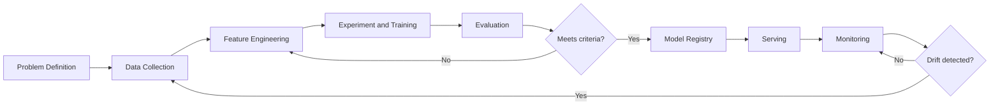

# ML Lifecycle and MLOps

> **Capability area:** Managing the full lifecycle of machine learning models from experiment through production, monitoring, and retirement.

## Why This Matters at Senior Level

A mid-level engineer trains a model and hands it off. A senior ML engineer owns the model from experiment to retirement: designing reproducible training, choosing serving patterns, detecting drift before users notice, and establishing governance that satisfies regulators.

Senior judgment shows in:
- Choosing experiment tracking granularity that enables reproduction without drowning in artifacts
- Designing feature stores that serve both training and inference without skew
- Selecting evaluation metrics that align with business outcomes, not just statistical accuracy
- Building monitoring that catches drift before it degrades user experience

## Topics in This Area

| # | Topic | Senior Focus |
|---|-------|-------------|
| 01 | [[01_Experiment_Tracking_and_Reproducibility]] | Reproducing any experiment from any point in time |
| 02 | [[02_Feature_Engineering_and_Feature_Store]] | Unifying offline and online feature serving |
| 03 | [[03_Model_Training_and_Evaluation]] | Choosing metrics that reflect business value |
| 04 | [[04_Model_Serving_and_Inference]] | Picking the right serving pattern for the use case |
| 05 | [[05_ML_Monitoring_and_Drift]] | Detecting degradation before users complain |
| 06 | [[06_Model_Governance_and_Cards]] | Documenting models for regulators and stakeholders |

## ML Lifecycle Flow

## Scope Boundary

This area covers the engineering lifecycle of ML models: how they are built, evaluated, served, monitored, and governed. It does not cover the mathematical foundations of algorithms, which belong in [[computing-foundation-note/Artificial_Intelligence/AI Overview]].

## Key Principles

- Reproducibility is non-negotiable: every production model must be retrainable from its recorded inputs
- Feature skew between training and serving is the most common production failure mode
- Evaluation metrics must reflect business outcomes, not just statistical accuracy
- Monitoring is not optional: undetected drift silently degrades user experience
- Model governance is a prerequisite for regulated industries, not an afterthought

## Common Anti-Patterns

| Anti-Pattern | Why It Fails | Better Approach |
|-------------|-------------|-----------------|
| Notebook-to-production handoff | No reproducibility, no monitoring | Full MLOps pipeline from experiment to serving |
| Optimizing accuracy only | Business metrics ignored | Define success metrics before training |
| Deploy and forget | Drift degrades silently | Continuous monitoring with retraining triggers |
| Feature store per team | No reuse, training-serving skew | Shared feature store with ownership model |
| Manual model promotion | Slow, error-prone, no audit trail | Automated promotion gates with approval workflow |

## Maturity Signals

- Every production model has a complete experiment record enabling exact reproduction
- Feature definitions are shared across teams through a central feature store
- Model promotion follows automated gates, not manual approvals
- Drift detection triggers investigation within hours, not weeks
- Model cards are generated automatically from experiment tracking metadata

## Connections

- [[computing-foundation-note/Artificial_Intelligence/AI Overview]]: AI fundamentals
- [[SWEBOK v4 - Overview]]: software engineering for ML systems
- [[04_Data_Quality/00_overview|Data Quality]]: training data quality determines model quality
- [[07_Production_Engineering/00_overview|Production Engineering]]: infrastructure that hosts models

## Sources

- [[SWEBOK v4 - Overview]]
- [[CyBOK v1 - Overview]]
