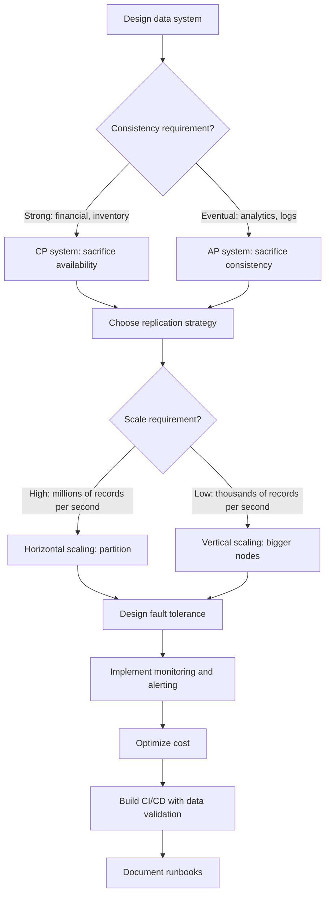

# Production Engineering

> **Capability area:** Operating distributed data systems reliably, efficiently, and cost-effectively at scale.

## Why This Matters at Senior Level

A mid-level engineer builds pipelines that work. A senior data/ML engineer builds pipelines that survive infrastructure failures, scale without manual intervention, and operate within budget constraints. Production engineering is the difference between a prototype and a system that runs for years without waking you up at 3 AM.

Senior judgment shows in:
- Designing idempotent pipelines that survive retries without duplicating data
- Choosing consistency models that match business requirements, not theoretical ideals
- Optimizing cost without sacrificing reliability or performance
- Building CI/CD that catches data quality issues before they reach production

## Topics in This Area

| # | Topic | Senior Focus |
|---|-------|-------------|
| 01 | [[01_Distributed_Systems_for_Data]] | Choosing consistency and partitioning strategies |
| 02 | [[02_Scaling_and_Performance_Tuning]] | Optimizing for the actual workload, not synthetic benchmarks |
| 03 | [[03_Reliability_and_Fault_Tolerance]] | Designing for failure, not hoping it does not happen |
| 04 | [[04_Cost_Optimization_for_Data_Systems]] | Balancing performance, reliability, and budget |
| 05 | [[05_CI_CD_for_Data_and_ML]] | Catching data quality issues in CI, not production |
| 06 | [[06_Operational_Runbooks_and_On_Call]] | Responding to incidents without heroics |

## Production Engineering Decision Flow

## Scope Boundary

This area covers the operational and infrastructure concerns of running data and ML systems in production. It does not cover application-level software engineering, which belongs in [[software-engineering-note/06_Software_Engineering_Operations/Software Engineering Operations Overview]].

## Key Principles

- Design for failure: every component will fail, every network will partition, every disk will fill
- Idempotency is the foundation: pipelines that can be safely retried survive infrastructure failures
- Consistency is a business decision: strong consistency costs more than eventual consistency, choose based on requirements
- Cost optimization is continuous: data systems accumulate cost over time, review quarterly
- Observability precedes reliability: you cannot fix what you cannot see

## Common Anti-Patterns

| Anti-Pattern | Why It Fails | Better Approach |
|-------------|-------------|-----------------|
| Hope-based reliability | Assuming infrastructure will not fail | Design for failure with retries, circuit breakers, fallbacks |
| Over-provisioning for peak | Resources sit idle 90% of the time | Auto-scaling with right-sized base capacity |
| Manual pipeline recovery | Hours of investigation for every failure | Idempotent pipelines that can be safely retried |
| Cost as afterthought | Monthly bill surprises | Cost monitoring with per-pipeline attribution |
| Data validation in production | Bad data reaches users | Data quality checks in CI before deployment |

## Maturity Signals

- Every pipeline is idempotent and can be safely retried after failure
- Dead letter queues capture failures for investigation, never silently drop data
- Cost per pipeline is monitored and attributed to teams
- Data validation runs in CI, catching quality issues before production
- Runbooks exist for every alert, written for 3 AM context

## Connections

- [[software-engineering-note/06_Software_Engineering_Operations/Software Engineering Operations Overview]]: operations fundamentals
- [[SWEBOK v4 - Overview]]: software engineering for production systems
- [[06_ML_Lifecycle_and_MLOps/00_overview|ML Lifecycle and MLOps]]: infrastructure that hosts models
- [[04_Data_Quality/00_overview|Data Quality]]: quality validation in production pipelines

## Sources

- [[SWEBOK v4 - Overview]]
