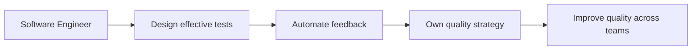

# Quality and Test Engineering

> **Positioning:** A specialist engineering path focused on building confidence that software is fit for purpose, safe to change, secure, reliable, and useful in its operating context.

## What This Path Is

Quality and test engineering is broader than executing test cases. It includes quality strategy, test design, automation, verification, validation, observability, defect prevention, and continuous improvement.

A strong quality engineer helps the whole team build quality in. The role may be called Quality Engineer, Test Engineer, SDET, Software Quality Engineer, or Test Architect depending on the organization.

## Primary Outcomes

- Meaningful confidence in software behavior
- Fast feedback for developers and delivery teams
- Appropriate test coverage for risks and quality attributes
- Fewer escaped defects and less costly rework
- Evidence for release and operational decisions
- A culture that treats quality as a shared engineering responsibility

## Capability Areas

| Capability | Specialist behavior | Existing vault anchor |
|---|---|---|
| Test strategy | Selects test levels and techniques according to risk | [[05_Software_Testing/Software Testing Overview]] |
| Test design | Uses equivalence, boundaries, decisions, paths, models, and exploratory methods | [[05_Software_Testing/02_Boundary_and_Equivalence]] |
| Automation | Builds maintainable, fast, and trustworthy automated checks | [[05_Software_Testing/09_Testing_Tools_and_Standards]] |
| Quality engineering | Prevents defects through reviews, design, process, and feedback | [[12_Software_Quality/Software Quality Overview]] |
| Specialized testing | Handles performance, security, reliability, AI, and domain risks | [[05_Software_Testing/10_Domain_Specific_Testing]] |
| Measurement | Uses defect, coverage, flow, and quality-cost measures responsibly | [[05_Software_Testing/12_Test_Process_and_Measures]] |

## Typical Progression

## Signals for Moving Forward

- You think in terms of risk, behavior, and evidence rather than only test counts.
- You can choose what not to test and explain the risk of that choice.
- Developers involve you early in requirements and design discussions.
- Your automation is trusted and gives fast, useful feedback.
- You improve the development system instead of becoming a final-stage gate.

## Evidence to Build

- Risk-based test strategy
- Test plan and traceability matrix
- Automated test architecture
- Performance-test report
- Security-test report
- Defect trend and quality-cost analysis
- Release quality report
- Quality improvement proposal

## Nearby Paths

- [[02_Senior_Software_Engineer|Senior Software Engineer]]: broad software ownership
- [[07_SRE_and_Platform_Engineer|SRE and Platform Engineer]]: production reliability
- [[08_Security_Engineer|Security Engineer]]: security verification and assurance
- [[06_Software_Architect|Software Architect]]: quality attributes and architecture trade-offs
- [[11_Engineering_Manager|Engineering Manager]]: people and delivery leadership

## Suggested Future Note Route

1. [[05_Software_Testing/Software Testing Overview]]
2. [[05_Software_Testing/01_Testing_Fundamentals]]
3. [[05_Software_Testing/06_Model_Based_and_Lifecycle]]
4. [[05_Software_Testing/09_Testing_Tools_and_Standards]]
5. [[05_Software_Testing/10_Domain_Specific_Testing]]
6. [[05_Software_Testing/11_AI_ML_Testing_and_Emerging]]
7. [[05_Software_Testing/12_Test_Process_and_Measures]]
8. [[12_Software_Quality/Software Quality Overview]]

## Sources

- [[SWEBOK v4 - Overview]]
- [[SEBoK v2 - Overview]]
- [[CyBOK v1 - Overview]]

## Related

- [[00_Career_Path_Overview]]
- [[01_Software_Engineer]]
- [[07_SRE_and_Platform_Engineer]]
- [[08_Security_Engineer]]
