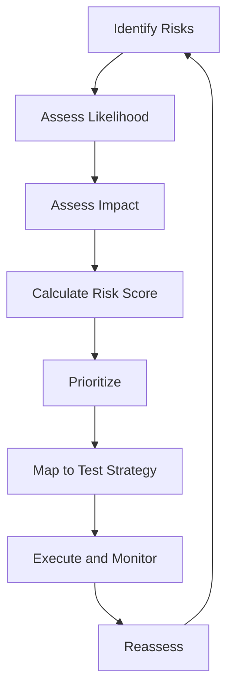
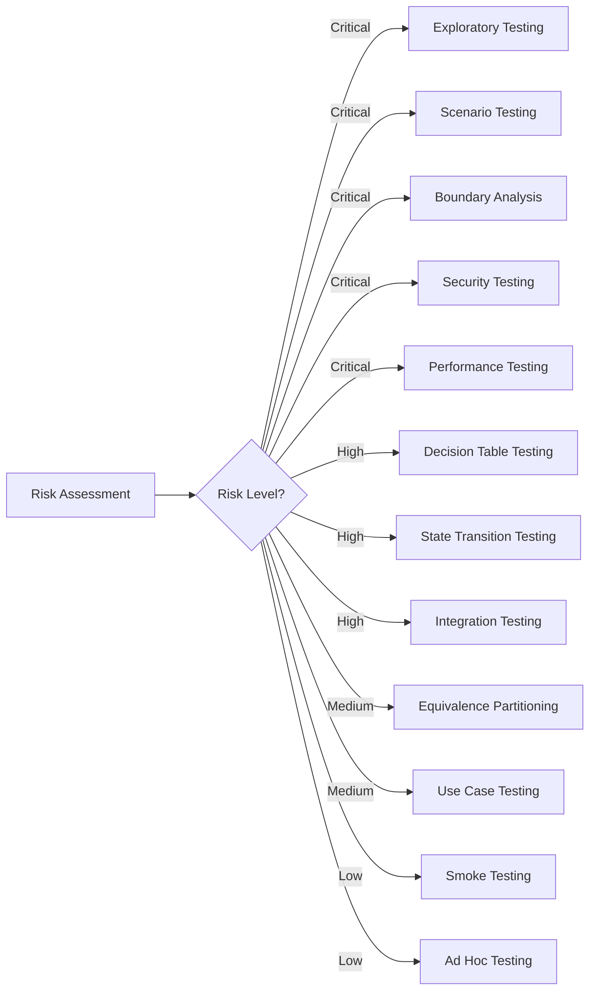
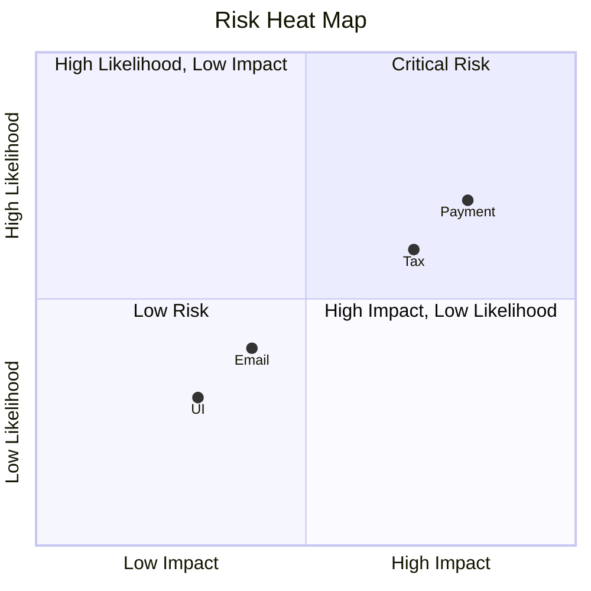

# Risk-Based Testing

> **Core Principle:** Test what matters most. Allocate testing effort proportionally to risk and impact.

## What Risk-Based Testing Is

Risk-based testing is a strategic approach that:

- Identifies what could go wrong
- Assesses the likelihood and impact of each risk
- Prioritizes testing effort toward high-risk areas
- Makes explicit decisions about what to test less (or not at all)

It is not about eliminating risk. It is about **making informed decisions** about where to invest limited testing resources.

## Why Risk-Based Testing Matters

Without risk-based thinking, teams fall into common traps:

| Trap | Symptom | Consequence |
|------|---------|-------------|
| **Test everything equally** | Same effort on login and admin panel | High-risk areas undertested |
| **Test what is easy** | Automate simple features first | Complex, critical logic untested |
| **Test what changed** | Only regression test modified code | Integration risks ignored |
| **Test what broke before** | Focus on historical defects | New risks not addressed |

Risk-based testing replaces these patterns with **deliberate, defensible choices**.

## The Risk Assessment Process



### Step 1: Identify Risks

Risks come from multiple sources:

**Technical risks:**
- Complex algorithms or business logic
- Integration with external systems
- New or unfamiliar technology
- Performance-critical paths
- Security-sensitive operations
- Data migration or transformation

**Business risks:**
- Revenue-generating features
- Compliance or regulatory requirements
- Customer-facing workflows
- Features with high visibility
- Contractual obligations

**Organizational risks:**
- Tight deadlines
- Limited testing resources
- Distributed teams
- High staff turnover
- Incomplete requirements

**Historical risks:**
- Areas with frequent defects
- Features with complex change history
- Modules with high technical debt

### Step 2: Assess Likelihood

Rate each risk on a scale (example: 1-5):

| Score | Likelihood | Description |
|-------|-----------|-------------|
| 1 | Very Low | Unlikely to occur in normal conditions |
| 2 | Low | Possible but not expected |
| 3 | Medium | Could happen with some frequency |
| 4 | High | Likely to occur |
| 5 | Very High | Almost certain to occur |

**Factors increasing likelihood:**
- Code complexity
- Number of dependencies
- Frequency of changes
- Lack of automated tests
- Inexperienced developers
- Ambiguous requirements

### Step 3: Assess Impact

Rate the consequence if the risk materializes:

| Score | Impact | Description |
|-------|--------|-------------|
| 1 | Negligible | Minor inconvenience, easy workaround |
| 2 | Low | Some user friction, limited scope |
| 3 | Medium | Noticeable degradation, affects some users |
| 4 | High | Significant impact, affects many users |
| 5 | Critical | System failure, data loss, regulatory breach |

**Impact dimensions:**
- **User impact:** How many users affected? How severely?
- **Business impact:** Revenue loss, reputation damage, legal exposure
- **Technical impact:** Data corruption, system instability, cascading failures
- **Operational impact:** Support burden, recovery time, manual intervention required

### Step 4: Calculate Risk Score

**Risk Score = Likelihood × Impact**

| | Impact 1 | Impact 2 | Impact 3 | Impact 4 | Impact 5 |
|---|---------|---------|---------|---------|---------|
| **Likelihood 5** | 5 | 10 | 15 | 20 | 25 |
| **Likelihood 4** | 4 | 8 | 12 | 16 | 20 |
| **Likelihood 3** | 3 | 6 | 9 | 12 | 15 |
| **Likelihood 2** | 2 | 4 | 6 | 8 | 10 |
| **Likelihood 1** | 1 | 2 | 3 | 4 | 5 |

### Step 5: Prioritize and Map to Test Strategy

| Risk Score | Priority | Test Strategy |
|-----------|----------|---------------|
| 20-25 | Critical | Extensive testing, multiple techniques, early and continuous |
| 12-19 | High | Thorough testing, combination of techniques |
| 6-11 | Medium | Targeted testing, focused techniques |
| 1-5 | Low | Minimal testing, spot checks, or accept risk |

## Risk-Based Testing Techniques

### Technique Selection by Risk Level



### Mapping Risks to Test Types

| Risk Category | Primary Test Types | Supporting Techniques |
|--------------|-------------------|----------------------|
| **Functional correctness** | Unit, integration, system tests | Decision tables, state transitions |
| **Performance** | Load, stress, endurance tests | Profiling, monitoring |
| **Security** | Penetration, vulnerability scans | Threat modeling, code review |
| **Reliability** | Chaos engineering, failure injection | FMEA, fault tree analysis |
| **Usability** | User acceptance, accessibility | Heuristic evaluation |
| **Compatibility** | Cross-browser, cross-platform | Matrix testing |
| **Data integrity** | Data validation, migration tests | Boundary analysis |

## Practical Risk Assessment Methods

### Method 1: Risk Workshop

**Participants:** Developers, testers, product owners, architects, operations

**Process:**
1. Brainstorm potential risks (15 minutes)
2. Rate likelihood and impact (30 minutes)
3. Discuss and resolve disagreements (15 minutes)
4. Prioritize and assign test owners (15 minutes)

**Output:** Risk register with test strategy mapping

### Method 2: Failure Mode and Effects Analysis (FMEA)

Systematic analysis of potential failure modes:

| Component | Failure Mode | Effect | Cause | Severity | Occurrence | Detection | RPN |
|-----------|-------------|--------|-------|----------|------------|-----------|-----|
| Payment API | Transaction timeout | User cannot complete purchase | Network latency | 5 | 3 | 4 | 60 |
| User DB | Data corruption | User data lost | Disk failure | 5 | 2 | 5 | 50 |

**RPN (Risk Priority Number) = Severity × Occurrence × Detection**

### Method 3: Risk Storming

Visual, collaborative technique:

1. Draw system architecture on whiteboard
2. Each participant places colored stickers:
   - **Red:** High risk areas
   - **Yellow:** Medium risk areas
   - **Green:** Low risk or well-tested areas
3. Discuss clustering patterns
4. Identify gaps and overlaps

### Method 4: Heuristic Risk Assessment

Quick assessment using heuristics:

**High-risk indicators:**
- New code with no test coverage
- Code changed by multiple developers
- Complex conditional logic (nested if/else, switch statements)
- External system integrations
- Asynchronous operations
- Database schema changes
- Security-critical paths (authentication, authorization, encryption)

**Low-risk indicators:**
- Simple CRUD operations
- Well-tested legacy code
- Isolated utility functions
- Static configuration
- Documentation-only changes

## Risk-Based Test Planning Example

### Scenario: E-commerce Checkout Redesign

**Risk Assessment:**

| Feature | Likelihood | Impact | Risk Score | Priority |
|---------|-----------|--------|-----------|----------|
| Payment processing | 3 | 5 | 15 | High |
| Tax calculation | 4 | 4 | 16 | High |
| Inventory deduction | 3 | 4 | 12 | High |
| Order confirmation email | 2 | 3 | 6 | Medium |
| Shipping address validation | 3 | 3 | 9 | Medium |
| Coupon application | 4 | 2 | 8 | Medium |
| Order history display | 2 | 2 | 4 | Low |
| Wishlist integration | 1 | 2 | 2 | Low |

**Test Strategy:**

**High-risk (Payment, Tax, Inventory):**
- Exploratory testing with edge cases
- Boundary analysis for amounts and quantities
- Integration testing with payment gateway
- Performance testing under load
- Security testing for PCI compliance
- Regression testing on every build

**Medium-risk (Email, Address, Coupon):**
- Functional testing with key scenarios
- Integration testing with dependent services
- Smoke testing on each deployment

**Low-risk (History, Wishlist):**
- Smoke testing
- Automated regression tests
- Manual spot checks

## Dynamic Risk Management

Risk assessment is not a one-time activity. Risks change as:

- **Requirements evolve:** New features introduce new risks
- **Code changes:** Refactoring may reduce or introduce risks
- **Defects emerge:** Production issues reveal hidden risks
- **Context shifts:** Business priorities or regulatory changes

### Risk Reassessment Triggers

| Trigger | Action |
|---------|--------|
| Major feature added | Reassess affected areas |
| Critical defect found | Review similar areas for same risk |
| Architecture change | Reassess integration and performance risks |
| Performance degradation | Reassess load and scalability risks |
| Security incident | Reassess all security-sensitive areas |
| Release approaching | Final risk review and test coverage check |

## Communicating Risk-Based Decisions

### To Stakeholders

**Do:**
- Explain which risks you are addressing and why
- Show the trade-off between testing effort and risk reduction
- Provide data on defect detection rates by risk level
- Be transparent about accepted risks

**Do not:**
- Use technical jargon without explanation
- Present risk as a single number without context
- Claim you have eliminated all risk
- Hide low-priority items without justification

### Risk Reporting Template

```
Test Coverage Summary (Release X.Y)

Critical Risks (Score 20-25): 3 identified, 3 addressed
- Payment processing: 147 tests, 100% pass, 2 defects found and fixed
- Tax calculation: 89 tests, 100% pass, 1 defect found and fixed
- Inventory sync: 64 tests, 98% pass, 1 known issue deferred (see JIRA-1234)

High Risks (Score 12-19): 5 identified, 5 addressed
- [Summary for each]

Medium Risks (Score 6-11): 12 identified, 10 addressed
- [Summary for each]
- 2 risks accepted due to time constraints (see risk acceptance form)

Low Risks (Score 1-5): 8 identified, 4 spot-checked
- [Summary]

Recommendation: Ready for release with monitoring plan in place
```

## Common Pitfalls

| Pitfall | Symptom | Solution |
|---------|---------|----------|
| **Risk assessment is a one-time activity** | Risk register created at project start, never updated | Schedule regular reassessment (weekly or per sprint) |
| **Subjective ratings without calibration** | Team members rate same risk differently | Define clear criteria for each likelihood and impact level |
| **Ignoring low-probability, high-impact risks** | "It will never happen" mentality | Consider worst-case scenarios for critical systems |
| **Over-focusing on technical risks** | Ignoring business or organizational risks | Include all risk categories in assessment |
| **No follow-through** | Risks identified but not tested | Map each risk to specific tests and assign owners |
| **Risk inflation** | Everything rated as critical | Use relative ranking, not absolute scores |

## Tools and Techniques

### Risk Register Template

| ID | Risk Description | Category | Likelihood | Impact | Score | Priority | Test Strategy | Owner | Status |
|----|-----------------|----------|-----------|--------|-------|----------|---------------|-------|--------|
| R001 | Payment timeout under load | Performance | 4 | 5 | 20 | Critical | Load test, monitor response times | Alice | In Progress |
| R002 | Tax calculation error | Functional | 3 | 5 | 15 | High | Decision table, boundary analysis | Bob | Complete |

### Risk Heat Map

Visual representation of risk distribution:



## Key Takeaways

1. **Risk-based testing is strategic, not reactive:** You proactively identify and address risks rather than waiting for defects to appear
2. **Risk assessment is collaborative:** Involve developers, testers, product owners, and operations
3. **Risk scores guide effort, not eliminate testing:** Even low-risk areas need some coverage
4. **Risk changes over time:** Reassess regularly as the project evolves
5. **Communicate risk decisions clearly:** Stakeholders need to understand what you are testing and what you are accepting

## Related Topics

- [[02_Test_Levels_and_Scope]]: Deciding what belongs at each test level
- [[03_Test_Planning]]: Creating actionable test plans
- [[05_Release_Strategy]]: Making release decisions based on risk

## Existing Vault Connections

- [[software-engineering-note/05_Software_Testing/06_Model_Based_and_Lifecycle]]: Risk-based testing in test lifecycle
- [[software-engineering-note/12_Software_Quality/04_Quality_Management]]: Risk management in quality processes
