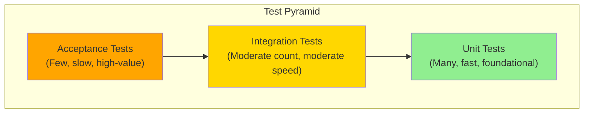
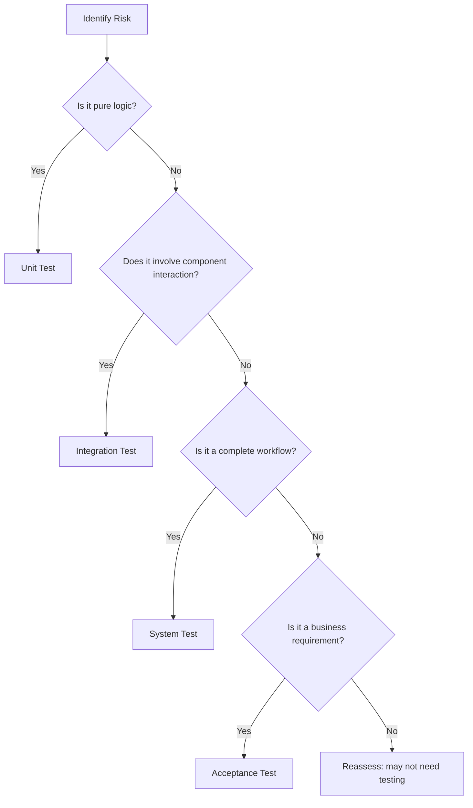
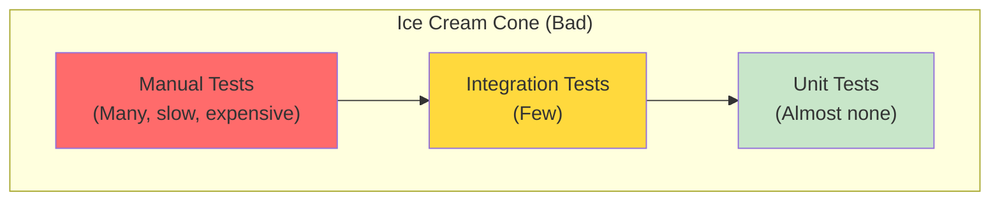

# Test Levels and Scope

> **Core Principle:** Each test level serves a distinct purpose. Choose the right level for the right risk.

## What Test Levels Are

Test levels are layers of testing that verify different aspects of software:

| Level | Scope | Purpose | Typical Owner |
|-------|-------|---------|---------------|
| **Unit** | Individual functions, methods, classes | Verify logic correctness in isolation | Developers |
| **Integration** | Interactions between components | Verify interfaces and data flow | Developers, Testers |
| **System** | Complete, integrated system | Verify end-to-end behavior | Testers, QA |
| **Acceptance** | Business requirements | Verify fitness for use | Product Owner, Users |

Each level answers different questions and catches different types of defects.

## The Test Pyramid

The test pyramid is a model for distributing tests across levels:



### Why the Pyramid Shape?

| Level | Count | Speed | Cost | Confidence |
|-------|-------|-------|------|-----------|
| Unit | High (thousands) | Fast (milliseconds) | Low | Logic correctness |
| Integration | Medium (hundreds) | Moderate (seconds) | Medium | Component interaction |
| Acceptance | Low (dozens) | Slow (minutes) | High | Business value |

**Benefits of the pyramid:**
- **Fast feedback:** Most tests run quickly
- **Maintainable:** Lower-level tests are easier to maintain
- **Cost-effective:** Catch defects early when they are cheap to fix
- **Reliable:** Unit and integration tests are less flaky

## When to Use Each Level

### Unit Tests

**Use when:**
- Testing pure logic (calculations, algorithms, transformations)
- Verifying error handling and edge cases
- Ensuring code correctness in isolation
- Building a safety net for refactoring

**Do not use for:**
- Testing integrations with databases, APIs, or file systems
- Verifying UI behavior
- Testing configuration or environment setup
- Validating business workflows

**Example:**
```python
# Good unit test: tests pure logic
def test_calculate_discount():
    assert calculate_discount(100, 0.1) == 90
    assert calculate_discount(100, 0.0) == 100
    assert calculate_discount(0, 0.5) == 0

# Bad unit test: depends on database
def test_get_user():
    user = get_user_from_db(123)  # Requires real DB
    assert user.name == "Alice"
```

### Integration Tests

**Use when:**
- Testing interactions between components
- Verifying database queries and transactions
- Testing API contracts and protocols
- Validating external service integrations
- Checking configuration and environment dependencies

**Do not use for:**
- Testing pure logic (use unit tests)
- Testing complete user workflows (use acceptance tests)
- Verifying UI rendering

**Example:**
```python
# Good integration test: tests database interaction
def test_create_user():
    # Arrange
    db = setup_test_database()
    
    # Act
    user_id = create_user(db, name="Alice", email="alice@example.com")
    
    # Assert
    user = db.get_user(user_id)
    assert user.name == "Alice"
    assert user.email == "alice@example.com"
    
    # Cleanup
    db.teardown()
```

### System Tests

**Use when:**
- Testing complete workflows end-to-end
- Verifying system behavior under realistic conditions
- Validating cross-component scenarios
- Testing non-functional requirements (performance, security)

**Do not use for:**
- Testing individual components in isolation
- Verifying business acceptance criteria (use acceptance tests)
- Testing every possible code path

**Example:**
```python
# Good system test: tests complete workflow
def test_user_registration_workflow():
    # Simulate real HTTP requests to running application
    response = client.post("/register", json={
        "name": "Alice",
        "email": "alice@example.com",
        "password": "securepass123"
    })
    
    assert response.status_code == 201
    assert "user_id" in response.json()
    
    # Verify user can log in
    login_response = client.post("/login", json={
        "email": "alice@example.com",
        "password": "securepass123"
    })
    assert login_response.status_code == 200
```

### Acceptance Tests

**Use when:**
- Validating business requirements
- Verifying user-facing features
- Demonstrating value to stakeholders
- Supporting release decisions

**Do not use for:**
- Testing technical implementation details
- Covering every code path
- Regression testing (too slow and expensive)

**Example:**
```gherkin
# Good acceptance test: written in business language
Feature: User Registration
  As a new user
  I want to register for an account
  So that I can access the platform

  Scenario: Successful registration with valid details
    Given I am on the registration page
    When I enter my name as "Alice"
    And I enter my email as "alice@example.com"
    And I enter a secure password
    And I click the register button
    Then I should see a confirmation message
    And I should receive a welcome email
    And I should be able to log in with my credentials
```

## Risk-Based Test Level Selection

### Mapping Risks to Test Levels

| Risk Type | Primary Test Level | Supporting Levels |
|-----------|-------------------|-------------------|
| **Logic errors** | Unit | Integration |
| **Integration failures** | Integration | System |
| **Performance issues** | System (load tests) | Unit (profiling) |
| **Security vulnerabilities** | Integration, System | Unit (security checks) |
| **Usability problems** | Acceptance | System |
| **Data integrity issues** | Integration | System, Acceptance |
| **Business rule violations** | Acceptance | System, Unit |

### Decision Framework



## Test Level Anti-Patterns

### Anti-Pattern 1: Ice Cream Cone

**Problem:** Too many manual/acceptance tests, too few unit tests



**Consequences:**
- Slow feedback loops
- Expensive to maintain
- Flaky tests
- Low confidence

**Solution:** Invest in unit and integration tests, reduce manual testing

### Anti-Pattern 2: Cupcake

**Problem:** Too many tests at every level (over-testing)

**Consequences:**
- Redundant coverage
- Slow test suites
- High maintenance cost
- Diminishing returns

**Solution:** Apply test pyramid principles, eliminate redundancy

### Anti-Pattern 3: Unit Test Abuse

**Problem:** Unit tests that test implementation details, not behavior

```python
# Bad: tests implementation, not behavior
def test_calculate_total_calls_tax_service():
    calculator = Calculator()
    calculator.tax_service = Mock()
    
    calculator.calculate_total(100)
    
    # This tests HOW it works, not WHAT it does
    calculator.tax_service.calculate.assert_called_once_with(100)

# Good: tests behavior
def test_calculate_total_includes_tax():
    calculator = Calculator()
    
    total = calculator.calculate_total(100)
    
    assert total == 110  # 100 + 10% tax
```

**Solution:** Test behavior (inputs and outputs), not implementation

### Anti-Pattern 4: Integration Test Overuse

**Problem:** Using integration tests for things that could be unit tested

**Consequences:**
- Slow test suites
- Flaky tests due to external dependencies
- Hard to debug failures

**Solution:** Use test doubles (mocks, stubs) in unit tests, reserve integration tests for real interactions

## Test Level Coverage Strategy

### Coverage by Risk Level

| Risk Level | Unit Coverage | Integration Coverage | System Coverage | Acceptance Coverage |
|-----------|---------------|---------------------|-----------------|-------------------|
| **Critical** | 90%+ | Key scenarios | End-to-end workflows | All acceptance criteria |
| **High** | 80%+ | Important paths | Critical workflows | Key acceptance criteria |
| **Medium** | 70%+ | Happy path | Smoke tests | Critical criteria |
| **Low** | 50%+ | Minimal | Spot checks | Deferred or sampled |

### Coverage Metrics That Matter

**Do measure:**
- **Risk coverage:** Percentage of identified risks with tests
- **Critical path coverage:** Percentage of critical workflows tested
- **Defect detection rate:** Percentage of defects found by each level
- **Test execution time:** Time to run each test level

**Do not measure:**
- **Code coverage as a goal:** High coverage does not mean good tests
- **Test count:** More tests is not always better
- **Lines of test code:** Encourages verbose, low-value tests

## Practical Guidelines

### Unit Tests

**Aim for:**
- Fast execution (< 100ms per test)
- No external dependencies (use mocks/stubs)
- Test one concept per test
- Descriptive test names
- AAA pattern (Arrange, Act, Assert)

**Example structure:**
```python
def test_[what]_[when]_[expected]():
    # Arrange
    input_data = create_test_data()
    
    # Act
    result = function_under_test(input_data)
    
    # Assert
    assert result == expected_value
```

### Integration Tests

**Aim for:**
- Test real interactions (database, APIs, file system)
- Use test containers or in-memory databases
- Clean up after each test
- Test error conditions and edge cases
- Moderate execution time (seconds per test)

**Example structure:**
```python
def test_[component]_[interaction]_[scenario]():
    # Setup real dependencies
    db = setup_test_database()
    api_client = create_api_client()
    
    # Test interaction
    result = component.do_something(db, api_client)
    
    # Verify side effects
    assert db.state == expected
    assert api_client.calls == expected
    
    # Cleanup
    cleanup(db, api_client)
```

### System Tests

**Aim for:**
- Test complete workflows
- Use realistic data and configurations
- Test in environment similar to production
- Include performance and security tests
- Slower execution (minutes per test)

### Acceptance Tests

**Aim for:**
- Written in business language (Gherkin, user stories)
- Executable by non-technical stakeholders
- Focus on user value
- Demonstrate fitness for purpose
- Few in number, high in value

## Test Level Migration

Sometimes tests need to move between levels:

| From | To | When |
|------|----|----|
| Unit | Integration | When you realize the test depends on real interactions |
| Integration | Unit | When you can mock the dependency and test logic only |
| System | Integration | When you want faster feedback and more precise failure location |
| Integration | System | When the test needs full environment context |
| Manual | Automated | When the test is stable and worth automating |
| Automated | Manual | When the test is too flaky or expensive to maintain |

## Key Takeaways

1. **Each test level has a purpose:** Unit tests verify logic, integration tests verify interactions, system tests verify workflows, acceptance tests verify value
2. **Follow the test pyramid:** Many fast unit tests, fewer integration tests, even fewer system and acceptance tests
3. **Match test level to risk:** Critical risks need coverage at multiple levels, low risks need minimal coverage
4. **Avoid anti-patterns:** Ice cream cones, cupcakes, and unit test abuse all lead to inefficient test suites
5. **Measure what matters:** Focus on risk coverage and defect detection, not code coverage or test count

## Related Topics

- [[01_Risk_Based_Testing]]: Using risk to guide test level selection
- [[03_Test_Planning]]: Planning test coverage across levels
- [[04_Test_Estimation]]: Estimating effort for each test level

## Existing Vault Connections

- [[software-engineering-note/05_Software_Testing/01_Testing_Fundamentals]]: Test level definitions
- [[software-engineering-note/05_Software_Testing/06_Model_Based_and_Lifecycle]]: Test levels in lifecycle models
