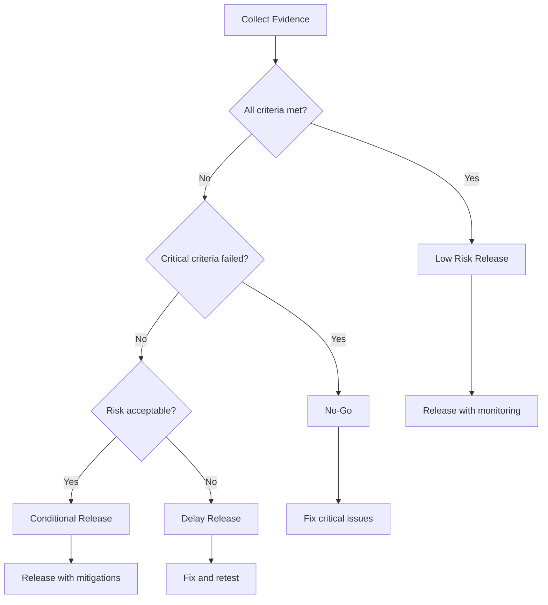
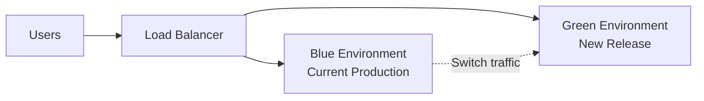

# Release Strategy

> **Core Principle:** Release decisions are risk-based, evidence-driven, and transparent about residual risk.

## What Release Strategy Is

Release strategy answers: **Is this software ready to go live?**

It involves:
- **Defining release criteria:** What must be true before release
- **Collecting evidence:** Test results, defect data, coverage metrics
- **Assessing risk:** What could go wrong if we release
- **Making recommendations:** Go, no-go, or conditional release
- **Planning rollback:** What to do if release fails

A good release strategy is **data-driven**, **transparent**, and **aligned with business risk tolerance**.

## Why Release Strategy Matters

**Releasing too early:**
- Critical defects escape to production
- Customer trust damaged
- Support costs increase
- Reputation harmed
- Emergency patches required

**Releasing too late:**
- Missed market opportunities
- Competitor advantage
- Revenue delayed
- Team frustration
- Perfectionism culture

**Good release strategy:**
- Balances quality with speed
- Makes informed risk decisions
- Builds stakeholder confidence
- Enables continuous delivery
- Supports business objectives

## Release Criteria

### Defining Release Criteria

Release criteria are measurable conditions that must be met before release:

**Functional criteria:**
- All critical and high-priority tests pass
- No open critical or high-severity defects
- Test coverage meets target (e.g., 80% code coverage)
- All acceptance criteria verified
- Regression tests pass

**Non-functional criteria:**
- Performance tests meet SLA (e.g., response time < 2s)
- Security vulnerabilities remediated
- Accessibility standards met (e.g., WCAG 2.1 AA)
- Reliability tests pass (e.g., 99.9% uptime in staging)

**Process criteria:**
- Code review completed
- Documentation updated
- Stakeholder sign-off received
- Deployment plan approved
- Rollback plan tested

### Release Criteria Examples

**Example 1: E-commerce Feature Release**

```markdown
Release Criteria: Shopping Cart Redesign

Functional:
✓ All 147 test cases executed
✓ 100% pass rate
✓ No open critical defects
✓ No open high-severity defects
✓ 2 medium defects deferred (JIRA-1234, JIRA-1235) with workarounds

Performance:
✓ Load test: 1000 concurrent users, avg response time 1.2s (< 2s target)
✓ Stress test: System handles 2000 concurrent users gracefully

Security:
✓ OWASP Top 10 scan: No critical or high vulnerabilities
✓ PCI compliance verified
✓ Penetration test completed, findings remediated

Process:
✓ Code review: 2 approvals received
✓ Documentation: User guide updated
✓ Stakeholder sign-off: Product owner, QA lead, ops lead approved

Recommendation: READY FOR RELEASE
```

**Example 2: Conditional Release**

```markdown
Release Criteria: Payment Gateway Integration

Functional:
✓ 95% test cases executed (12 of 240 deferred due to environment issue)
✓ 98% pass rate (2 failures in deferred tests)
✓ No open critical defects
✓ 1 high-severity defect open (JIRA-2345) with workaround

Performance:
✓ Load test: Meets SLA for normal load
⚠ Stress test: Degrades above 500 concurrent users (target: 1000)

Security:
✓ Security scan passed
⚠ Third-party audit pending (scheduled for next week)

Risk Assessment:
- High defect has workaround (manual payment processing)
- Performance degradation affects <5% of traffic based on analytics
- Security audit likely to pass based on internal scan results

Recommendation: CONDITIONAL RELEASE
Conditions:
1. Monitor performance closely
2. Have manual payment process ready
3. Schedule hotfix for high-severity defect within 48 hours
4. Complete security audit within 1 week
5. Rollback if performance degrades >10% in production
```

## Release Readiness Assessment

### Release Readiness Checklist

**Test Completion:**
- [ ] All planned tests executed
- [ ] Test coverage targets met
- [ ] Regression tests pass
- [ ] Exploratory testing completed
- [ ] Edge cases tested

**Defect Status:**
- [ ] No open critical defects
- [ ] No open high-severity defects (or documented workarounds)
- [ ] Medium defects reviewed and accepted
- [ ] Defect trend is decreasing
- [ ] Root cause analysis completed for critical defects

**Quality Metrics:**
- [ ] Code coverage meets target
- [ ] Defect density within acceptable range
- [ ] Test execution time within budget
- [ ] Automation coverage meets target

**Non-Functional Requirements:**
- [ ] Performance tests meet SLA
- [ ] Security tests pass
- [ ] Accessibility standards met
- [ ] Reliability tests pass

**Documentation:**
- [ ] User documentation updated
- [ ] Technical documentation updated
- [ ] Release notes prepared
- [ ] Known issues documented

**Stakeholder Approval:**
- [ ] Product owner sign-off
- [ ] Development team sign-off
- [ ] QA team sign-off
- [ ] Operations team sign-off
- [ ] Security team sign-off (if applicable)

**Deployment Readiness:**
- [ ] Deployment plan reviewed
- [ ] Rollback plan tested
- [ ] Monitoring in place
- [ ] Support team trained
- [ ] Communication plan ready

### Release Readiness Scorecard

| Category | Criteria | Status | Score |
|----------|----------|--------|-------|
| **Test Completion** | All tests executed | ✓ | 10/10 |
| | Coverage target met | ✓ | 10/10 |
| | Regression pass | ✓ | 10/10 |
| **Defect Status** | No critical defects | ✓ | 20/20 |
| | No high defects | ⚠ | 15/20 |
| | Defect trend decreasing | ✓ | 10/10 |
| **Performance** | Meets SLA | ✓ | 10/10 |
| **Security** | Tests pass | ✓ | 10/10 |
| **Documentation** | Complete | ✓ | 5/5 |
| **Approval** | All stakeholders | ✓ | 5/5 |
| **TOTAL** | | | **105/110** |

**Scoring:**
- 100-110: Ready for release
- 90-99: Ready with minor risks
- 80-89: Conditional release
- <80: Not ready

## Risk-Based Release Decisions

### Release Decision Matrix



### Risk Assessment for Release

| Risk Level | Criteria | Decision |
|-----------|----------|----------|
| **Low** | All criteria met, no known issues | Release |
| **Medium** | Minor issues with workarounds, non-critical criteria not met | Conditional release with monitoring |
| **High** | Significant issues, performance concerns, incomplete testing | Delay or limited release |
| **Critical** | Critical defects, security vulnerabilities, data integrity issues | No release |

### Risk Acceptance

When criteria are not fully met, stakeholders may accept risk:

**Risk Acceptance Form:**

```markdown
Risk Acceptance: Release X.Y

Risk Description:
Payment processing has a known defect (JIRA-2345) that causes 2% of 
transactions to timeout under high load.

Impact:
- Affected users: Estimated 200 users per day
- Business impact: Lost sales, customer frustration
- Workaround: Manual retry or contact support

Mitigation:
- Monitor transaction success rate
- Increase support staff during peak hours
- Hotfix scheduled for 48 hours after release

Risk Owner: Product Owner (Jane Smith)

Acceptance Rationale:
- Defect affects <2% of transactions
- Workaround available
- Hotfix ready and tested
- Business opportunity cost of delay: $500K

Approved by:
- Product Owner: Jane Smith
- QA Lead: John Doe
- Operations Lead: Bob Johnson
- CTO: Alice Williams

Date: 2026-01-20
```

## Release Strategies

### Strategy 1: Big Bang Release

**Description:** Release everything at once to all users

**When to use:**
- Small, low-risk changes
- Internal systems
- Mandatory updates (security patches)

**Pros:**
- Simple to manage
- All users on same version
- No version compatibility issues

**Cons:**
- High risk if something goes wrong
- Difficult to rollback
- Large blast radius

**Risk Mitigation:**
- Thorough testing
- Rollback plan
- Off-hours deployment
- Monitoring in place

### Strategy 2: Phased Release

**Description:** Release to subset of users, then expand

**Phases:**
1. Internal testing (employees)
2. Beta users (opt-in customers)
3. 10% of users
4. 50% of users
5. 100% of users

**When to use:**
- High-risk changes
- New features
- Performance-sensitive systems

**Pros:**
- Limits blast radius
- Early feedback
- Can stop if issues found
- Builds confidence gradually

**Cons:**
- More complex to manage
- Multiple versions in production
- Longer release cycle

**Risk Mitigation:**
- Define success criteria for each phase
- Monitor metrics closely
- Have rollback plan for each phase

### Strategy 3: Blue-Green Deployment

**Description:** Two identical environments, switch traffic between them



**Process:**
1. Deploy new version to Green environment
2. Test Green environment
3. Switch load balancer to Green
4. Monitor Green
5. If issues, switch back to Blue

**When to use:**
- Zero-downtime deployments required
- High-availability systems
- Critical business applications

**Pros:**
- Zero downtime
- Instant rollback
- Easy to test in production-like environment
- Low risk

**Cons:**
- Requires duplicate infrastructure
- Database migration complexity
- Higher cost

**Risk Mitigation:**
- Test database migration thoroughly
- Monitor both environments
- Have rollback procedure ready

### Strategy 4: Canary Release

**Description:** Release to small percentage of users, monitor, then expand

**Process:**
1. Deploy new version to canary instances (5% of capacity)
2. Route 5% of traffic to canary
3. Monitor for 24 hours
4. If metrics good, increase to 25%
5. Monitor for 24 hours
6. If metrics good, increase to 100%

**When to use:**
- Continuous delivery
- Performance-sensitive changes
- A/B testing

**Pros:**
- Gradual rollout
- Real user feedback
- Can stop early if issues
- Data-driven decisions

**Cons:**
- Complex routing logic
- Multiple versions running
- Requires good monitoring

**Risk Mitigation:**
- Define success metrics upfront
- Automate rollback on metric degradation
- Monitor error rates, latency, user feedback

### Strategy 5: Feature Flags

**Description:** Deploy code but disable features via configuration

**Process:**
1. Deploy code with features disabled
2. Enable features for internal users
3. Enable for beta users
4. Enable for all users
5. Remove feature flags after stabilization

**When to use:**
- Decouple deployment from release
- A/B testing
- Gradual feature rollout
- Emergency kill switch

**Pros:**
- Deploy anytime, release anytime
- Instant rollback without redeployment
- A/B testing capability
- Reduces deployment risk

**Cons:**
- Code complexity
- Feature flag management overhead
- Technical debt if flags not removed

**Risk Mitigation:**
- Use feature flag management tool
- Set expiration dates for flags
- Regular cleanup of old flags

## Release Decision Process

### Step 1: Collect Evidence

**Test Results:**
- Test execution summary
- Pass/fail rates
- Coverage metrics
- Defect data

**Quality Metrics:**
- Defect density
- Defect trend
- Test effectiveness
- Code quality metrics

**Non-Functional Metrics:**
- Performance test results
- Security scan results
- Accessibility audit
- Reliability metrics

**Stakeholder Input:**
- Product owner assessment
- Development team confidence
- Operations readiness
- Customer feedback (if available)

### Step 2: Assess Against Criteria

Compare evidence against release criteria:
- Which criteria are met?
- Which criteria are not met?
- What is the impact of unmet criteria?
- Are there workarounds?

### Step 3: Identify Risks

For unmet criteria or known issues:
- What is the likelihood of problems?
- What is the impact if problems occur?
- What mitigations are available?
- What is the residual risk?

### Step 4: Make Recommendation

Based on evidence and risk assessment:

**Recommendation options:**
1. **Go:** All criteria met, low risk
2. **Conditional Go:** Minor issues, acceptable risk with mitigations
3. **No-Go:** Critical issues, unacceptable risk
4. **Delay:** Need more time to address issues

**Recommendation format:**

```markdown
Release Recommendation: Version 2.3

Recommendation: CONDITIONAL GO

Evidence Summary:
- 98% test pass rate (2 failures in low-priority tests)
- No critical or high-severity defects
- Performance meets SLA
- Security scan passed

Risks:
- 2 low-priority defects with workarounds
- Performance degrades 15% above 2000 concurrent users (current peak: 1500)

Mitigations:
- Document workarounds in release notes
- Monitor performance closely
- Capacity planning for future growth

Conditions:
1. Monitor error rates for first 48 hours
2. Have rollback plan ready
3. Schedule fixes for low-priority defects in next sprint

Approved by: [Stakeholder signatures]
```

### Step 5: Get Approval

Present recommendation to stakeholders:
- Product owner
- Development lead
- QA lead
- Operations lead
- Business sponsor (for major releases)

Document approval and any conditions.

### Step 6: Plan Rollback

Define rollback procedure:
- When to rollback (trigger conditions)
- How to rollback (technical steps)
- Who decides to rollback (decision authority)
- Communication plan (who to notify)

**Rollback plan example:**

```markdown
Rollback Plan: Version 2.3

Trigger Conditions:
- Error rate > 5% for 15 minutes
- Response time > 5s for 15 minutes
- Critical defect discovered in production

Rollback Procedure:
1. Notify on-call team and stakeholders
2. Switch load balancer to previous version (Blue environment)
3. Verify previous version is healthy
4. Investigate root cause
5. Communicate status to users

Decision Authority:
- Operations lead (during business hours)
- On-call engineer (after hours)

Communication:
- Status page update
- Customer support notification
- Internal stakeholder notification

Estimated Rollback Time: 5 minutes
```

## Post-Release Activities

### Monitoring

**Key metrics to monitor:**
- Error rates
- Response times
- User feedback
- System resources (CPU, memory, disk)
- Business metrics (transactions, conversions)

**Monitoring tools:**
- Application performance monitoring (APM)
- Log aggregation
- User analytics
- Support ticket system

### Post-Release Review

**Review questions:**
- Did the release go as planned?
- Were there any unexpected issues?
- How accurate was our testing?
- What did we learn?
- What can we improve?

**Review format:**

```markdown
Post-Release Review: Version 2.3

Release Date: 2026-01-20
Review Date: 2026-01-27

What Went Well:
- Deployment completed on schedule
- No critical issues in production
- Performance metrics within SLA
- Rollback plan not needed

What Did Not Go Well:
- 2 low-priority defects caused 15 support tickets
- Performance degraded faster than expected under load
- Documentation unclear for new feature

Lessons Learned:
- Need better performance testing at higher loads
- Improve user documentation for new features
- Add more monitoring for new feature usage

Action Items:
- Increase performance test load to 3000 users (Owner: Bob, Due: 2026-02-01)
- Rewrite user guide section on new feature (Owner: Alice, Due: 2026-02-05)
- Add monitoring dashboard for new feature (Owner: Charlie, Due: 2026-02-10)
```

## Key Takeaways

1. **Release criteria must be measurable:** Define clear, objective criteria before testing begins
2. **Decisions are risk-based:** Balance quality with business needs, accept calculated risks
3. **Evidence drives decisions:** Base recommendations on test results, metrics, and stakeholder input
4. **Multiple strategies exist:** Choose release strategy (big bang, phased, blue-green, canary) based on risk
5. **Plan for failure:** Always have rollback plan and monitoring in place

## Related Topics

- [[01_Risk_Based_Testing]]: Risk assessment informs release decisions
- [[03_Test_Planning]]: Exit criteria defined in test plan
- [[06_Stakeholder_Communication]]: Communicating release recommendations

## Existing Vault Connections

- [[software-engineering-note/06_Software_Engineering_Operations/04_Deployment_and_Release]]: Release management practices
- [[software-engineering-note/05_Software_Testing/12_Test_Process_and_Measures]]: Test completion criteria
