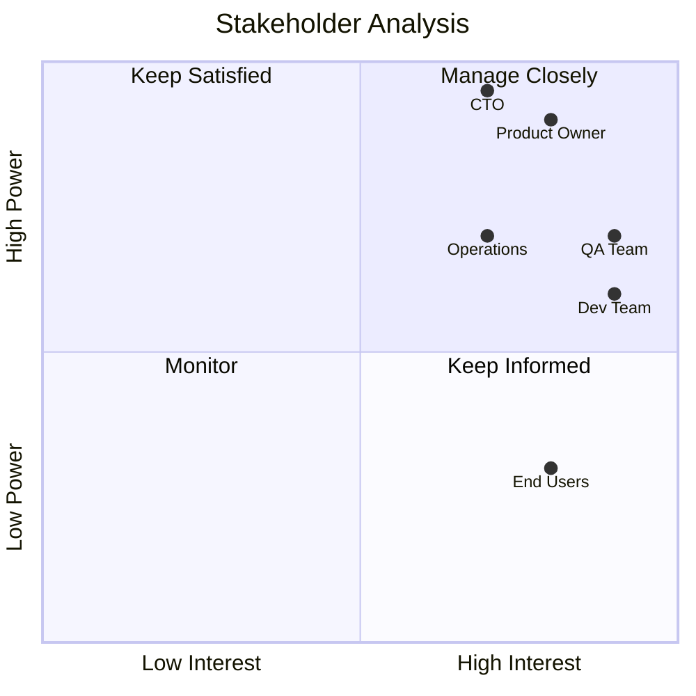

# Stakeholder Communication

> **Core Principle:** Effective testing requires clear communication with stakeholders about risks, progress, and recommendations.

## What Stakeholder Communication Is

Stakeholder communication in testing involves:

- **Explaining test strategy:** Why we test what we test
- **Reporting progress:** What we have tested and what we found
- **Recommending actions:** What to do based on test results
- **Managing expectations:** What testing can and cannot guarantee
- **Building trust:** Demonstrating testing value and competence

Good communication is **clear**, **timely**, **relevant**, and **actionable**.

## Why Stakeholder Communication Matters

**Poor communication leads to:**
- Misaligned expectations
- Testing effort not valued
- Decisions made without test input
- Stakeholders surprised by results
- Loss of credibility

**Good communication enables:**
- Informed decision-making
- Appropriate resource allocation
- Stakeholder confidence in quality
- Collaborative problem-solving
- Continuous improvement support

## Identifying Stakeholders

### Key Stakeholders in Testing

| Stakeholder | Interest | Information Needs |
|-------------|----------|-------------------|
| **Product Owner** | Feature quality, user satisfaction | Test coverage, defect status, release readiness |
| **Development Team** | Code quality, technical debt | Test results, defect details, automation status |
| **Project Manager** | Schedule, budget, risk | Test progress, blockers, resource needs |
| **Operations** | System stability, deployment risk | Performance, reliability, deployment readiness |
| **Business Sponsor** | Business value, ROI | Risk summary, release recommendation |
| **End Users** | Usability, functionality | Known issues, workarounds, release notes |
| **Security Team** | Security posture | Security test results, vulnerabilities |
| **Compliance** | Regulatory requirements | Audit evidence, compliance status |

### Stakeholder Analysis

For each stakeholder, understand:

**Power/Interest Grid:**



**Communication Strategy:**
- **High power, high interest:** Manage closely, frequent updates
- **High power, low interest:** Keep satisfied, executive summaries
- **Low power, high interest:** Keep informed, detailed updates
- **Low power, low interest:** Monitor, minimal effort

## Communication Artifacts

### 1. Test Strategy Document

**Audience:** Product owner, development lead, project manager

**Purpose:** Explain testing approach and get buy-in

**Content:**
- Test scope and objectives
- Risk assessment and prioritization
- Test levels and techniques
- Resources and schedule
- Entry and exit criteria

**Format:** Lightweight document (2-5 pages) or presentation

**Example:**
```markdown
Test Strategy: Payment Gateway Integration

Objective:
Verify payment processing is secure, reliable, and performs under load.

Risk Assessment:
- Critical: Payment data security (PCI compliance)
- Critical: Transaction accuracy
- High: Performance under peak load (1000 TPS)
- Medium: Integration with banking APIs

Test Approach:
- Security: OWASP Top 10, PCI DSS checklist, penetration testing
- Functional: Decision table testing for payment rules
- Performance: Load testing up to 2000 TPS
- Integration: Contract testing with bank APIs

Timeline: 4 weeks (Jan 15 - Feb 12)
Resources: 2 testers, 1 security specialist, performance test environment

Recommendation:
Approach aligns with risk profile. Request approval to proceed.
```

### 2. Test Progress Report

**Audience:** Project manager, development team, product owner

**Purpose:** Track testing progress and identify issues

**Frequency:** Daily (standup) or weekly (status report)

**Content:**
- Tests planned vs executed
- Defects found and fixed
- Blockers and risks
- Next steps

**Format:** Dashboard, email, or standup update

**Example:**
```markdown
Test Progress Report: Week 2 (Jan 22-26)

Summary:
- Tests planned: 120
- Tests executed: 95 (79%)
- Tests passed: 92
- Tests failed: 3
- Tests blocked: 0

Defects:
- Critical: 0
- High: 1 (JIRA-234, fixed, awaiting verification)
- Medium: 4 (2 fixed, 2 open)
- Low: 8 (3 fixed, 5 open)

Blockers:
- Performance test environment unavailable (ETA: Jan 29)
- Test data for edge cases not available (Owner: Bob)

Risks:
- Performance testing delayed by 1 week
- May need to reduce test scope if environment not ready

Next Week:
- Complete remaining functional tests
- Start performance testing (if environment ready)
- Verify high-severity defect fix
```

### 3. Defect Report

**Audience:** Development team, product owner

**Purpose:** Communicate defects clearly for quick resolution

**Content:**
- Clear description
- Steps to reproduce
- Expected vs actual behavior
- Severity and priority
- Environment and version
- Screenshots or logs

**Format:** Bug tracking system (JIRA, GitHub Issues)

**Example:**
```markdown
Defect: Payment timeout on high-value transactions

ID: JIRA-234
Severity: High
Priority: High
Component: Payment Processing
Version: 2.3.1
Environment: Staging

Description:
Transactions above $10,000 timeout after 30 seconds and fail, 
even though payment is processed successfully in the backend.

Steps to Reproduce:
1. Login as test user
2. Add items totaling $15,000 to cart
3. Proceed to checkout
4. Enter valid payment details
5. Click "Pay Now"
6. Wait for response

Expected Result:
Payment processed, confirmation page displayed within 10 seconds

Actual Result:
Timeout error after 30 seconds: "Payment processing failed. Please try again."
However, payment is actually processed (verified in backend logs).

Impact:
- Customer sees error but payment is charged
- Potential duplicate charges if customer retries
- Loss of customer trust

Logs:
[Attach relevant logs]

Screenshots:
[Attach screenshots]

Root Cause (suspected):
Payment gateway API timeout set to 30s, but high-value transactions 
require additional fraud check taking 45s.

Suggested Fix:
Increase timeout to 60s or implement async payment processing.
```

### 4. Test Summary Report

**Audience:** All stakeholders

**Purpose:** Summarize testing activities and results

**Timing:** End of test cycle

**Content:**
- Test objectives and scope
- Test execution summary
- Defect analysis
- Quality metrics
- Lessons learned
- Recommendations

**Format:** Document or presentation (5-10 pages)

**Example:**
```markdown
Test Summary Report: Payment Gateway Integration

Executive Summary:
Testing completed on schedule. System meets quality criteria for release 
with 2 known low-severity issues. Recommend conditional release.

Test Execution:
- Test cases planned: 240
- Test cases executed: 235 (98%)
- Pass rate: 96%
- Automation coverage: 85%

Defect Summary:
- Total defects: 47
- Critical: 2 (both fixed)
- High: 8 (all fixed)
- Medium: 15 (13 fixed, 2 deferred with workarounds)
- Low: 22 (18 fixed, 4 accepted)

Quality Metrics:
- Code coverage: 87% (target: 80%) ✓
- Defect density: 2.3 per KLOC (historical avg: 3.5) ✓
- Test effectiveness: 94% of defects found in testing ✓

Known Issues:
1. JIRA-456: Error message unclear for expired cards (workaround: FAQ)
2. JIRA-789: Slow response for international cards (workaround: none, 
   affects <1% of transactions)

Recommendations:
1. Release with monitoring
2. Fix known issues in next sprint
3. Improve error messages in future release

Lessons Learned:
1. Performance testing should start earlier
2. Test data preparation took longer than expected
3. Automation saved significant time in regression testing
```

### 5. Release Recommendation

**Audience:** Decision makers (product owner, business sponsor)

**Purpose:** Provide clear go/no-go recommendation

**Content:**
- Release criteria status
- Risk assessment
- Recommendation with rationale
- Conditions and mitigations

**Format:** Executive summary (1-2 pages)

**Example:**
```markdown
Release Recommendation: Version 2.3

Recommendation: CONDITIONAL GO

Release Criteria Status:
✓ All critical tests passed
✓ No open critical or high defects
✓ Performance meets SLA
✓ Security scan passed
⚠ 2 low-severity defects with workarounds
⚠ Documentation incomplete for 1 feature

Risk Assessment:
- Overall risk: LOW
- Known issues have minimal user impact
- Mitigations in place

Conditions:
1. Monitor error rates for first 48 hours
2. Complete documentation within 1 week
3. Fix known issues in next sprint
4. Have rollback plan ready

Approval Required:
- Product Owner: [signature]
- QA Lead: [signature]
- Operations Lead: [signature]
```

## Communication Techniques

### 1. Tailor Message to Audience

**Technical stakeholders (developers, testers):**
- Use technical terminology
- Provide detailed data
- Focus on implementation details
- Share code snippets, logs, metrics

**Business stakeholders (product owner, sponsor):**
- Use business language
- Focus on impact and risk
- Provide summaries and recommendations
- Use visualizations (charts, graphs)

**Example:**

**Technical:**
```
Defect JIRA-234: NullPointerException in PaymentService.processPayment() 
at line 147 when amount > 10000. Stack trace shows issue in 
FraudCheckClient.validate() returning null for high-value transactions.
```

**Business:**
```
Payment processing fails for transactions over $10,000. Customers see 
error message but payment is actually processed, causing confusion and 
potential duplicate charges. Affects approximately 5% of transactions. 
Fix available and tested.
```

### 2. Use Visualizations

**Defect Trend Chart:**
```
Defects Found vs Fixed (Week 1-4)

Week 1: Found 15, Fixed 8, Open 7
Week 2: Found 12, Fixed 14, Open 5
Week 3: Found 8, Fixed 10, Open 3
Week 4: Found 5, Fixed 6, Open 2

Trend: Decreasing defects found, increasing fixes, decreasing open defects
Status: Positive trend, ready for release
```

**Test Coverage Pie Chart:**
```
Test Coverage by Type:
- Unit tests: 45%
- Integration tests: 30%
- System tests: 20%
- Acceptance tests: 5%
```

**Risk Heat Map:**
```
Risk Distribution:
- Critical risks: 2 (both addressed)
- High risks: 5 (all addressed)
- Medium risks: 12 (10 addressed, 2 accepted)
- Low risks: 8 (4 addressed, 4 accepted)
```

### 3. Tell a Story

**Structure:**
1. **Context:** What we set out to do
2. **Actions:** What we did
3. **Results:** What we found
4. **Implications:** What it means
5. **Recommendations:** What to do next

**Example:**
```
Context:
We tested the new payment gateway integration to ensure it's secure, 
reliable, and performs under load.

Actions:
We executed 240 test cases covering security, functionality, performance, 
and integration. We also conducted penetration testing and load testing.

Results:
- 96% of tests passed
- Found and fixed 43 defects (2 critical, 8 high)
- Performance meets SLA (avg response time 1.2s)
- Security scan passed with no critical vulnerabilities

Implications:
The system is ready for release with minimal risk. Two low-severity 
issues remain but have workarounds and minimal user impact.

Recommendations:
Proceed with conditional release. Monitor closely for 48 hours. Fix 
remaining issues in next sprint.
```

### 4. Be Transparent About Uncertainty

**Instead of:**
```
"We tested everything and found no issues."
```

**Say:**
```
"We tested 95% of planned scenarios and found 3 medium-severity issues. 
The remaining 5% are low-risk edge cases that we deferred due to time 
constraints. Based on risk assessment, we're confident in release readiness."
```

**Instead of:**
```
"The system is 100% reliable."
```

**Say:**
```
"Reliability testing shows 99.9% uptime over 30 days in staging. 
This meets our SLA target. Production reliability may vary based on 
real-world conditions."
```

### 5. Use the Pyramid Principle

**Structure communication from top down:**

1. **Main message first:** Recommendation or key finding
2. **Supporting arguments:** Why we made this recommendation
3. **Evidence:** Data and details that support arguments

**Example:**
```
Recommendation: Release version 2.3 with monitoring (Main message)

Why:
- All critical criteria met (Supporting argument 1)
- Known issues have minimal impact (Supporting argument 2)
- Risk is low and manageable (Supporting argument 3)

Evidence:
- 98% test pass rate (Evidence for argument 1)
- 2 low-severity defects with workarounds (Evidence for argument 2)
- Risk assessment shows low probability and impact (Evidence for argument 3)
```

## Handling Difficult Conversations

### Scenario 1: Stakeholder Wants to Release Despite Critical Defects

**Situation:** Critical defect found, but business pressure to release on time.

**Approach:**
1. **Acknowledge business pressure:** "I understand the importance of meeting the deadline."
2. **Explain risk clearly:** "This defect causes data corruption in 10% of transactions. If we release, we risk losing customer data and facing legal liability."
3. **Provide options:**
   - Option A: Delay release 3 days to fix and test
   - Option B: Release with feature disabled (if possible)
   - Option C: Release to limited users with manual workaround
4. **Recommend based on evidence:** "I recommend Option A because the risk of data loss outweighs the cost of 3-day delay."
5. **Document decision:** If stakeholder insists on release, document risk acceptance.

### Scenario 2: Testing Behind Schedule

**Situation:** Testing is 1 week behind, deadline approaching.

**Approach:**
1. **Be transparent early:** "We're currently 1 week behind schedule due to environment issues."
2. **Explain impact:** "If we continue at current pace, we'll only test 70% of planned scenarios."
3. **Provide options:**
   - Option A: Extend deadline by 1 week
   - Option B: Reduce scope (test high-risk areas only)
   - Option C: Add resources (2 more testers)
4. **Recommend based on constraints:** "Given the fixed deadline, I recommend Option B: focus on critical and high-risk areas, defer low-risk testing."
5. **Get agreement:** "Do you agree with this risk-based approach?"

### Scenario 3: Stakeholder Questions Testing Value

**Situation:** "Why do we need so much testing? Can't we just fix bugs in production?"

**Approach:**
1. **Acknowledge perspective:** "I understand the desire to move faster."
2. **Provide data:** "Defects found in production cost 10x more to fix than in testing. Last quarter, we had 3 production incidents that cost $150K in support and lost revenue."
3. **Explain value:** "Testing reduces risk, protects reputation, and saves money in the long run. It's an investment, not a cost."
4. **Suggest improvement:** "Let's review our testing approach to see if we can be more efficient without compromising quality."

### Scenario 4: Disagreement on Defect Severity

**Situation:** Developer says defect is low severity, tester says high.

**Approach:**
1. **Focus on impact:** "Let's look at the impact on users and business."
2. **Use objective criteria:** "According to our severity definitions, defects affecting >10% of users are high severity. This affects 15%."
3. **Escalate if needed:** "If we can't agree, let's involve the product owner to make the call based on business impact."

## Communication Channels

### Synchronous (Real-Time)

**Standup meetings:**
- Daily 15-minute updates
- Quick progress and blocker sharing
- Face-to-face or video call

**Ad-hoc discussions:**
- Immediate issues or questions
- Quick clarification
- In-person or chat

**Review meetings:**
- Test plan review
- Defect triage
- Release decision meetings

### Asynchronous

**Email:**
- Weekly status reports
- Formal recommendations
- Documentation sharing

**Chat (Slack, Teams):**
- Quick questions
- Informal updates
- Team coordination

**Dashboards:**
- Real-time test progress
- Defect metrics
- Quality indicators

**Documentation:**
- Test plans
- Test reports
- Lessons learned

## Building Credibility

### Demonstrate Competence

- **Know your domain:** Understand the system, technology, and business context
- **Use data:** Base recommendations on evidence, not opinions
- **Admit mistakes:** Acknowledge when testing misses defects, learn from them
- **Stay current:** Keep up with testing trends, tools, and techniques

### Build Relationships

- **Listen actively:** Understand stakeholder concerns and priorities
- **Be responsive:** Answer questions quickly, follow up on commitments
- **Collaborate:** Work with developers, not against them
- **Show empathy:** Understand pressures and constraints others face

### Communicate Value

- **Quantify impact:** "Testing found 47 defects, preventing an estimated $500K in production issues"
- **Share success stories:** "The performance test we added caught a memory leak that would have caused outages"
- **Educate stakeholders:** "Here's why exploratory testing is valuable..."
- **Celebrate wins:** "Great news: zero critical defects in this release!"

## Key Takeaways

1. **Know your audience:** Tailor message to stakeholder needs and interests
2. **Be clear and concise:** Use simple language, avoid jargon, focus on key points
3. **Use evidence:** Base recommendations on data, not opinions
4. **Be transparent:** Share bad news early, admit uncertainty, document decisions
5. **Build relationships:** Listen, collaborate, and demonstrate value

## Related Topics

- [[03_Test_Planning]]: Communicating test plans to stakeholders
- [[05_Release_Strategy]]: Presenting release recommendations
- [[06_Measurement/04_Quality_Reporting]]: Reporting quality metrics

## Existing Vault Connections

- [[software-engineering-note/14_Software_Engineering_Professional_Practice/03_Communication_Skills]]: General communication skills
- [[software-engineering-note/09_Software_Engineering_Management/05_Stakeholder_Management]]: Stakeholder management principles
