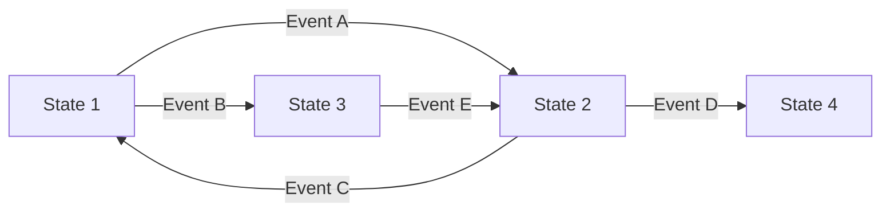
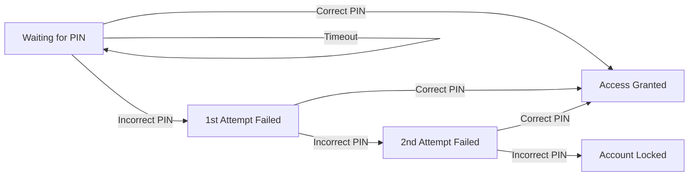
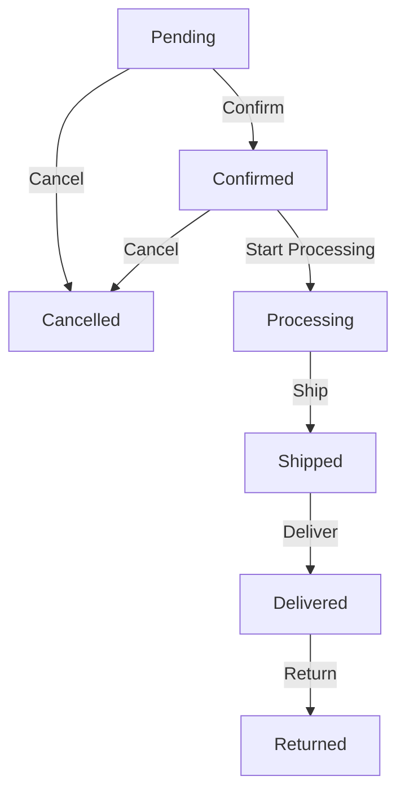
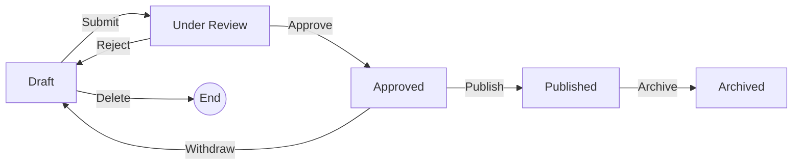
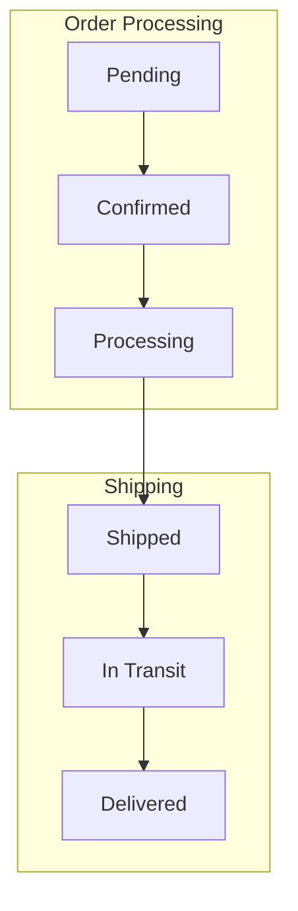

# State Transition Testing

> **Core Principle:** When system behavior depends on current state and past events, model states and transitions to design effective tests.

## What State Transition Testing Is

State transition testing is a technique for systems where:
- Output depends on current state, not just current input
- System moves through a sequence of states
- Past events affect future behavior
- Different actions are valid in different states

## When to Use State Transition Testing

**Use when:**
- System has distinct states (e.g., logged in, logged out, locked)
- Behavior depends on history (e.g., 3 failed logins locks account)
- Sequential workflows exist (e.g., order: pending → processing → shipped → delivered)
- State machines or workflows are documented
- Concurrent state changes are possible

**Do not use when:**
- Output depends only on current input (use decision tables)
- No state concept exists in the system
- States are too numerous to model (consider decomposition)

## The Technique

### Step 1: Identify States

List all distinct states the system can be in:
- Initial state (starting point)
- Intermediate states (transitional)
- Final states (terminal, if any)

### Step 2: Identify Events/Inputs

List all events or inputs that can cause state changes:
- User actions (click, submit, cancel)
- System events (timeout, error, completion)
- External triggers (API call, message received)

### Step 3: Identify Transitions

For each state, determine:
- What events can occur in this state
- What state results from each event
- What output or action occurs

### Step 4: Create State Diagram

Visual representation of states and transitions:



### Step 5: Create State Table

Tabular representation for systematic coverage:

| Current State | Event | Next State | Output/Action |
|--------------|-------|-----------|---------------|
| State 1 | Event A | State 2 | Action X |
| State 1 | Event B | State 3 | Action Y |
| State 2 | Event C | State 1 | Action Z |

### Step 6: Design Test Cases

Based on coverage criteria:
- **0-switch:** Cover all states
- **1-switch:** Cover all transitions
- **2-switch:** Cover all pairs of transitions
- **n-switch:** Cover all sequences of n transitions

## Examples

### Example 1: ATM PIN Entry

**States:**
- S1: Waiting for PIN
- S2: PIN entered (1st attempt)
- S3: PIN entered (2nd attempt)
- S4: Account locked
- S5: Access granted

**Events:**
- E1: Enter correct PIN
- E2: Enter incorrect PIN
- E3: Timeout

**State Diagram:**



**State Table:**

| Current State | Event | Next State | Output |
|--------------|-------|-----------|--------|
| S1: Waiting | Correct PIN | S5: Granted | Display account menu |
| S1: Waiting | Incorrect PIN | S2: 1st fail | "Incorrect PIN, 2 attempts remaining" |
| S1: Waiting | Timeout | S1: Waiting | Eject card |
| S2: 1st fail | Correct PIN | S5: Granted | Display account menu |
| S2: 1st fail | Incorrect PIN | S3: 2nd fail | "Incorrect PIN, 1 attempt remaining" |
| S3: 2nd fail | Correct PIN | S5: Granted | Display account menu |
| S3: 2nd fail | Incorrect PIN | S4: Locked | "Account locked, contact bank" |

**Test Cases (1-switch coverage - all transitions):**

| Test ID | Sequence | Expected Final State | Expected Outputs |
|---------|----------|---------------------|------------------|
| TC1 | S1 → Correct PIN | S5 | Account menu displayed |
| TC2 | S1 → Incorrect PIN → Correct PIN | S5 | Warning, then account menu |
| TC3 | S1 → Incorrect PIN → Incorrect PIN → Correct PIN | S5 | 2 warnings, then account menu |
| TC4 | S1 → Incorrect PIN → Incorrect PIN → Incorrect PIN | S4 | 3 warnings, then locked |
| TC5 | S1 → Timeout | S1 | Card ejected |

### Example 2: E-commerce Order Status

**States:**
- S1: Pending
- S2: Confirmed
- S3: Processing
- S4: Shipped
- S5: Delivered
- S6: Cancelled
- S7: Returned

**State Diagram:**



**State Table:**

| Current State | Event | Next State | Output |
|--------------|-------|-----------|--------|
| Pending | Confirm | Confirmed | Email confirmation |
| Pending | Cancel | Cancelled | Refund initiated |
| Confirmed | Start Processing | Processing | Update status |
| Confirmed | Cancel | Cancelled | Refund initiated |
| Processing | Ship | Shipped | Tracking number sent |
| Shipped | Deliver | Delivered | Delivery confirmation |
| Delivered | Return | Returned | Return label sent |

**Invalid Transitions (negative testing):**

| Current State | Invalid Event | Expected Behavior |
|--------------|---------------|-------------------|
| Shipped | Cancel | Error: "Cannot cancel shipped order" |
| Delivered | Cancel | Error: "Cannot cancel delivered order" |
| Cancelled | Ship | Error: "Order already cancelled" |
| Processing | Return | Error: "Cannot return before delivery" |

### Example 3: Document Workflow

**States:**
- S1: Draft
- S2: Under Review
- S3: Approved
- S4: Published
- S5: Archived

**State Diagram:**



## Coverage Criteria

### 0-Switch Coverage (State Coverage)

**Goal:** Visit every state at least once

**Test cases:**
- TC1: Start → Draft
- TC2: Draft → Under Review
- TC3: Under Review → Approved
- TC4: Approved → Published
- TC5: Published → Archived

**Minimum tests:** Number of states (or fewer if states are on same path)

### 1-Switch Coverage (Transition Coverage)

**Goal:** Execute every transition at least once

**Test cases:**
- TC1: Draft → Submit → Under Review
- TC2: Under Review → Approve → Approved
- TC3: Under Review → Reject → Draft
- TC4: Approved → Publish → Published
- TC5: Approved → Withdraw → Draft
- TC6: Published → Archive → Archived
- TC7: Draft → Delete → End

**Minimum tests:** Number of transitions

### 2-Switch Coverage

**Goal:** Execute every pair of consecutive transitions

**Example test cases:**
- TC1: Draft → Submit → Under Review → Approve → Approved
- TC2: Draft → Submit → Under Review → Reject → Draft
- TC3: Under Review → Approve → Approved → Publish → Published
- TC4: Under Review → Reject → Draft → Submit → Under Review

**Use when:** High risk, need to test transition sequences

### N-Switch Coverage

**Goal:** Execute every sequence of n transitions

**Use when:**
- Critical workflows
- Complex state interactions
- Regulatory requirements

**Caution:** Test count grows exponentially with n

## State Transition Testing Checklist

### Modeling Checklist

- [ ] All states identified
- [ ] Initial state defined
- [ ] Final states identified (if any)
- [ ] All events/inputs listed
- [ ] All valid transitions defined
- [ ] Invalid transitions identified
- [ ] State diagram created
- [ ] State table created
- [ ] Model reviewed with stakeholders

### Test Design Checklist

- [ ] Coverage criterion selected (0-switch, 1-switch, etc.)
- [ ] Test cases cover all required transitions
- [ ] Invalid transitions tested (negative testing)
- [ ] Concurrent state changes considered
- [ ] Timeout and error transitions tested
- [ ] Loop transitions tested (e.g., reject → edit → resubmit)

## Common Defects Found

| Defect Type | Example | How State Testing Catches It |
|-------------|---------|---------------------------|
| **Invalid state** | System enters undefined state | Test all transitions from each state |
| **Dead state** | State with no exit transitions | Identify states with no outgoing transitions |
| **Missing transition** | Valid event not handled | Test all events in each state |
| **Wrong transition** | Event leads to wrong state | Verify next state for each transition |
| **Race condition** | Concurrent events cause invalid state | Test concurrent transitions |
| **State persistence** | State not saved/restored correctly | Test state after restart/recovery |

## Practical Tips

1. **Start with the happy path:** Model the main workflow first
2. **Add error paths:** Include timeout, cancellation, and error states
3. **Test invalid transitions:** Try events that should not be valid in current state
4. **Consider concurrency:** What if two events happen simultaneously?
5. **Test persistence:** Does state survive restart, crash, or network failure?
6. **Review with developers:** They may know about hidden states
7. **Use state diagrams:** Visual models are easier to review than tables

## Advanced Concepts

### Hierarchical State Machines

For complex systems, use nested states:



### Orthogonal States

Independent state machines that run in parallel:

**Example:** Document with separate "Status" and "Visibility" states

| Status | Visibility |
|--------|-----------|
| Draft | Private |
| Review | Team |
| Published | Public |

Test combinations of orthogonal states.

### Guard Conditions

Transitions that only occur when conditions are met:

```
State: Pending
Event: Confirm
Guard: Stock > 0
Next State: Confirmed
```

Test both when guard is true and when guard is false.

## Key Takeaways

1. **State transition testing is for sequential behavior:** When past events affect future behavior
2. **Model states and transitions:** Use diagrams and tables for clarity
3. **Choose coverage criteria:** 0-switch (states), 1-switch (transitions), or n-switch (sequences)
4. **Test invalid transitions:** Verify system rejects invalid events
5. **Consider concurrency and persistence:** Real-world state management is complex

## Related Topics

- [[03_Decision_Table_Testing]]: When decisions depend on multiple conditions
- [[05_Use_Case_Testing]]: Testing complete user workflows
- [[07_Test_Design_Strategy]]: Combining state testing with other techniques

## Existing Vault Connections

- [[software-engineering-note/05_Software_Testing/03_Decision_Tables_and_State_Based]]: State transition testing fundamentals
