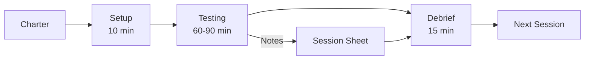
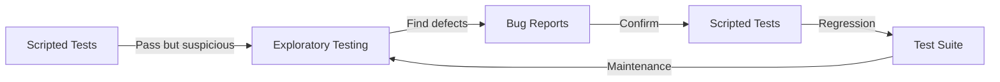

# Exploratory Testing

> **Core Principle:** Exploratory testing is simultaneous learning, test design, and execution. It finds defects that scripted tests miss by leveraging tester creativity and domain knowledge.

## What Exploratory Testing Is

Exploratory testing is:
- **Simultaneous learning and testing:** Tester learns system while testing
- **Structured but not scripted:** Guided by charters, not step-by-step instructions
- **Defect discovery focused:** Aims to find unexpected problems
- **Adaptive:** Tester adjusts approach based on findings
- **Skill-based:** Relies on tester experience, creativity, and intuition

## What Exploratory Testing Is NOT

| Misconception | Reality |
|--------------|---------|
| "Just clicking around" | Structured with charters and timeboxes |
| "Unprofessional" | Requires skill and discipline |
| "No documentation" | Documented via session notes and defects |
| "Replaces scripted tests" | Complements scripted tests |
| "Anyone can do it" | Requires training and experience |

## When to Use Exploratory Testing

**Use when:**
- Requirements are incomplete or ambiguous
- System is complex or poorly understood
- Time is limited for test design
- Need to find unexpected defects
- Early in development (before scripted tests exist)
- After major changes (to find regression issues)
- Usability and user experience testing

**Do not use when:**
- Regulatory requirements demand scripted tests
- High-risk calculations need repeatable verification
- Testing must be automated
- Team lacks exploratory testing skills

## Session-Based Test Management (SBTM)

### What Is SBTM?

Session-Based Test Management is a structured approach to exploratory testing:
- **Sessions:** Timeboxed testing periods (60-90 minutes)
- **Charters:** Mission statements guiding each session
- **Session sheets:** Documentation of what was tested and found
- **Debriefs:** Review sessions with test lead

### Session Structure



### Charter Examples

**Charter 1: Feature Exploration**
```
Mission: Explore the shopping cart feature
Focus: Add/remove items, quantity changes, price calculations
Risk: Incorrect totals, lost items, slow performance
Timebox: 90 minutes
```

**Charter 2: Error Handling**
```
Mission: Test error handling in payment processing
Focus: Invalid inputs, network failures, timeout scenarios
Risk: Lost payments, confusing errors, data corruption
Timebox: 60 minutes
```

**Charter 3: Integration**
```
Mission: Explore integration between user profile and order history
Focus: Data consistency, updates, deletions
Risk: Orphaned data, inconsistent displays
Timebox: 75 minutes
```

### Session Sheet Template

```markdown
Session Sheet

Charter: [Mission statement]
Tester: [Name]
Date: [Date]
Duration: [Actual time spent]

Areas Explored:
- [Area 1]: [What was tested]
- [Area 2]: [What was tested]

Defects Found:
- [Defect ID]: [Brief description]
- [Defect ID]: [Brief description]

Issues/Risks Identified:
- [Issue 1]: [Description]
- [Issue 2]: [Description]

Questions for Development:
- [Question 1]
- [Question 2]

Test Ideas for Future:
- [Idea 1]
- [Idea 2]

Time Breakdown:
- Session setup: [X] minutes
- Test design and execution: [Y] minutes
- Bug investigation and reporting: [Z] minutes
- Total: [X+Y+Z] minutes

Coverage:
- [Percentage of charter completed]
- [Areas not covered and why]
```

## Exploratory Testing Techniques

### 1. Tours

Structured approaches to exploring a feature:

**Landmark Tour:**
- Visit major features systematically
- Like visiting tourist attractions
- Good for initial exploration

**Intellectual Tour:**
- Ask "what if" questions
- Challenge assumptions
- Think like a curious user

**Supermodel Tour:**
- Focus on appearance and presentation
- Check UI consistency, layout, colors
- Look for visual defects

**Garbage Collector Tour:**
- Look for discarded/unused features
- Find dead code, obsolete messages
- Identify technical debt

**Bad Neighborhood Tour:**
- Focus on areas with many defects
- Revisit problem areas
- Look for related issues

**Back Alley Tour:**
- Explore rarely-used features
- Test edge cases and options
- Find forgotten functionality

### 2. Heuristics

Mental shortcuts for test design:

**SFDPOT (San Francisco Depot):**
- **Structure:** What is it made of?
- **Function:** What does it do?
- **Data:** What does it process?
- **Platform:** What does it depend on?
- **Operations:** How is it used?
- **Time:** How does time affect it?

**INVEST:**
- **Independent:** Can test in isolation
- **Negotiable:** Flexible approach
- **Valuable:** Find real problems
- **Estimable:** Can estimate effort
- **Small:** Focused scope
- **Testable:** Can verify results

**CRUSSAD:**
- **Complexity:** Where is it complex?
- **Repetition:** What happens repeatedly?
- **Users:** Who uses it and how?
- **Scalability:** What if more users/data?
- **Security:** How is it protected?
- **Accessibility:** Who can use it?
- **Data:** What data does it use?

### 3. Error Guessing

Based on experience, guess where defects might be:
- Null/empty values
- Boundary conditions
- Error handling
- Concurrent access
- Network failures
- Large data volumes
- Special characters

### 4. Attack Patterns

Systematic ways to "attack" the system:

**Input Attacks:**
- Extreme values
- Special characters
- SQL injection
- XSS payloads
- Long strings
- Negative numbers

**State Attacks:**
- Rapid state changes
- Invalid state transitions
- Concurrent state modifications
- State persistence after restart

**Timing Attacks:**
- Slow networks
- Timeout scenarios
- Race conditions
- Clock changes

**Resource Attacks:**
- Low memory
- Low disk space
- Network interruption
- Service unavailability

## Conducting an Exploratory Testing Session

### Before the Session

1. **Define charter:** Clear mission and scope
2. **Prepare environment:** Test data, tools, access
3. **Review context:** Requirements, known issues, recent changes
4. **Set timebox:** Typically 60-90 minutes
5. **Prepare note-taking:** Session sheet template, bug tracker access

### During the Session

1. **Start with charter:** Keep mission in mind
2. **Explore systematically:** Use tours or heuristics
3. **Document as you go:** Notes, screenshots, defects
4. **Follow interesting leads:** But don't lose sight of charter
5. **Time management:** Track time spent on different activities
6. **Ask questions:** Note unclear behavior for debrief

### After the Session

1. **Complete session sheet:** Document findings and coverage
2. **File defects:** Ensure all bugs are reported
3. **Debrief with lead:** Discuss findings, questions, next steps
4. **Plan next session:** Based on findings and remaining risk

## Example Session

### Charter
```
Mission: Explore user registration feature
Focus: Form validation, error handling, success flow
Risk: Invalid users created, poor error messages, security issues
Timebox: 75 minutes
```

### Session Notes

**0:00-0:10 - Setup and Initial Exploration**
- Navigated to registration page
- Reviewed form fields: username, email, password, confirm password
- Noted: No password strength indicator

**0:10-0:25 - Valid Registration (Happy Path)**
- Registered with valid data: testuser1, test@example.com, Password123!
- Result: Account created, confirmation email sent
- Verified: Can log in with new credentials
- Note: Email arrived in 30 seconds

**0:25-0:45 - Input Validation Testing**
- Empty username: "Username is required" ✓
- Short username (2 chars): "Username must be at least 3 characters" ✓
- Username with spaces: "Username cannot contain spaces" ✓
- Invalid email: "Invalid email address" ✓
- Short password: "Password must be at least 8 characters" ✓
- Password without number: "Password must contain at least one number" ✓
- Mismatched passwords: "Passwords do not match" ✓

**Defect Found:** BUG-1234: Username accepts SQL injection payload `' OR 1=1 --` without validation

**0:45-0:60 - Error Handling**
- Registered with existing username: "Username already taken" ✓
- Registered with existing email: "Email already registered" ✓
- Network timeout during registration: Generic error, form data preserved ✓
- Rapid double-click on submit: Only one account created ✓

**0:60-0:75 - Security and Edge Cases**
- Very long username (1000 chars): Accepted! (BUG-1235)
- Unicode characters in username: Accepted and displayed correctly ✓
- Copy-paste password with leading/trailing spaces: Spaces included in password (BUG-1236: should trim)

### Session Sheet Summary

```markdown
Areas Explored:
- Form validation: 100% of fields tested
- Error handling: 80% of error scenarios tested
- Security: Basic injection and boundary testing
- Success flow: Complete happy path verified

Defects Found:
- BUG-1234: SQL injection in username field (Critical)
- BUG-1235: No maximum length on username (Medium)
- BUG-1236: Password not trimmed of whitespace (Low)

Issues Identified:
- No password strength indicator
- No CAPTCHA for bot protection

Time Breakdown:
- Setup: 10 min
- Testing: 55 min
- Bug reporting: 10 min
- Total: 75 min
```

## Measuring Exploratory Testing

### Metrics

| Metric | Purpose | Example |
|--------|---------|---------|
| **Defects found** | Effectiveness | 5 defects per session |
| **Defect density** | Quality of exploration | 2 defects per feature area |
| **Charter coverage** | Completeness | 80% of charter objectives met |
| **Time breakdown** | Efficiency | 70% testing, 20% reporting, 10% setup |
| **Defect severity** | Impact | 1 critical, 2 high, 3 medium |

### Coverage Tracking

Track what was explored:
- Features tested
- Test techniques used
- Risks addressed
- Questions answered

**Coverage Map:**
```
Registration Feature Coverage:
✓ Form validation (all fields)
✓ Success flow
✓ Error messages
⚠ Security (basic tests only)
⚠ Performance (not tested)
✗ Accessibility (not tested)
```

## Benefits and Limitations

### Benefits

| Benefit | Description |
|---------|-------------|
| **Finds unexpected defects** | Scripted tests miss what they don't look for |
| **Fast feedback** | No test design phase, immediate results |
| **Adapts to changes** | No scripts to update |
| **Leverages tester skill** | Uses creativity and experience |
| **Good for complex systems** | Explores interactions and edge cases |
| **Improves understanding** | Testers learn system deeply |

### Limitations

| Limitation | Mitigation |
|-----------|-----------|
| **Not repeatable** | Document approach in session sheets |
| **Skill-dependent** | Train testers, pair with experts |
| **Hard to automate** | Use for discovery, automate confirmed scenarios |
| **Coverage unclear** | Use charters and coverage maps |
| **Regulatory concerns** | Combine with scripted tests for audit trail |

## Integrating with Scripted Testing

### Complementary Approaches



### When to Use Each

| Scenario | Approach |
|----------|----------|
| **New feature, early development** | Exploratory first |
| **Stable feature, regression testing** | Scripted tests |
| **Complex interactions, usability** | Exploratory |
| **Calculations, business rules** | Scripted tests |
| **After major changes** | Exploratory to find issues |
| **Before release** | Scripted for coverage, exploratory for surprises |

### Hybrid Approach

1. **Exploratory session:** Find defects and understand system
2. **Document findings:** Create bug reports
3. **Automate confirmed defects:** Add to regression suite
4. **Create scripted tests:** For critical paths identified in exploration
5. **Continue exploring:** For new areas and edge cases

## Practical Tips

1. **Use charters:** Give sessions focus and purpose
2. **Timebox sessions:** 60-90 minutes is optimal
3. **Take notes:** Document what you tested and found
4. **Follow your nose:** Investigate suspicious behavior
5. **Ask questions:** Note unclear behavior for debrief
6. **Pair with developers:** Fast feedback and learning
7. **Use heuristics:** SFDPOT, tours, attack patterns
8. **Debrief after sessions:** Share findings and learnings
9. **Track coverage:** Know what you've explored
10. **Practice regularly:** Skill improves with experience

## Key Takeaways

1. **Exploratory testing is structured:** Charters, timeboxes, session sheets
2. **Finds defects scripted tests miss:** Leverages tester creativity
3. **Complements scripted testing:** Use both for comprehensive coverage
4. **Requires skill and discipline:** Training and practice improve effectiveness
5. **Document findings:** Session sheets provide traceability

## Related Topics

- [[05_Use_Case_Testing]]: Scripted testing of complete workflows
- [[07_Test_Design_Strategy]]: Balancing exploratory and scripted approaches
- [[01_Risk_Based_Testing]]: Prioritizing exploratory testing efforts

## Existing Vault Connections

- [[software-engineering-note/05_Software_Testing/06_Exploratory_Testing]]: Exploratory testing fundamentals
