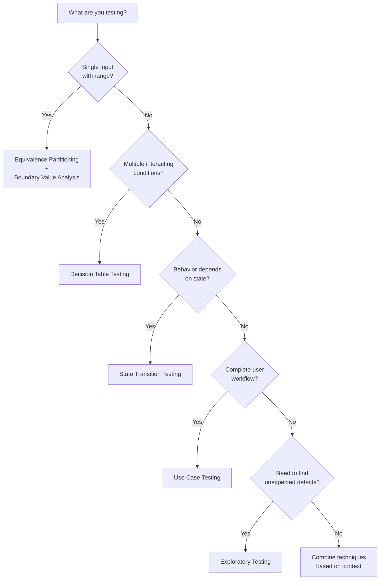

# Test Design Strategy

> **Core Principle:** No single test design technique is sufficient. A specialist quality engineer combines techniques strategically based on risk, context, and objectives.

## What Test Design Strategy Means

Test design strategy is the art of:
- Selecting appropriate techniques for each testing situation
- Combining techniques to maximize defect detection
- Balancing systematic and exploratory approaches
- Prioritizing test cases based on risk and value
- Adapting approach as testing progresses

## Why Strategy Matters

**Without strategy:**
- Random technique selection
- Inefficient test design
- Missing critical defects
- Over-testing low-risk areas
- Under-testing high-risk areas

**With strategy:**
- Systematic technique selection
- Efficient defect detection
- Balanced coverage
- Risk-based prioritization
- Adaptable approach

## Technique Selection Guide

### Decision Framework



### Technique Selection Matrix

| Situation | Primary Technique | Complementary Techniques |
|-----------|------------------|-------------------------|
| **Input validation** | Equivalence partitioning | Boundary value analysis |
| **Numeric ranges** | Boundary value analysis | Equivalence partitioning |
| **Business rules** | Decision tables | Equivalence partitioning |
| **Workflows** | State transition testing | Use case testing |
| **User journeys** | Use case testing | State transition, equivalence partitioning |
| **Complex interactions** | Decision tables | Pairwise testing |
| **New/unfamiliar features** | Exploratory testing | Tours, heuristics |
| **Regression testing** | Scripted tests (from use cases) | Exploratory for surprises |

## Combining Techniques

### Example 1: Login Feature

**Feature:** User login with username, password, and account lockout

**Techniques to combine:**

1. **Equivalence Partitioning** (username and password validation)
   - Valid username / invalid username
   - Valid password / invalid password
   - Empty fields

2. **Boundary Value Analysis** (username and password length)
   - Username: 2, 3, 4, 18, 19, 20 characters
   - Password: 7, 8, 9, 19, 20, 21 characters

3. **State Transition Testing** (account lockout)
   - States: Active, Locked
   - Transitions: 3 failed attempts → Locked
   - Unlock: Admin reset or timeout

4. **Decision Table Testing** (combined conditions)

| Username | Password | Attempts | Result |
|----------|----------|----------|--------|
| Valid | Valid | Any | Login success |
| Valid | Invalid | < 3 | Error, retry |
| Valid | Invalid | = 3 | Account locked |
| Invalid | Any | Any | Error |

5. **Exploratory Testing** (security and usability)
   - SQL injection attempts
   - Session handling
   - Password visibility toggle
   - Error message clarity

**Test Design Strategy:**
```
Phase 1: Systematic testing
- Equivalence partitioning for input validation
- Boundary value analysis for length constraints
- Decision table for login logic
- State transition for lockout

Phase 2: Exploratory testing
- Security attacks (injection, brute force)
- Usability (error messages, accessibility)
- Edge cases (concurrent logins, network issues)
```

### Example 2: E-commerce Checkout

**Feature:** Complete checkout process from cart to order confirmation

**Techniques to combine:**

1. **Use Case Testing** (main workflow)
   - Main success: Cart → Shipping → Payment → Confirmation
   - Alternatives: Apply coupon, use saved payment, guest checkout
   - Exceptions: Payment declined, out of stock, network error

2. **State Transition Testing** (order status)
   - States: Pending, Confirmed, Processing, Shipped, Delivered
   - Transitions: Status updates at each stage
   - Invalid transitions: Cannot cancel shipped order

3. **Decision Table Testing** (discount calculation)
   - Conditions: Premium customer, order amount, coupon code
   - Actions: Apply discount, free shipping

4. **Equivalence Partitioning** (input validation)
   - Shipping address fields
   - Payment information
   - Coupon codes

5. **Boundary Value Analysis** (order amounts)
   - Minimum order: $10
   - Free shipping threshold: $50
   - Maximum order: $10,000

6. **Exploratory Testing** (usability and integration)
   - Cart persistence across sessions
   - Payment gateway integration
   - Email notifications
   - Mobile responsiveness

**Test Design Strategy:**
```
Phase 1: Workflow testing
- Use case testing for complete checkout flow
- State transition for order lifecycle

Phase 2: Business logic testing
- Decision tables for discounts and shipping
- Equivalence partitioning for input validation
- Boundary value analysis for amounts

Phase 3: Integration and usability
- Exploratory testing for user experience
- Integration testing with payment gateway
- Email notification verification
```

## Prioritization Strategy

### Risk-Based Prioritization

**High Priority (test first):**
- Critical business functions
- High-risk calculations
- Security-sensitive areas
- Frequently used features
- Areas with history of defects
- Recent changes or fixes

**Medium Priority (test next):**
- Important but not critical functions
- Moderate complexity
- Occasional use
- Stable areas with some changes

**Low Priority (test if time permits):**
- Rarely used features
- Simple functionality
- Very stable areas
- Cosmetic issues

### Prioritization Matrix

| Risk Level | Usage Frequency | Priority |
|-----------|----------------|----------|
| High | High | Critical (test first) |
| High | Low | High (test early) |
| Low | High | High (test early) |
| Low | Low | Medium/Low |

### Test Case Priority Levels

**P0 - Smoke Tests:**
- Core functionality
- Run before detailed testing
- Quick pass/fail indication
- Example: Can user log in?

**P1 - Critical Path:**
- Main success scenarios
- High-risk areas
- Must pass for release
- Example: Complete purchase workflow

**P2 - Important:**
- Alternative flows
- Medium-risk areas
- Should pass for release
- Example: Apply coupon code

**P3 - Nice to Have:**
- Edge cases
- Low-risk scenarios
- Test if time permits
- Example: Unusual username characters

## Test Design Process

### Step 1: Analyze Requirements

**Questions to ask:**
- What is being tested?
- What are the inputs and outputs?
- What are the business rules?
- What are the risks?
- What are the acceptance criteria?

**Outputs:**
- List of testable requirements
- Risk assessment
- Test objectives

### Step 2: Select Techniques

**Based on:**
- Type of requirement (functional, non-functional)
- Complexity and interactions
- Available time and resources
- Team skills and experience

**Decision guide:**
- Single input with range → Equivalence + Boundary
- Multiple conditions → Decision tables
- Sequential behavior → State transitions
- Complete workflows → Use cases
- Unknown areas → Exploratory

### Step 3: Design Test Cases

**For each technique:**
- Apply technique systematically
- Document test cases
- Define expected results
- Identify test data needs

**Combine results:**
- Remove duplicates
- Fill gaps
- Ensure coverage

### Step 4: Prioritize Test Cases

**Apply prioritization criteria:**
- Risk level
- Business importance
- Technical complexity
- Execution time

**Assign priority levels:**
- P0 (smoke), P1 (critical), P2 (important), P3 (nice to have)

### Step 5: Review and Refine

**Review checklist:**
- [ ] All requirements covered
- [ ] High-risk areas prioritized
- [ ] Techniques appropriate for context
- [ ] Test cases clear and executable
- [ ] Expected results defined
- [ ] Test data identified
- [ ] No redundant tests
- [ ] Gaps identified and addressed

**Refinement:**
- Add tests for identified gaps
- Remove redundant tests
- Adjust priorities if needed
- Get stakeholder feedback

## Adapting Strategy to Context

### Context Factors

**Time constraints:**
- **Ample time:** Use all applicable techniques, thorough exploratory
- **Limited time:** Focus on high-risk, use pairwise testing
- **Very limited:** Smoke tests + targeted exploratory

**System complexity:**
- **Simple:** Equivalence + boundary may suffice
- **Moderate:** Combine multiple systematic techniques
- **Complex:** Add exploratory testing, consider decomposition

**Team skills:**
- **Experienced:** Can use advanced techniques, more exploratory
- **Novice:** Stick to basic techniques, more scripted tests
- **Mixed:** Pair experienced with novice testers

**Regulatory requirements:**
- **High regulation:** Scripted tests with full traceability
- **Low regulation:** More flexibility for exploratory
- **Audit requirements:** Document test design rationale

### Adaptive Strategy Examples

**Scenario 1: Hotfix for Critical Bug**
- **Time:** 2 hours
- **Strategy:** 
  - Verify fix works (15 min)
  - Regression test affected area (45 min)
  - Exploratory testing for related issues (45 min)
  - Smoke test core functions (15 min)

**Scenario 2: New Feature, 2-Week Sprint**
- **Time:** 5 days for testing
- **Strategy:**
  - Day 1: Exploratory testing to understand feature
  - Day 2-3: Systematic test design (equivalence, boundary, decision tables)
  - Day 4: Execute scripted tests, file defects
  - Day 5: Regression testing, exploratory for edge cases

**Scenario 3: Legacy System, No Documentation**
- **Time:** 3 weeks
- **Strategy:**
  - Week 1: Exploratory testing to learn system, document behavior
  - Week 2: Create use cases from exploration, design systematic tests
  - Week 3: Execute tests, continue exploratory for surprises

## Measuring Test Design Effectiveness

### Metrics

| Metric | Purpose | Target |
|--------|---------|--------|
| **Requirements coverage** | % of requirements with tests | 100% of high-risk |
| **Defect detection rate** | Defects found per test case | High value |
| **Defect escape rate** | Defects found in production | Low (< 5%) |
| **Test execution time** | Time to run test suite | Reasonable |
| **Maintenance effort** | Time to update tests | Low |

### Review Questions

After testing, ask:
- Did we find the defects we expected?
- Were there surprises (defects we didn't anticipate)?
- Which techniques were most effective?
- Which techniques were inefficient?
- What would we do differently next time?
- Are there gaps in our approach?

## Common Mistakes

| Mistake | Problem | Solution |
|---------|---------|----------|
| **Using only one technique** | Misses defects that technique doesn't find | Combine multiple techniques |
| **Over-testing low-risk areas** | Wastes time, delays release | Prioritize based on risk |
| **Under-testing high-risk areas** | Critical defects escape | Focus effort on high-risk |
| **Ignoring exploratory testing** | Misses unexpected defects | Include exploratory sessions |
| **Not adapting to context** | Strategy doesn't fit situation | Consider time, complexity, skills |
| **No prioritization** | All tests seem equally important | Use risk-based prioritization |
| **Not reviewing strategy** | Don't learn from experience | Conduct retrospectives |

## Practical Tips

1. **Start with risk:** Identify high-risk areas first
2. **Combine techniques:** No single technique is sufficient
3. **Prioritize ruthlessly:** Focus on what matters most
4. **Include exploratory:** Always leave time for discovery
5. **Adapt to context:** Consider time, complexity, team skills
6. **Document rationale:** Explain why you chose each technique
7. **Review and improve:** Learn from each testing effort
8. **Get feedback:** Ask developers and stakeholders what was useful
9. **Balance depth and breadth:** Don't over-test one area at expense of others
10. **Automate strategically:** Automate stable, repetitive tests; explore for new issues

## Key Takeaways

1. **Strategy guides technique selection:** Choose based on context and risk
2. **Combine techniques systematically:** Each technique finds different types of defects
3. **Prioritize based on risk:** Focus effort where it matters most
4. **Adapt to constraints:** Time, complexity, and skills affect strategy
5. **Include exploratory testing:** Always leave room for discovery

## Related Topics

- [[01_Equivalence_Partitioning]]: Partitioning inputs
- [[02_Boundary_Value_Analysis]]: Testing boundaries
- [[03_Decision_Table_Testing]]: Testing business rules
- [[04_State_Transition_Testing]]: Testing stateful behavior
- [[05_Use_Case_Testing]]: Testing workflows
- [[06_Exploratory_Testing]]: Finding unexpected defects

## Existing Vault Connections

- [[software-engineering-note/05_Software_Testing/01_Test_Design_Fundamentals]]: Test design fundamentals
- [[software-engineering-note/05_Software_Testing/12_Test_Process_and_Measures]]: Test planning and strategy
