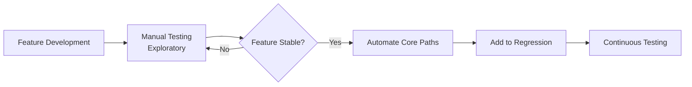

# Automation Strategy

> **Core Principle:** Automate strategically based on risk, frequency, and value. Not everything should be automated.

## What Automation Strategy Is

Automation strategy answers:
- **What to automate:** Which tests provide the most value
- **When to automate:** At what point in development
- **How to automate:** Which tools and approaches to use
- **Why to automate:** What benefits we expect

A good strategy balances:
- Initial investment vs long-term benefits
- Automation coverage vs maintenance cost
- Speed vs reliability
- Breadth vs depth

## Why Strategy Matters

**Without strategy:**
- Automate everything → High maintenance, low value
- Automate nothing → Missed opportunities for fast feedback
- Automate wrong things → Waste time on low-value tests
- Inconsistent approach → Fragmented, hard-to-maintain suite

**With strategy:**
- Focus on high-value automation
- Clear priorities and roadmap
- Consistent approach across teams
- Measurable benefits

## The Test Automation Pyramid

### Classic Pyramid

```
        /\
       /  \
      / E2E \          Few, slow, high-value
     /--------\
    / Integration \    Moderate number, moderate speed
   /----------------\
  /   Unit Tests     \  Many, fast, low-level
 /--------------------\
```

| Layer | Count | Speed | Purpose |
|-------|-------|-------|---------|
| **Unit tests** | Many (thousands) | Fast (ms) | Verify individual functions/methods |
| **Integration tests** | Moderate (hundreds) | Moderate (seconds) | Verify component interactions |
| **E2E tests** | Few (dozens) | Slow (minutes) | Verify complete user workflows |

### Why This Structure?

**Unit tests (base):**
- Fast execution (milliseconds)
- Easy to write and maintain
- Precise failure location
- High coverage of logic

**Integration tests (middle):**
- Verify component interactions
- Catch interface defects
- Moderate speed and complexity

**E2E tests (top):**
- Verify complete workflows
- Test from user perspective
- Slow and brittle
- High business value

### Modern Variations

**Testing Trophy (Kent C. Dodds):**
```
        /\
       /  \
      / E2E \
     /--------\
    /Integration\  ← Emphasis here
   /--------------\
  /   Static Tests  \
 /--------------------\
```

Emphasizes integration tests over unit tests for modern web applications.

**Ice Cream Cone (Anti-Pattern):**
```
      ______
     /      \
    /  E2E   \      Too many E2E tests
   /----------\
  / Integration \   Few integration tests
 /----------------\
/    Unit Tests    \ Few unit tests
\------------------/
```

**Problem:** High maintenance, slow feedback, flaky tests

## What to Automate

### High Priority (Automate First)

| Category | Examples | Rationale |
|----------|----------|-----------|
| **Regression tests** | Tests for fixed bugs | Prevent re-introduction |
| **Smoke tests** | Core functionality checks | Fast feedback on builds |
| **Critical paths** | Login, checkout, payment | High business value |
| **Data-driven tests** | Same test with many data sets | Efficiency gain |
| **Repetitive tests** | Run frequently in CI | Time savings |
| **Complex calculations** | Business logic, algorithms | Precision and speed |

### Medium Priority (Automate When Stable)

| Category | Examples | Rationale |
|----------|----------|-----------|
| **API tests** | Service integrations | Stable interfaces |
| **Configuration tests** | Environment-specific behavior | Repeatable checks |
| **Performance tests** | Load and stress tests | Consistent measurement |

### Low Priority (Automate Last or Not At All)

| Category | Examples | Rationale |
|----------|----------|-----------|
| **UX/usability** | Visual design, user experience | Requires human judgment |
| **Exploratory tests** | Discovery and investigation | Creative, adaptive |
| **One-time tests** | Migration, data conversion | Not repeatable |
| **Unstable features** | Rapidly changing UI | High maintenance |
| **Edge cases** | Rare scenarios | Low ROI |

### Automation Decision Matrix

| Test Type | Frequency | Stability | Automation Value |
|-----------|-----------|-----------|------------------|
| Smoke tests | Every build | High | **High** (automate) |
| Regression suite | Every release | High | **High** (automate) |
| New feature tests | Once | Low | **Low** (manual first) |
| Exploratory testing | Ad-hoc | N/A | **None** (manual) |
| Performance tests | Weekly | Medium | **Medium** (automate when stable) |

## When to Automate

### Development Lifecycle



**Phase 1: Early Development**
- Manual exploratory testing
- Understand feature behavior
- Find and fix initial defects
- **Do not automate yet** (feature changing)

**Phase 2: Stabilization**
- Feature behavior understood
- Requirements clarified
- Major defects fixed
- **Start automating** core paths

**Phase 3: Maturity**
- Feature stable
- Automated tests in place
- Part of regression suite
- **Maintain and extend** automation

### Automation Timing Guidelines

| Scenario | When to Automate |
|----------|-----------------|
| **New feature** | After manual testing, when stable |
| **Bug fix** | Immediately (prevent regression) |
| **Refactoring** | Before changes (safety net) |
| **Legacy system** | Incrementally, starting with critical paths |
| **API changes** | When contract is stable |

## Automation Approaches

### 1. Record and Playback

**Description:** Record user actions, replay automatically

**Tools:** Selenium IDE, TestComplete

**Pros:**
- Quick to create
- No programming required
- Good for simple scenarios

**Cons:**
- Brittle (breaks on UI changes)
- Hard to maintain
- Limited flexibility
- Poor error handling

**When to use:** Quick demos, one-time tests, non-technical users

### 2. Scripted Automation

**Description:** Write test scripts in programming language

**Tools:** Selenium WebDriver, Cypress, Playwright

**Pros:**
- Full control and flexibility
- Can handle complex scenarios
- Integrates with CI/CD
- Reusable code

**Cons:**
- Requires programming skills
- Higher initial investment
- Maintenance overhead

**When to use:** Most automation projects, complex scenarios, long-term maintenance

### 3. Keyword-Driven Testing

**Description:** Define keywords for actions, combine in test cases

**Example:**
```
Login:
  Open Browser: Chrome
  Navigate: https://example.com/login
  Enter Text: username_field, testuser
  Enter Text: password_field, password123
  Click: login_button
  Verify: dashboard_page_displayed
```

**Pros:**
- Reusable keywords
- Non-technical users can create tests
- Separation of test logic and implementation

**Cons:**
- Requires framework development
- Can become complex
- Maintenance of keyword library

**When to use:** Large test suites, mixed technical/non-technical teams

### 4. Data-Driven Testing

**Description:** Same test logic with multiple data sets

**Example:**
```python
@pytest.mark.parametrize("username,password,expected", [
    ("user1", "pass1", "success"),
    ("user2", "wrong", "error"),
    ("", "pass1", "error"),
])
def test_login(username, password, expected):
    result = login(username, password)
    assert result == expected
```

**Pros:**
- Efficient for many test cases
- Easy to add new data
- Separation of logic and data

**Cons:**
- Requires data management
- Can be slow with large data sets

**When to use:** Input validation, business rules, many similar scenarios

### 5. Model-Based Testing

**Description:** Generate tests from system model (state machine, decision table)

**Pros:**
- Systematic coverage
- Automatic test generation
- Good for complex logic

**Cons:**
- Requires modeling expertise
- Tool support limited
- Can generate too many tests

**When to use:** Complex state machines, business rules, protocol testing

## Automation Roadmap

### Step 1: Assess Current State

**Questions:**
- What manual tests exist?
- How long do they take?
- How often do they run?
- What are the pain points?
- What tools are available?

**Outputs:**
- Inventory of manual tests
- Time and effort estimates
- Pain point list

### Step 2: Identify Automation Candidates

**Prioritize based on:**
- Execution frequency
- Time savings
- Risk coverage
- Stability
- Business value

**Create prioritized list:**
1. Smoke tests (high frequency, high value)
2. Regression suite (frequent, stable)
3. Critical path tests (high business value)
4. Data-driven tests (efficiency gain)

### Step 3: Define Approach

**Decisions:**
- Tools and frameworks
- Programming language
- Test structure (pyramid, trophy)
- Integration with CI/CD
- Maintenance strategy

**Document:**
- Automation strategy document
- Tool selection rationale
- Coding standards
- Review process

### Step 4: Create Implementation Plan

**Phased approach:**

**Phase 1: Foundation (Week 1-2)**
- Set up framework and tools
- Create basic infrastructure
- Automate smoke tests
- Integrate with CI

**Phase 2: Core Coverage (Week 3-6)**
- Automate critical path tests
- Add regression tests
- Expand CI integration
- Train team

**Phase 3: Expansion (Week 7-12)**
- Add more regression tests
- Implement data-driven tests
- Optimize execution time
- Measure and report ROI

### Step 5: Execute and Iterate

**Implementation:**
- Start with high-priority tests
- Build incrementally
- Get feedback early
- Adjust approach as needed

**Continuous improvement:**
- Monitor test results
- Track maintenance effort
- Measure time savings
- Refine strategy

## Automation Strategy Template

```markdown
Test Automation Strategy: [Project Name]

1. Objectives
   - Reduce regression testing time from 3 days to 2 hours
   - Enable continuous integration with automated checks
   - Increase test coverage of critical paths to 90%

2. Scope
   In Scope:
   - Smoke tests (all builds)
   - Regression suite (all releases)
   - API integration tests
   - Critical user workflows
   
   Out of Scope:
   - Exploratory testing
   - Usability testing
   - One-time migration tests

3. Approach
   - Test pyramid: 70% unit, 20% integration, 10% E2E
   - Tools: Pytest, Selenium WebDriver, Requests
   - Language: Python
   - CI Integration: Jenkins pipeline

4. Priorities
   Phase 1: Smoke tests (Week 1-2)
   Phase 2: Login and checkout workflows (Week 3-4)
   Phase 3: API tests (Week 5-6)
   Phase 4: Full regression suite (Week 7-12)

5. Maintenance
   - Code review for all test code
   - Refactor when tests become slow or brittle
   - Remove obsolete tests quarterly
   - Update tests when UI changes

6. Success Metrics
   - Automation coverage: 80% of regression tests
   - Execution time: < 2 hours for full suite
   - Maintenance effort: < 20% of automation time
   - Defect detection: 50% of defects found by automation

7. Risks and Mitigations
   - Risk: Flaky tests erode trust
     Mitigation: Quarantine flaky tests, fix promptly
   
   - Risk: High maintenance overhead
     Mitigation: Use page object pattern, code reviews
   
   - Risk: Team lacks automation skills
     Mitigation: Training, pairing, gradual rollout
```

## Common Mistakes

| Mistake | Problem | Solution |
|---------|---------|----------|
| **Automate everything** | High maintenance, low value | Prioritize based on ROI |
| **Automate unstable features** | Constant test updates | Wait for stability |
| **Ignore maintenance** | Tests become brittle | Allocate time for refactoring |
| **No code reviews** | Poor quality test code | Treat tests as production code |
| **Automate manual tests directly** | Inefficient automation | Redesign for automation |
| **Skip unit tests** | Too many E2E tests | Follow test pyramid |
| **No CI integration** | Tests run infrequently | Integrate into pipeline |

## Key Takeaways

1. **Automate strategically:** Focus on high-value, stable, frequent tests
2. **Follow the test pyramid:** Many unit tests, fewer E2E tests
3. **Time automation right:** Automate after manual testing, when stable
4. **Choose appropriate approach:** Scripted, keyword, data-driven based on context
5. **Plan and iterate:** Create roadmap, implement incrementally, measure results

## Related Topics

- [[02_Test_Framework_Design]]: Building maintainable automation frameworks
- [[05_Flaky_Test_Management]]: Handling unreliable tests
- [[06_ROI_Analysis]]: Measuring automation value

## Existing Vault Connections

- [[software-engineering-note/05_Software_Testing/11_Test_Automation]]: Automation fundamentals and strategy
