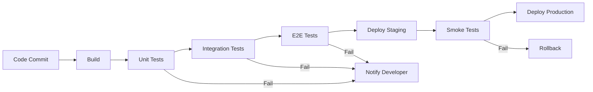
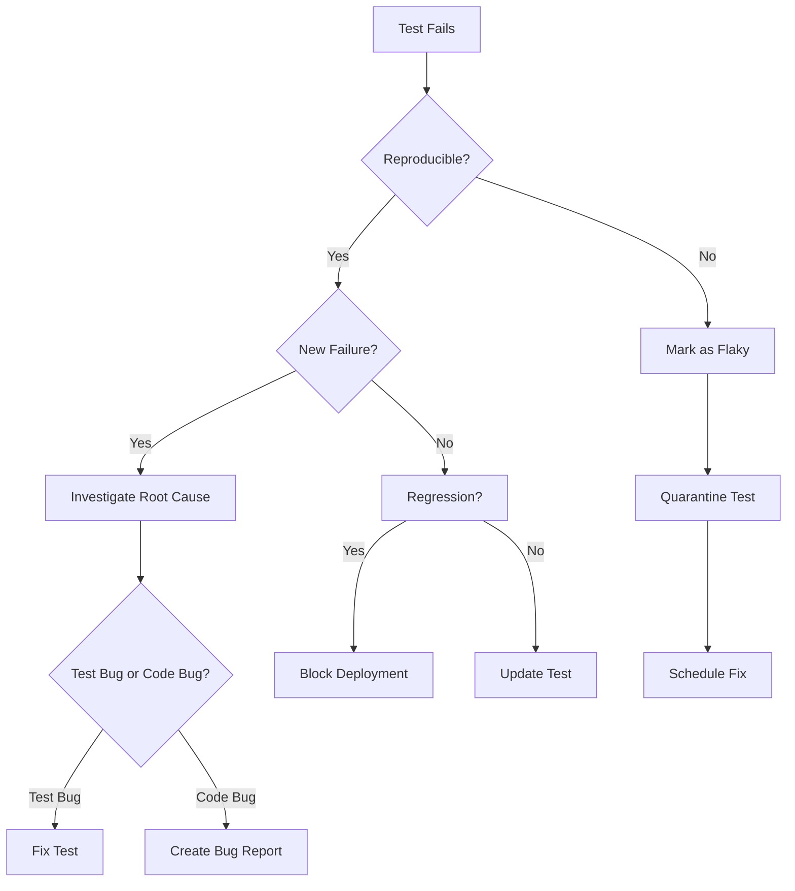

# CI/CD Integration

> **Core Principle:** Automated tests deliver maximum value when integrated into CI/CD pipelines, providing fast feedback on every code change.

## What CI/CD Integration Means

CI/CD integration connects automated tests to the development workflow:
- **Continuous Integration (CI):** Run tests on every code commit
- **Continuous Delivery (CD):** Automate deployment after tests pass
- **Fast feedback:** Developers learn quickly if changes break anything
- **Quality gates:** Prevent defective code from progressing

## Why CI/CD Integration Matters

**Without integration:**
- Tests run infrequently (manually triggered)
- Defects discovered late
- Slow feedback loops
- No enforcement of quality standards
- Manual deployment processes

**With integration:**
- Tests run automatically on every change
- Fast feedback (minutes, not days)
- Quality gates prevent bad code from merging
- Automated deployments
- Confidence in releases

## CI/CD Pipeline Structure

### Typical Pipeline Stages



### Stage Breakdown

| Stage | Tests | Duration | Purpose |
|-------|-------|----------|---------|
| **Build** | Compilation, linting | 1-2 min | Verify code compiles |
| **Unit tests** | Unit test suite | 2-5 min | Fast feedback on logic |
| **Integration tests** | API, database tests | 5-15 min | Verify component interactions |
| **E2E tests** | Critical workflows | 15-30 min | Verify user journeys |
| **Deploy staging** | N/A | 2-5 min | Deploy to test environment |
| **Smoke tests** | Core functionality | 2-5 min | Verify deployment health |
| **Deploy production** | N/A | 2-5 min | Release to users |

## Pipeline Configuration

### Jenkins Example

```groovy
pipeline {
    agent any
    
    stages {
        stage('Build') {
            steps {
                sh 'npm install'
                sh 'npm run build'
            }
        }
        
        stage('Unit Tests') {
            steps {
                sh 'npm run test:unit'
            }
            post {
                always {
                    junit 'test-results/unit/*.xml'
                }
            }
        }
        
        stage('Integration Tests') {
            steps {
                sh 'npm run test:integration'
            }
            post {
                always {
                    junit 'test-results/integration/*.xml'
                }
            }
        }
        
        stage('E2E Tests') {
            steps {
                sh 'npm run test:e2e'
            }
            post {
                always {
                    junit 'test-results/e2e/*.xml'
                    archiveArtifacts artifacts: 'screenshots/**', allowEmptyArchive: true
                }
            }
        }
        
        stage('Deploy to Staging') {
            when {
                branch 'main'
            }
            steps {
                sh './deploy.sh staging'
            }
        }
        
        stage('Smoke Tests') {
            when {
                branch 'main'
            }
            steps {
                sh 'npm run test:smoke -- --env=staging'
            }
        }
        
        stage('Deploy to Production') {
            when {
                branch 'main'
            }
            input {
                message 'Deploy to production?'
            }
            steps {
                sh './deploy.sh production'
            }
        }
    }
    
    post {
        failure {
            mail to: 'team@example.com',
                 subject: "Pipeline failed: ${env.BUILD_URL}",
                 body: "Check console output at ${env.BUILD_URL}console"
        }
    }
}
```

### GitHub Actions Example

```yaml
name: CI/CD Pipeline

on:
  push:
    branches: [main, develop]
  pull_request:
    branches: [main]

jobs:
  test:
    runs-on: ubuntu-latest
    
    steps:
    - uses: actions/checkout@v3
    
    - name: Setup Node
      uses: actions/setup-node@v3
      with:
        node-version: '18'
    
    - name: Install dependencies
      run: npm ci
    
    - name: Build
      run: npm run build
    
    - name: Unit tests
      run: npm run test:unit
    
    - name: Integration tests
      run: npm run test:integration
    
    - name: E2E tests
      run: npm run test:e2e
    
    - name: Upload test results
      uses: actions/upload-artifact@v3
      if: always()
      with:
        name: test-results
        path: test-results/
    
    - name: Upload screenshots
      uses: actions/upload-artifact@v3
      if: failure()
      with:
        name: screenshots
        path: screenshots/
  
  deploy-staging:
    needs: test
    runs-on: ubuntu-latest
    if: github.ref == 'refs/heads/main'
    
    steps:
    - uses: actions/checkout@v3
    
    - name: Deploy to staging
      run: ./deploy.sh staging
      env:
        DEPLOY_KEY: ${{ secrets.STAGING_DEPLOY_KEY }}
    
    - name: Smoke tests
      run: npm run test:smoke -- --env=staging
  
  deploy-production:
    needs: deploy-staging
    runs-on: ubuntu-latest
    environment: production
    
    steps:
    - uses: actions/checkout@v3
    
    - name: Deploy to production
      run: ./deploy.sh production
      env:
        DEPLOY_KEY: ${{ secrets.PRODUCTION_DEPLOY_KEY }}
```

## Test Execution Strategies

### 1. Parallel Execution

**Run tests in parallel to reduce time:**

```groovy
stage('Tests') {
    parallel {
        stage('Unit Tests') {
            steps {
                sh 'npm run test:unit'
            }
        }
        stage('Integration Tests') {
            steps {
                sh 'npm run test:integration'
            }
        }
        stage('API Tests') {
            steps {
                sh 'npm run test:api'
            }
        }
    }
}
```

**Pytest parallel execution:**
```bash
# Run tests in parallel (4 workers)
pytest -n 4

# Distribute by test duration
pytest -n auto --dist loadscope
```

### 2. Test Sharding

**Split tests across multiple machines:**

```yaml
jobs:
  test:
    runs-on: ubuntu-latest
    strategy:
      matrix:
        shard: [1, 2, 3, 4]
    
    steps:
    - name: Run tests (shard ${{ matrix.shard }}/4)
      run: pytest --shard=${{ matrix.shard }}/4
```

### 3. Selective Test Execution

**Run only relevant tests:**

```bash
# Run tests affected by changed files
pytest --testmon

# Run only smoke tests for quick feedback
pytest -m smoke

# Run tests matching pattern
pytest -k "login or checkout"
```

### 4. Incremental Testing

**Cache test results, run only changed tests:**

```bash
# Pytest with cache
pytest --lf  # Run last failed tests first
pytest --ff  # Run failed tests first, then others
pytest --nf  # Run new tests first
```

## Quality Gates

### Definition

Quality gates are checkpoints that prevent code from progressing if quality criteria are not met.

### Common Quality Gates

**Build gate:**
- Code compiles without errors
- No linting violations
- Dependencies resolved

**Unit test gate:**
- All unit tests pass
- Code coverage >= 80%
- No new code smells

**Integration test gate:**
- All integration tests pass
- API contracts validated
- Database migrations successful

**E2E test gate:**
- Critical workflows pass
- No high-severity defects
- Performance within SLA

**Deployment gate:**
- Smoke tests pass
- Health checks successful
- Monitoring configured

### Implementation Example

```groovy
stage('Quality Gate') {
    steps {
        script {
            def coverage = getCoverage()
            if (coverage < 80) {
                error "Code coverage ${coverage}% is below 80% threshold"
            }
            
            def criticalBugs = getCriticalBugCount()
            if (criticalBugs > 0) {
                error "Found ${criticalBugs} critical bugs"
            }
            
            def performanceScore = getPerformanceScore()
            if (performanceScore < 90) {
                error "Performance score ${performanceScore} is below 90"
            }
        }
    }
}
```

## Test Reporting

### JUnit XML Format

**Standard format for test results:**

```xml
<?xml version="1.0" encoding="UTF-8"?>
<testsuites>
  <testsuite name="LoginTests" tests="3" failures="1" errors="0" time="2.5">
    <testcase name="test_valid_login" time="0.8"/>
    <testcase name="test_invalid_password" time="0.7">
      <failure message="Expected error message not displayed">
        AssertionError: Expected "Invalid password" but got "Login failed"
      </failure>
    </testcase>
    <testcase name="test_account_lockout" time="1.0"/>
  </testsuite>
</testsuites>
```

**Pytest generates JUnit XML:**
```bash
pytest --junitxml=test-results.xml
```

### Test Result Visualization

**Jenkins:**
- Blue Ocean UI shows pipeline stages
- Test result trend graphs
- Failure analysis

**GitHub Actions:**
- Test summary in PR checks
- Annotations for failures
- Artifact downloads

**Allure Reports:**
- Rich HTML reports
- Test history and trends
- Failure categorization
- Screenshots and logs

## Handling Test Failures

### Failure Notification

**Immediate notification:**
```groovy
post {
    failure {
        slackSend channel: '#builds',
                  message: "Build failed: ${env.JOB_NAME} #${env.BUILD_NUMBER}",
                  color: 'danger'
        
        mail to: 'team@example.com',
             subject: "Build failed: ${env.JOB_NAME}",
             body: "View details: ${env.BUILD_URL}"
    }
}
```

### Failure Analysis

**Automatic retry for flaky tests:**
```groovy
stage('E2E Tests') {
    steps {
        retry(2) {
            sh 'npm run test:e2e'
        }
    }
}
```

**Quarantine flaky tests:**
```python
import pytest

@pytest.mark.flaky(reruns=3)
def test_unreliable_feature():
    # Test code that sometimes fails
    pass
```

### Failure Triage Process



## Pipeline Optimization

### 1. Caching

**Cache dependencies:**
```yaml
- name: Cache node modules
  uses: actions/cache@v3
  with:
    path: ~/.npm
    key: ${{ runner.os }}-node-${{ hashFiles('**/package-lock.json') }}
    restore-keys: |
      ${{ runner.os }}-node-
```

**Cache test environments:**
```groovy
stage('Setup') {
    steps {
        cache(path: 'node_modules', key: 'node-modules-${hashFiles("package-lock.json")}') {
            sh 'npm install'
        }
    }
}
```

### 2. Docker Containers

**Use containers for consistency:**
```yaml
jobs:
  test:
    runs-on: ubuntu-latest
    container:
      image: node:18
      options: --cpus 2
    
    services:
      postgres:
        image: postgres:13
        env:
          POSTGRES_DB: testdb
          POSTGRES_USER: test
          POSTGRES_PASSWORD: test
    
    steps:
    - uses: actions/checkout@v3
    - run: npm ci
    - run: npm test
```

### 3. Pipeline Analytics

**Track metrics:**
- Pipeline duration
- Test execution time
- Failure rate
- Flaky test count
- Queue time

**Identify bottlenecks:**
- Slow stages
- Frequent failures
- Resource contention

## Integration Best Practices

### 1. Fast Feedback

**Prioritize speed:**
- Run unit tests first (fastest)
- Run integration tests second
- Run E2E tests last (slowest)
- Parallelize where possible
- Cache dependencies

**Target times:**
- Unit tests: < 5 minutes
- Integration tests: < 15 minutes
- E2E tests: < 30 minutes
- Total pipeline: < 1 hour

### 2. Reliability

**Ensure consistent results:**
- Use containers for consistency
- Isolate tests from each other
- Clean up after tests
- Handle flaky tests promptly
- Retry transient failures

### 3. Visibility

**Provide clear feedback:**
- Test result summaries
- Failure details and logs
- Trend graphs
- Notifications for failures
- Dashboard for pipeline health

### 4. Security

**Protect sensitive data:**
- Use secrets for credentials
- Rotate keys regularly
- Audit access logs
- Scan for vulnerabilities
- Isolate test environments

## Common Challenges

| Challenge | Solution |
|-----------|----------|
| **Slow pipelines** | Parallelize, cache, optimize tests |
| **Flaky tests** | Quarantine, fix, improve waits |
| **Environment issues** | Use containers, infrastructure as code |
| **Test data management** | Use fixtures, reset between tests |
| **Resource contention** | Scale runners, schedule off-peak |
| **Failure diagnosis** | Better logging, screenshots, videos |

## Key Takeaways

1. **Integrate tests into CI/CD:** Run automatically on every change
2. **Provide fast feedback:** Optimize pipeline speed
3. **Use quality gates:** Prevent bad code from progressing
4. **Handle failures systematically:** Notify, analyze, fix
5. **Monitor and optimize:** Track metrics, improve continuously

## Related Topics

- [[01_Automation_Strategy]]: What to automate for CI/CD
- [[03_Maintainable_Tests]]: Writing tests that work in pipelines
- [[05_Flaky_Test_Management]]: Handling unreliable tests in CI

## Existing Vault Connections

- [[software-engineering-note/06_Software_Engineering_Operations/04_Deployment_and_Release]]: CI/CD pipelines
- [[software-engineering-note/05_Software_Testing/11_Test_Automation]]: Test automation in CI/CD
