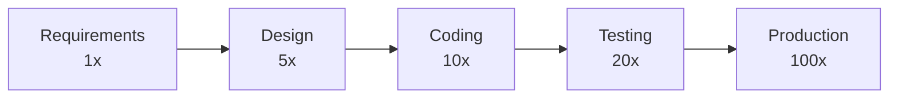
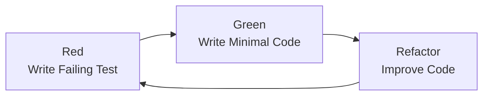

# Defect Prevention

> **Core Principle:** Preventing defects is cheaper than finding and fixing them. Build quality in from the start.

## The Cost of Defects

### Cost Escalation by Phase



**Why costs escalate:**
- Later phases require more rework
- Defects cascade (one defect causes others)
- Production defects affect customers
- Emergency fixes are rushed and error-prone
- Reputation and trust damage

**Example:**
- Fix in requirements: 1 hour ($100)
- Fix in testing: 20 hours ($2,000)
- Fix in production: 100 hours ($10,000)

## Defect Prevention Strategies

### 1. Clear Requirements

**Problem:** Ambiguous requirements lead to misunderstandings

**Prevention:**
- Use INVEST criteria (Independent, Negotiable, Valuable, Estimable, Small, Testable)
- Write acceptance criteria for each requirement
- Use examples and scenarios
- Review requirements with stakeholders
- Prototype when unclear

**Example:**
```markdown
Requirement: User login

Bad: "Users should be able to log in easily"

Good: "Users can log in with email and password.
      System validates credentials and creates session.
      Invalid credentials show error message.
      Account locks after 3 failed attempts."

Acceptance Criteria:
- User enters valid email and password: logged in successfully
- User enters invalid password: error message shown, can retry
- User enters invalid email: error message shown
- 3 failed attempts: account locked for 15 minutes
- Password field masked
- "Remember me" option available
```

### 2. Design Reviews

**Problem:** Design flaws lead to implementation defects

**Prevention:**
- Review architecture before coding
- Identify risks and edge cases
- Consider scalability, security, performance
- Document design decisions
- Get feedback from team

**Design Review Checklist:**
- [ ] Requirements understood
- [ ] Architecture appropriate
- [ ] Security considered
- [ ] Performance requirements met
- [ ] Scalability planned
- [ ] Error handling defined
- [ ] Edge cases identified
- [ ] Dependencies managed

### 3. Coding Standards

**Problem:** Inconsistent code leads to bugs and maintenance issues

**Prevention:**
- Define coding standards
- Use linters and formatters
- Enforce via code reviews
- Automate where possible

**Example standards:**
```python
# Naming
- Variables: snake_case (user_name, order_total)
- Functions: snake_case (calculate_total, validate_email)
- Classes: PascalCase (UserAccount, OrderProcessor)
- Constants: UPPER_SNAKE_CASE (MAX_RETRIES, API_KEY)

# Structure
- Functions: < 50 lines
- Classes: < 500 lines
- Files: < 1000 lines
- Nesting: < 4 levels

# Documentation
- Public functions: docstrings
- Complex logic: inline comments
- APIs: API documentation

# Error handling
- Catch specific exceptions
- Log errors with context
- Provide meaningful error messages
```

### 4. Test-Driven Development (TDD)

**Problem:** Writing code without tests leads to untested code

**Prevention:**
- Write test before code
- Test defines expected behavior
- Refactor with confidence

**TDD Cycle:**


**Example:**
```python
# 1. Write failing test
def test_calculate_discount():
    assert calculate_discount(100, "premium") == 10.0
    assert calculate_discount(100, "regular") == 5.0
    assert calculate_discount(50, "premium") == 5.0

# 2. Write minimal code to pass
def calculate_discount(amount, customer_type):
    if customer_type == "premium":
        return amount * 0.1
    return amount * 0.05

# 3. Refactor
def calculate_discount(amount, customer_type):
    rates = {"premium": 0.1, "regular": 0.05}
    return amount * rates.get(customer_type, 0)
```

### 5. Pair Programming

**Problem:** Solo coding misses issues

**Prevention:**
- Two developers, one keyboard
- Continuous code review
- Knowledge sharing
- Fewer defects introduced

**Benefits:**
- Immediate feedback
- Fewer defects (studies show 15-50% reduction)
- Better design decisions
- Knowledge transfer
- Reduced bus factor

### 6. Static Analysis

**Problem:** Manual code review misses patterns

**Prevention:**
- Use static analysis tools
- Catch common issues automatically
- Enforce standards

**Tools:**
- **Python:** pylint, flake8, mypy, bandit
- **JavaScript:** ESLint, TypeScript, SonarQube
- **Java:** Checkstyle, FindBugs, PMD
- **General:** SonarQube, CodeClimate

### 7. Automated Testing

**Problem:** Manual testing is slow and error-prone

**Prevention:**
- Unit tests for all functions
- Integration tests for components
- E2E tests for critical paths
- Run tests on every commit

**Test Pyramid:**
```
        /  E2E  \          Few, slow
       /----------\
      / Integration \      Moderate
     /----------------\
    /    Unit Tests     \  Many, fast
```

### 8. Continuous Integration

**Problem:** Integration issues found late

**Prevention:**
- Integrate frequently
- Run tests on every commit
- Fast feedback
- Catch integration issues early

### 9. Root Cause Analysis

**Problem:** Same defects recur

**Prevention:**
- Analyze root causes of defects
- Implement preventive measures
- Share learnings

**5 Whys Example:**
```
Problem: Payment processing failed in production

Why 1: Database connection timeout
Why 2: Connection pool exhausted
Why 3: Connections not released properly
Why 4: Missing finally block to close connection
Why 5: Developer forgot, no code review caught it

Root Cause: Missing code review checklist for resource management

Prevention: Add resource management to code review checklist
```

## Defect Prevention Process

### Phase 1: Requirements

**Activities:**
- Requirements review
- Acceptance criteria definition
- Risk identification
- Prototype if needed

**Outputs:**
- Clear requirements
- Testable acceptance criteria
- Identified risks

### Phase 2: Design

**Activities:**
- Architecture review
- Design walkthrough
- Risk assessment
- Test strategy planning

**Outputs:**
- Approved design
- Identified risks
- Test strategy

### Phase 3: Implementation

**Activities:**
- TDD or pair programming
- Code reviews
- Static analysis
- Unit testing

**Outputs:**
- Reviewed code
- Passing tests
- Static analysis clean

### Phase 4: Integration

**Activities:**
- Continuous integration
- Automated testing
- Integration testing
- Performance testing

**Outputs:**
- Integrated system
- Passing tests
- Performance metrics

### Phase 5: Validation

**Activities:**
- System testing
- User acceptance testing
- Exploratory testing
- Security review

**Outputs:**
- Validated system
- Bug reports
- Release readiness

## Defect Prevention Metrics

### Prevention Effectiveness

**Defect Injection Rate:**
```
Defects introduced per 1000 lines of code
Target: < 1 defect per KLOC
```

**Defect Detection Efficiency:**
```
% of defects found before production
Target: > 95%
```

**Cost of Quality:**
```
Prevention costs + Appraisal costs + Failure costs
Target: Prevention > Failure costs
```

**Rework Effort:**
```
% of time spent fixing defects
Target: < 20%
```

### Tracking Prevention

**Dashboard:**
```
Defect Prevention Dashboard
═══════════════════════════════════

Injection Rate:
  This sprint: 0.8 defects/KLOC ✓
  Last sprint: 1.2 defects/KLOC
  Target: < 1.0

Detection Efficiency:
  Found in testing: 97% ✓
  Found in production: 3%
  Target: > 95% in testing

Cost of Quality:
  Prevention: $15,000
  Appraisal (testing): $10,000
  Failure (rework): $5,000
  Ratio: 5:1 ✓

Rework:
  This sprint: 15% ✓
  Last sprint: 25%
  Target: < 20%
```

## Practical Defect Prevention

### Daily Practices

**For developers:**
- Write tests before code (TDD)
- Run tests before committing
- Use static analysis
- Review your own code before submitting
- Ask for help when unsure

**For testers:**
- Review requirements early
- Participate in design reviews
- Create test cases early
- Share testing insights
- Suggest preventive measures

**For team leads:**
- Allocate time for reviews
- Encourage pair programming
- Invest in automation
- Celebrate prevention successes
- Analyze and learn from defects

### Weekly Practices

- Review defect trends
- Identify prevention opportunities
- Share learnings
- Update prevention practices

### Monthly Practices

- Analyze defect root causes
- Update prevention checklist
- Train team on new practices
- Review prevention metrics

## Defect Prevention Checklist

### Requirements Phase
- [ ] Requirements reviewed with stakeholders
- [ ] Acceptance criteria defined
- [ ] Risks identified
- [ ] Examples provided
- [ ] Ambiguities resolved

### Design Phase
- [ ] Architecture reviewed
- [ ] Security considered
- [ ] Performance requirements addressed
- [ ] Edge cases identified
- [ ] Design documented

### Implementation Phase
- [ ] Coding standards followed
- [ ] TDD or pair programming used
- [ ] Code reviewed
- [ ] Static analysis passed
- [ ] Unit tests written and passing

### Integration Phase
- [ ] CI pipeline passing
- [ ] Integration tests passing
- [ ] Performance tests passing
- [ ] No critical defects

### Validation Phase
- [ ] System tests passing
- [ ] UAT completed
- [ ] Security review done
- [ ] Release criteria met

## Common Prevention Mistakes

| Mistake | Problem | Solution |
|---------|---------|----------|
| **Skip requirements review** | Misunderstandings | Always review requirements |
| **No design review** | Architecture flaws | Review design before coding |
| **Skip code reviews** | Defects introduced | Make reviews mandatory |
| **No TDD** | Untested code | Encourage TDD practices |
| **Ignore static analysis** | Common issues missed | Integrate static analysis |
| **Rushed development** | Quality suffers | Allocate time for quality |
| **No root cause analysis** | Defects recur | Analyze and learn |

## Key Takeaways

1. **Prevention is cheaper:** Fix defects early, not late
2. **Multiple strategies:** Use requirements, design, coding, and testing practices
3. **Measure effectiveness:** Track defect injection and detection rates
4. **Continuous improvement:** Learn from defects and improve practices
5. **Team responsibility:** Quality is everyone's job

## Related Topics

- [[02_Code_Reviews]]: Catching issues through peer review
- [[03_Static_Analysis]]: Automated issue detection
- [[04_Continuous_Improvement]]: Learning from defects

## Existing Vault Connections

- [[software-engineering-note/12_Software_Quality/03_Defect_Prevention]]: Defect prevention techniques
