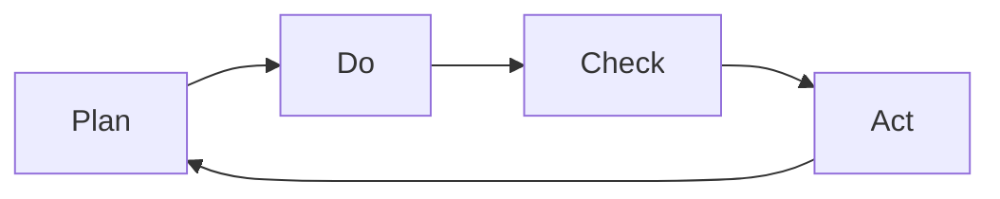

# Continuous Improvement

> **Core Principle:** Quality is not a destination but a journey. Continuously improve processes, practices, and products through systematic learning and adaptation.

## What Continuous Improvement Is

Continuous improvement is:
- **Ongoing:** Never finished, always evolving
- **Systematic:** Structured approach to getting better
- **Data-driven:** Based on metrics and evidence
- **Team-wide:** Everyone participates
- **Incremental:** Small changes add up over time

Also known as **Kaizen** (Japanese for "change for better").

## Why Continuous Improvement Matters

**Without improvement:**
- Processes become stale
- Technical debt accumulates
- Team morale declines
- Quality stagnates or degrades
- Competitors pass you by

**With improvement:**
- Processes evolve and improve
- Technical debt is managed
- Team engagement increases
- Quality steadily improves
- Competitive advantage maintained

**Compounding effect:**
- 1% improvement per week = 68% improvement per year
- Small changes are sustainable
- Big changes are risky and often fail

## Continuous Improvement Frameworks

### 1. PDCA Cycle (Deming Cycle)



**Plan:** Identify problem and plan improvement
- Analyze current state
- Identify root causes
- Define goals and metrics
- Plan implementation

**Do:** Implement the improvement
- Try on small scale
- Collect data
- Document what you did
- Monitor progress

**Check:** Measure results and learn
- Compare before and after
- Analyze metrics
- Identify what worked
- Identify what didn't

**Act:** Standardize or adjust
- If successful: standardize and scale
- If not: learn and try again
- Update processes and documentation
- Start next cycle

**Example:**
```
Problem: Too many production defects

Plan:
- Analyzed defects: 60% from missing error handling
- Root cause: No error handling checklist in code reviews
- Goal: Reduce production defects by 50%
- Plan: Add error handling checklist to code review process

Do:
- Piloted with one team for 2 sprints
- Added checklist to PR template
- Trained team on common error patterns
- Collected data on defects

Check:
- Production defects reduced by 65%
- Code review time increased by 10 minutes (acceptable)
- Team feedback: positive, found it helpful

Act:
- Rolled out to all teams
- Updated code review guidelines
- Added error handling to training materials
- Planned next improvement: automated error handling checks
```

### 2. Retrospectives

**Purpose:** Learn from experience and improve

**When:** End of each sprint or project

**Format:**
```
What went well?
- [List 3-5 things]

What didn't go well?
- [List 3-5 things]

What can we improve?
- [List 3-5 actions]
```

**Example:**
```
Sprint 12 Retrospective

What went well:
- Automated tests caught bugs early
- Pair programming worked well for complex features
- Daily standups were focused and short

What didn't go well:
- Requirements changed mid-sprint (2 stories affected)
- Code reviews took too long (average 3 days)
- One production incident due to missing error handling

What can we improve:
- Action 1: Freeze requirements 2 days before sprint starts
  Owner: Product Manager
  Due: Next sprint planning
  
- Action 2: Set code review SLA of 24 hours
  Owner: Tech Lead
  Due: This week
  
- Action 3: Add error handling checklist to code reviews
  Owner: QA Lead
  Due: Next sprint
```

**Retrospective techniques:**

**Start/Stop/Continue:**
- Start: What should we start doing?
- Stop: What should we stop doing?
- Continue: What should we continue doing?

**5 Whys:**
- Ask "why" five times to find root cause
- Example: Why did the bug reach production? Why wasn't it caught in testing? Why wasn't there a test? Why wasn't it in the acceptance criteria? Why weren't acceptance criteria detailed?

**Mad/Sad/Glad:**
- Mad: What frustrated you?
- Sad: What disappointed you?
- Glad: What made you happy?

**Sailboat:**
- Wind (helping): What's pushing us forward?
- Anchor (hindering): What's holding us back?
- Rocks (risks): What could sink us?
- Island (goal): Where are we heading?

### 3. Root Cause Analysis

**Purpose:** Find and fix root causes, not symptoms

**Techniques:**

**Fishbone Diagram (Ishikawa):**
```
Effect: Production incident

Categories:
- People: Developer rushed, reviewer was busy
- Process: No error handling checklist, no automated checks
- Technology: Complex error scenarios, poor logging
- Environment: Time pressure, production-like data unavailable
```

**5 Whys:**
```
Problem: Customer reported login failure

Why 1: Session expired unexpectedly
Why 2: Session timeout set too short
Why 3: Used default timeout value
Why 4: No session timeout requirements
Why 5: Security requirements not reviewed

Root Cause: Missing security requirements review
```

**Pareto Analysis:**
- 80% of problems come from 20% of causes
- Focus on the vital few, not the trivial many
- Example: 80% of defects from 20% of modules

### 4. Kaizen Events

**Purpose:** Focused improvement on specific area

**Format:**
- Short duration (1-5 days)
- Cross-functional team
- Specific problem or process
- Rapid implementation

**Example:**
```
Kaizen Event: Reduce test execution time

Problem: Full test suite takes 4 hours

Team: 2 developers, 1 tester, 1 DevOps

Day 1: Analyze
- Profile test execution
- Identify slowest tests
- Map dependencies

Day 2: Improve
- Parallelize independent tests
- Optimize database setup
- Cache test data

Day 3: Verify
- Run full suite: 1.5 hours (62% reduction)
- Ensure all tests still pass
- Document changes

Day 4: Standardize
- Update test guidelines
- Train team on best practices
- Add performance tests to CI
```

## Continuous Improvement in Practice

### Daily Improvements

**Individual level:**
- Learn one new thing
- Try one small improvement
- Reflect on what worked
- Share learnings

**Examples:**
- Learn a new testing technique
- Automate a repetitive task
- Improve a test case
- Refactor a small piece of code

### Weekly Improvements

**Team level:**
- Retrospective meeting
- Review metrics
- Plan improvements
- Track actions

**Examples:**
- Review defect trends
- Analyze test coverage
- Discuss process improvements
- Plan technical debt reduction

### Monthly Improvements

**Department level:**
- Quality review
- Process audit
- Training planning
- Strategic improvements

**Examples:**
- Review quality metrics
- Audit testing processes
- Plan training programs
- Update quality strategy

### Quarterly Improvements

**Organizational level:**
- Quality strategy review
- Process optimization
- Technology evaluation
- Major improvements

**Examples:**
- Evaluate new testing tools
- Redesign testing processes
- Implement new practices
- Measure ROI of improvements

## Improvement Metrics

### Process Metrics

**Cycle time:**
```
Time from idea to implementation
Target: Decreasing over time
```

**Improvement rate:**
```
Number of improvements implemented per month
Target: Increasing over time
```

**Improvement success rate:**
```
% of improvements that achieve goals
Target: > 80%
```

### Quality Metrics

**Defect trend:**
```
Defects per sprint or release
Target: Decreasing over time
```

**Test coverage trend:**
```
% of code covered by tests
Target: Increasing over time
```

**Technical debt trend:**
```
Amount of technical debt
Target: Decreasing over time
```

### Team Metrics

**Team engagement:**
```
Team satisfaction and participation
Target: High and increasing
```

**Learning rate:**
```
New skills and practices adopted
Target: Continuous learning
```

### Improvement Dashboard

```
Continuous Improvement Dashboard
═══════════════════════════════════════

This Quarter:
  Improvements implemented: 12
  Improvements in progress: 5
  Success rate: 83% ✓

Quality Trends:
  [Graph: Defects per sprint - decreasing]
  [Graph: Test coverage - increasing]
  [Graph: Cycle time - decreasing]

Top Improvements:
  1. Automated regression tests: saved 20 hours/sprint
  2. Code review checklist: reduced defects by 40%
  3. Pair programming: reduced bugs by 30%

Next Priorities:
  1. Implement TDD for new features
  2. Add performance testing to CI
  3. Improve test data management
```

## Improvement Techniques

### 1. Value Stream Mapping

**Purpose:** Identify waste and bottlenecks

**Steps:**
1. Map current process
2. Identify value-added vs non-value-added steps
3. Calculate cycle time and wait time
4. Identify bottlenecks and waste
5. Design improved process

**Example:**
```
Current Test Process:
- Write test (2 hours) - value added
- Wait for review (8 hours) - wait time
- Review test (1 hour) - value added
- Wait for approval (4 hours) - wait time
- Execute test (30 min) - value added
- Wait for results (2 hours) - wait time

Total cycle time: 17.5 hours
Value-added time: 3.5 hours
Efficiency: 20%

Improved Process:
- Write test (2 hours)
- Automated review (5 min)
- Execute test immediately (30 min)
- Automated reporting (5 min)

Total cycle time: 3 hours
Value-added time: 3 hours
Efficiency: 100%
```

### 2. A/B Testing

**Purpose:** Compare two approaches

**Steps:**
1. Define hypothesis
2. Create two versions (A and B)
3. Split traffic or users
4. Measure results
5. Choose winner

**Example:**
```
Hypothesis: Exploratory testing finds more bugs than scripted testing

Test:
- Team A: Scripted testing (50 test cases)
- Team B: Exploratory testing (2 hours)

Results:
- Team A: Found 8 bugs, 6 hours
- Team B: Found 12 bugs, 2 hours

Decision: Use exploratory testing for this type of feature
```

### 3. Experiments

**Purpose:** Try new ideas safely

**Format:**
- Hypothesis: We believe [change] will [benefit]
- Experiment: We will try [change] for [time]
- Success: We will know we succeeded when [metric]

**Example:**
```
Hypothesis: Daily code reviews will reduce review cycle time

Experiment: Try daily 30-minute review sessions for 2 weeks

Success: Review cycle time < 4 hours, team satisfaction > 4/5

Result: Success! Cycle time reduced to 3 hours, satisfaction 4.2/5

Decision: Continue daily reviews
```

### 4. Benchmarking

**Purpose:** Compare to industry standards

**Steps:**
1. Identify metrics to benchmark
2. Research industry standards
3. Compare your performance
4. Identify gaps
5. Plan improvements

**Example:**
```
Metric: Test automation coverage
Industry standard: 70-80%
Our coverage: 45%
Gap: 25-35%

Action plan: Increase automation coverage to 70% in 6 months
```

## Common Improvement Pitfalls

| Pitfall | Problem | Solution |
|---------|---------|----------|
| **Too many changes** | Overwhelm, confusion | Focus on 1-2 at a time |
| **No measurement** | Don't know if it worked | Define metrics upfront |
| **No follow-through** | Actions not completed | Assign owners and deadlines |
| **Blame culture** | People hide problems | Focus on systems, not people |
| **Big bang changes** | High risk, resistance | Make incremental changes |
| **No celebration** | Morale suffers | Celebrate successes |

## Building an Improvement Culture

### Leadership Role

**Leaders should:**
- Model continuous improvement
- Allocate time for improvement
- Celebrate improvements
- Remove obstacles
- Provide resources

**Example:**
```
Good leader:
"We have time allocated every Friday for improvement work.
Let's try this new testing technique and see how it goes.
Great job on reducing test time by 30%!"

Bad leader:
"We don't have time for improvements, just get it done.
Why are you trying new things? Just do what we've always done.
That improvement only saved 1 hour, not worth the effort."
```

### Team Role

**Team members should:**
- Suggest improvements
- Participate in retrospectives
- Try new approaches
- Share learnings
- Support each other

### Psychological Safety

**Create environment where:**
- People feel safe to admit mistakes
- Failures are learning opportunities
- Ideas are welcomed and considered
- Questions are encouraged
- Experimentation is supported

**Example:**
```
Psychologically safe:
"I made a mistake in the test design, here's what I learned..."
"Let's try this new approach, it might not work but we'll learn."
"What do you think we could do better?"

Not safe:
"Who made this mistake? They need to be more careful."
"We've always done it this way, don't change it."
"That's a stupid idea, it will never work."
```

## Key Takeaways

1. **Improvement is continuous:** Never finished, always evolving
2. **Use structured approaches:** PDCA, retrospectives, root cause analysis
3. **Measure improvements:** Know what works and what doesn't
4. **Start small:** Incremental changes are sustainable
5. **Build a culture:** Everyone participates, everyone improves

## Related Topics

- [[04_Continuous_Improvement]]: Learning from defects
- [[05_Quality_Metrics]]: Measuring improvement
- [[06_Quality_Culture]]: Building improvement culture

## Existing Vault Connections

- [[software-engineering-note/12_Software_Quality/06_Continuous_Improvement]]: Continuous improvement practices
