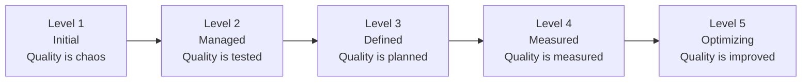

# Quality Culture

> **Core Principle:** Quality is not a phase or a role: it is a mindset. A quality culture means everyone owns quality, every day.

## What Quality Culture Is

Quality culture is:
- **Shared mindset:** Team believes quality matters
- **Collective ownership:** Everyone is responsible for quality
- **Embedded practices:** Quality is built into daily work
- **Continuous learning:** Team learns from mistakes and improves
- **Psychological safety:** People feel safe to raise issues

## Why Culture Matters More Than Process

**Process without culture:**
- People follow rules but don't care
- Quality is "QA's job"
- Defects are hidden or blamed
- Improvement is resisted
- Quality degrades under pressure

**Culture with process:**
- People care about quality intrinsically
- Everyone owns quality
- Defects are raised openly
- Improvement is embraced
- Quality improves over time

**Culture eats process for breakfast:** A team with strong quality culture will outperform a team with perfect processes but weak culture.

## Signs of Strong vs Weak Quality Culture

### Strong Quality Culture

| Indicator | Behavior |
|-----------|----------|
| **Ownership** | "I found a bug in my code, fixing it now" |
| **Transparency** | "This feature has known issues, here's the plan" |
| **Pride** | "I refactored this to make it cleaner" |
| **Collaboration** | "Let me help you test this" |
| **Learning** | "What can we learn from this incident?" |
| **Prevention** | "Let's add a test to prevent this recurring" |
| **Courage** | "We should delay release, quality isn't good enough" |

### Weak Quality Culture

| Indicator | Behavior |
|-----------|----------|
| **Blame** | "QA should have caught this" |
| **Secrecy** | "Don't mention this bug, it might delay us" |
| **Shortcuts** | "Skip the tests, we're in a hurry" |
| **Silos** | "That's not my job" |
| **Repetition** | "We've seen this bug before" |
| **Reactive** | "We'll add tests after it breaks" |
| **Pressure** | "Ship it now, fix it later" |

## Building Quality Culture

### 1. Leadership Commitment

**Leaders must:**
- Demonstrate quality is a priority
- Allocate time and resources for quality
- Celebrate quality achievements
- Support quality decisions (even when they delay releases)
- Model quality behaviors

**Example:**
```
Strong leadership:
"We're delaying the release to fix these quality issues.
Quality is more important than speed.
Great job catching those bugs before they reached customers."

Weak leadership:
"Ship it now, we'll fix bugs later.
Don't slow us down with all these tests.
Why did you spend time refactoring? Just add features."
```

### 2. Shared Ownership

**Quality is everyone's job:**
- Developers write tests
- Testers prevent defects
- Product owners define quality criteria
- Managers allocate time for quality
- Everyone reviews code

**Practices:**
- Developers write unit and integration tests
- Testers participate in design reviews
- Product owners define acceptance criteria
- Everyone does code reviews
- Quality goals in everyone's objectives

### 3. Psychological Safety

**Create environment where:**
- People can admit mistakes without fear
- Issues are raised openly
- Questions are welcomed
- Experimentation is encouraged
- Failure is a learning opportunity

**Practices:**
- Blameless post-mortems
- Celebrate learning from mistakes
- Encourage questions and curiosity
- Support experimentation
- Focus on systems, not individuals

**Example:**
```
Psychologically safe:
"I made a mistake that caused the outage. Here's what I learned
and how we can prevent it in the future."
Team: "Thanks for sharing. Let's add safeguards."

Not safe:
"Who caused the outage? They need to be more careful."
Team: "I better not admit my mistakes."
```

### 4. Transparency and Visibility

**Make quality visible:**
- Public dashboards
- Regular quality reports
- Open defect tracking
- Shared metrics
- Celebrate improvements

**Practices:**
- Quality dashboards in team area
- Weekly quality updates in standup
- Monthly quality reports to stakeholders
- Public celebration of quality wins
- Transparent defect tracking

### 5. Continuous Learning

**Team learns and improves:**
- Retrospectives after every sprint
- Post-mortems after incidents
- Knowledge sharing sessions
- Training and conferences
- Experimentation with new practices

**Practices:**
- Regular retrospectives
- Blameless incident reviews
- Tech talks and brown bags
- Training budget for everyone
- Time allocated for learning

### 6. Recognition and Rewards

**Celebrate quality behaviors:**
- Recognize people who prevent defects
- Reward quality improvements
- Celebrate testing achievements
- Acknowledge code review contributions
- Highlight quality wins

**Examples:**
- "Quality Champion" of the month
- Spotlight quality work in team meetings
- Include quality in performance reviews
- Celebrate defect prevention (not just detection)
- Share success stories

## Quality Culture Practices

### Daily Practices

**Quality standup questions:**
- What quality issues did you encounter?
- What did you do to improve quality?
- What quality risks do you see?

**Quality moments:**
- Share a quality win or learning
- Highlight good code or tests
- Discuss a defect and what was learned

### Weekly Practices

**Quality reviews:**
- Review quality metrics
- Discuss quality trends
- Plan quality improvements
- Share quality learnings

**Code review focus:**
- Rotate code review focus areas
- Share interesting findings
- Discuss patterns and anti-patterns

### Monthly Practices

**Quality retrospectives:**
- Deep dive into quality trends
- Analyze defect patterns
- Plan quality initiatives
- Review improvement progress

**Quality workshops:**
- Training on new practices
- Hands-on exercises
- Team building around quality
- Knowledge sharing

### Quarterly Practices

**Quality strategy reviews:**
- Review quality goals
- Assess progress
- Adjust strategy
- Plan next quarter

**Quality celebrations:**
- Celebrate achievements
- Recognize contributors
- Share success stories
- Team building

## Overcoming Resistance

### Common Objections

**"Quality slows us down"**
- Response: Quality speeds us up by reducing rework
- Evidence: Show defect fix time vs prevention time
- Example: "It takes 10 minutes to write a test, 10 hours to fix a bug in production"

**"That's QA's job"**
- Response: Quality is everyone's responsibility
- Evidence: Show how early involvement reduces defects
- Example: "Developers who write tests find bugs faster than QA"

**"We don't have time"**
- Response: We don't have time NOT to invest in quality
- Evidence: Show cost of poor quality (rework, defects)
- Example: "We spent 40% of last sprint fixing bugs"

**"It's good enough"**
- Response: Define what "good enough" means
- Evidence: Show customer impact and technical debt
- Example: "Customers reported 15 bugs last month"

### Change Management

**Steps to change culture:**

1. **Create urgency:** Show why quality matters
   - Share customer complaints
   - Show cost of poor quality
   - Highlight competitive threats

2. **Build coalition:** Find quality champions
   - Identify early adopters
   - Get leadership support
   - Build cross-functional team

3. **Create vision:** Define what good looks like
   - Describe desired culture
   - Set quality goals
   - Paint picture of success

4. **Communicate:** Share the vision widely
   - Talk about quality constantly
   - Share success stories
   - Address concerns openly

5. **Empower:** Remove obstacles
   - Provide tools and training
   - Allocate time for quality
   - Remove bureaucratic barriers

6. **Generate wins:** Create quick successes
   - Start with small improvements
   - Celebrate early wins
   - Build momentum

7. **Consolidate:** Build on successes
   - Expand successful practices
   - Tackle bigger challenges
   - Keep improving

8. **Anchor:** Make it stick
   - Update processes and policies
   - Include in onboarding
   - Recognize and reward

## Quality Culture Assessment

### Culture Maturity Model



**Level 1: Initial**
- Quality is ad hoc
- No processes
- Reactive firefighting
- Blame culture
- High defect rates

**Level 2: Managed**
- Testing exists
- Basic processes
- Some metrics
- Quality is QA's job
- Defects found in testing

**Level 3: Defined**
- Quality planned upfront
- Defined processes
- Prevention practices
- Shared ownership
- Fewer defects

**Level 4: Measured**
- Quality measured
- Data-driven decisions
- Continuous monitoring
- Proactive improvement
- Low defect rates

**Level 5: Optimizing**
- Continuous improvement
- Innovation encouraged
- Learning organization
- Quality culture embedded
- Excellence pursued

### Assessment Questions

**Leadership:**
- Do leaders prioritize quality?
- Is time allocated for quality?
- Are quality decisions supported?

**Ownership:**
- Does everyone feel responsible for quality?
- Do developers write tests?
- Is quality in everyone's objectives?

**Transparency:**
- Are quality metrics visible?
- Are defects discussed openly?
- Is there psychological safety?

**Learning:**
- Do retrospectives happen?
- Are incidents reviewed?
- Is learning shared?

**Improvement:**
- Are improvements implemented?
- Is progress tracked?
- Are successes celebrated?

## Measuring Culture

### Qualitative Indicators

**Observe behaviors:**
- Do people raise issues openly?
- Do developers write tests voluntarily?
- Do people help each other with quality?
- Are mistakes treated as learning?
- Is quality discussed in conversations?

**Listen to language:**
- "We" vs "they" (ownership)
- "Learn" vs "blame" (safety)
- "Prevent" vs "find" (proactive)
- "Improve" vs "maintain" (growth)

### Quantitative Indicators

**Survey team:**
- Quality is important to our team (1-5)
- I feel safe raising quality issues (1-5)
- We have time allocated for quality (1-5)
- Quality is everyone's responsibility (1-5)
- We continuously improve quality (1-5)

**Track participation:**
- % of team doing code reviews
- % of team writing tests
- % attending quality meetings
- % participating in retrospectives

### Culture Dashboard

```
Quality Culture Dashboard
═══════════════════════════════════

Maturity Level: 3 (Defined) ↑ from 2 last quarter

Survey Results:
  Quality is important: 4.5/5 ✓
  Safe to raise issues: 4.2/5 ✓
  Time for quality: 3.8/5 ⚠
  Shared ownership: 4.0/5 ✓
  Continuous improvement: 3.5/5 ⚠

Participation:
  Code reviews: 95% ✓
  Test writing: 88% ✓
  Retrospectives: 100% ✓
  Quality meetings: 75%

Behaviors:
  Issues raised proactively: 12 this month ↑
  Quality wins celebrated: 5 this month ✓
  Learning shared: 8 sessions this month ✓
```

## Quality Culture Success Stories

### Example 1: From Blame to Learning

**Before:**
- Production incident: "Who did this?"
- People hide mistakes
- Same issues recur
- Low morale

**After:**
- Production incident: "What can we learn?"
- Blameless post-mortems
- Systemic fixes implemented
- High morale, continuous improvement

**Result:** 60% reduction in recurring incidents

### Example 2: From Silos to Collaboration

**Before:**
- Developers: "Write code"
- Testers: "Find bugs"
- Operations: "Deploy code"
- Finger-pointing between teams

**After:**
- Cross-functional teams
- Everyone involved in quality
- Shared goals and metrics
- Collaborative problem-solving

**Result:** 50% faster delivery, 40% fewer defects

### Example 3: From Reactive to Proactive

**Before:**
- Test at the end
- Find bugs in production
- Emergency fixes
- Customer complaints

**After:**
- Prevent defects upfront
- Test throughout development
- Proactive monitoring
- Customer satisfaction

**Result:** 70% reduction in production defects

## Key Takeaways

1. **Culture matters more than process:** Mindset drives behavior
2. **Leadership is critical:** Leaders set the tone
3. **Everyone owns quality:** Not just QA's job
4. **Psychological safety:** Safe to raise issues and admit mistakes
5. **Continuous learning:** Learn from mistakes, improve constantly

## Related Topics

- [[01_Defect_Prevention]]: Prevention requires culture
- [[04_Continuous_Improvement]]: Improvement requires culture
- [[05_Quality_Metrics]]: Metrics support culture

## Existing Vault Connections

- [[software-engineering-note/12_Software_Quality/08_Quality_Culture]]: Building quality culture
