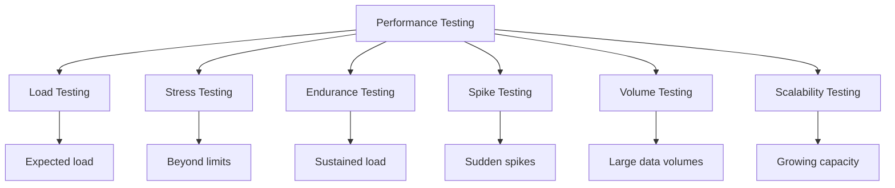

# Performance Testing

> **Core Principle:** Performance testing verifies that the system meets speed, scalability, and stability requirements under expected and peak load conditions.

## What Performance Testing Is

Performance testing measures:
- **Response time:** How long operations take
- **Throughput:** How many operations per second
- **Resource utilization:** CPU, memory, disk, network usage
- **Scalability:** How performance changes with more load
- **Stability:** How performance holds up over time

## Types of Performance Tests



### Load Testing

**Purpose:** Verify performance under expected load

**Approach:**
- Simulate expected number of users
- Measure response times and throughput
- Compare against SLAs

**Example:**
```
Scenario: E-commerce site during normal business hours
Expected load: 500 concurrent users
Target: Page load < 2 seconds, checkout < 5 seconds
Test duration: 30 minutes

Results:
- Average page load: 1.2 seconds ✓
- Checkout time: 3.8 seconds ✓
- Throughput: 450 requests/second ✓
- CPU utilization: 65% ✓
```

### Stress Testing

**Purpose:** Find breaking point and recovery behavior

**Approach:**
- Increase load beyond expected limits
- Find where system fails
- Observe how system recovers

**Example:**
```
Scenario: Push system to its limits
Load progression: 500 → 1000 → 2000 → 3000 users

Results:
- 500 users: All metrics within SLA ✓
- 1000 users: Response time 3.5s (degraded)
- 2000 users: Response time 8s (unacceptable)
- 3000 users: System crashes at 2500 users
- Recovery: System recovers in 45 seconds after load drops

Finding: System breaks at ~2500 concurrent users
Recommendation: Add auto-scaling at 1500 users
```

### Endurance Testing (Soak Testing)

**Purpose:** Verify stability under sustained load

**Approach:**
- Run expected load for extended period
- Watch for memory leaks, resource exhaustion
- Verify performance doesn't degrade

**Example:**
```
Scenario: 24-hour endurance test at 500 users
Monitoring: Memory usage, response time, error rate

Results:
Hour 1:  Memory 2GB, response 1.2s, errors 0.1%
Hour 6:  Memory 4GB, response 1.3s, errors 0.1%
Hour 12: Memory 7GB, response 1.8s, errors 0.3%
Hour 18: Memory 11GB, response 3.5s, errors 1.2%
Hour 24: Memory 15GB, response 8.0s, errors 5.0%

Finding: Memory leak detected in session management
Recommendation: Fix session cleanup, retest
```

### Spike Testing

**Purpose:** Verify behavior under sudden load spikes

**Approach:**
- Rapidly increase load
- Observe system response
- Verify graceful handling

**Example:**
```
Scenario: Flash sale event
Normal load: 200 users
Spike: Jump to 5000 users in 2 minutes

Results:
- Response time spiked to 12 seconds
- Error rate increased to 15%
- Queue mechanism activated
- System stabilized after 5 minutes at 3s response time
- No data loss or corruption

Finding: System handles spikes but needs better queue management
```

### Volume Testing

**Purpose:** Verify behavior with large data volumes

**Approach:**
- Populate database with large datasets
- Test operations with realistic data volumes
- Measure impact on performance

**Example:**
```
Scenario: Database with 10 million records
Tests: Search, filter, report generation

Results:
- Search: 0.5 seconds (10K records) → 3.2 seconds (10M records)
- Filter: 0.8 seconds → 5.1 seconds
- Report: 2 seconds → 45 seconds

Finding: Missing indexes on frequently queried columns
Recommendation: Add composite indexes, consider pagination
```

## Performance Testing Process

### 1. Define Requirements

**Non-functional requirements:**
```
Performance SLA:
- Page load time: < 2 seconds (95th percentile)
- API response time: < 500ms (99th percentile)
- Throughput: > 1000 requests/second
- Availability: > 99.9%
- Concurrent users: 5000 peak

Business scenarios:
- Normal load: 1000 concurrent users
- Peak load: 5000 concurrent users (Black Friday)
- Data volume: 50 million records
```

### 2. Design Test Scenarios

**User journey modeling:**
```
User Journey: E-commerce purchase

Steps:
1. Browse homepage (2 min)
2. Search for product (1 min)
3. View product details (2 min)
4. Add to cart (30 sec)
5. View cart (1 min)
6. Checkout (3 min)
7. Payment (2 min)

Think time: 5-15 seconds between actions
Session duration: ~12 minutes
```

**Workload model:**
```
User distribution:
- Browsers (no purchase): 60%
- Searchers: 25%
- Purchasers: 15%

Peak hours: 10 AM to 2 PM (4x normal load)
Seasonal: Black Friday (10x normal load)
```

### 3. Set Up Test Environment

**Environment requirements:**
- Match production as closely as possible
- Isolated from other testing
- Representative data volumes
- Monitoring tools configured
- Load generation capacity

**Environment checklist:**
- [ ] Hardware matches production (or scaled proportionally)
- [ ] Same software versions
- [ ] Same configuration settings
- [ ] Representative test data
- [ ] Network conditions simulated
- [ ] Monitoring agents installed
- [ ] Load generators have sufficient capacity

### 4. Create Test Scripts

**Example (k6):**
```javascript
import http from 'k6/http';
import { check, sleep } from 'k6';

export const options = {
  stages: [
    { duration: '5m', target: 100 },   // Ramp up
    { duration: '20m', target: 500 },  // Peak load
    { duration: '5m', target: 0 },     // Ramp down
  ],
  thresholds: {
    http_req_duration: ['p(95)<2000'],  // 95% under 2 seconds
    http_req_failed: ['rate<0.01'],     // <1% failures
  },
};

export default function () {
  // Browse homepage
  let res = http.get('https://shop.example.com/');
  check(res, { 'homepage status 200': (r) => r.status === 200 });
  sleep(Math.random() * 10 + 5);
  
  // Search for product
  res = http.get('https://shop.example.com/search?q=laptop');
  check(res, { 'search status 200': (r) => r.status === 200 });
  sleep(Math.random() * 10 + 5);
  
  // View product
  res = http.get('https://shop.example.com/product/123');
  check(res, { 'product status 200': (r) => r.status === 200 });
  sleep(Math.random() * 5 + 3);
}
```

### 5. Execute Tests

**Test execution plan:**
```
Week 1: Baseline testing
- Single user tests (verify scripts work)
- Low load tests (50 users)
- Establish baseline metrics

Week 2: Load testing
- Expected load (500 users)
- Peak load (2000 users)
- Identify bottlenecks

Week 3: Stress and endurance
- Stress test (find breaking point)
- Endurance test (24 hours)
- Spike test (sudden load)

Week 4: Analysis and reporting
- Analyze results
- Identify issues
- Create report
- Recommend improvements
```

### 6. Monitor and Collect Data

**Key metrics to monitor:**

**Application metrics:**
- Response time (average, p50, p95, p99)
- Throughput (requests/second)
- Error rate
- Active sessions

**Infrastructure metrics:**
- CPU utilization
- Memory usage
- Disk I/O
- Network bandwidth

**Database metrics:**
- Query execution time
- Connection pool usage
- Cache hit ratio
- Lock contention

### 7. Analyze Results

**Performance analysis:**
```
Test: 500 concurrent users, 30 minutes

Response Time:
  Average: 1.2s
  P50: 1.0s
  P95: 2.1s ⚠ (target: < 2.0s)
  P99: 4.5s ⚠ (target: < 3.0s)

Throughput: 450 req/s ✓ (target: > 400)
Error rate: 0.2% ✓ (target: < 1%)

Bottleneck Analysis:
  - Database query on product search: avg 800ms
  - Connection pool at 85% capacity
  - CPU spike during report generation

Recommendations:
  1. Add index on products.category_id
  2. Increase connection pool from 50 to 100
  3. Cache report results for 5 minutes
```

## Performance Testing Tools

### Load Generation Tools

| Tool | Type | Best For |
|------|------|----------|
| **k6** | Open source | API testing, CI integration |
| **JMeter** | Open source | Complex scenarios, GUI |
| **Gatling** | Open source | Scala/Java, high performance |
| **Locust** | Open source | Python, distributed testing |
| **LoadRunner** | Commercial | Enterprise, comprehensive |
| **BlazeMeter** | Cloud | Cloud-based, JMeter compatible |

### Monitoring Tools

| Tool | Purpose |
|------|---------|
| **Prometheus + Grafana** | Metrics collection and visualization |
| **Datadog** | Full-stack monitoring |
| **New Relic** | Application performance monitoring |
| **ELK Stack** | Log analysis |
| **Jaeger** | Distributed tracing |

## Performance Testing Best Practices

### 1. Test Early and Often

**Shift-left performance testing:**
- Test individual components early
- Include performance tests in CI
- Catch regressions before they reach production

### 2. Use Realistic Data

**Test data considerations:**
- Match production data volumes
- Use realistic data distributions
- Include edge cases
- Refresh data between tests

### 3. Isolate Variables

**One change at a time:**
- Test one configuration change per run
- Document all settings
- Compare against baseline
- Avoid multiple variables

### 4. Automate Where Possible

**CI/CD integration:**
```yaml
# GitHub Actions example
jobs:
  performance-test:
    runs-on: ubuntu-latest
    steps:
      - uses: actions/checkout@v3
      - name: Run k6 performance test
        uses: grafana/k6-action@v0.2.0
        with:
          filename: tests/performance/load-test.js
          flags: --out json=results.json
      - name: Check thresholds
        run: |
          if [ $? -ne 0 ]; then
            echo "Performance test failed!"
            exit 1
          fi
```

### 5. Establish Baselines

**Track performance over time:**
- Run baseline tests regularly
- Track trends across releases
- Alert on performance regressions
- Compare against SLAs

## Common Performance Issues

| Issue | Symptom | Solution |
|-------|---------|----------|
| **Slow database queries** | High response time on reads | Add indexes, optimize queries |
| **Connection pool exhaustion** | Timeouts under load | Increase pool size, optimize connections |
| **Memory leaks** | Growing memory over time | Profile and fix leaky code |
| **N+1 queries** | Many small DB calls | Use eager loading, batch queries |
| **Missing caching** | Repeated expensive operations | Add caching layer |
| **Synchronous processing** | Blocking on slow operations | Use async/message queues |
| **Unoptimized images** | Slow page loads | Compress and optimize assets |
| **No CDN** | Slow global response | Use CDN for static assets |

## Key Takeaways

1. **Define clear SLAs:** Know what "good" looks like before testing
2. **Test all types:** Load, stress, endurance, spike, volume
3. **Monitor everything:** Application, infrastructure, database
4. **Analyze bottlenecks:** Find root causes, not just symptoms
5. **Integrate into CI:** Catch regressions early

## Related Topics

- [[02_Security_Testing]]: Security under load
- [[03_Reliability_Testing]]: Stability under stress
- [[05_API_Testing]]: API performance testing

## Existing Vault Connections

- [[software-engineering-note/05_Software_Testing/06_Performance_Testing]]: Performance testing techniques
