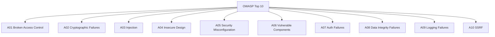
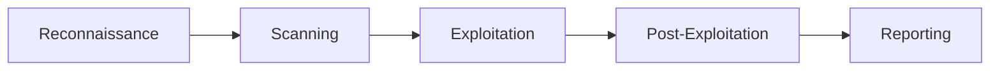

# Security Testing

> **Core Principle:** Security testing identifies vulnerabilities before attackers do. It verifies that the system protects data, resists attacks, and complies with security requirements.

## What Security Testing Is

Security testing verifies:
- **Confidentiality:** Data is protected from unauthorized access
- **Integrity:** Data is not tampered with
- **Availability:** System remains accessible to authorized users
- **Authentication:** Users are who they claim to be
- **Authorization:** Users can only access what they're allowed to
- **Non-repudiation:** Actions can be traced to actors

## OWASP Top 10 Vulnerabilities



### A01: Broken Access Control

**Risk:** Users access data they shouldn't

**Test cases:**
```
1. Access other user's data by changing ID in URL
   GET /api/users/123/profile (logged in as user 456)
   Expected: 403 Forbidden

2. Access admin endpoints as regular user
   GET /admin/users
   Expected: 403 Forbidden

3. Modify data via direct API call
   PUT /api/users/123/role {"role": "admin"}
   Expected: 403 Forbidden
```

### A02: Cryptographic Failures

**Risk:** Sensitive data exposed due to weak encryption

**Test cases:**
```
1. Check data in transit uses TLS 1.2+
   Expected: No SSL/TLS vulnerabilities

2. Check passwords stored with strong hashing (bcrypt, argon2)
   Expected: No plaintext or weak hash algorithms

3. Check sensitive data not logged
   Expected: No credit cards, passwords in logs
```

### A03: Injection

**Risk:** Attacker injects malicious code

**SQL Injection test:**
```python
# Test input
payload = "' OR '1'='1' --"

# Send to login form
POST /login
username=admin&password={payload}

# Expected: Login fails, input sanitized
# Vulnerable if: Logs in as admin
```

**XSS test:**
```javascript
// Test input
payload = "<script>alert('XSS')</script>"

// Submit to comment form
POST /comments
body={payload}

// Expected: Script tags escaped, not executed
// Vulnerable if: Alert dialog appears
```

### A05: Security Misconfiguration

**Test cases:**
```
1. Check default credentials changed
   Expected: No admin/admin, root/root

2. Check unnecessary services disabled
   Expected: Only required ports open

3. Check error messages don't leak info
   Expected: Generic errors, no stack traces

4. Check security headers present
   Expected: CSP, X-Frame-Options, HSTS
```

## Security Testing Approaches

### 1. Static Application Security Testing (SAST)

**What:** Analyze source code for vulnerabilities without running it

**Tools:**
- **Bandit** (Python): Security-focused static analysis
- **Semgrep**: Pattern-based code analysis
- **SonarQube**: Code quality with security rules
- **Checkmarx**: Enterprise SAST

**Example (Bandit):**
```bash
# Scan Python code
bandit -r src/ -f json -o security-report.json

# Common findings:
# - B101: Use of assert (removed in optimized mode)
# - B104: Hardcoded bind address (0.0.0.0)
# - B105: Possible hardcoded password
# - B608: SQL injection via string formatting
```

### 2. Dynamic Application Security Testing (DAST)

**What:** Test running application for vulnerabilities

**Tools:**
- **OWASP ZAP**: Free, open-source web scanner
- **Burp Suite**: Professional web security testing
- **Nikto**: Web server scanner
- **Nmap**: Network scanner

**Example (OWASP ZAP):**
```bash
# Scan web application
zap-cli quick-scan --self-contained --start-options '-config api.disablekey=true' http://localhost:8080

# Common findings:
# - SQL injection
# - Cross-site scripting (XSS)
# - Missing security headers
# - Cookie without HttpOnly flag
```

### 3. Dependency Scanning

**What:** Check third-party libraries for known vulnerabilities

**Tools:**
- **npm audit** (JavaScript)
- **pip-audit** (Python)
- **Snyk**: Multi-language
- **OWASP Dependency-Check**: Java/general

**Example:**
```bash
# Python
pip-audit -r requirements.txt

# JavaScript
npm audit

# Common findings:
# - Package X version 1.2.3 has CVE-2024-1234
# - Fix: Upgrade to version 1.2.5
```

### 4. Penetration Testing

**What:** Simulate real attacks to find vulnerabilities

**Approaches:**
- **Black box:** No knowledge of internals
- **White box:** Full knowledge of internals
- **Gray box:** Partial knowledge

**Pen test phases:**


### 5. Threat Modeling

**What:** Identify threats and design countermeasures

**STRIDE model:**
| Threat | Description | Countermeasure |
|--------|-------------|----------------|
| **S**poofing | Pretending to be someone | Authentication |
| **T**ampering | Modifying data | Integrity checks |
| **R**epudiation | Denying actions | Logging, audit trails |
| **I**nformation Disclosure | Exposing data | Encryption, access control |
| **D**enial of Service | Making unavailable | Rate limiting, redundancy |
| **E**levation of Privilege | Gaining unauthorized access | Least privilege, authorization |

## Security Testing Process

### 1. Define Security Requirements

**Security requirements example:**
```
Authentication:
- Multi-factor authentication required
- Passwords: min 12 chars, complexity rules
- Account lockout after 5 failed attempts
- Session timeout after 30 minutes of inactivity

Authorization:
- Role-based access control (RBAC)
- Principle of least privilege
- All API endpoints require authentication

Data Protection:
- TLS 1.3 for data in transit
- AES-256 for data at rest
- PII encrypted in database
- No sensitive data in logs

Compliance:
- OWASP Top 10 addressed
- PCI-DSS for payment data
- GDPR for personal data
```

### 2. Create Security Test Plan

**Test plan structure:**
```markdown
# Security Test Plan

## Scope
- Web application (frontend + API)
- Authentication and authorization
- Payment processing
- User data management

## Test Types
1. SAST: Static code analysis
2. DAST: Dynamic web scanning
3. Dependency scanning: Third-party vulnerabilities
4. Manual testing: OWASP Top 10 verification
5. Penetration testing: External security firm

## Tools
- Bandit (SAST)
- OWASP ZAP (DAST)
- pip-audit (dependencies)
- Burp Suite (manual testing)

## Schedule
- Week 1: SAST and dependency scanning
- Week 2: DAST scanning
- Week 3: Manual OWASP testing
- Week 4: Penetration testing

## Entry Criteria
- Application deployed to test environment
- Test data loaded
- All features functional

## Exit Criteria
- No critical or high vulnerabilities
- All medium vulnerabilities assessed
- Security test report delivered
```

### 3. Execute Security Tests

**Automated scanning:**
```bash
#!/bin/bash
# Security scan script

echo "=== Static Analysis ==="
bandit -r src/ -f json -o reports/sast.json

echo "=== Dependency Scan ==="
pip-audit -r requirements.txt -f json > reports/deps.json

echo "=== Web Application Scan ==="
zap-cli quick-scan http://localhost:8080 -o reports/dast.json

echo "=== SSL/TLS Check ==="
testssl.sh https://app.example.com > reports/ssl.txt

echo "Reports generated in reports/"
```

**Manual testing checklist:**
- [ ] SQL injection on all input fields
- [ ] XSS on all user-input displays
- [ ] CSRF protection on state-changing operations
- [ ] Authentication bypass attempts
- [ ] Authorization checks on all endpoints
- [ ] Session management (fixation, hijacking)
- [ ] File upload validation
- [ ] Error handling (no information leakage)
- [ ] Security headers present
- [ ] Rate limiting on sensitive endpoints

### 4. Analyze and Report

**Vulnerability report:**
```
Security Test Report
═══════════════════════════════════

Summary:
  Critical: 1
  High: 3
  Medium: 5
  Low: 8
  Informational: 12

Critical Findings:
  [CRIT-001] SQL Injection in Search API
  Severity: Critical
  Location: /api/search?q=
  Impact: Full database access
  Fix: Use parameterized queries

High Findings:
  [HIGH-001] Stored XSS in User Profile
  Severity: High
  Location: /profile/bio
  Impact: Session hijacking
  Fix: Sanitize and escape output

  [HIGH-002] Missing CSRF Protection
  Severity: High
  Location: POST /api/transfer
  Impact: Unauthorized transactions
  Fix: Add CSRF tokens

  [HIGH-003] Weak Password Policy
  Severity: High
  Location: /register
  Impact: Account compromise
  Fix: Enforce 12+ chars, complexity

Remediation Priority:
  1. Fix CRIT-001 immediately (blocks release)
  2. Fix HIGH-001, HIGH-002 before release
  3. Fix HIGH-003 in next sprint
  4. Address medium findings in backlog
```

## Security Testing Best Practices

### 1. Test Continuously

**Integrate into CI/CD:**
```yaml
jobs:
  security-scan:
    runs-on: ubuntu-latest
    steps:
      - uses: actions/checkout@v3
      - name: SAST scan
        run: bandit -r src/ -f json -o sast-report.json
      - name: Dependency scan
        run: pip-audit -r requirements.txt
      - name: Upload reports
        uses: actions/upload-artifact@v3
        with:
          name: security-reports
          path: '*-report.json'
```

### 2. Defense in Depth

**Multiple layers of security:**
- Input validation
- Parameterized queries
- Output encoding
- Authentication
- Authorization
- Encryption
- Logging and monitoring

### 3. Least Privilege

**Minimize access:**
- Users get minimum permissions needed
- Services use dedicated accounts
- Database connections use read-only when possible
- API keys scoped to specific operations

### 4. Security Champions

**Embed security in teams:**
- One developer per team as security champion
- Extra security training
- First point of contact for security questions
- Review security aspects of changes

## Key Takeaways

1. **Test all layers:** SAST, DAST, dependencies, manual, pen testing
2. **Focus on OWASP Top 10:** Address the most common vulnerabilities
3. **Shift left:** Test security early and continuously
4. **Automate scanning:** Integrate into CI/CD pipeline
5. **Report clearly:** Prioritized findings with remediation guidance

## Related Topics

- [[01_Performance_Testing]]: Security under load
- [[02_Security_Testing]]: Security testing in depth
- [[05_API_Testing]]: API security testing

## Existing Vault Connections

- [[software-engineering-note/05_Software_Testing/07_Security_Testing]]: Security testing techniques
- [[body-of-knowledge/CyBOK]]: Cybersecurity Body of Knowledge
