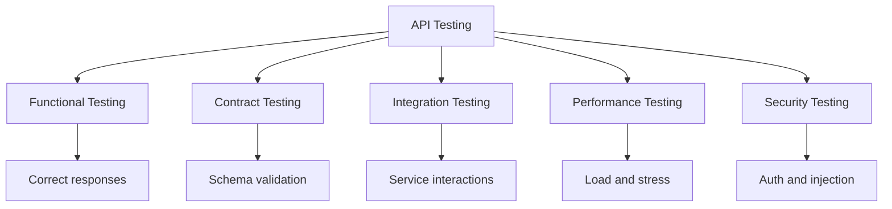

# API Testing

> **Core Principle:** API testing verifies that service interfaces work correctly, handle errors gracefully, and meet performance requirements.

## What API Testing Is

API testing verifies:
- **Functionality:** API does what it's supposed to
- **Reliability:** API responds consistently
- **Performance:** API responds quickly under load
- **Security:** API authenticates and authorizes correctly
- **Data integrity:** API handles data correctly

## Types of API Tests



### Functional Testing

**Purpose:** Verify API works correctly

**Test cases:**
```python
import requests
import pytest

def test_get_user_success():
    """Test successful user retrieval"""
    response = requests.get('https://api.example.com/users/123')
    
    assert response.status_code == 200
    data = response.json()
    assert data['id'] == 123
    assert 'name' in data
    assert 'email' in data

def test_get_user_not_found():
    """Test user not found error"""
    response = requests.get('https://api.example.com/users/99999')
    
    assert response.status_code == 404
    data = response.json()
    assert data['error'] == 'User not found'

def test_create_user_success():
    """Test successful user creation"""
    new_user = {
        'name': 'John Doe',
        'email': 'john@example.com',
        'password': 'securepass123'
    }
    
    response = requests.post('https://api.example.com/users', json=new_user)
    
    assert response.status_code == 201
    data = response.json()
    assert data['name'] == 'John Doe'
    assert data['email'] == 'john@example.com'
    assert 'id' in data
    assert 'password' not in data  # Password not returned

def test_create_user_invalid_email():
    """Test validation error for invalid email"""
    invalid_user = {
        'name': 'John Doe',
        'email': 'not-an-email',
        'password': 'securepass123'
    }
    
    response = requests.post('https://api.example.com/users', json=invalid_user)
    
    assert response.status_code == 400
    data = response.json()
    assert 'email' in data['errors']
```

### Contract Testing

**Purpose:** Verify API matches specification

**OpenAPI/Swagger validation:**
```python
from openapi_spec_validator import validate_spec
import yaml

def test_api_matches_spec():
    """Verify API matches OpenAPI specification"""
    # Load spec
    with open('api-spec.yaml') as f:
        spec = yaml.safe_load(f)
    
    # Validate spec is valid OpenAPI
    validate_spec(spec)
    
    # Test endpoints match spec
    response = requests.get('https://api.example.com/users/123')
    
    # Verify response matches schema
    schema = spec['paths']['/users/{id}']['get']['responses']['200']['content']['application/json']['schema']
    
    from jsonschema import validate
    validate(instance=response.json(), schema=schema)
```

**Consumer-driven contract testing (Pact):**
```python
import pact

# Consumer test (defines expectations)
consumer = pact.Consumer('Frontend')
provider = pact.Provider('UserAPI')

pact = consumer.has_pact_with(provider)

def test_get_user():
    """Define contract for getting a user"""
    expected_response = {
        'id': 123,
        'name': 'John Doe',
        'email': 'john@example.com'
    }
    
    (pact
     .given('user 123 exists')
     .upon_receiving('a request for user 123')
     .with_request('get', '/users/123')
     .will_respond_with(200, body=expected_response))
    
    with pact:
        # Make actual request
        result = requests.get('http://localhost:8080/users/123')
        assert result.json() == expected_response
```

### Integration Testing

**Purpose:** Verify API works with dependencies

**Test cases:**
```python
def test_create_user_with_database():
    """Test user creation writes to database"""
    # Create user via API
    new_user = {'name': 'Jane', 'email': 'jane@example.com'}
    response = requests.post('http://localhost:8080/users', json=new_user)
    
    assert response.status_code == 201
    user_id = response.json()['id']
    
    # Verify in database
    db_user = database.get_user(user_id)
    assert db_user['name'] == 'Jane'
    assert db_user['email'] == 'jane@example.com'

def test_get_user_with_cache():
    """Test user retrieval uses cache"""
    # First request (cache miss)
    response1 = requests.get('http://localhost:8080/users/123')
    assert response1.status_code == 200
    
    # Second request (cache hit)
    response2 = requests.get('http://localhost:8080/users/123')
    assert response2.status_code == 200
    
    # Verify cache was used (faster response)
    assert response2.elapsed < response1.elapsed
```

## API Testing Best Practices

### 1. Test All HTTP Methods

**CRUD operations:**
```python
# Create
def test_create():
    response = requests.post('/items', json={'name': 'Item 1'})
    assert response.status_code == 201

# Read
def test_read():
    response = requests.get('/items/1')
    assert response.status_code == 200

# Update
def test_update():
    response = requests.put('/items/1', json={'name': 'Updated'})
    assert response.status_code == 200

# Delete
def test_delete():
    response = requests.delete('/items/1')
    assert response.status_code == 204
```

### 2. Test Error Handling

**Error scenarios:**
```python
def test_error_responses():
    """Test various error conditions"""
    
    # 400 Bad Request - invalid input
    response = requests.post('/users', json={'email': 'invalid'})
    assert response.status_code == 400
    assert 'errors' in response.json()
    
    # 401 Unauthorized - missing auth
    response = requests.get('/protected')
    assert response.status_code == 401
    
    # 403 Forbidden - insufficient permissions
    headers = {'Authorization': 'Bearer user-token'}
    response = requests.get('/admin/users', headers=headers)
    assert response.status_code == 403
    
    # 404 Not Found - resource doesn't exist
    response = requests.get('/users/99999')
    assert response.status_code == 404
    
    # 409 Conflict - duplicate resource
    requests.post('/users', json={'email': 'test@example.com'})
    response = requests.post('/users', json={'email': 'test@example.com'})
    assert response.status_code == 409
    
    # 429 Too Many Requests - rate limited
    for _ in range(100):
        requests.get('/items')
    response = requests.get('/items')
    assert response.status_code == 429
    
    # 500 Internal Server Error - server error
    response = requests.get('/error')
    assert response.status_code == 500
```

### 3. Test Authentication and Authorization

**Security tests:**
```python
def test_authentication():
    """Test authentication mechanisms"""
    
    # Valid token
    headers = {'Authorization': 'Bearer valid-token'}
    response = requests.get('/protected', headers=headers)
    assert response.status_code == 200
    
    # Invalid token
    headers = {'Authorization': 'Bearer invalid-token'}
    response = requests.get('/protected', headers=headers)
    assert response.status_code == 401
    
    # Expired token
    headers = {'Authorization': 'Bearer expired-token'}
    response = requests.get('/protected', headers=headers)
    assert response.status_code == 401
    
    # Missing token
    response = requests.get('/protected')
    assert response.status_code == 401

def test_authorization():
    """Test role-based access control"""
    
    # Admin can access admin endpoints
    admin_headers = {'Authorization': 'Bearer admin-token'}
    response = requests.get('/admin/users', headers=admin_headers)
    assert response.status_code == 200
    
    # Regular user cannot access admin endpoints
    user_headers = {'Authorization': 'Bearer user-token'}
    response = requests.get('/admin/users', headers=user_headers)
    assert response.status_code == 403
```

### 4. Test Data Validation

**Input validation:**
```python
def test_input_validation():
    """Test input validation"""
    
    # Valid input
    valid_data = {
        'name': 'John Doe',
        'email': 'john@example.com',
        'age': 30
    }
    response = requests.post('/users', json=valid_data)
    assert response.status_code == 201
    
    # Invalid email
    invalid_email = {**valid_data, 'email': 'not-an-email'}
    response = requests.post('/users', json=invalid_email)
    assert response.status_code == 400
    assert 'email' in response.json()['errors']
    
    # Invalid age (negative)
    invalid_age = {**valid_data, 'age': -5}
    response = requests.post('/users', json=invalid_age)
    assert response.status_code == 400
    assert 'age' in response.json()['errors']
    
    # Missing required field
    missing_name = {'email': 'test@example.com', 'age': 25}
    response = requests.post('/users', json=missing_name)
    assert response.status_code == 400
    assert 'name' in response.json()['errors']
    
    # Extra fields (should be ignored or rejected)
    extra_fields = {**valid_data, 'extra': 'field'}
    response = requests.post('/users', json=extra_fields)
    # Depends on API design: 201 (ignored) or 400 (rejected)
```

### 5. Test Pagination and Filtering

**List operations:**
```python
def test_pagination():
    """Test pagination"""
    
    # Default pagination
    response = requests.get('/users')
    assert response.status_code == 200
    data = response.json()
    assert 'items' in data
    assert 'total' in data
    assert 'page' in data
    assert 'per_page' in data
    
    # Custom page size
    response = requests.get('/users?page=1&per_page=10')
    assert len(response.json()['items']) <= 10
    
    # Second page
    response = requests.get('/users?page=2&per_page=10')
    assert response.status_code == 200

def test_filtering():
    """Test filtering"""
    
    # Filter by status
    response = requests.get('/users?status=active')
    users = response.json()['items']
    assert all(user['status'] == 'active' for user in users)
    
    # Filter by date range
    response = requests.get('/users?created_after=2024-01-01&created_before=2024-12-31')
    assert response.status_code == 200
    
    # Search
    response = requests.get('/users?search=john')
    users = response.json()['items']
    assert all('john' in user['name'].lower() for user in users)
```

## API Testing Tools

### HTTP Clients

| Tool | Type | Best For |
|------|------|----------|
| **Postman** | GUI | Manual testing, collections |
| **Insomnia** | GUI | REST and GraphQL |
| **HTTPie** | CLI | Quick command-line testing |
| **curl** | CLI | Scripting, automation |
| **Requests** (Python) | Library | Automated testing |
| **Axios** (JavaScript) | Library | Frontend integration |

### Testing Frameworks

| Tool | Language | Features |
|------|----------|----------|
| **Pytest** | Python | Assertions, fixtures, plugins |
| **Jest** | JavaScript | Mocking, snapshots |
| **RestAssured** | Java | Fluent API, BDD style |
| **Supertest** | JavaScript | Express.js testing |
| **Karate** | Multi | BDD, no code required |

### Contract Testing

| Tool | Purpose |
|------|---------|
| **Pact** | Consumer-driven contracts |
| **Spring Cloud Contract** | JVM contract testing |
| **Prism** | OpenAPI mocking and validation |

### Performance Testing

| Tool | Purpose |
|------|---------|
| **k6** | Load testing |
| **Artillery** | Load testing |
| **Locust** | Distributed load testing |

## API Testing Checklist

### Functional

- [ ] All endpoints return correct status codes
- [ ] Response bodies match expected schema
- [ ] Create operations return created resource
- [ ] Update operations return updated resource
- [ ] Delete operations return appropriate response
- [ ] Error responses include helpful messages

### Validation

- [ ] Required fields validated
- [ ] Field types validated
- [ ] Field formats validated (email, date, etc.)
- [ ] Field ranges validated (min/max)
- [ ] Invalid input returns 400 with details

### Authentication

- [ ] Protected endpoints require authentication
- [ ] Valid tokens accepted
- [ ] Invalid tokens rejected with 401
- [ ] Expired tokens rejected with 401
- [ ] Token refresh works

### Authorization

- [ ] Role-based access enforced
- [ ] Users can only access their resources
- [ ] Admin endpoints require admin role
- [ ] Insufficient permissions return 403

### Data Integrity

- [ ] Create operations persist data
- [ ] Update operations modify data correctly
- [ ] Delete operations remove data
- [ ] Concurrent updates handled correctly
- [ ] Transactions rollback on errors

### Performance

- [ ] Response times meet SLAs
- [ ] Pagination works correctly
- [ ] Large responses handled efficiently
- [ ] Caching implemented where appropriate

### Security

- [ ] Sensitive data not exposed
- [ ] Input sanitized (no injection)
- [ ] Rate limiting implemented
- [ ] CORS configured correctly
- [ ] HTTPS enforced

## Key Takeaways

1. **Test all aspects:** Functional, contract, integration, performance, security
2. **Automate everything:** API tests are fast and reliable
3. **Use contract testing:** Prevent breaking changes
4. **Test error handling:** Verify graceful failure
5. **Validate thoroughly:** Input validation is critical

## Related Topics

- [[01_Performance_Testing]]: API performance testing
- [[02_Security_Testing]]: API security testing
- [[03_Reliability_Testing]]: API reliability testing

## Existing Vault Connections

- [[software-engineering-note/05_Software_Testing/10_API_Testing]]: API testing techniques
