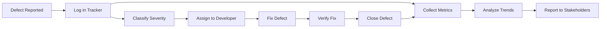

# Defect Metrics

> **Core Principle:** Defect metrics reveal patterns in quality: where defects come from, when they are found, and how they are resolved. Use them to improve processes, not to blame individuals.

## What Defect Metrics Measure

Defect metrics track:
- **Volume:** How many defects exist
- **Density:** Defects per unit of code
- **Severity:** How serious defects are
- **Age:** How long defects remain open
- **Detection phase:** When defects are found
- **Resolution time:** How quickly defects are fixed

## Key Defect Metrics

### 1. Defect Density

**Definition:** Number of defects per unit of code (usually per 1000 lines of code, KLOC)

**Formula:**
```
Defect Density = (Total Defects / Lines of Code) × 1000
```

**Example:**
```
Module A: 5000 lines, 10 defects → 2.0 defects/KLOC
Module B: 3000 lines, 15 defects → 5.0 defects/KLOC
Module C: 8000 lines, 8 defects → 1.0 defects/KLOC

Insight: Module B has highest defect density, needs attention
```

**Benchmarks:**
| Quality Level | Defect Density |
|---------------|----------------|
| Excellent | < 1.0 defects/KLOC |
| Good | 1.0 to 3.0 defects/KLOC |
| Average | 3.0 to 5.0 defects/KLOC |
| Poor | > 5.0 defects/KLOC |

**Uses:**
- Identify high-risk modules
- Compare quality across components
- Track quality improvement over time
- Allocate testing resources

**Limitations:**
- Does not account for complexity
- Different languages have different LOC productivity
- Can incentivize writing verbose code

### 2. Defect Severity Distribution

**Definition:** Percentage of defects by severity level

**Severity levels:**
| Level | Description | Impact |
|-------|-------------|--------|
| Critical | System crash, data loss | Blocks release |
| Major | Major feature broken | Must fix before release |
| Minor | Minor feature issue | Can release with workaround |
| Cosmetic | Visual issue only | Low priority |

**Example:**
```
Sprint 12 Defects:
  Critical: 2 (5%)
  Major: 8 (20%)
  Minor: 20 (50%)
  Cosmetic: 10 (25%)
  Total: 40

Target: < 5% critical, < 20% major
Status: On target ✓
```

**Uses:**
- Assess release readiness
- Prioritize defect fixes
- Track quality trends
- Communicate quality status

### 3. Defect Detection Efficiency (DDE)

**Definition:** Percentage of defects found before production

**Formula:**
```
DDE = (Defects Found Before Production / Total Defects) × 100%
```

**Example:**
```
Release 2.0:
  Defects found in testing: 95
  Defects found in production: 5
  Total defects: 100

  DDE = (95 / 100) × 100% = 95%

Target: > 95%
Status: On target ✓
```

**By phase breakdown:**
```
Requirements review: 10%
Design review: 15%
Code review: 20%
Unit testing: 25%
Integration testing: 15%
System testing: 10%
Production: 5%
```

**Uses:**
- Measure testing effectiveness
- Identify weak testing phases
- Justify testing investments
- Track improvement over time

### 4. Defect Escape Rate

**Definition:** Percentage of defects that escape to production

**Formula:**
```
Escape Rate = (Production Defects / Total Defects) × 100%
```

**Relationship to DDE:**
```
Escape Rate = 100% - DDE
```

**Example:**
```
Last 4 releases:
  Release 1.7: 8% escape rate
  Release 1.8: 6% escape rate
  Release 1.9: 4% escape rate
  Release 2.0: 5% escape rate

Trend: Improving ✓
Target: < 5%
```

**Uses:**
- Measure quality gate effectiveness
- Identify testing gaps
- Track improvement over time
- Assess customer impact

### 5. Defect Age

**Definition:** Time from defect creation to resolution

**Metrics:**
```
Average defect age: Mean time to fix
Median defect age: Middle value (less affected by outliers)
Defect age by severity: Critical defects should be fixed fastest
Aging defects: Defects open > 30 days
```

**Example:**
```
Current open defects:
  Critical: 3 (avg age: 2 days) ✓
  Major: 12 (avg age: 8 days) ✓
  Minor: 25 (avg age: 15 days) ✓
  Cosmetic: 15 (avg age: 45 days) ⚠

Aging defects (> 30 days): 8
Oldest defect: 90 days (cosmetic, low priority)
```

**Uses:**
- Track responsiveness
- Identify bottlenecks
- Prioritize old defects
- Assess team velocity

### 6. Defect Arrival Rate

**Definition:** Number of new defects reported over time

**Example:**
```
Weekly defect arrival:
  Week 1: 25 new defects
  Week 2: 22 new defects
  Week 3: 18 new defects
  Week 4: 15 new defects

Trend: Decreasing ✓ (code stabilizing)
```

**Defect arrival curve:**
```
Early development: High arrival rate
Mid development: Peak arrival rate
Late development: Declining arrival rate
Pre-release: Low arrival rate (ready for release)
Post-release: Spike (customer-reported defects)
```

**Uses:**
- Assess code stability
- Predict release readiness
- Plan testing resources
- Identify quality trends

### 7. Defect Fix Rate

**Definition:** Number of defects fixed over time

**Metrics:**
```
Fix rate: Defects fixed per week
Fix ratio: Fixes / New defects
Backlog trend: Growing or shrinking
```

**Example:**
```
Week 10:
  New defects: 20
  Fixed defects: 25
  Fix ratio: 1.25 (fixing faster than finding)
  Backlog: Decreasing ✓

Target: Fix ratio > 1.0 in late development
```

**Uses:**
- Track team productivity
- Assess release readiness
- Plan resources
- Manage backlog

### 8. Defect Reopen Rate

**Definition:** Percentage of fixed defects that are reopened

**Formula:**
```
Reopen Rate = (Reopened Defects / Fixed Defects) × 100%
```

**Example:**
```
Last sprint:
  Fixed defects: 50
  Reopened defects: 5
  Reopen rate: 10%

Target: < 5%
Status: Above target ⚠

Analysis:
  - 3 reopened due to incomplete fix
  - 2 reopened due to regression
  Action: Improve fix verification and regression testing
```

**Uses:**
- Measure fix quality
- Identify verification gaps
- Assess regression testing
- Track improvement

## Defect Metrics Dashboard

```
Defect Metrics Dashboard
═══════════════════════════════════════

Release 2.0 Status:

Volume:
  Total defects: 150
  Open: 12
  Fixed: 138
  Verified: 130

Severity:
  Critical: 3 (2%) ✓
  Major: 25 (17%) ✓
  Minor: 80 (53%)
  Cosmetic: 42 (28%)

Quality:
  Defect density: 2.3 per KLOC ✓
  Detection efficiency: 96% ✓
  Escape rate: 4% ✓
  Reopen rate: 3% ✓

Trends:
  [Graph: Defect arrival rate - declining]
  [Graph: Defect fix rate - stable]
  [Graph: Defect age - decreasing]

Alerts:
  ⚠ 3 defects open > 30 days
  ⚠ Module B defect density: 5.2 per KLOC
```

## Using Defect Metrics Effectively

### Good Uses

**1. Process improvement:**
- High escape rate → improve testing
- High reopen rate → improve fix verification
- High defect density → improve code reviews

**2. Resource allocation:**
- High-density modules → more testing
- Aging defects → dedicated fix sprints
- High arrival rate → more developers

**3. Release decisions:**
- Low escape rate + declining arrival → ready to release
- High critical defects → delay release
- High fix ratio → stabilizing

**4. Trend analysis:**
- Improving DDE over releases → testing getting better
- Declining defect density → code quality improving
- Declining arrival rate → code stabilizing

### Bad Uses

**Never use defect metrics to:**
- Rank or compare individual developers
- Set quotas (e.g., "find 10 bugs per week")
- Punish teams for finding defects
- Reward teams for having few defects
- Compare teams working on different codebases

**Why these are bad:**
- Encourages hiding defects
- Discourages finding defects
- Creates adversarial relationships
- Reduces quality transparency
- Leads to gaming the metrics

## Collecting Defect Metrics

### Data Sources

**Defect tracking system:**
- JIRA, Bugzilla, GitHub Issues
- All defect data: creation, severity, status, resolution

**Version control:**
- Git, SVN
- Lines of code, changes, commits

**CI/CD pipeline:**
- Jenkins, GitHub Actions
- Build results, test results

**Code analysis tools:**
- SonarQube, CodeClimate
- Static analysis results

### Data Collection Process



### Data Quality

**Ensure data quality:**
- Consistent severity definitions
- Accurate status updates
- Timely logging
- Regular cleanup (remove duplicates, invalid defects)
- Training on proper usage

**Common data issues:**
- Severity inflation (everything is critical)
- Stale defects (not updated)
- Duplicate defects
- Incomplete information
- Inconsistent categorization

## Key Takeaways

1. **Use multiple metrics:** No single metric tells the whole story
2. **Focus on trends:** Direction matters more than absolute numbers
3. **Use for improvement:** Metrics drive process improvement, not blame
4. **Ensure data quality:** Garbage in, garbage out
5. **Communicate clearly:** Dashboards and reports for stakeholders

## Related Topics

- [[02_Coverage_Metrics]]: How much code is tested
- [[03_Process_Metrics]]: Process efficiency metrics
- [[06_Measurement_Pitfalls]]: Common measurement mistakes

## Existing Vault Connections

- [[software-engineering-note/12_Software_Quality/07_Quality_Metrics]]: Quality metrics fundamentals
