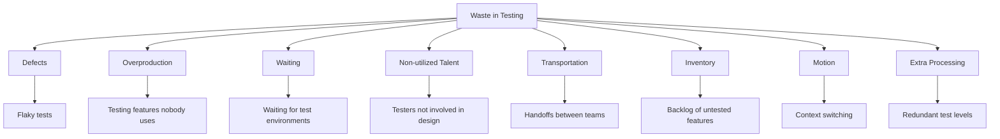
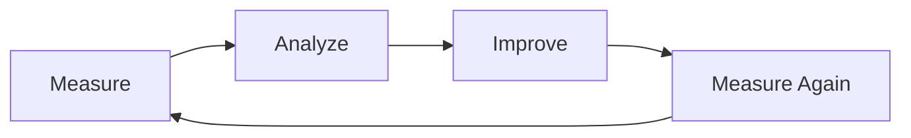

# Process Metrics

> **Core Principle:** Process metrics measure the efficiency and effectiveness of quality activities. They reveal bottlenecks, waste, and opportunities for improvement.

## What Process Metrics Measure

Process metrics track:
- **Testing efficiency:** How quickly tests run
- **Review effectiveness:** How many issues reviews find
- **Automation ROI:** Whether automation saves time
- **Feedback loops:** How quickly problems are detected and fixed
- **Waste:** Activities that don't add value

## Key Process Metrics

### 1. Test Execution Time

**Definition:** Time to run the full test suite

**Metrics:**
```
Unit tests: < 5 minutes
Integration tests: < 30 minutes
E2E tests: < 2 hours
Full regression: < 8 hours

Trend tracking:
  January: 45 minutes
  February: 52 minutes
  March: 48 minutes
  April: 55 minutes ⚠ (growing)
```

**Why it matters:**
- Slow tests slow down development
- Teams skip slow tests
- Fast feedback enables rapid iteration

**Improvement strategies:**
- Parallel execution
- Test isolation (no shared state)
- Mock external dependencies
- Remove redundant tests
- Optimize slow tests

### 2. Mean Time to Detect (MTTD)

**Definition:** Average time from defect introduction to detection

**Formula:**
```
MTTD = Σ(Detection Time - Introduction Time) / Number of Defects
```

**Example:**
```
Defect 1: Introduced Monday, found Wednesday → 2 days
Defect 2: Introduced Tuesday, found Tuesday → 0 days (same day)
Defect 3: Introduced Monday, found Friday → 4 days

MTTD = (2 + 0 + 4) / 3 = 2 days

Target: < 1 day
```

**How to reduce MTTD:**
- Shift left (test earlier)
- Continuous integration (test on every commit)
- Automated testing
- Code reviews
- Pair programming

### 3. Mean Time to Repair (MTTR)

**Definition:** Average time from defect detection to fix deployment

**Formula:**
```
MTTR = Σ(Repair Time - Detection Time) / Number of Defects
```

**Example:**
```
Defect 1: Detected 9am, fixed 11am → 2 hours
Defect 2: Detected 2pm, fixed next day 10am → 20 hours
Defect 3: Detected 4pm, fixed 5pm → 1 hour

MTTR = (2 + 20 + 1) / 3 = 7.7 hours

Target: < 8 hours for critical defects
```

**How to reduce MTTR:**
- Automated build and deploy
- Feature flags (quick rollback)
- Good logging and monitoring
- Clear ownership
- Prioritized backlog

### 4. Code Review Metrics

**Definition:** Metrics about the code review process

**Key metrics:**
```
Review turnaround time:
  Target: < 24 hours
  Current: 18 hours ✓

Review coverage:
  Percentage of PRs reviewed: 100% ✓

Issues found per review:
  Average: 3.2 issues per PR
  Trend: Declining (code quality improving) ✓

Review comments by type:
  Bugs: 15%
  Design: 25%
  Style: 10%
  Performance: 20%
  Security: 15%
  Testing: 15%
```

**Effective review indicators:**
- Fast turnaround (< 24 hours)
- Constructive comments
- Issues actually fixed
- Learning happens

**Ineffective review indicators:**
- Slow turnaround (> 48 hours)
- Rubber stamp approvals
- Nitpicking only
- Large PRs (> 500 lines)

### 5. Test Automation Metrics

**Definition:** Metrics about automation effectiveness

**Key metrics:**
```
Automation coverage:
  Automated tests: 850
  Manual tests: 150
  Automation rate: 85% ✓

Automation execution time:
  Manual (estimated): 40 hours
  Automated: 2 hours
  Time saved: 38 hours per run ✓

Automation maintenance cost:
  Time fixing broken tests: 4 hours/week
  Time adding new tests: 8 hours/week
  Total: 12 hours/week

ROI:
  Time saved per month: 152 hours (38 × 4 runs)
  Time spent per month: 48 hours (12 × 4 weeks)
  Net savings: 104 hours/month ✓
```

**Healthy automation indicators:**
- Saves more time than it costs
- Reliable (few false failures)
- Fast feedback
- Easy to maintain
- Covers critical paths

**Unhealthy automation indicators:**
- Flaky tests (> 5% flaky rate)
- High maintenance cost
- Slow execution
- Brittle (breaks on minor changes)
- Testing trivial things

### 6. Continuous Integration Metrics

**Definition:** Metrics about the CI/CD pipeline

**Key metrics:**
```
Build success rate:
  Target: > 95%
  Current: 92% ⚠

Build time:
  Target: < 10 minutes
  Current: 8 minutes ✓

Queue time:
  Target: < 2 minutes
  Current: 3 minutes ⚠

Deployment frequency:
  Production: 2x/week
  Staging: 5x/day

Change failure rate:
  Target: < 5%
  Current: 8% ⚠
```

**DORA metrics (DevOps Research and Assessment):**
```
Deployment Frequency:
  Elite: Multiple per day
  High: Daily to weekly
  Medium: Weekly to monthly
  Low: Monthly to yearly

Lead Time for Changes:
  Elite: < 1 hour
  High: 1 day to 1 week
  Medium: 1 week to 1 month
  Low: 1 month to 6 months

Mean Time to Recovery:
  Elite: < 1 hour
  High: < 1 day
  Medium: 1 day to 1 week
  Low: 1 week to 1 month

Change Failure Rate:
  Elite: 0-15%
  High: 16-30%
  Medium: 31-45%
  Low: > 45%
```

### 7. Defect Containment Efficiency

**Definition:** How well each phase catches defects

**Formula:**
```
Phase Efficiency = (Defects Found in Phase / Defects Introduced in Phase) × 100%
```

**Example:**
```
Requirements phase:
  Defects introduced: 20
  Defects found: 15
  Efficiency: 75%

Design phase:
  Defects introduced: 15
  Defects found: 10
  Efficiency: 67%

Coding phase:
  Defects introduced: 50
  Defects found: 35
  Efficiency: 70%

Testing phase:
  Defects found: 25 (from earlier phases)
  These escaped earlier phases

Overall containment: 60/85 = 71%
Target: > 85%
```

### 8. Feedback Loop Time

**Definition:** Time from code commit to production deployment

**Stages:**
```
Commit to build: 2 minutes
Build to unit tests: 5 minutes
Unit tests to integration tests: 10 minutes
Integration tests to staging: 5 minutes
Staging to production: 30 minutes (manual approval)

Total: 52 minutes

Target: < 1 hour ✓
```

**Bottleneck identification:**
```
Longest stages:
  1. Staging to production: 30 min (manual approval)
  2. Integration tests: 10 min
  3. Unit tests: 5 min

Improvement: Automate production approval → reduce to 5 min
```

## Process Metrics Dashboard

```
Process Efficiency Dashboard
═══════════════════════════════════════

Testing:
  Test execution time: 48 min ✓
  Test suite reliability: 97% ✓
  Automation coverage: 85% ✓

Reviews:
  Review turnaround: 18 hours ✓
  Review coverage: 100% ✓
  Issues per review: 3.2

CI/CD:
  Build success rate: 92% ⚠
  Build time: 8 min ✓
  Deploy frequency: 2x/week

Speed:
  MTTD: 1.5 days ✓
  MTTR: 6 hours ✓
  Feedback loop: 52 min ✓

DORA:
  Deployment frequency: High ✓
  Lead time: High ✓
  MTTR: High ✓
  Change failure rate: Medium ⚠
```

## Lean and Waste Metrics

### The 8 Wastes in Testing



### Measuring Waste

| Waste Type | Metric | Example |
|------------|--------|---------|
| **Defects** | Flaky test rate | 8% of tests are flaky |
| **Overproduction** | Unused test coverage | 20% tests cover unused features |
| **Waiting** | Environment wait time | 2 hours/day waiting for environments |
| **Non-utilized Talent** | Tester involvement in design | Testers join 30% of design reviews |
| **Transportation** | Handoff count | 5 handoffs per feature |
| **Inventory** | Untested feature backlog | 12 features waiting for testing |
| **Motion** | Context switches per day | Developers switch tasks 8 times/day |
| **Extra Processing** | Duplicate test levels | Same check at unit, integration, and E2E |

## Using Process Metrics for Improvement

### The Improvement Cycle



**Example improvement cycle:**
```
Month 1: Measure
  MTTD: 3 days
  Problem: Defects found too late

Month 2: Analyze
  Root cause: No automated tests in CI
  Most defects found in manual testing phase

Month 3: Improve
  Action: Add automated tests to CI pipeline
  Result: Tests run on every commit

Month 4: Measure again
  MTTD: 1 day ✓
  Improvement: 67% reduction
```

### Setting Improvement Goals

**SMART goals:**
```
Specific: Reduce build time from 15 min to 10 min
Measurable: Track build time daily
Achievable: Parallelize test suites
Relevant: Faster feedback for developers
Time-bound: Achieve by end of Q3
```

## Key Takeaways

1. **Measure the process, not the people:** Metrics improve systems, not individuals
2. **Focus on flow:** Fast feedback loops enable quality
3. **Eliminate waste:** Identify and remove non-value activities
4. **Track DORA metrics:** Industry-standard DevOps metrics
5. **Continuous improvement:** Measure, analyze, improve, repeat

## Related Topics

- [[01_Defect_Metrics]]: Defect-based metrics
- [[02_Coverage_Metrics]]: Test coverage metrics
- [[04_Quality_Reporting]]: Reporting process metrics

## Existing Vault Connections

- [[software-engineering-note/10_Software_Engineering_Management/03_Project_Metrics]]: Project metrics
- [[software-engineering-note/06_Software_Engineering_Operations/02_CI_CD]]: CI/CD metrics
