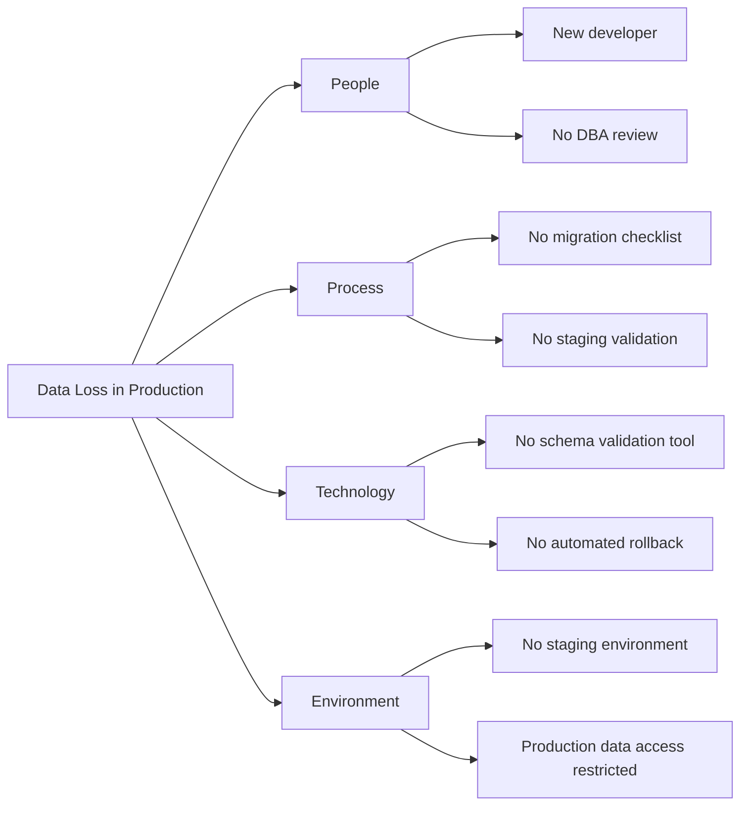
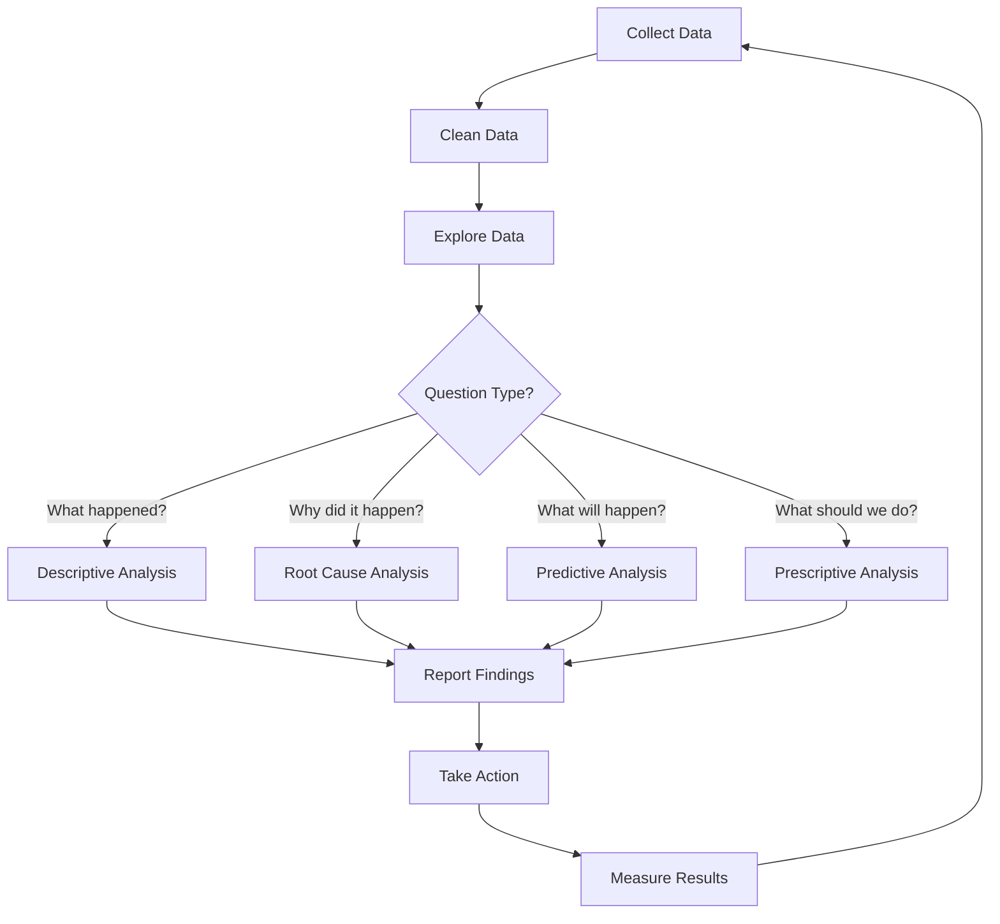

# Data Analysis

> **Core Principle:** Raw quality data is noise. Analysis transforms data into insights that drive improvement. A specialist quality engineer uses statistical thinking and structured analysis to find root causes, identify trends, and make data-driven decisions.

## What Data Analysis Means for Quality

Data analysis is:
- **Systematic:** Structured approach to exploring data
- **Statistical:** Uses statistical methods to separate signal from noise
- **Causal:** Seeks root causes, not just correlations
- **Actionable:** Leads to specific improvement actions
- **Evidence-based:** Conclusions backed by data, not opinions

## Analysis Techniques

### 1. Descriptive Statistics

**Purpose:** Summarize quality data

**Key statistics:**
```
Central tendency:
  Mean: Average value
  Median: Middle value (robust to outliers)
  Mode: Most common value

Spread:
  Standard deviation: How much values vary
  Range: Difference between max and min
  Percentiles: 25th, 75th, 90th, 95th

Example:
  Response times (ms): 120, 150, 180, 200, 250, 300, 1200
  
  Mean: 343ms (misleading due to outlier)
  Median: 200ms (better representation)
  P95: 1200ms (worst case)
  
  Insight: Most requests are fast, but some are very slow
```

**When to use each:**
| Statistic | When to Use |
|-----------|-------------|
| Mean | Data is normally distributed |
| Median | Data has outliers |
| P95/P99 | Understanding worst-case performance |
| Standard deviation | Understanding variability |

### 2. Trend Analysis

**Purpose:** Identify patterns over time

**Methods:**

**Simple trend:**
```
Defect escape rate:
  Jan: 12%
  Feb: 10%
  Mar: 9%
  Apr: 8%
  May: 7%
  Jun: 5%

Trend: Declining ✓ (improving)
Rate: ~1.4% per month
```

**Moving average:**
```
Weekly defects (raw): 15, 22, 8, 25, 12, 18, 10
3-week moving average: -, -, 15, 18.3, 15, 18.3, 13.3

Smoothed trend: Stable around 15 per week
```

**Seasonal patterns:**
```
Defects by month (2-year average):
  January: 25 (post-holiday rush)
  February: 18
  March: 15
  ...
  November: 30 (pre-holiday releases)
  December: 35 (holiday releases)

Insight: Defects spike around release-heavy months
Action: Increase testing before November releases
```

### 3. Pareto Analysis

**Purpose:** Identify the vital few causes that create the most impact

**The 80/20 rule:** 80% of problems come from 20% of causes

**Example:**
```
Defects by module:
  Payment: 45 defects (38%)
  Auth: 30 defects (25%)
  Search: 20 defects (17%)
  Profile: 12 defects (10%)
  Settings: 8 defects (7%)
  Help: 4 defects (3%)
  Total: 119 defects

Pareto analysis:
  Top 3 modules: 95 defects (80%)
  
  Focus improvement on: Payment, Auth, Search
  These 3 modules cause 80% of all defects
```

**Pareto chart:**
```
Defects by Module (Pareto)

Payment  ████████████████████████████████████  45 (38%)  ┐
Auth     ████████████████████████              30 (63%)  │ 80%
Search   ████████████████                      20 (80%)  ┘
Profile  ██████████                            12 (90%)
Settings ██████                                 8 (97%)
Help     ███                                    4 (100%)
```

### 4. Root Cause Analysis

**Purpose:** Find the underlying cause of quality problems

#### The 5 Whys

```
Problem: Customer reported data loss

Why 1: Why was data lost?
  → Database migration failed

Why 2: Why did migration fail?
  → Schema change was incompatible

Why 3: Why was it incompatible?
  → Migration script wasn't tested against production schema

Why 4: Why wasn't it tested?
  → No staging environment with production-like data

Why 5: Why no staging environment?
  → Infrastructure budget was cut, staging was deprioritized

Root cause: Insufficient infrastructure investment
Solution: Invest in staging environment, not just fix the script
```

#### Fishbone (Ishikawa) Diagram



#### Fault Tree Analysis

```
Top Event: System Crash
├── OR
│   ├── Out of Memory
│   │   ├── Memory leak
│   │   └── Insufficient heap size
│   ├── Database Failure
│   │   ├── Connection pool exhausted
│   │   └── Disk full
│   └── Network Failure
│       ├── DNS resolution failure
│       └── Firewall misconfiguration
```

### 5. Correlation Analysis

**Purpose:** Find relationships between quality variables

**Example:**
```
Hypothesis: Complex code has more defects

Data:
  Module A: Complexity 15, Defects 8
  Module B: Complexity 8, Defects 3
  Module C: Complexity 22, Defects 15
  Module D: Complexity 5, Defects 2
  Module E: Complexity 18, Defects 12

Correlation coefficient: 0.94 (strong positive correlation)

Insight: Higher complexity strongly correlates with more defects
Action: Reduce complexity in high-complexity modules
```

**Correlation vs. Causation:**
```
Observed: More testing → More defects found
Correlation: Positive

Is testing causing defects? NO
Testing REVEALS defects, it doesn't cause them

Always ask: Is there a causal mechanism?
```

### 6. Statistical Process Control (SPC)

**Purpose:** Distinguish normal variation from special causes

**Control chart:**
```
Defects per Sprint (Control Chart)

     UCL ────────────────────── 12
      +
     10 ·         ·
      |     ·           ·
Mean ─ 8 ────────────────────── 8
      |  ·        ·    ·    ·
      6                    ·
      +
     LCL ────────────────────── 4
      Sprint 1  2  3  4  5  6

UCL = Mean + 3σ = 12
LCL = Mean - 3σ = 4

All points within control limits: Process is stable ✓
If a point exceeds UCL or LCL: Investigate special cause
```

**Out-of-control signals:**
1. Point outside control limits
2. 7 consecutive points above or below mean
3. 7 consecutive points trending up or down
4. 2 of 3 consecutive points in outer third

### 7. Regression Analysis

**Purpose:** Predict quality outcomes based on input variables

**Example:**
```
Predicting defect count from code metrics:

Model:
  Defects = 2.5 + 0.8 × Complexity + 0.3 × Size(KLOC) - 1.2 × ReviewHours

For a new module:
  Complexity: 15
  Size: 5 KLOC
  Review hours: 4

Predicted defects:
  = 2.5 + (0.8 × 15) + (0.3 × 5) - (1.2 × 4)
  = 2.5 + 12 + 1.5 - 4.8
  = 11.2 defects

Action: Plan for ~11 defects, allocate testing resources
```

## Analysis Workflow



### Step 1: Collect Data

**Data sources:**
- Defect tracking system (JIRA, Bugzilla)
- Version control (Git)
- CI/CD pipeline
- Test management tools
- Code analysis tools
- Production monitoring

**Data quality checks:**
- Completeness: Are there missing values?
- Accuracy: Is the data correct?
- Consistency: Does the data agree across sources?
- Timeliness: Is the data current?

### Step 2: Clean Data

**Common cleaning tasks:**
```
Remove duplicates:
  Same defect reported twice

Handle missing values:
  Defect with no severity → classify as "unknown"

Fix inconsistencies:
  "Critical" vs "critical" vs "P0" → standardize

Remove outliers (with caution):
  1000-day defect age → investigate, may be valid

Standardize formats:
  Dates, categories, severity levels
```

### Step 3: Explore Data

**Exploratory data analysis (EDA):**
```
1. Summary statistics
   Mean, median, min, max, std dev

2. Distributions
   Histograms, box plots

3. Relationships
   Scatter plots, correlation matrix

4. Time patterns
   Trend lines, seasonal patterns

5. Categories
   Pareto charts, frequency tables
```

### Step 4: Analyze and Interpret

**Ask the right questions:**
```
Descriptive: What is the current state?
  - What is our defect escape rate?
  - How does our coverage compare to targets?

Diagnostic: Why did this happen?
  - Why did defects increase last sprint?
  - Why is this module high-risk?

Predictive: What will happen?
  - When will we be ready to release?
  - How many defects will the next release have?

Prescriptive: What should we do?
  - Where should we focus testing?
  - Which defects should we fix first?
```

## Tools for Quality Data Analysis

### Python Tools

```python
import pandas as pd
import matplotlib.pyplot as plt
import numpy as np

# Load defect data
df = pd.read_csv('defects.csv')

# Summary statistics
print(df.describe())

# Pareto analysis
module_counts = df['module'].value_counts()
cumulative = module_counts.cumsum() / module_counts.sum() * 100

# Control chart
mean = df['defect_count'].mean()
std = df['defect_count'].std()
ucl = mean + 3 * std
lcl = mean - 3 * std

# Trend analysis
from scipy import stats
slope, intercept, r_value, p_value, std_err = stats.linregress(
    range(len(df)), df['defect_count']
)
```

### Visualization Tools

| Tool | Best For |
|------|----------|
| **Grafana** | Real-time dashboards |
| **Tableau** | Interactive exploration |
| **Power BI** | Business intelligence |
| **Jupyter** | Exploratory analysis |
| **Excel** | Quick analysis |

## Common Analysis Mistakes

| Mistake | Problem | Solution |
|---------|---------|----------|
| **Survivorship bias** | Only looking at fixed defects | Include all defects in analysis |
| **Correlation ≠ causation** | Assuming relationships are causal | Verify causal mechanisms |
| **Small sample size** | Drawing conclusions from few data points | Use confidence intervals |
| **Ignoring context** | Analyzing numbers without context | Always consider project context |
| **Cherry-picking** | Selecting favorable data | Include all relevant data |
| **Over-fitting** | Finding patterns in noise | Use statistical significance tests |

## Key Takeaways

1. **Start with questions:** Analysis should answer specific questions
2. **Use the right technique:** Descriptive, diagnostic, predictive, or prescriptive
3. **Look for root causes:** The 5 Whys and fishbone diagrams reveal underlying issues
4. **Beware of biases:** Survivorship bias, confirmation bias, small samples
5. **Make it actionable:** Analysis without action is wasted effort

## Related Topics

- [[01_Defect_Metrics]]: Data to analyze
- [[04_Quality_Reporting]]: Presenting analysis results
- [[06_Measurement_Pitfalls]]: Analysis pitfalls

## Existing Vault Connections

- [[software-engineering-note/12_Software_Quality/07_Quality_Metrics]]: Quality data sources
