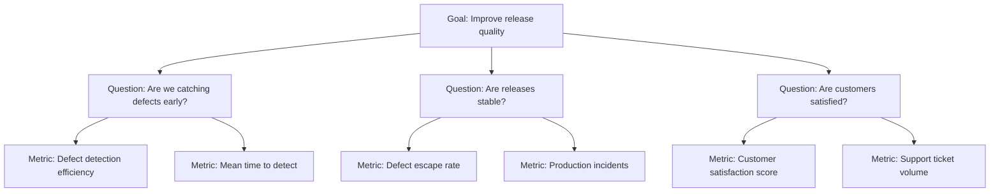

# Measurement Pitfalls

> **Core Principle:** Metrics are powerful but dangerous. Misused metrics create perverse incentives, gaming, and worse quality. A specialist quality engineer knows what can go wrong and how to prevent it.

## Goodhart's Law

> *"When a measure becomes a target, it ceases to be a good measure."*

This is the fundamental danger of metrics. Once people know what is being measured, they optimize for the metric, not the underlying goal.

**Examples:**
```
Metric: Lines of code written
Target: More is better
Result: Developers write verbose, duplicated code
Reality: Code quality decreased

Metric: Number of bugs found
Target: Testers should find more bugs
Result: Testers report trivial issues, split one bug into many
Reality: Bug reports became noisy and unhelpful

Metric: Test coverage percentage
Target: 80% coverage
Result: Developers write tests that execute code but don't assert anything
Reality: Coverage increased but test quality decreased
```

## The Seven Deadly Sins of Measurement

### 1. Measuring Individuals

**The sin:** Using metrics to rank or compare individual developers

**Why it's wrong:**
```
Developer A: 500 lines of code, 3 bugs
Developer B: 200 lines of code, 1 bug

Is A better? Maybe A writes verbose code with hidden bugs.
Is B better? Maybe B works on harder problems.

Metrics don't capture:
  - Problem difficulty
  - Code quality
  - Mentoring and collaboration
  - Design decisions
  - Documentation
```

**What to do instead:**
- Measure team outcomes, not individuals
- Use metrics for process improvement, not performance reviews
- Combine quantitative and qualitative assessment
- Let peer reviews and 360 feedback handle individual assessment

### 2. Vanity Metrics

**The sin:** Tracking metrics that look good but don't drive action

**Examples:**
```
Vanity metrics:
  "We ran 10,000 tests!" (How many found bugs?)
  "95% code coverage!" (Is the code actually good?)
  "We fixed 500 bugs!" (Why were there 500 bugs?)
  "1 million lines of code!" (Is all that code necessary?)

Actionable metrics:
  "Defect escape rate decreased from 8% to 5%"
  "Mean time to detect improved from 3 days to 1 day"
  "Customer-reported defects decreased 40%"
```

**Test:** Can this metric change a decision? If not, it's vanity.

### 3. Metric Gaming

**The sin:** People optimizing for the metric instead of the goal

**Common gaming patterns:**
```
Coverage gaming:
  # Test that executes code but asserts nothing
  def test_complex_function():
      complex_function()  # Executes but doesn't verify
  
  Solution: Mutation testing, code review of tests

Bug count gaming:
  Report: "Login button is blue instead of green" (trivial)
  Report: "Login button text is 1px too low" (cosmetic)
  Report: "Login page could be faster" (not a bug)
  
  Solution: Severity-based metrics, review bug reports

Velocity gaming:
  Inflate story point estimates
  Avoid hard stories
  Cut corners to "complete" stories
  
  Solution: Track outcomes, not velocity
```

### 4. Single-Metric Focus

**The sin:** Optimizing one metric at the expense of everything else

**Example:**
```
Focus: Reduce open bug count

Actions taken:
  - Close bugs as "won't fix" without investigation
  - Lower severity to make bugs seem less important
  - Stop reporting new bugs to keep count low

Result: Open bug count decreased ✓
Reality: Quality got worse

Solution: Balance with other metrics
  - Open bugs + escape rate + customer satisfaction
```

**The balanced scorecard approach:**
```
Quality (multiple dimensions):
  1. Defect metrics: escape rate, density
  2. Coverage metrics: code, requirements, risk
  3. Process metrics: MTTD, MTTR, feedback time
  4. Customer metrics: satisfaction, reported issues
  5. Business metrics: revenue impact, uptime
```

### 5. Ignoring Context

**The sin:** Comparing metrics without context

**Bad comparisons:**
```
"Team A has 5% escape rate, Team B has 15%"
  → Team A works on stable legacy code
  → Team B works on new, complex features
  → Context matters!

"Our coverage is 75%, industry average is 80%"
  → Our code is 10 years old, mostly untested legacy
  → Industry average includes greenfield projects
  → Context matters!
```

**What to do instead:**
- Compare to your own past (trend analysis)
- Account for project characteristics
- Use metrics as conversation starters, not verdicts
- Always ask "Why?" before drawing conclusions

### 6. Measurement Without Action

**The sin:** Collecting metrics but never using them

**Signs of measurement without action:**
```
  - Dashboard nobody looks at
  - Reports nobody reads
  - Metrics collected for months without changes
  - No one can explain what a metric means
  - No decisions have been based on metrics
```

**The action test:**
```
For each metric, ask:
  1. Who uses this metric?
  2. What decision does it inform?
  3. What action would we take if it changed?

If you can't answer these, stop measuring it.
```

### 7. Data Quality Problems

**The sin:** Making decisions based on bad data

**Common data quality issues:**
```
Incomplete data:
  - Not all bugs are reported
  - Not all tests are tracked
  - Missing historical data

Inaccurate data:
  - Wrong severity assignments
  - Duplicate bug reports
  - Incorrect test results (flaky tests)

Inconsistent data:
  - Different teams use different definitions
  - Severity levels mean different things
  - Status values not standardized

Stale data:
  - Bugs not updated for months
  - Test results from old code
  - Metrics calculated on outdated data
```

**Data quality checklist:**
```
Before trusting any metric:
□ Is the data complete?
□ Is the data accurate?
□ Is the data consistent?
□ Is the data current?
□ Are definitions standardized?
□ Are there known gaps?
```

## The Measurement Anti-Pattern Catalog

### Anti-Pattern: The Coverage Obsession

```
Symptom:
  Team spends more time increasing coverage than fixing bugs

Root cause:
  Coverage is the only metric management sees

Solution:
  Add mutation testing, defect metrics, customer feedback
  Coverage is one input, not the goal
```

### Anti-Pattern: The Bug Count Quota

```
Symptom:
  Testers are given weekly bug quotas
  "Find at least 10 bugs per week"

Root cause:
  Management thinks bug count = tester productivity

Solution:
  Measure outcomes: escape rate, customer satisfaction
  Testers who find 0 bugs because code is good = success
```

### Anti-Pattern: The Green Dashboard

```
Symptom:
  Dashboard shows everything green
  But customers are complaining

Root cause:
  Metrics are gamed, thresholds are too loose, or
  wrong things are being measured

Solution:
  Include customer-facing metrics
  Validate metrics against reality
  Make thresholds meaningful
```

### Anti-Pattern: The Metric Blame Game

```
Symptom:
  Metrics used to blame teams
  "Your escape rate is too high"
  "Your team writes buggy code"

Root cause:
  Metrics used for punishment, not improvement

Solution:
  Use metrics for system improvement
  Ask "What in our process allowed this?"
  Never "Who caused this?"
```

### Anti-Pattern: The Dashboard Graveyard

```
Symptom:
  Dozens of dashboards, nobody looks at them
  Metrics collected but never discussed

Root cause:
  Metrics created without clear purpose
  No ownership of metrics

Solution:
  Each metric needs an owner and a purpose
  Review metrics quarterly: keep, improve, or kill
  Discuss metrics in regular meetings
```

## Designing Good Metrics

### The Metric Design Checklist

```
Purpose:
□ Why are we measuring this?
□ What decision will it inform?
□ What action will we take based on it?

Definition:
□ Is the metric clearly defined?
□ Can anyone calculate it the same way?
□ Are edge cases handled?

Data:
□ Is the data available and accurate?
□ How often is it updated?
□ Are there known gaps?

Context:
□ What is the target or threshold?
□ How does it compare to baseline?
□ What factors might affect it?

Balance:
□ What other metrics balance this one?
□ Can this metric be gamed?
□ What happens if someone optimizes only for this?

Review:
□ Who owns this metric?
□ How often is it reviewed?
□ When will we reassess its value?
```

### The Goal-Question-Metric (GQM) Framework



### Balanced Quality Scorecard

```
┌─────────────────────────────────────────────────┐
│              QUALITY SCORECARD                    │
├─────────────────┬──────────┬─────────┬──────────┤
│ Dimension       │ Metric   │ Current │ Target   │
├─────────────────┼──────────┼─────────┼──────────┤
│ Prevention      │ DDE      │ 95%     │ > 95%    │
│ Detection       │ MTTD     │ 1.5 days│ < 1 day  │
│ Response        │ MTTR     │ 6 hours │ < 4 hours│
│ Customer        │ CSAT     │ 4.3/5   │ > 4.5    │
│ Efficiency      │ Autom. % │ 85%     │ > 80%    │
│ Coverage        │ Branch   │ 74%     │ > 70%    │
│ Stability       │ Uptime   │ 99.95%  │ > 99.9%  │
└─────────────────┴──────────┴─────────┴──────────┘

No single metric dominates. Balance prevents gaming.
```

## Building a Healthy Measurement Culture

### Principles

```
1. Metrics serve people, not the other way around
   → If a metric doesn't help, remove it

2. Measure systems, not individuals
   → "What in our process caused this?" not "Who did this?"

3. Multiple metrics prevent gaming
   → Balance every metric with a counter-metric

4. Trends matter more than snapshots
   → Direction is more important than absolute value

5. Context is king
   → Never compare without understanding differences

6. Action over measurement
   → A rough metric that drives action beats a perfect metric that sits in a dashboard
```

### Regular Reviews

```
Monthly:
  - Review all quality metrics
  - Are they still useful?
  - Are they being gamed?
  - Do we need new metrics?

Quarterly:
  - Assess measurement culture
  - Survey teams: Do metrics help or hurt?
  - Adjust targets based on improvement

Annually:
  - Complete measurement system review
  - Benchmark against industry (with context)
  - Plan measurement improvements
```

## Key Takeaways

1. **Goodhart's Law is real:** When a metric becomes a target, it gets gamed
2. **Never measure individuals:** Measure systems and processes
3. **Balance metrics:** No single metric tells the whole story
4. **Action over measurement:** A rough metric that drives action beats a perfect one that doesn't
5. **Review regularly:** Metrics need maintenance, just like code

## Related Topics

- [[01_Defect_Metrics]]: Defect metrics done right
- [[02_Coverage_Metrics]]: Coverage without obsession
- [[04_Quality_Reporting]]: Reporting that drives action
- [[05_Data_Analysis]]: Analyzing data responsibly

## Existing Vault Connections

- [[software-engineering-note/12_Software_Quality/07_Quality_Metrics]]: Quality metrics fundamentals
