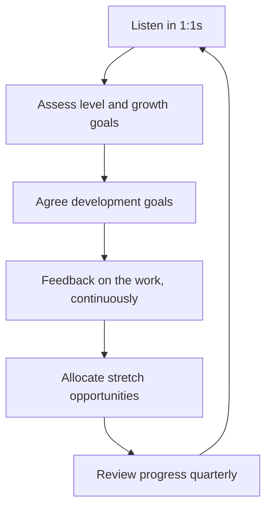

# People Development

> **Core capability:** The engineering manager grows each engineer deliberately — through one-to-ones, feedback, coaching, career frameworks, and honest performance management — so that people advance and the team's capability compounds.

## Why This Matters

People join companies and leave managers. The one-to-one meeting, the feedback conversation, and the promotion case are where the manager's leverage lives — or where retention quietly dies. Development is also the EM's compounding asset: engineers who grow take on more scope, which grows the team's capacity, which frees the manager from being the ceiling.

This is the area where new managers fail most often, in both directions: avoidance (feedback never given, performance problems left to rot) and over-correction (managing people as tasks to optimize rather than professionals to partner with). The skill is deliberate, documented, human development work on a cadence.

## Topics in This Capability Area

| Topic | Core Skill | When It Matters |
|-------|------------|-----------------|
| [[01_One_to_Ones]] | Running 1:1s that develop people, not status meetings | Weekly or bi-weekly, every report, forever |
| [[02_Feedback_and_Difficult_Conversations]] | Delivering honest feedback and holding hard conversations | Continuous feedback; formal review cycles |
| [[03_Coaching_for_Growth]] | Coaching mindset and practice for developing engineers | Growth plans, skill gaps, stretch assignments |
| [[04_Career_Frameworks_and_Promotions]] | Using career ladders honestly; building promotion cases | Promotion cycles, level expectations, career conversations |
| [[05_Performance_Management]] | Managing underperformance fairly and firmly | When expectations are not met, over time |
| [[06_Motivation_and_Engagement]] | Understanding what drives each engineer | Retention risk, disengagement signals, energy shifts |
| [[07_Managing_Experienced_Engineers]] | Managing senior and staff engineers | Senior reports, former peers, deep specialists |

## The Development Cadence

## What Changes from Tech Lead to Engineering Manager

| Activity | Tech Lead | Engineering Manager |
|----------|-----------|---------------------|
| 1:1s | Occasional, technical mentoring focus | Owns the cadence; career, growth, wellbeing |
| Feedback | On the work, in reviews and pairing | Formal and informal; owns delivery and documentation |
| Performance | Contributes input | Owns the assessment, the process, and the outcome |
| Promotion | Provides evidence | Builds the case, manages the process |
| Coaching | Technical coaching | Whole-person and whole-career coaching |

## Practical Applications

### People Development Checklist

- [ ] Every report has a regular 1:1 that survives deadline pressure
- [ ] Each engineer knows their level's expectations and their gaps
- [ ] Feedback flows both ways, and difficult conversations happen early
- [ ] Development goals exist in writing and are reviewed quarterly
- [ ] Promotion cases are built from evidence collected over time, not scrambled at cycle end
- [ ] Underperformance is addressed within weeks, not quarters
- [ ] Senior reports get management adjusted to their autonomy

## Common Pitfalls

| Pitfall | Why It Is a Problem | Better Approach |
|---------|---------------------|-----------------|
| **Status-update 1:1s** | Wastes the only meeting dedicated to the person | Their agenda first; status lives elsewhere |
| **Feedback hoarding** | Surprises at review time; trust collapses | Small, continuous, documented feedback |
| **Promising promotions** | Manager does not control the outcome | Promise the case and the coaching, not the title |
| **Avoiding hard conversations** | Problems compound; team notices the unfairness | Prepare, rehearse, deliver, document, follow up |

## Success Indicators

- Engineers can state their growth goals and their level gaps unprompted
- No performance surprises in formal reviews
- Promotions are predictable because expectations were explicit
- Regretted attrition is rare, and exits are handled with dignity
- Reports increasingly manage their own development

## Related Capabilities

- [[02_Team_Formation_and_Health/00_overview|Team Formation and Health]]: individual growth feeds team health
- [[05_Organizational_Awareness_and_Influence/00_overview|Organizational Awareness and Influence]]: promotion and performance outcomes land in org context
- [[career-path/02_Senior_Software_Engineer/07_Mentoring_and_Team_Leadership/00_overview|Mentoring and Team Leadership (Senior)]]: the mentoring skills this area formalizes
- [[career-path/05_Tech_Lead/05_Team_Development_and_Mentoring_Leadership/00_overview|Team Development and Mentoring Leadership (Tech Lead)]]: the lead-level practices this owns fully

## Summary

People development is the engineering manager's core craft: 1:1s that belong to the report, feedback that arrives early and honest, coaching that builds capability, career frameworks applied without fantasy, and performance management that is fair, documented, and timely. Done well, people grow, stay longer, and the team's capability compounds.
