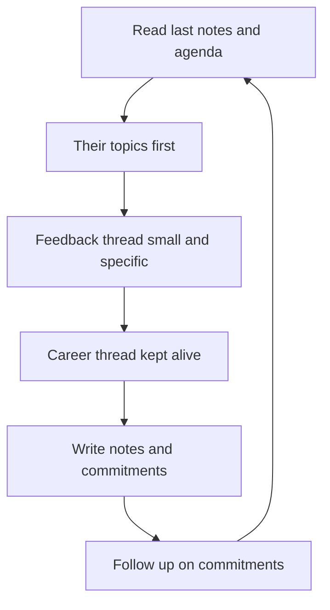

# One-to-Ones

> **Core skill:** Running the one-to-one as the report's meeting — their agenda first, a career thread and a feedback thread, tracked over time, and adjusted to the person.

## Why This Matters

The one-to-one is the only meeting on the calendar that belongs to the report. Everything else — standups, planning, reviews — exists to get work done; the one-to-one exists to develop a person. When it works, it is where problems surface early, feedback lands, careers get planned, and trust compounds. When it decays into a status meeting, the manager loses their early-warning system and the report loses their only guaranteed audience.

Managers who cancel one-to-ones under pressure are signaling, every time, that the work matters more than the person. The report notices, the agenda quietly shrinks, topics move elsewhere, and the manager starts hearing about problems after they became incidents. The one-to-one is not a meeting to protect when there is time; it is the meeting to protect because there is pressure.

## The Cadence

Weekly, thirty to forty-five minutes, on a recurring calendar slot. The slot survives because it is a standing commitment, not a scheduled convenience.

| Cadence | For whom | Why |
|---------|----------|-----|
| Weekly, 30-45 minutes | Most reports | The default: short enough to keep, long enough to go deep |
| Weekly, 45-60 minutes | New hires, juniors, people in trouble | More airtime while ramping or recovering |
| Biweekly, 30 minutes | Senior and staff engineers | Respects autonomy; they hold their own thread. Never less than biweekly |
| Extra sessions | Post-incident, pre-review, after re-org | Add time on top; do not steal the standing slot |

The manager arrives on time, phone away, and reschedules to a real date when genuinely forced — never to "we will find time". The report learns the meeting is real by watching the manager protect it.

## Structure: Their Agenda First

The standing agenda is a shared document with three threads. The report owns the top of it.

| Thread | What lives there | Who drives it |
|--------|------------------|---------------|
| Their topics | Blockers, team dynamics, workload, wellbeing, anything on their mind | The report, first part of the meeting |
| Career thread | Growth goals, level gaps, stretch opportunities, promotion readiness | The report, with the manager keeping it alive |
| Feedback thread | Praise and improvement notes, observed behaviors, follow-ups | The manager, every meeting, in small doses |

The manager's own status items do not live here. If the manager fills the meeting with their updates, the report learns to arrive empty. Status belongs in the status channel; this hour belongs to the person.

## What One-to-Ones Are Not

| Not this | Why it fails | Where it belongs instead |
|----------|--------------|--------------------------|
| Status meeting | Report reads out tickets; manager nods; no development happens | Standup, async updates, project reviews |
| Project review | The project eats the whole hour and the person disappears | Dedicated project cadence |
| Performance ambush | Feedback saved for the one-to-one arrives as a surprise and lands as attack | Continuous small feedback plus formal reviews |
| Therapy session | The manager is not a therapist; deep personal crisis needs professionals | EAP and HR — the manager supports, not treats |

## Tracking Themes Across One-to-Ones

Notes are written in the shared document during or right after the meeting: commitments, concerns, and themes. The manager reads them back before the next meeting and follows up on anything promised. Every quarter, the manager reviews each report's accumulated notes and asks three questions: what themes recur, what changed since last quarter, and what did we promise but not do. Those notes are the raw material for reviews, promotion cases, and performance management — written while things were small, never reconstructed after they got big.

## Adjusting Per Person

| Engineer | One-to-one shape | What the manager provides |
|----------|------------------|---------------------------|
| Junior | Structured agenda, concrete questions, direct feedback | Direction, checklists, explicit next steps, reassurance |
| Mid | Balanced: their topics plus career discussion | Coaching questions, ownership pushes, feedback on scope |
| Senior | Their agenda almost entirely; manager listens | Partnership, hard problems, honest challenge, few but deep feedback |
| Staff | Sparse, high-leverage, often about org and strategy | Peer-level sounding board, influence access, brutal honesty |

The cadence is not negotiable; the content is. One shape for everyone is the fastest way to make the meeting useless for half the team.

## Cancelled One-to-Ones as Signal

A cancelled one-to-one is an event, not a detail. Whose cancellations and how often tell a story the manager should read out loud.

| Signal | What it usually means | Manager's move |
|--------|------------------------|----------------|
| Manager cancels repeatedly | The report is being told they are low priority | Protect the slot; delegate something else instead |
| Report cancels repeatedly | Avoidance, or the meeting is useless | Ask directly; fix the meeting's value first |
| Meeting shrinks to ten minutes | The agenda is dead; trust is low | Restart with the first-one-to-one questions |
| Both cancel silently | The meeting has become theater | Rebuild the frame from scratch |

## The Conversation Menu

When the report arrives with nothing, the menu keeps the meeting valuable. These are starting points, not a script.

| Menu item | Sample question |
|-----------|-----------------|
| Career | Where do you want to be in two years, and what would have to be true? |
| Growth | What skill, if improved, would change your impact most? |
| Team dynamics | What is one thing the team does that frustrates you most? |
| Workload | What are you spending time on that feels wasted? |
| Wellbeing | How is your energy outside of work right now? |
| Feedback | What have I done recently that helped you, and what got in your way? |
| Engagement | What part of your work would you drop if you could? |

## The First One-to-One

The first one-to-one sets the frame. The manager comes with questions, not a speech, and says plainly: this hour is yours.

```markdown
## First One-to-One Agenda
- [ ] How do you like to receive feedback - direct, written, after thought?
- [ ] What does a good week look like for you? What does a bad one?
- [ ] What have past managers done that you appreciated? That you hated?
- [ ] Where do you want your career to go in the next two years?
- [ ] What do you need from me weekly to do your best work?
- [ ] How do you prefer to be stretched - new scope, new tech, new people?
- [ ] What are your current worries about the team or the work?
```

## The One-to-One Rhythm



## Practical Applications

- [ ] One-to-one calendared weekly in a fixed slot and protected from status content
- [ ] Shared agenda document with three threads; the report adds items before each meeting
- [ ] Notes written after every meeting and read before the next
- [ ] Quarterly theme review per report, feeding reviews and promotion cases
- [ ] Cadence and shape adjusted per person and rechecked when signals change
- [ ] Cancellations tracked; repeated cancellations treated as signal, not accident

## Common Pitfalls

| Pitfall | Why It Is a Problem | Better Approach |
|---------|---------------------|-----------------|
| **The manager's meeting** | The report arrives empty because the manager always fills the room | Their agenda first; the manager speaks last |
| **Status-update one-to-ones** | The only people-focused meeting becomes a ticket readout | Move status to standup and async; keep this hour human |
| **No notes** | Themes and promises evaporate; reviews get reconstructed from memory | Shared document; write during or right after |
| **Skipping under pressure** | Reports learn they rank below the work | Reschedule to a real slot; protect the cadence |
| **One shape for everyone** | Juniors drown in open questions, seniors drown in checklists | Adjust structure to the person's level and needs |
| **Feedback hoarding** | The one-to-one becomes the monthly dump | Small continuous feedback; this hour is one channel, not the only one |

## Success Indicators

- Reports arrive with their own agenda items most weeks
- Problems surface in one-to-ones before they become incidents
- Career topics recur, not just task topics
- Notes exist and themes are visible across quarters
- Reports do not cancel; when they do, the reason is known and addressed

## Related Topics

- [[02_Feedback_and_Difficult_Conversations]]: the craft behind the feedback thread
- [[03_Coaching_for_Growth]]: turning one-to-one topics into coaching moments
- [[04_Career_Frameworks_and_Promotions]]: the structure behind the career thread
- [[06_Motivation_and_Engagement]]: reading the person behind the agenda
- [[02_Team_Formation_and_Health/00_overview|Team Formation and Health]]: healthy teams make one-to-ones easier

## Summary

The one-to-one is the report's meeting: weekly, protected, their agenda first, with a career thread and a feedback thread tracked in writing over time. It adapts to the person — structured for juniors, partnership for seniors — and its cancellation pattern is a signal the manager reads honestly. Run well, it is the early-warning system, the feedback channel, and the career cockpit in one hour.
