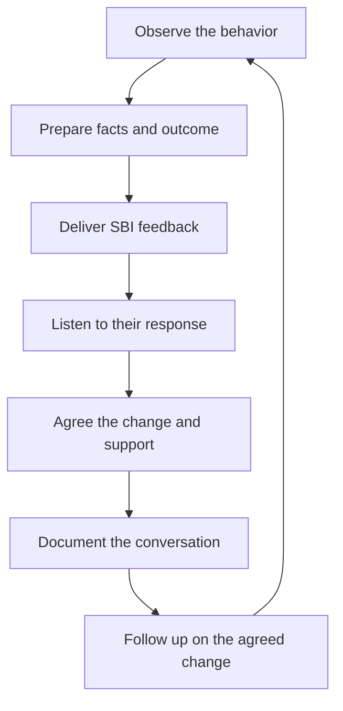

# Feedback and Difficult Conversations

> **Core skill:** Delivering honest, specific feedback early and holding difficult conversations with preparation, dignity, and documentation — while receiving feedback without defensiveness.

## Why This Matters

Feedback is how people learn what to keep and what to change. Continuous, specific feedback prevents small issues from becoming habits, and habits from becoming performance problems that end in surprise reviews or exits. The manager who hoards feedback until the formal cycle is guaranteeing that the formal cycle will be a shock — and shocks destroy trust.

Difficult conversations are where the manager's courage is tested: telling a senior their code quality has declined, telling a strong engineer their communication is damaging the team, telling someone their behavior is the problem. Avoided, they fester into grudges, team-wide resentment, and documented failures. Delivered well, they are often the moment the engineer later credits with saving their career at this company.

## Continuous vs Formal Feedback

| Dimension | Continuous feedback | Formal feedback |
|-----------|---------------------|-----------------|
| Timing | Within days of the behavior | Per the review cycle |
| Size | Small, one behavior at a time | Cumulative assessment of the period |
| Setting | One-to-one, review comments, quick chats | Scheduled review meeting |
| Purpose | Correct and reinforce in the moment | Rate, decide, and plan |
| Failure mode | Never given, so surprises at review | Given only formally, so it arrives as ambush |

Both matter. Continuous feedback is the daily diet; formal feedback is the periodic weigh-in. The weigh-in should contain no news the diet has not already delivered.

## The SBI Model

Situation-Behavior-Impact is the reliable structure for feedback that lands as information rather than attack.

| Element | What it is | Example |
|---------|------------|---------|
| Situation | When and where it happened | In Tuesday's design review |
| Behavior | The observable behavior, not the person | You interrupted the presenter three times |
| Impact | The effect on you, others, or the work | The room went quiet and the design went undiscussed |

The discipline: no personality adjectives, no "you always", no mind-reading. State what was seen, not what was inferred. Then pause — the other person responds to facts far better than to verdicts.

## Preparing the Difficult Conversation

Hard conversations fail in the preparation, not the delivery. Before scheduling, the manager assembles four things.

| Element | What it looks like |
|---------|--------------------|
| Facts | The concrete events, dated, with names and specifics |
| Examples | Two or three recent instances, enough to show a pattern |
| Desired outcome | What the manager wants to be different, stated as behavior |
| Rehearsal | The opening lines said out loud, alone or with a peer |

Preparation also means choosing the room: private, uninterrupted, enough time, no audience. The manager enters with a goal — changed behavior — not a script to recite and a score to settle.

## Delivering Without Apology Padding

Apology padding is the instinct to soften the message until it disappears. It protects the manager's comfort at the cost of the engineer's clarity.

| Padding to avoid | Why it fails | Direct alternative |
|------------------|--------------|--------------------|
| "This is hard for me to say..." | Frames the manager as the victim | "I need to give you direct feedback." |
| "I might be wrong, but..." | Signals the feedback is optional | "Here is what I observed." |
| "Everyone feels..." | Hides the manager behind a crowd | "I am telling you this." |
| "It's not a big deal, but..." | Contradicts the message | State the impact plainly. |
| "You're great, it's just..." | The praise swallows the feedback | One behavior, one impact, one ask. |

Empathy is shown in how the message is delivered and what happens after — not in diluting the message itself.

## Receiving Feedback Without Defensiveness

The manager models the behavior they expect from reports. Defensive managers breed defensive teams, and feedback to the manager dies within months. The receiving stance: listen fully, ask one clarifying question, thank the giver, and take time before responding to anything that stings. If the feedback is wrong in detail, correct the detail — not the person's right to speak. The manager who thanks someone for hard feedback, then visibly changes, doubles the odds that hard feedback keeps coming.

## Documenting Conversations

Feedback conversations get written down — what was said, what was agreed, what the follow-up is. Documentation protects the report (agreements are kept), the manager (assessments are grounded), and the process (patterns are provable). It is written the same day, in the manager's notes, and shared with the report where appropriate.

```markdown
## Conversation Note
- Date and topic:
- What was observed (facts, examples):
- What was agreed (behavior change, timeline):
- Support offered (coaching, resources, check-ins):
- Follow-up date:
```

## When to Involve HR

| Situation | Manager's move |
|-----------|----------------|
| Harassment, discrimination, or safety concerns | Involve HR immediately; do not investigate alone |
| Repeated misconduct after clear feedback | Involve HR before the next conversation; align on process |
| Serious performance decline with legal exposure | Advise HR before formalizing a plan |
| Any conversation that might end in termination | HR from the start; the manager never goes it alone |

The rule: HR is escalation, not avoidance. Involving HR is a sign the manager is taking the situation seriously, not passing it off.

## Common Hard Conversations

| Situation | What it looks like | The move |
|-----------|--------------------|----------|
| Senior's code quality declining | Review comments thinning, tests skipped, shortcuts becoming normal | Name it with evidence; they will respect directness from a peer-level partner |
| Communication damaging the team | Interruptions, dismissive tone, steamrolling decisions | Behavioral examples and impact; agree on a signal or norm |
| Attitude affecting others | Eye-rolling, sarcasm, public frustration | Separate the conduct from the person; make the standard explicit |
| Repeated missed commitments | Dates slip with new excuses each time | Facts and pattern; move toward a plan with consequences |

## The Feedback Flow



## Practical Applications

- [ ] Give feedback within days of the behavior, in small doses
- [ ] Use SBI for every constructive message; skip personality words
- [ ] Prepare facts, examples, and desired outcome before hard conversations
- [ ] Say the opening line out loud before delivering it
- [ ] Drop apology padding; keep empathy in delivery and follow-up
- [ ] Document every difficult conversation the same day
- [ ] Consult HR before any conversation that could end in termination
- [ ] Thank reports for feedback to the manager and act on it visibly

## Common Pitfalls

| Pitfall | Why It Is a Problem | Better Approach |
|---------|---------------------|-----------------|
| **Feedback hoarding** | Review-time surprises destroy trust and compound the problem | Continuous small feedback; formal cycles contain no news |
| **Sandwich technique** | Praise-bookends blur the message; people remember the praise | One behavior, one impact, one ask |
| **Apology padding** | The message dissolves and nothing changes | Direct opening, empathetic delivery, real follow-up |
| **Talking about them to others** | The report hears third-hand; trust collapses | Direct conversation first, always |
| **Investigating solo** | Managers gather "evidence" from the team and create a mob | Observe directly; involve HR for serious matters |
| **Letting it slide one more time** | Patterns harden and the eventual conversation is bigger | Address the second occurrence, not the tenth |

## Success Indicators

- Reports receive feedback weekly and can recall recent examples of both praise and correction
- Difficult conversations happen early, privately, and rarely surprise anyone
- Documented conversation notes exist for every serious discussion
- Reports bring feedback to the manager without fear
- HR is consulted early, never as a last-minute rescue

## Related Topics

- [[01_One_to_Ones]]: the weekly channel where most feedback lands
- [[05_Performance_Management]]: when feedback escalates into a formal plan
- [[career-path/02_Senior_Software_Engineer/07_Mentoring_and_Team_Leadership/04_Effective_Feedback|Effective Feedback (Senior)]]: the same craft at engineer level
- [[07_Manager_Communication/00_overview|Manager Communication]]: the broader communication craft
- [[02_Team_Formation_and_Health/00_overview|Team Formation and Health]]: safe teams make feedback a reflex

## Summary

Feedback and difficult conversations are the manager's honesty work: continuous, specific, behavior-based feedback delivered through SBI, hard conversations prepared with facts and desired outcomes, delivered without apology padding, documented the same day, and escalated to HR when the stakes demand it. Done consistently, the formal review becomes a formality and the team learns that hard truths arrive early, privately, and with support.
