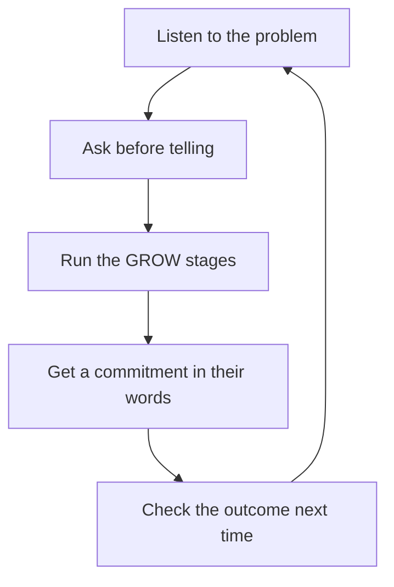

# Coaching for Growth

> **Core skill:** Growing engineers through questions rather than answers — using the GROW model, coaching in one-to-ones, and measuring success by whether people solve their own next problem.

## Why This Matters

Telling people what to do solves the current problem and teaches nothing. Coaching — asking the questions that let the engineer find the answer — solves the current problem and builds the capability to solve the next one. The manager who always answers becomes the bottleneck; every decision and every solution routes through them. The manager who coaches compounds: each coached engineer takes on more, and the team's ability to self-serve grows.

Coaching is also a retention lever. Engineers who feel their manager invests in their thinking — not just their output — stay. The manager who coaches signals that the person matters beyond this sprint, and that signal is read loudly by the best engineers, who have options.

## Coaching vs Managing vs Mentoring vs Therapy

| Mode | Focus | Manager's posture | Example |
|------|-------|-------------------|---------|
| Managing | Outcomes and accountability | Directs, plans, checks | Agreeing quarterly goals and reviewing delivery |
| Coaching | The person's own thinking | Asks, listens, holds space | "What options do you see?" |
| Mentoring | Sharing experience and advice | Advises from their own path | "Here is how I handled this failure" |
| Therapy | Emotional healing and diagnosis | None — refer out | A report in personal crisis |

The four modes blend in practice, but the manager should know which mode they are in. The failure mode is drifting into telling whenever the engineer is capable of thinking. The rule of thumb: if the engineer has the knowledge and just needs to access it, coach. If they lack knowledge, mentor. If outcomes are slipping, manage. If there is a wound, refer.

## The GROW Model

GROW is the coaching spine: a four-stage conversation that moves from the desired state to a concrete action.

| Stage | Purpose | Sample questions |
|-------|---------|------------------|
| Goal | What they want to achieve | "What would success look like? What will be different?" |
| Reality | Where they are now | "What have you tried? What is in the way? What is the current state?" |
| Options | The paths forward | "What are your options? What else? Who could help?" |
| Way forward | The commitment | "What will you do by when? How will you know it worked?" |

The manager's discipline in GROW: stay in each stage until it is genuinely explored, resist jumping to solutions in Reality, and end with a commitment the engineer owns — their words, their date, their metric.

## Asking Over Telling

| Telling | Open question | Scaling question |
|---------|---------------|------------------|
| "You should talk to the platform team." | "What have you considered so far?" | "On a scale of 1 to 10, how confident are you this will work?" |
| "That design is too risky." | "What worries you about it?" | "What would make it a 9 instead of a 6?" |
| "Push back on the deadline." | "What do you think is driving the pressure?" | "What is the smallest step that would move you from 4 to 5?" |

Open questions hand the thinking back. Scaling questions make abstract feelings concrete and almost always produce the engineer's own next step: a 7 with a reason contains the fix for becoming an 8.

## Coaching in One-to-Ones

The one-to-one is the natural coaching ring. The pattern: when the report brings a problem, the manager coaches before advising. Three questions buy the coach the right to eventually opine — and often make the opinion unnecessary. Keep a rough discipline: for problems the report raises, coach first, advise only if asked or stuck. For problems the manager observes, feedback comes first, then coaching on the fix. Coaching does not mean never giving direction; it means direction is the last resort, not the first.

## Problems Brought vs Problems Observed

| Source | Example | Coaching move |
|--------|---------|---------------|
| Brought by the engineer | "I keep missing review deadlines" | GROW the gap: goal, reality, options, way forward |
| Observed by the manager | Tension in meetings the engineer does not raise | Name the observation, then coach: "I noticed X — what is your read on it?" |
| Both | Engineer knows it, manager sees it | Agree the problem first, then coach the solution |

Observed problems need a naming step before coaching; unspoken problems cannot be coached. The manager names the behavior neutrally and lets the engineer interpret it — interpretation is where ownership begins.

## Building the Coaching Habit

Coaching is a habit with a trigger. The manager installs it with a small loop: in every one-to-one, notice the first moment they want to answer, and ask instead. Track the ratio for a month — questions asked versus answers given — and watch it improve. Keep a coaching prompt card in the agenda document until the questions become reflex. The habit is fragile under pressure: deadlines and incidents pull the manager back into telling, which is exactly when coaching matters most.

## Measuring Coaching Effect

| Signal | What it means |
|--------|---------------|
| Engineers bring problems with proposed solutions | They now think ahead of the meeting |
| The same problem does not recur | The learning stuck |
| Engineers coach each other | The practice has spread to the team |
| Manager's question count rises and rescue count falls | The habit is working |
| Engineers say "I figured it out" more than "you were right" | Ownership has shifted to them |

The blunt test: is each engineer solving their own next problem, or still bringing the manager every first attempt? Coaching works when the manager's inbox of questions shrinks and the team's capability grows.

## The Coaching Loop

## Practical Applications

- [ ] Use GROW for every coaching conversation until it is reflex
- [ ] Track questions vs answers in one-to-ones for a month
- [ ] Coach before advising on problems the report brings
- [ ] Name observed problems neutrally, then coach the interpretation
- [ ] Keep a prompt card with open and scaling questions in the agenda
- [ ] Refer to therapy and EAP when the issue is emotional, not professional
- [ ] Review the coaching effect quarterly: do people solve their own next problem?

## Common Pitfalls

| Pitfall | Why It Is a Problem | Better Approach |
|---------|---------------------|-----------------|
| **Answering first** | The engineer learns to wait for the answer | Ask one question before any opinion; usually one is enough |
| **Coaching without context** | Open questions with no shared facts waste everyone's time | Ground the conversation in reality before going abstract |
| **Coaching a knowledge gap** | An engineer who lacks the skill cannot be asked into it | Mentor or train first, coach the application |
| **Therapy drift** | Managers try to fix emotional wounds with questions | Recognize the boundary; refer with care |
| **Coaching as avoidance** | Questions replace the manager's accountability for outcomes | Coach the thinking, then manage the commitment |
| **No follow-through** | Commitments made in coaching sessions evaporate | Check the commitment at the next one-to-one |

## Success Indicators

- Engineers bring problems with at least one proposed solution
- The same issues stop recurring after a coaching conversation
- Question-to-answer ratio in one-to-ones shifts toward questions
- Engineers coach each other without the manager present
- The manager's rescue count drops while team output holds or grows

## Related Topics

- [[01_One_to_Ones]]: the weekly ring where coaching happens
- [[07_Managing_Experienced_Engineers]]: coaching is the primary mode with seniors
- [[career-path/02_Senior_Software_Engineer/07_Mentoring_and_Team_Leadership/05_Coaching_and_Development|Coaching and Development (Senior)]]: the same craft at engineer level
- [[02_Team_Formation_and_Health/00_overview|Team Formation and Health]]: coaching depends on a team where questions are safe

## Summary

Coaching for growth is the practice of asking before telling: GROW-structured conversations, open and scaling questions, and a measured habit that shifts ownership of problems to the engineer. The manager distinguishes coaching from managing, mentoring, and therapy, coaches both brought and observed problems, and judges success by one test — whether each engineer solves their own next problem.
