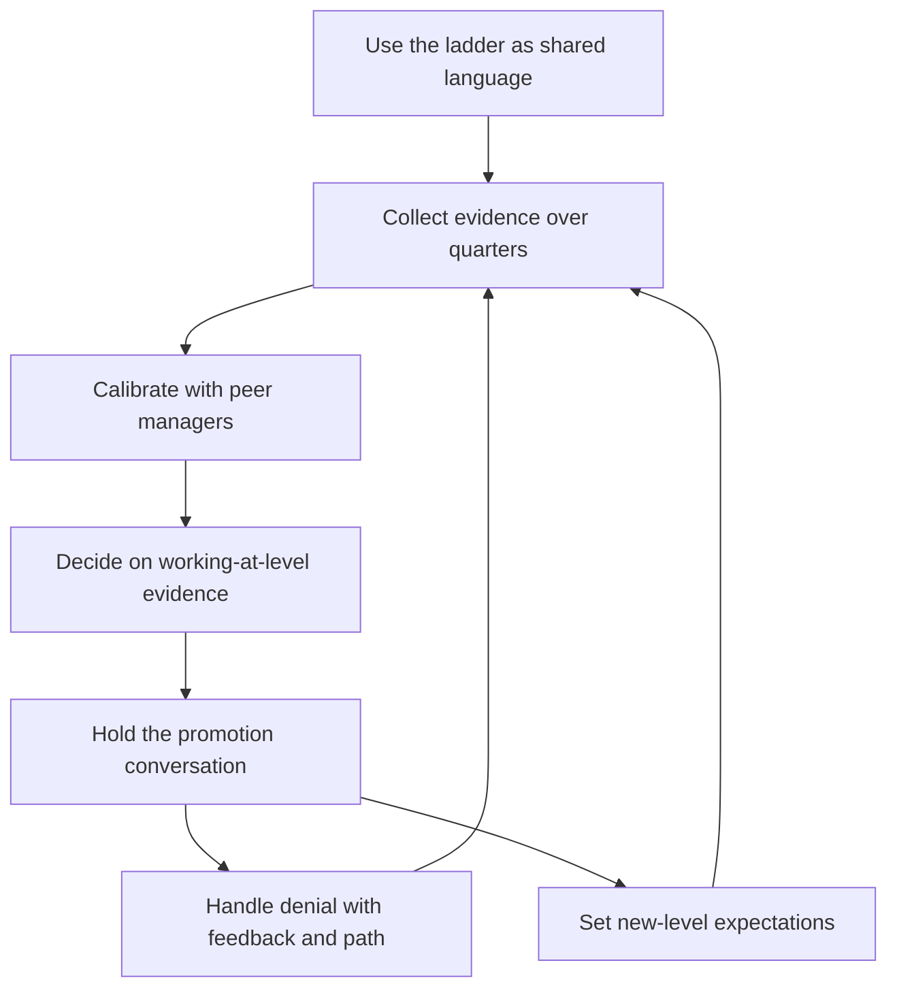

# Career Frameworks and Promotions

> **Core skill:** Using career ladders as shared language for levels and evidence, building promotion cases over quarters, calibrating with peers, and handling promotion outcomes — including denials — with honesty.

## Why This Matters

Promotions are the most visible reward the manager controls — and the one they control least. The manager does not decide the outcome; they build the case, coach the candidate, and manage the aftermath. Managers who treat promotions as a favor to extract from the process create lottery dynamics: engineers lobby, compare, and leave when the draw goes wrong. Managers who treat ladders and evidence as shared language create predictability: everyone knows what a level means, what evidence counts, and where they stand.

A credible promotion system is also a retention system. Engineers who see a fair, legible path stay longer and work harder on the right things. Engineers who see arbitrariness update their resumes. The manager's job is to make the system legible and then run it honestly — including when the answer is no.

## Career Ladders as Shared Language

| Ladder element | What it gives | Abuse to avoid |
|----------------|---------------|----------------|
| Level definitions | A common vocabulary for scope, autonomy, and impact | Treating them as a checklist instead of a pattern |
| Expectations per level | Engineers know what "next level" means in behavior | Hiding the ladder; keeping expectations implicit |
| Evidence standards | Decisions become comparable across teams | Evidence theater — cases built at cycle end |
| Progression criteria | A legible path; engineers plan toward it | Promising timelines the manager cannot guarantee |

The ladder is a coaching tool, not a ranking. It is used in development conversations as the map for gaps and stretches, and in promotion reviews as the bar for evidence. The manager keeps the ladder visible, current, and used — an unused ladder is worse than none, because it fakes a system.

## Using Ladders in Development Conversations

Every development conversation references the ladder: where the engineer is, what the next level demands, and which expectations are currently the gap. The manager asks the engineer to self-assess against the ladder first — their read is usually honest and often harsher than the manager's. The output is a written gap list: the two or three expectations at the next level the engineer is not yet meeting, with concrete work that closes them. Promotions then stop being a surprise verdict and become the natural consequence of a visible process.

## The Promotion Case: Evidence Over Quarters

Cases are built continuously, not scrambled at cycle end. The manager keeps a running evidence log per report, collected from the work itself.

| Evidence type | What counts | How it is collected |
|---------------|-------------|---------------------|
| Impact | Shipped outcomes, metrics moved, problems solved | Noted quarterly from delivery reviews and one-to-ones |
| Scope | Size and ambiguity of owned work, span of influence | Written down when scope changes, not at cycle end |
| Behavior at next level | Acts that demonstrate the target level's expectations | Captured the moment they happen: reviews, incidents, decisions |

The pattern: one document per report, updated every one-to-one or monthly, containing dated examples. When the cycle arrives, the case assembles itself. A manager who cannot produce a case from a year of notes was not collecting evidence; they were hoping.

## Calibration with Peer Managers

Calibration is the antidote to manager bias. The manager brings their cases to a forum of peer managers and defends them: is this engineer's evidence actually at the next level, or does this manager just like them? The posture is curiosity, not advocacy. The manager expects their own cases to be challenged, challenges other managers' cases in return, and watches for two systematic errors: the manager who never promotes (their bar is secretly too high) and the manager who always does (their bar is secretly too low). Calibration works when the group can say no to each other.

## Working at Level vs Potential

| Basis | What it means | Risk |
|-------|---------------|------|
| Already working at level | The engineer demonstrably does the next level's work today | Conservative; may under-promote people ready to stretch |
| Potential | The engineer could grow into the level soon | Speculative; promotions on potential burn the system's credibility |

The defensible standard is "working at level" — evidence that the role is being performed now, sustained over time. Potential is discussed in development, not rewarded by promotion. The honest question at review: "If this engineer had the title today, would we be comfortable, and could we defend it?" If the answer needs a future tense, the case is not ready.

## Handling Denied Promotions

The denial is where the manager earns or loses trust. The conversation happens promptly, privately, and with the evidence open.

| Component | What the manager does |
|-----------|-----------------------|
| Feedback | Show the specific evidence gaps against the ladder; no vagueness |
| Timeline | Give a realistic path: what closes the gaps, and when it is reviewed again |
| Retention risk | Expect the reaction; a denied candidate is a flight risk for weeks |
| Follow-up | Schedule the next check-in before the meeting ends; do not vanish |

The manager never blames the committee alone, never promises the next cycle, and never softens the gap. The engineer leaves knowing exactly what changed — or knowing the manager fought honestly and the bar was real. Both preserve the relationship; vagueness destroys it.

## The Promotion Conversation

The conversation has one rule: no surprises. If the candidate is promoted, the manager shares the outcome, the evidence that carried the case, and the new expectations — and celebrates. If not, the manager delivers the denial with the gaps, the plan, and the timeline, and then listens. The conversation is short on justification and long on next steps; the candidate who can say "here is what I need to do" has received the promotion process at its best.

## The Promotion Cycle

## Practical Applications

- [ ] Keep the ladder visible and used in every development conversation
- [ ] Maintain a dated evidence log per report, updated monthly
- [ ] Have engineers self-assess against the ladder before each cycle
- [ ] Bring every case to calibration with peer managers, ready to defend and to challenge
- [ ] Base decisions on working-at-level evidence, not potential
- [ ] Deliver denials promptly, with gaps, timeline, and a scheduled follow-up
- [ ] Watch the denied candidate's engagement closely for the following quarter

## Common Pitfalls

| Pitfall | Why It Is a Problem | Better Approach |
|---------|---------------------|-----------------|
| **Promising promotions** | The manager does not control the outcome | Promise the case and the coaching, never the title |
| **Evidence theater** | Cases assembled in a panic at cycle end are thin and embarrassing | Collect evidence monthly, in the flow of work |
| **Promoting on potential** | The bar drifts and every future case gets harder to defend | Demand working-at-level evidence, sustained |
| **Ladder secrecy** | Engineers discover the levels exist at review time | Use the ladder in every development conversation |
| **Solo calibration** | One manager's bias becomes the whole team's outcome | Bring cases to peer forums and defend them |
| **Vanishing after denial** | The denied candidate gets silence and updates their resume | Deliver gaps, timeline, follow-up — and keep checking in |

## Success Indicators

- Engineers can state their level, their gaps, and their evidence unprompted
- Promotion cases are assembled from a year of notes, not a week of panic
- Calibration meetings produce honest challenges, not mutual applause
- Denied candidates stay engaged and know exactly what to change
- Promotion outcomes rarely surprise anyone — including the committee

## Related Topics

- [[05_Performance_Management]]: the sibling system that handles unmet expectations
- [[03_Coaching_for_Growth]]: coaching closes the gaps the ladder exposes
- [[career-path/02_Senior_Software_Engineer/09_Promotion_Evidence_and_Capstone/05_Career_Ladders|Career Ladders (Senior)]]: the ladder craft from the engineer's side
- [[career-path/02_Senior_Software_Engineer/09_Promotion_Evidence_and_Capstone/01_Promotion_Packets|Promotion Packets (Senior)]]: what a strong packet looks like
- [[career-path/02_Senior_Software_Engineer/09_Promotion_Evidence_and_Capstone/04_Self_Assessment|Self Assessment (Senior)]]: the self-assessment the manager coaches

## Summary

Career frameworks and promotions run on shared language: ladders that make levels legible, evidence collected over quarters, calibration that checks manager bias, and decisions grounded in demonstrated work at level. The manager coaches the gap list, builds honest cases, defends them among peers, and handles denials with feedback, a timeline, and a retained relationship. Predictable, evidence-based promotions are one of the strongest retention systems a manager can build.
