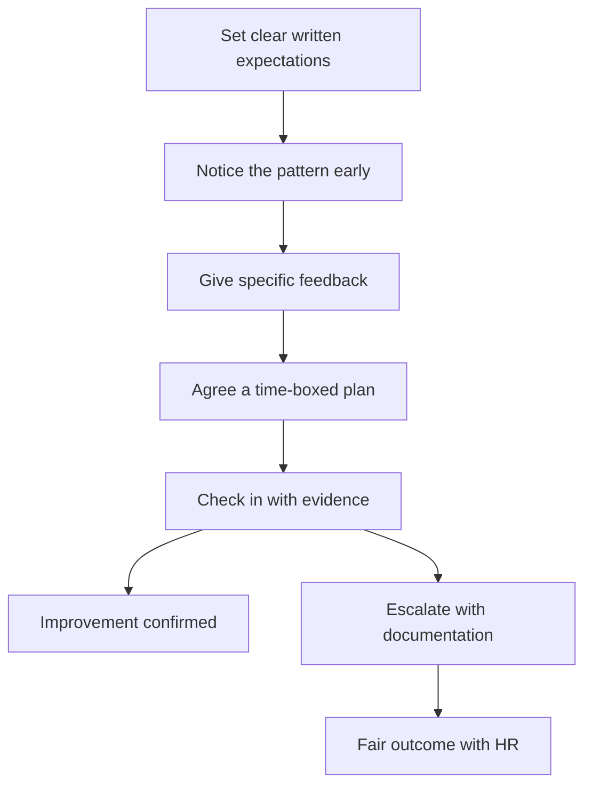

# Performance Management

> **Core skill:** Managing underperformance fairly and firmly — clear expectations, early and specific feedback, a time-boxed improvement plan, documentation, and consequences delivered without cruelty or delay.

## Why This Matters

Underperformance is a tax on everyone: the manager absorbs the work, teammates compensate and resent it, and the underperformer drifts in a fog of vague unease. The most common failure is delay — months of hoping, hints, and "let's see next quarter" while the problem compounds and the team quietly loses faith in the manager's fairness. Performance management done well is a rescue: most people, given a clear gap and a real plan, improve.

It is also the legal and ethical backbone of the manager's authority. Every termination that survives review was preceded by documented expectations, documented feedback, and a documented plan. Every termination that collapses in grievance was a surprise — and the manager who surprises people with their own performance has already failed.

## Setting Clear Expectations

Performance management starts before there is a problem. Expectations are written, specific, and agreed.

| Expectation | What it covers | How it is set |
|-------------|----------------|---------------|
| Role expectations | The behaviors and scope of the role | At onboarding and every level change |
| Level expectations | What the engineer's level demands | From the career ladder, in development conversations |
| Quarterly goals | The measurable outcomes for the period | At the start of each quarter, in writing |
| Standards of conduct | How work happens: communication, ownership, collaboration | In the charter and role definition |

Vague expectations produce vague feedback and defensible nothing. "You need to improve" is not an expectation; "review comments land within two days and incidents get a written postmortem" is.

## The Underperformance Arc

Underperformance is handled in stages, each with a clear entry and exit. Skipping stages is how managers end up terminating people who never knew they were failing.

| Stage | What happens | Duration | Exit |
|-------|--------------|----------|------|
| Signal | Repeated pattern noticed: missed dates, quality dips, behavior | Immediate | Logged and named |
| Specific feedback | The pattern named with examples, in a one-to-one | One conversation | The engineer knows the gap |
| Improvement plan | Written goals, support, and check-ins | 4-8 weeks | Improvement or escalation |
| Consequences | Formal review, role change, or exit | Per process, with HR | Fair, documented outcome |

The discipline: each stage is announced, each stage has evidence, and the manager never lets a stage stretch silently. The pattern is a staircase, not a cliff — the engineer always knows which step they are on.

## Designing the Improvement Plan

The improvement plan is a rescue instrument, not a punishment. Well-designed, it gives the engineer the best chance to turn around and the manager the documentation to act if they do not.

| Property | What it means | Example |
|----------|---------------|---------|
| Specific | Behaviors and outcomes, not vibes | "Ship the migration by the 15th with tests above 80 percent coverage" |
| Measurable | A way to verify each item | "Review queue empty by end of each week" |
| Time-boxed | A review date, not an open horizon | "Assessment at week six" |
| Supportive | Resources the manager commits | "Weekly check-ins; pairing with the tech lead on the migration" |

The plan is written, shared, and signed by both sides in spirit — the engineer agrees the goals are fair and the support is real. A plan the engineer does not believe in is a countdown, not a rescue.

## Documentation Discipline

| When | What to write | Why it matters |
|------|---------------|----------------|
| The pattern appears | Dated notes of each instance | The problem becomes provable |
| Feedback is given | What was said, what was agreed | No he-said-she-said later |
| The plan is set | The plan document itself | The bar is fixed and shared |
| Check-ins happen | Progress against each item | Improvement is visible or its absence is |
| The outcome lands | The final assessment | The decision has a paper trail |

```markdown
## Performance Note Template
- Date and context:
- Expectation not met (quote the expectation):
- What was observed (facts, examples):
- What was agreed (action, support, date):
- Next check-in:
```

The manager writes the note the same day, in the report's file. Documentation is not about the termination that might come; it is about the fairness that must be visible throughout.

## Fairness and Consistency Across Reports

| Threat to fairness | What it looks like | The fix |
|--------------------|--------------------|---------|
| The favorite | A star's misses are excused, another's are logged | Judge behavior, not history; log for everyone |
| The new manager | The bar changes when the manager changes | Written expectations survive manager changes |
| Team differences | Two teams, two bars, same level | Calibrate expectations with peer managers |
| The difficult conversation | Harder to confront, so it never happens | The gap is the problem, not the person |

The test: would this engineer's file stand up if every other report read it? If the manager would not want the team to see how one person was treated, the treatment is not fair yet.

## When Performance Management Fails

Sometimes the engineer improves and the role still does not fit. The manager distinguishes three failures and handles them differently.

| Failure | What it looks like | The move |
|---------|--------------------|----------|
| Wrong role | Skills and role mismatch; the engineer succeeds elsewhere | Explore internal moves before external exit |
| Wrong team | The engineer thrives in a different environment | Reassignment can rescue the person and the team |
| Genuine exit path | Improvement does not happen despite real support | End it with dignity, process, and severance fairness |

The manager's obligation is to have tried genuinely — plan, support, check-ins — so that the exit, when it comes, is a conclusion the engineer saw coming and the team respects.

## Performance vs Conduct

| Dimension | Performance | Conduct |
|-----------|-------------|---------|
| What it covers | Skills, output, quality, pace | Behavior: communication, respect, integrity, policy |
| How it is addressed | Coaching, plans, skill-building | Direct correction, consequences, possibly HR |
| Typical arc | Gradual, with a plan and time | Can be immediate; egregious conduct skips the plan |
| Documentation | Performance notes and plans | Incident records, warnings, HR involvement |

Conduct issues are not performance issues in disguise. A brilliant engineer who is toxic gets conduct management, not a performance plan — the team's safety outranks the output.

## The Performance Arc



## Practical Applications

- [ ] Expectations written and agreed for role, level, and quarter
- [ ] Feedback given at the second occurrence, never later
- [ ] Improvement plans specific, measurable, time-boxed, and supportive
- [ ] Notes written the same day for every significant conversation
- [ ] Peer calibration on the bar for each level
- [ ] HR consulted before any plan that could end in exit
- [ ] Wrong-role and wrong-team options explored before exit

## Common Pitfalls

| Pitfall | Why It Is a Problem | Better Approach |
|---------|---------------------|-----------------|
| **Waiting too long** | Problems compound and the eventual conversation is brutal | Act at the second occurrence, in writing |
| **Vague feedback** | The engineer cannot fix what was never named | Specific behaviors, examples, and expectations |
| **Unwritten plans** | The bar moves and the dispute follows | Write the plan; both sides agree the goals |
| **Personality-based assessment** | "I just don't think he fits" terminates nothing legally | Documented behavior against documented expectations |
| **The rescue fantasy** | Managers keep hoping while the team pays the tax | Time-box the plan; honor the date |
| **Surprise termination** | The engineer never saw it coming; the team sees the unfairness | The arc: feedback, plan, check-ins, then outcome |

## Success Indicators

- No performance surprises at formal reviews
- Underperformance is addressed within weeks of the pattern emerging
- Plans are written, specific, and time-boxed; most end in improvement
- Documentation exists for every stage and would survive scrutiny
- Exits, when they happen, are understood by the team and the person

## Related Topics

- [[02_Feedback_and_Difficult_Conversations]]: the feedback craft the arc depends on
- [[04_Career_Frameworks_and_Promotions]]: the sibling system for those who meet the bar
- [[02_Team_Formation_and_Health/00_overview|Team Formation and Health]]: underperformance is also a team-health signal
- [[05_Organizational_Awareness_and_Influence/00_overview|Organizational Awareness and Influence]]: HR process and legal context

## Summary

Performance management is underperformance handled in stages — expectations set in writing, patterns named early with specific feedback, a time-boxed and supportive improvement plan, relentless documentation, and fair consequences reached with HR. It is a rescue system first and a termination system only as a last, well-documented resort; its success is measured in people who improved, teams that stayed fair, and exits that surprised no one.
