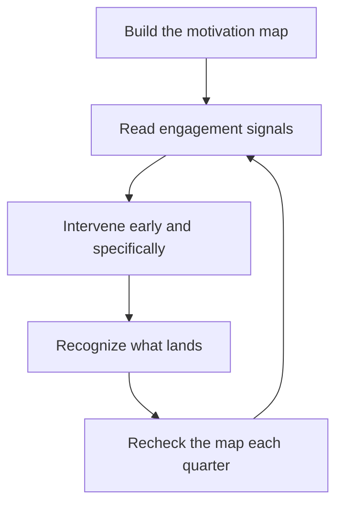

# Motivation and Engagement

> **Core skill:** Reading what drives each engineer — autonomy, mastery, purpose, belonging, security — and intervening early when engagement drops, including spotting burnout.

## Why This Matters

Motivation is the team's fuel. Engineers who are driven by the work itself deliver more, learn faster, and stay longer; engineers who are merely present consume management attention and quietly erode the team's energy. The manager cannot inject motivation — it is intrinsic or it is theater — but the manager can read it, protect it, and remove what kills it.

Engagement is also the earliest warning system for attrition. Disengagement precedes resignation by months, not days. The manager who reads the signals early can intervene; the manager who waits for the resignation letter has already lost. Reading engagement is not soft management — it is retention engineering with a lead time of a quarter.

## Intrinsic vs Extrinsic Motivation

| Dimension | Intrinsic | Extrinsic |
|-----------|-----------|-----------|
| Source | The work itself: interest, challenge, progress | Outside rewards: pay, title, status, perks |
| Durability | Sustains through difficulty | Fades when the reward stops or normalizes |
| Failure mode | Burnout when overdriven | Golden-handcuff retention; leave when the offer lands |
| Manager's lever | Design the work: autonomy, mastery, purpose | Mostly limited; compensation is hygiene |

Engineers are disproportionately intrinsic — they chose a craft. The manager's highest-leverage work is protecting intrinsic motivation: meaningful problems, visible progress, real autonomy. Extrinsic levers buy time but never engagement.

## Motivation Maps Per Report

Each engineer has a different mix of drives. The manager builds a motivation map per report — not a personality quiz, but an observed, updated picture of what fuels them.

| Drive | What it looks like | The manager's move |
|-------|--------------------|--------------------|
| Autonomy | Energized by owning decisions and direction | Delegate problems, not tasks; resist hovering |
| Mastery | Energized by skill growth and hard technical problems | Stretch assignments, learning time, hard problems |
| Purpose | Energized by visible user and business impact | Connect work to outcomes; tell the story of the impact |
| Belonging | Energized by team connection and being valued | Team rituals, inclusion in decisions, credit given |
| Security | Energized by stability and predictability | Clear expectations, honest signals, no surprises |

The map is built from one-to-ones, observed energy, and what the engineer chooses when given options — and it changes. The manager refreshes it quarterly and, crucially, acts on it. A map that is never used is a diary.

## Reading Engagement Signals

| Signal | Early | Late |
|--------|-------|------|
| Energy in one-to-ones | Shorter answers, fewer topics | Meetings cancelled, silence |
| Initiative | Stops proposing; waits for assignments | Pulls back from all voluntary work |
| Learning posture | Questions about new tech stop; skill growth pauses | Openly disengaged from learning |
| Complaint patterns | Specific, work-related gripes | General cynicism, "what's the point" |
| Team presence | Fewer contributions, later arrivals | Withdraws from team events and rituals |

The manager reads these at the level of trend, not moment — everyone has a bad week. What matters is direction: the engineer who proposed three ideas last quarter and none this quarter is signaling, whether or not they know it.

## Disengagement Interventions

| Stage | What it looks like | Intervention |
|-------|--------------------|--------------|
| Bored | Work is easy; growth stopped | New scope, hard problems, mentoring role |
| Frustrated | Fights the system; complaints are specific | Fix what is fixable; give them a real voice in it |
| Withdrawn | Quiet, compliant, absent energy | Direct conversation; find the driver before it is too late |
| Departed-in-place | Present but gone; already interviewing | Honest conversation; if retention is real, act fast |

The intervention order is always the same: name what you see, ask what changed, fix what you can, and be honest about what you cannot. The manager who guesses at the cause instead of asking usually guesses wrong.

## Recognition That Lands

| Property | What it means | Example |
|----------|---------------|---------|
| Specific | Names the actual behavior and its effect | "Your postmortem turned a firefight into a checklist" |
| Timely | Close to the event, not at review time | Same week, in the channel where it happened |
| Appropriate to person | Matches how they like to receive it | Public for some, private for others — the map again |
| Credible | Earned, not sprayed around | Recognition inflation makes praise worthless |

Recognition fails in two directions: never given, or given so freely it means nothing. The manager matches the form to the person — a private note lands harder for some than a company-wide shout-out — and keeps the substance specific.

## Compensation as Hygiene

Compensation does not motivate; its absence demotivates. Engineers rarely do their best work because of pay, and they frequently stop doing good work when pay is unfair. The manager's job: make sure compensation is competitive and internally fair, fix inequities fast when found, and never mistake a raise for engagement. The engineer who stays only for the money is already planning their exit; the money just sets the date.

## Burnout Spotting and Response

| Sign | What it looks like | Manager's response |
|------|--------------------|--------------------|
| Energy collapse | Chronic exhaustion; recovery time never arrives | Reduce load now; protect recovery; talk openly |
| Cynicism | Detachment from work and people; dark humor | Address the load and the meaning; reconnect purpose |
| Reduced efficacy | Output drops despite effort; self-doubt grows | Shrink scope to winnable wins; restore progress |
| Boundary collapse | Working nights; pride in exhaustion | Model and enforce boundaries; the manager goes first |

Burnout is a system failure before it is a personal one: sustained overload, low control, unfairness, or broken values. The manager treats the cause, not just the symptom — a week off without fixing the workload is a gift with a return date on the box.

## The Engagement Loop

## Practical Applications

- [ ] Keep a written motivation map per report, reviewed quarterly
- [ ] Track engagement signals as trends in one-to-one notes
- [ ] Intervene at the second signal, not the resignation
- [ ] Match recognition to the person: specific, timely, appropriate form
- [ ] Check compensation fairness at least annually; fix inequities fast
- [ ] Watch for burnout signs and treat the cause, not just the rest
- [ ] Discuss engagement explicitly in one-to-ones at least monthly

## Common Pitfalls

| Pitfall | Why It Is a Problem | Better Approach |
|---------|---------------------|-----------------|
| **One-size motivation** | Assuming everyone wants what the manager wants | Build and update a per-person map |
| **Money as the answer** | Raises buy time, not engagement | Fix compensation fairness; then work on the work |
| **Reading a bad week as a trend** | Overreacting to noise creates churn | Judge direction over quarters, not moments |
| **Waiting for the resignation** | The conversation at the exit is a postmortem | Name the disengagement while it can still be fixed |
| **Recognition inflation** | Praise everywhere means praise nowhere | Specific, credible, matched to the person |
| **Ignoring burnout** | The strongest engineers burn out hardest and quietest | Watch energy and boundaries; reduce load early |

## Success Indicators

- Each report can name what motivates them, and the manager's actions match it
- Engagement dips are caught and discussed within weeks
- Recognition is specific and lands; reports can recall recent examples
- Compensation is fair and any inequity is fixed fast
- Burnout is rare, and when it appears, load and causes change

## Related Topics

- [[01_One_to_Ones]]: where motivation maps are built and refreshed
- [[07_Managing_Experienced_Engineers]]: experienced engineers have the strongest motivation and the most options
- [[02_Team_Formation_and_Health/00_overview|Team Formation and Health]]: individual engagement feeds team health
- [[07_Manager_Communication/00_overview|Manager Communication]]: the conversations that surface disengagement

## Summary

Motivation and engagement are read, protected, and repaired: per-person motivation maps, trend-level reading of energy and initiative, early interventions, recognition matched to the person, compensation treated as hygiene rather than fuel, and burnout addressed at its causes. The manager's return on this work is retention with lead time — problems caught while they are still fixable and engineers who stay because the work and the manager are worth it.
