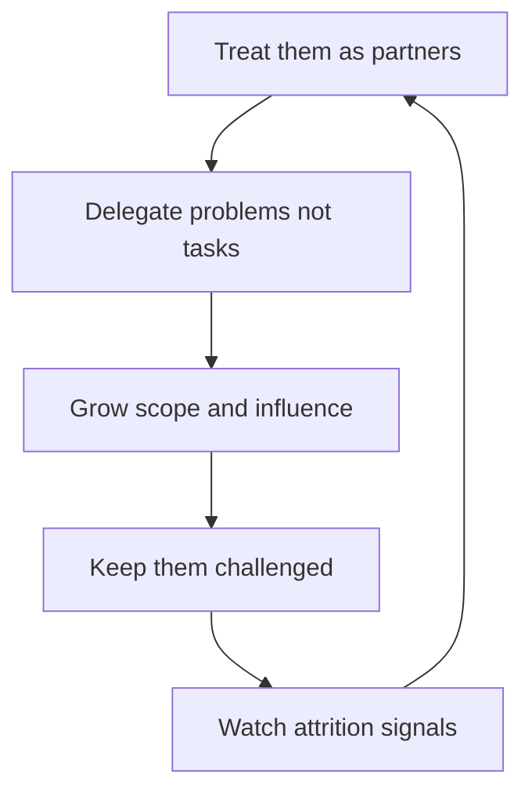

# Managing Experienced Engineers

> **Core skill:** Managing senior and staff engineers as partners — delegating problems rather than tasks, growing their scope and influence, renegotiating former-peer relationships, and watching their attrition risk.

## Why This Matters

Experienced engineers carry the team's technical depth, mentor its juniors, and absorb its hardest problems. They also need the least management — and resent the most of it. The manager who supervises a senior like a junior loses them twice: their judgment goes unused, and their loyalty goes elsewhere. The manager who partners with them multiplies the whole team's capability, because a senior who is trusted delegates down and grows the team from within.

The stakes are asymmetric. Seniors and staff have options, networks, and a quiet market; when they disengage, they leave quietly and the damage is discovered late — after the knowledge walked out. Managing experienced engineers well is not a nicety; it is the retention of the team's core capability.

## Partnership Not Supervision

| Supervision behavior | Partnership behavior |
|----------------------|----------------------|
| Assigning tasks with acceptance criteria | Discussing problems and agreeing the approach |
| Checking progress on a cadence | Checking in on direction and constraints |
| Reviewing their work for correctness | Challenging their thinking as a peer |
| Giving feedback top-down | Trading feedback both ways |
| Holding them to the process | Holding the process to their judgment |

The partner manager's stance: "you own this; I am here to resource, unblock, and argue with you when needed." The senior who must ask permission for every decision stops deciding — and the manager becomes the bottleneck they were hired to avoid.

## Delegating Problems, Not Tasks

| Wrong: tasks | Right: problems |
|--------------|-----------------|
| "Write the migration plan" | "The legacy store is costing us — fix it, however you decide" |
| "Present at the architecture forum" | "Own the platform direction; I need you represented there" |
| "Mentor the new hire" | "Bring the new hire to productivity; you choose how" |

Delegating problems hands over the decision space with the work: the what, the how, and often the who. The manager provides context, constraints, and a check-in point — then gets out of the way. The measure of success is not that it was done the manager's way, but that it was done well.

## Career Development for Seniors

| Growth axis | What it looks like | Manager's support |
|-------------|--------------------|-------------------|
| Scope growth | Bigger, vaguer, longer-horizon problems | Larger mandates, fewer guardrails, more consequence |
| Influence growth | Their judgment shaping people beyond the team | Cross-team forums, stakeholder surfaces, speaking roles |
| Staff-level tracks | Specialist depth or architect breadth | A named track with real criteria and evidence collection |

Senior development is not about skills — they have skills. It is about leverage: whose problems they own, whose decisions they shape, who they grow. The manager's quarterly question for each senior: "What did you influence this quarter that you did not touch directly?"

## Keeping Seniors Challenged

| Lever | What it provides |
|-------|------------------|
| Hard problems | The unsolved, risky, high-stakes work — not the backlog's leftovers |
| Mentoring roles | Growing others exercises their judgment and renews their purpose |
| Cross-team scope | New surfaces, new politics, new constraints — new learning |
| Technical ownership | The platform, the architecture, the standards — their name on it |
| Failure with review | Permission to attempt the risky thing with a safe landing |

Challenge is the senior's oxygen. The manager audits challenge annually per senior: what did they learn, what got harder, what did they own that they could not have owned last year? A senior with two flat years is a senior interviewing elsewhere.

## The Former Peer Transition

Promoting a peer changes both relationships. The manager who was their equal now evaluates them — and everyone on the team is watching how it is handled.

| Stage | What happens | The manager's move |
|-------|--------------|--------------------|
| Announcement | The relationship change is public | Name the change directly; set the new frame together |
| Renegotiation | Old patterns collide with new authority | One explicit conversation: what stays, what changes |
| First frictions | Old peer habits surface in review and direction | Address immediately, privately, with the new frame |
| New equilibrium | Partnership with clear boundaries | Keep the candor of the old relationship, add the clarity of the new |

The classic failure is the manager who keeps treating the promoted peer as a peer at work — avoiding direction and diluting feedback — out of loyalty to the old friendship. The friendship survives the boundary; it rarely survives the ambiguity.

## When a Senior Outgrows the Team

| Situation | Signal | Options |
|-----------|--------|---------|
| Outgrows the team's scope | Consistently operating at org level | Bigger team, staff track, org-level problems |
| Outgrows the role | Wants management, architecture, or a new domain | Path conversations; honest reframing |
| Outgrows the company | Ambition exceeds what this org can offer | Celebrate; keep the relationship; learn from the exit |

The manager's duty is honesty: when the ceiling is real, say so and help them find the next thing — internally first. A senior forced to stay under a ceiling becomes a resentful senior, which is worse than a well-managed departure.

## Senior Attrition Risk

Seniors leave quietly and they leave for reasons the manager usually hears only in the exit interview.

| Signal | What it means | Manager's move |
|--------|---------------|----------------|
| Fewer arguments | They stopped fighting for their position | Re-engage the debate; their silence is a vote |
| Reduced initiative | Ideas stop; work becomes execution | Restore autonomy and stakes |
| Network activity | Recruiters and referrals surface | Ask directly; act on the honest answer |
| Comparison talk | "Other teams do X" becomes frequent | Listen for the gap they are describing |
| Quiet professionalism | Everything fine, nothing engaged | The exit is already planned; have the real conversation |

The retention playbook for seniors: hard problems, real influence, honest career talk, and market-competitive treatment — in that order. The manager checks in on each senior's engagement quarterly, with the direct question asked without drama: "What would make you leave, and what would make you stay?"

## The Partnership Loop

## Practical Applications

- [ ] Delegate problems with constraints, not tasks with checklists
- [ ] Hold the quarterly influence question: what did they change without touching it?
- [ ] Audit challenge annually; two flat years is an intervention trigger
- [ ] Renegotiate former-peer relationships explicitly, early, and in writing if needed
- [ ] Have the direct stay-and-leave conversation with each senior quarterly
- [ ] Explore internal growth paths before accepting external exits
- [ ] Keep compensation competitive; seniors know their market

## Common Pitfalls

| Pitfall | Why It Is a Problem | Better Approach |
|---------|---------------------|-----------------|
| **Supervising seniors** | Judgment atrophies; resentment builds; they leave quietly | Delegate problems; check direction, not progress |
| **Task-shaped delegation** | The senior becomes a very expensive executor | Hand over the decision space with the work |
| **Flat years** | A senior with nothing hard to solve is a flight risk | Annual challenge audit; keep raising the stakes |
| **Former-peer nostalgia** | The old friendship blocks new authority | Renegotiate the frame explicitly and early |
| **Holding the ceiling** | Forcing ambition inside the team's limits | Be honest about ceilings; help them find the next thing |
| **Reading quiet as fine** | Seniors leave silently; the damage arrives after | Ask the stay-and-leave question on a cadence |

## Success Indicators

- Seniors own problems end to end and the manager rarely rescues
- Each senior's scope and influence grows year over year
- Former peers maintain both candor and clear boundaries
- Regretted senior attrition is rare; exits are discussed before they are decided
- The team grows because seniors delegate down and develop others

## Related Topics

- [[06_Motivation_and_Engagement]]: the engagement map for the people with the most options
- [[01_One_to_Ones]]: partnership is built in the weekly conversation
- [[03_Coaching_for_Growth]]: coaching is the primary mode with experienced engineers
- [[career-path/05_Tech_Lead/01_The_Tech_Lead_Role_and_Operating_Model/02_The_Tech_Lead_Engineering_Manager_Partnership|TL-EM Partnership (Tech Lead)]]: the most important senior partnership
- [[career-path/02_Senior_Software_Engineer/07_Mentoring_and_Team_Leadership/07_Leading_Without_Authority|Leading Without Authority (Senior)]]: the influence craft seniors practice

## Summary

Managing experienced engineers is partnership: delegating problems rather than tasks, growing scope and influence instead of skills, keeping them challenged with hard problems and cross-team surfaces, and renegotiating former-peer relationships with explicit frames. The manager watches attrition signals on a cadence — the direct stay-and-leave question asked quarterly — and treats the senior as the team's core capability to protect, not another report to supervise.
