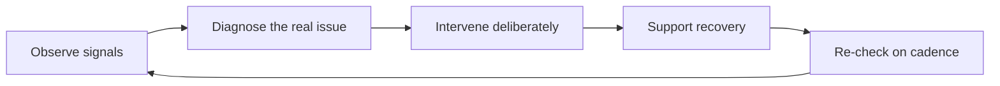

# Team Formation and Health

> **Core capability:** The engineering manager builds teams that trust each other, communicate openly, and sustain delivery — and reads and repairs team health when it degrades.

## Why This Matters

A manager inherits or assembles a group of people and turns it into a team. The difference is trust, clarity, and safety: people who can disagree openly, admit mistakes, depend on each other, and raise problems early. Teams without that operate on politics and concealment — expensive to run, brittle under pressure.

Team health is not vibes; it is observable. Engagement, conflict quality, decision speed, attrition, and energy after failures are all readable if the manager pays attention on a cadence. The EM owns that reading and the repairs.

## Topics in This Capability Area

| Topic | Core Skill | When It Matters |
|-------|------------|-----------------|
| [[01_Team_Lifecycle_and_Formation]] | Guiding teams through forming, storming, norming, performing | New teams, re-orgs, membership churn |
| [[02_Psychological_Safety_in_Practice]] | Building and protecting safety to speak up | Always; incident-heavy periods; new members |
| [[03_Conflict_Resolution]] | Surfacing and resolving conflict productively | Disagreements, feuds, passive resistance |
| [[04_Team_Charter_and_Working_Agreements]] | Making expectations explicit and shared | Team formation; when norms drift |
| [[05_Team_Health_Metrics_and_Surveys]] | Measuring health honestly and acting on it | Quarterly pulses; after disruptions |
| [[06_Managing_Remote_and_Hybrid_Teams]] | Creating cohesion across distance and time zones | Distributed teams; hybrid transitions |
| [[07_Team_Transitions_and_Exits]] | Managing departures and change without trauma | Resignations, re-orgs, role changes |

## The Team Health Loop

## What Changes from Tech Lead to Engineering Manager

| Activity | Tech Lead | Engineering Manager |
|----------|-----------|---------------------|
| Safety | Models it in technical discussion | Owns it as team policy and consequence |
| Conflict | Moderates technical disagreement | Resolves interpersonal and cross-person conflict |
| Charters | Contributes technical working agreements | Owns the charter and its renewal |
| Health | Senses team energy | Measures it, reports it, acts on it |
| Exits | Offboards the work | Manages the human transition |

## Practical Applications

### Team Health Checklist

- [ ] The team has a charter covering how it works, decides, and disagrees
- [ ] New members are deliberately integrated, not dropped in
- [ ] A health pulse or survey runs quarterly, and results are discussed openly
- [ ] Conflict is addressed within days, directly, and at the right level
- [ ] Meetings, rituals, and docs work for remote members, not just the room
- [ ] Departures are handled with a plan: knowledge, communication, morale

## Common Pitfalls

| Pitfall | Why It Is a Problem | Better Approach |
|---------|---------------------|-----------------|
| **Harmony as health** | Absence of conflict often means suppression | Expect productive conflict; watch for silence |
| **Survey theater** | Asking without acting kills trust faster than not asking | Share results; commit to visible actions |
| **Fixing by re-org** | Re-orgs treat symptoms and reset trust | Diagnose first; re-org only for structural causes |
| **Health as HR's job** | The EM is the first line; HR is escalation | Own the signals and the repairs |

## Success Indicators

- Disagreement happens in the room, not in corridors afterwards
- Bad news travels fast — to the manager, not around them
- New members become effective within a quarter
- Health metrics trend up or stay strong across disruptions
- Exits leave the team stable and the relationship intact

## Related Capabilities

- [[01_People_Development/00_overview|People Development]]: healthy teams are built from developing people
- [[04_Delivery_Leadership_for_Managers/00_overview|Delivery Leadership for Managers]]: health without delivery is fragility; they reinforce each other
- [[career-path/02_Senior_Software_Engineer/07_Mentoring_and_Team_Leadership/06_Psychological_Safety|Psychological Safety (Senior)]]: the concepts this area operationalizes

## Summary

Team formation and health is the manager's environmental work: guiding the lifecycle, building psychological safety, resolving conflict early, making norms explicit in a charter, measuring health honestly, and managing transitions humanely. A healthy team makes every other part of the manager's job easier; an unhealthy one makes all of them harder.
