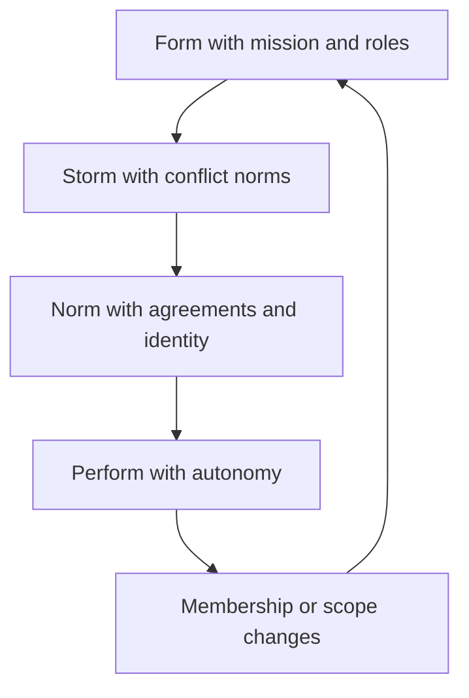

# Team Lifecycle and Formation

> **Core skill:** Guiding teams through forming, storming, norming, and performing — and knowing what to do when membership, scope, or structure changes and the cycle restarts.

## Why This Matters

A group of people becomes a team through a predictable arc — and every manager who ignores the arc pays for it. New teams that skip the messy middle look calm for a month and then explode in week six, when unspoken disagreements surface as conflict. Re-orged teams expect to perform immediately and quietly mourn the old team instead. The manager who knows the stages can name them, normalize them, and build the structures that move the team through them faster.

The lifecycle is also the calendar of the manager's attention: what to do, what to expect, and what to fix changes completely between stage one and stage four. Managing a forming team with performing-team habits creates chaos; managing a performing team with forming-team hand-holding creates resentment. Stage awareness is the difference between reacting to the team and leading it.

## The Tuckman Stages in Practice

| Stage | What it looks like | What the team needs | The manager's job |
|-------|--------------------|--------------------|--------------------|
| Forming | Polite, uncertain, watching the manager | Clarity: mission, roles, first wins | Define the frame, set the charter, create early wins |
| Storming | Disagreement, friction, subgroups | Norms and conflict channels | Normalize the friction; enforce respectful disagreement |
| Norming | Agreements stick; identity forms | Consistency and feedback | Protect the norms; coach the team to self-correct |
| Performing | Independent, self-organizing, high trust | Autonomy and challenge | Get out of the way; watch for drift |

The stages are not a one-way street — teams slide backward on stress, membership changes, and re-orgs. The manager's skill is recognizing the current stage honestly instead of insisting on the stage in the org chart.

## What the Manager Does at Each Stage

| Stage | Decisions to make | Rituals to establish | Signals to watch |
|-------|-------------------|----------------------|------------------|
| Forming | Mission, scope, roles | Kickoff, chartering, regular syncs | Who is silent, who is uncertain |
| Storming | Conflict norms, decision rights | Disagreement channels, direct conversations | Factions, personal attacks, avoidance |
| Norming | Accountability, quality bars | Retros, working agreements, review cadence | Who owns what, who feels heard |
| Performing | Delegation, external focus | Lightweight ceremonies, autonomy | Complacency, drift, burnout |

In forming, the manager is the frame. In storming, the manager is the referee. In norming, the manager is the coach. In performing, the manager is the shield — and mostly absent from the team's internal life.

## New Team Formation Checklist

```markdown
## New Team Formation Checklist
- [ ] Mission written in one sentence and agreed by the team
- [ ] Roles named: owner, contributor, reviewer for every workstream
- [ ] Decision rights explicit: what the team decides, what the manager decides
- [ ] Working agreements drafted together: meetings, reviews, communication
- [ ] First three wins identified, small enough to land quickly
- [ ] Kickoff held: why this team, why now, what success looks like
- [ ] One-to-ones started in week one, before problems exist
- [ ] A milestone in the first month that forces collaboration
```

The checklist's purpose is speed through forming: teams that know why they exist and who does what storm faster and perform sooner.

## Membership Change Restarts the Cycle

| Change | What resets | The manager's move |
|--------|-------------|--------------------|
| Someone joins | Trust distribution, roles, norms | Planned onboarding; pair the new member; re-explain norms |
| Someone leaves | Knowledge, identity, workload | Knowledge capture; rebalance openly; acknowledge the loss |
| Scope changes | Mission, priorities, dependencies | Re-charter the changed part; reset expectations |
| Re-org | Everything | Treat as a new forming stage with the old team's memory |

The mistake is assuming the team that was performing stays performing after a change. One new member is a new team — the norms were never written down in a way the newcomer can inherit, so they must be re-made together. The manager names the restart openly: "we are forming again; here is what that means."

## Team Maturity Signals

| Signal | Immature team | Mature team |
|--------|---------------|-------------|
| Disagreement | Avoided, or personal | Direct, technical, frequent |
| Mistakes | Hidden or blamed | Surfaced fast, learned from |
| Dependencies | Manager routes everything | Team coordinates directly |
| New members | Outsiders | Absorbed with support and patience |
| Meetings | Manager-led, one voice | Facilitated, many voices |

Maturity is observable in who talks, who fixes, and who decides when the manager is not in the room. The manager tests maturity by being absent: a mature team runs its ceremonies and resolves its own disagreements without the manager's presence.

## Re-Forming After Re-Orgs

Re-orgs are the hardest restart because the team carries the memory of what died. The manager handles the transition honestly: what ended, what is kept, what is new. The old team's grief is real — for people, rituals, and identity — and naming it beats ignoring it. Then the forming work begins deliberately: a fresh charter, a kickoff that acknowledges the past and commits to the future, and early wins that build the new team's own stories. Re-orgs fail when management assumes the new team will simply be productive; they succeed when the new team is given a formation period and permission to be new.

## The Lifecycle Loop



## Practical Applications

- [ ] Name the current stage with the team; it reduces anxiety and accelerates progress
- [ ] Run the formation checklist for every new team, including post-re-org
- [ ] Expect and normalize storming; referee it into technical conflict
- [ ] Protect norms during norming; let the team enforce them
- [ ] Treat every membership change as a restart with a deliberate re-forming
- [ ] Test maturity by being absent and watching what happens

## Common Pitfalls

| Pitfall | Why It Is a Problem | Better Approach |
|---------|---------------------|-----------------|
| **Skipping storming** | Unspoken disagreements erupt later, bigger | Create disagreement channels early; normalize the mess |
| **Performing expectations on day one** | New teams judged by old standards | Give formation a period and celebrate forming wins |
| **Ignoring membership changes** | One new member quietly resets the whole team | Re-form deliberately; re-explain norms together |
| **Manager as permanent router** | The team never learns to coordinate | Delegate; be absent; let them route |
| **Re-org denial** | The old team's grief blocks the new team's forming | Acknowledge what died; then charter what is new |
| **Stuck in storming** | Friction becomes identity; conflict becomes sport | Enforce norms, escalate the personal, protect the technical |

## Success Indicators

- The team can name its own stage and its current friction
- Storming resolves into technical disagreement, not personal conflict
- New members become effective within a quarter
- Ceremonies and decisions survive the manager's absence
- Membership changes are absorbed without delivery collapse

## Related Topics

- [[02_Psychological_Safety_in_Practice]]: the safety work that makes storming productive
- [[04_Team_Charter_and_Working_Agreements]]: the charter accelerates every stage
- [[07_Team_Transitions_and_Exits]]: departures are lifecycle events
- [[01_People_Development/00_overview|People Development]]: the people work that runs alongside the lifecycle

## Summary

The team lifecycle is a predictable arc — forming, storming, norming, performing — that the manager leads with stage-appropriate moves: frame, referee, coach, shield. Every membership change restarts the cycle, and re-orgs demand an honest acknowledgment of what died before the new team can form. Managers who name the stage, build the right structures, and test maturity by stepping back turn the messy middle into the team's strongest asset.
