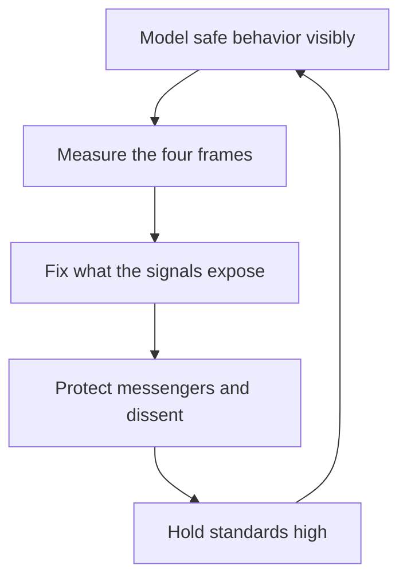

# Psychological Safety in Practice

> **Core skill:** Building and protecting a team where people can fail, question, object, and dissent without fear — while keeping standards high.

## Why This Matters

Psychological safety is the measurable property that decides what a team does with its mistakes. On safe teams, failures become postmortems and questions become learning; on unsafe teams, failures become cover-ups and questions stop being asked. The difference compounds: safe teams catch problems early, when they are cheap, and unsafe teams discover them in production, when they are expensive.

Safety is not softness. Edmondson's research is explicit: the highest-performing teams combine psychological safety with high standards. The manager who trades safety for accountability gets silence; the manager who trades standards for safety gets a comfortable team that ships nothing. The craft is holding both — a team that can say anything and is expected to deliver everything.

## Safety as a Measurable Team Property

| Property | Unsafe team | Safe team |
|----------|-------------|-----------|
| Failure | Hidden, blamed, repeated | Surfaced, analyzed, learned from |
| Questions | Asked privately, if at all | Asked openly, including "dumb" ones |
| Concerns | Raised only when it is too late | Raised early by whoever sees them |
| Dissent | Conformity in the room, resistance outside | Genuine disagreement in the room |

Safety is not how the team feels about the manager; it is what the team does with information. The observable test: does bad news travel to the decision-maker, and does it travel fast?

## Four Frames in Practice

| Frame | What safety looks like | Manager's behavior |
|-------|------------------------|--------------------|
| Responding to failure | Blameless postmortems; the system is the suspect | Ask "what broke the process", never "who broke it" |
| Asking questions | No dumb questions; learning is rewarded | Ask the naive question yourself, first and often |
| Raising concerns | Messengers are protected, not shot | Thank the reporter; act; report back what changed |
| Divergent thinking | Dissent is welcome and weighed | Invite the counter-position; decide openly |

Each frame has a signature failure: postmortems that name the person, question-asking monopolized by the confident, messengers who get punished for the message, and dissent that dies in the last meeting before the decision. The manager audits all four on a cadence.

## Manager Behaviors That Build or Destroy Safety

| Builds safety | Destroys safety |
|---------------|-----------------|
| Admitting your own mistakes first | Never being wrong, or never saying so |
| Asking for input before deciding | Asking for input after deciding |
| Responding to bad news with curiosity | Responding to bad news with blame |
| Following through on raised concerns | Listening, then changing nothing |
| Giving credit for surfacing problems | Crediting only the fixers, never the reporters |
| Interrupting blame with process questions | Joining the blame hunt |

The manager's own behavior is the largest single input to team safety. One public dressing-down undoes a quarter of safe behavior — the team learns instantly and permanently where the line is. The manager who wants safety must be visibly, repeatedly, safely wrong.

## Safety and Accountability: The Learning Zone

Safety and standards combine into four zones, and only one of them produces learning.

| Zone | Standards | Safety | Result |
|------|-----------|--------|--------|
| Comfort zone | Low | High | Nice people, no growth, no delivery |
| Anxiety zone | High | Low | Fear, silence, blame, turnover |
| Apathy zone | Low | Low | Everyone checked out |
| Learning zone | High | High | Experimentation, honesty, high performance |

The manager's job is to keep the team in the learning zone: raise standards without sacrificing safety, and raise safety without lowering standards. The signals of zone drift are concrete — silence after failures (anxiety), satisfied stagnation (comfort), and everything-is-fine-with-no-results (apathy).

## Measuring Safety

| Measure | What it captures | How to use it |
|---------|------------------|---------------|
| Surveys | Reported willingness to speak up | Pulse quarterly; read trends, not absolutes |
| Incident behavior | What happens after failures | Count blameless postmortems vs blame hunts |
| Meeting speech patterns | Who speaks, who is interrupted | Observe: airtime distribution, interruptions, silence |
| Messengers | What happens to bad-news bearers | Track whether the reporter survives and returns |
| Dissent | Whether counter-positions reach decisions | Ask the quiet ones directly, in private |

Measurement is only honest if it leads somewhere. The manager shares what was learned and what will change — the survey that disappears into a drawer teaches the team that honesty is a waste.

## The Safety Loop

## Practical Applications

- [ ] Admit a mistake of your own at least monthly, in front of the team
- [ ] Ask for input before deciding; say what changed after listening
- [ ] Run postmortems with the process as the suspect, every time
- [ ] Thank reporters publicly and report back what their report changed
- [ ] Watch meeting airtime: who speaks, who is interrupted, who is silent
- [ ] Pulse safety quarterly and act visibly on the results
- [ ] Keep standards high while raising safety — the learning zone is both

## Common Pitfalls

| Pitfall | Why It Is a Problem | Better Approach |
|---------|---------------------|-----------------|
| **Safety as softness** | Comfort becomes an excuse for low standards | Hold the bar; safety is about speech, not performance |
| **Blameless theater** | Postmortems that blame in nicer words | The process is the suspect, in every review |
| **One public punishment** | One dressing-down teaches permanent silence | Handle failures privately, learn from them publicly |
| **Listening without acting** | Concerns that change nothing stop coming | Close the loop: what changed and why |
| **Safety theater** | "We value speaking up" with no behavior behind it | Measure the frames; let behavior, not slogans, prove it |
| **Confusing silence with safety** | Quiet teams are often scared teams | Watch the meeting; ask the quiet ones directly |

## Success Indicators

- Mistakes surface fast and are analyzed, not punished
- Questions flow upward without fear, including naive ones
- Messengers are thanked and survive; concerns change decisions
- Dissent reaches decisions before they are final
- The team holds high standards while speaking freely

## Related Topics

- [[03_Conflict_Resolution]]: safety makes conflict productive instead of personal
- [[01_Team_Lifecycle_and_Formation]]: safety is built deliberately during forming
- [[05_Team_Health_Metrics_and_Surveys]]: safety is the most important health metric
- [[career-path/02_Senior_Software_Engineer/07_Mentoring_and_Team_Leadership/06_Psychological_Safety|Psychological Safety (Senior)]]: the same craft at engineer level

## Summary

Psychological safety is the measurable team property that decides what happens to failure, questions, concerns, and dissent — and it lives in the learning zone, paired with high standards. The manager builds it by modeling safe behavior, measuring the four frames, fixing what the signals expose, and protecting messengers; the payoff is a team that catches problems early, learns publicly, and argues productively.
