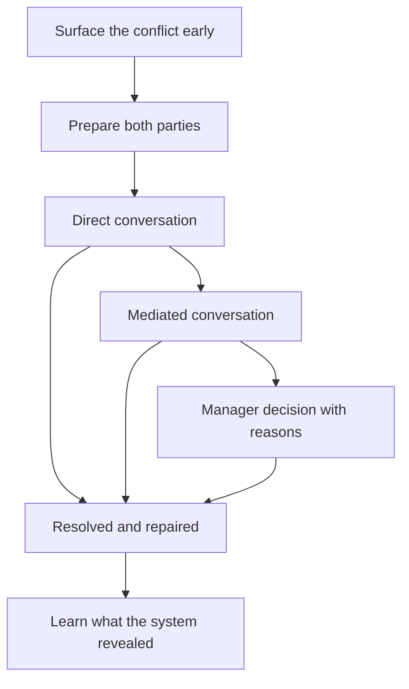

# Conflict Resolution

> **Core skill:** Surfacing conflict early and resolving it at the right level — direct conversation first, mediation second, manager decision last — and reading what conflict reveals about the system.

## Why This Matters

Conflict is not the enemy of a healthy team; suppression is. Teams that disagree openly make better decisions — the alternatives were actually weighed — while teams that paper over disagreement make decisions in the corridor, after the meeting, where the loudest voice wins and the losers hold grudges. The manager's job is not to make conflict disappear; it is to keep conflict technical, early, and resolvable.

Left alone, conflict metastasizes: a technical disagreement becomes a personal grudge, a grudge becomes passive aggression, and the team's energy drains into politics. Unresolved conflict is also expensive — in rework, in attrition, and in the manager's own time spent on drama instead of direction. Early, structured resolution is one of the cheapest investments a manager makes.

## Task Conflict vs Relationship Conflict

| Dimension | Task conflict | Relationship conflict |
|-----------|---------------|----------------------|
| What it is | Disagreement about the work | Disagreement about the person |
| Example | "This API design is wrong" | "He always steamrolls me" |
| Value | Improves decisions when managed | Destroys trust and focus |
| Manager's move | Channel into evidence and process | Intervene directly; never let it fester |

Task conflict is the team's decision-making engine. The discipline is keeping it there: the moment an argument moves from "the design" to "the designer", the manager steps in and returns it to the work. Relationship conflict is never solved by more debate — it is solved by intervention.

## Healthy Technical Conflict Norms

| Norm | What it looks like |
|------|--------------------|
| Ideas, not people | Arguments attack the proposal, never the proposer |
| Evidence, not volume | Data and experiments outrank decibels and seniority |
| Decided by decision rights | After debate, the owner decides — and everyone supports it |
| Fought in the room | Disagreement happens where the decision happens |
| Reversible by review | Today's loser can reopen with new evidence |

These norms are set before the conflict happens — in the charter and in the manager's own behavior at design reviews and retros. A team that already has disagreement norms storms faster and decides better.

## The Resolution Ladder

| Rung | What happens | Manager's role |
|------|--------------|----------------|
| Direct conversation | The two parties talk it through themselves | Coach preparation; stay out unless asked |
| Mediated conversation | The manager sits in, structures, and steers | Facilitate; do not adjudicate; both sides speak |
| Manager decision | The dispute blocks work or people | Decide with reasons; be the tiebreaker, not the judge of character |
| Escalation | HR, conflict of interest, or misconduct | Hand off with documentation and fairness |

The ladder is climbed from the bottom, deliberately. Most conflicts resolve at rung one if the parties are prepared — the manager's preparation is often the whole intervention.

## Preparing the Parties for Resolution

```markdown
## Preparation for a Resolution Conversation
- [ ] Each side states their position in one sentence
- [ ] Each side names the behavior they saw, not the motive they guessed
- [ ] Each side states what outcome would satisfy them
- [ ] Agree what facts are shared and what evidence is missing
- [ ] Agree the decision process if agreement fails
- [ ] Each side commits to speaking in the room, not after it
```

The manager's preparation converts a grudge match into a problem-solving session: from "he is malicious" to "when X happens, I experience Y, and I need Z". People who prepare on behavior and outcomes resolve faster than people who prepare on grievances.

## Structural vs Personal Conflict

| Type | What it really is | The fix |
|------|-------------------|---------|
| Structural | Competing for shared resources: time, scope, credit | Change the structure: ownership, sequencing, incentives |
| Personal | Clashing styles, values, or history | Interpersonal work: mediation, boundaries, coaching |
| Mixed | Real resource pressure plus bad blood | Fix the structure first, then the relationship |

The manager's first diagnosis is always structural: is this conflict a dispute between two people, or two people standing where the system puts pressure? Many "personality clashes" are two reasonable people with overlapping ownership and zero decision rights. Fix the structure and the feud often evaporates.

## Grudges and Passive Aggression

| Signal | What it looks like | Manager's move |
|--------|--------------------|----------------|
| Passive resistance | Silent non-cooperation, missed handoffs | Name it directly, with examples |
| Corridor campaigns | Decisions criticized after the meeting | Bring the dissent into the room |
| Grudge behavior | Old grievances resurfacing in new disputes | Separate current issues from history; resolve the history |
| Excluded members | Someone systematically left out | Intervene; the team's inclusion is not optional |

Passive aggression is conflict that lost its courage — it is the residue of a dispute that was never allowed to happen openly. The manager treats the underlying dispute, not the symptom: give the conflict a safe room and the passive behavior loses its purpose.

## Post-Conflict Team Repair

| Step | What it looks like |
|------|--------------------|
| Closure | The outcome is stated clearly: what was decided, why |
| Reconnect | The parties work together on something small and winnable |
| Debrief | The manager reviews what worked; the team learns the pattern |
| Watch | The manager checks the relationship's temperature for weeks |

Repair is not pretending nothing happened; it is demonstrating that the team survived the conflict and is stronger for the decision. The team learns from every resolved conflict how to resolve the next one faster.

## Conflict as Information

Conflict tells the manager where the system is broken. A dispute about ownership reveals ambiguous boundaries; a dispute about priorities reveals missing strategy; a dispute about credit reveals broken incentives. The manager asks, after every significant conflict: what does this dispute reveal about how we are structured, decided, or rewarded? The conflict that keeps recurring in different faces is never a people problem — it is a system problem wearing people.

## The Resolution Ladder



## Practical Applications

- [ ] Keep task conflict in the room with evidence norms
- [ ] Intervene the moment conflict turns personal
- [ ] Climb the ladder from the bottom: direct, mediated, decided
- [ ] Prepare both parties before any mediated conversation
- [ ] Diagnose structural causes before personal ones
- [ ] Repair relationships after resolution with a debrief and a reconnection
- [ ] Ask what each recurring conflict reveals about the system

## Common Pitfalls

| Pitfall | Why It Is a Problem | Better Approach |
|---------|---------------------|-----------------|
| **Avoiding conflict** | It metastasizes into grudges and politics | Surface early, while it is still small |
| **Adjudicating too fast** | The manager decides before the parties own the resolution | Let direct conversation work first; decide last |
| **Treating all conflict as personal** | Structural causes stay broken and recur | Diagnose the system before the people |
| **Letting task conflict turn personal** | The team loses its decision engine | Return arguments to the work, every time |
| **Ignoring passive aggression** | The real dispute stays hidden | Give the hidden conflict a safe room |
| **No post-conflict repair** | Winning the argument costs the relationship | Debrief, reconnect, and watch afterwards |

## Success Indicators

- Disagreement happens in the room, on evidence, without personal attacks
- Conflicts resolve at the lowest rung that can work
- Recurring conflicts reveal structural fixes that get made
- Grudges and corridor campaigns are rare and short-lived
- The team's decision quality visibly improves from real debate

## Related Topics

- [[02_Psychological_Safety_in_Practice]]: safety is the precondition for productive conflict
- [[04_Team_Charter_and_Working_Agreements]]: disagreement norms live in the charter
- [[05_Team_Health_Metrics_and_Surveys]]: conflict quality is a health signal to measure
- [[07_Manager_Communication/00_overview|Manager Communication]]: the conversations that resolve disputes

## Summary

Conflict resolution is surfacing disputes early and resolving them at the right rung — direct conversation, then mediation, then manager decision — while keeping task conflict productive and personal conflict impossible. The manager prepares both parties, diagnoses structural causes before personal ones, repairs relationships after resolution, and reads every recurring conflict for what it reveals about the system. A team that argues well decides well.
