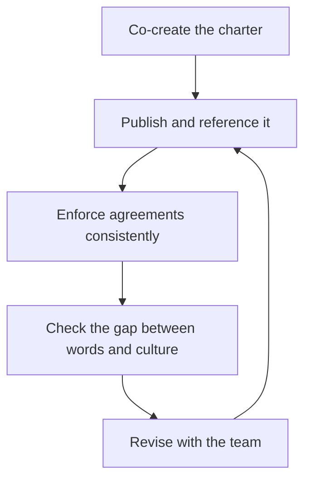

# Team Charter and Working Agreements

> **Core skill:** Co-creating explicit, written agreements about how the team works, decides, and communicates — and keeping them alive as living documents instead of posters on the wall.

## Why This Matters

Every team has norms; the question is whether they are chosen or accidental. Unwritten norms are whatever the loudest or earliest members established — review queues answered only by the senior, meetings that run long for the people in the room, decisions made by whoever repeated themselves most. The charter is the team's chance to choose its norms deliberately, while the team is still forming and the norms are still cheap to set.

A charter is also the manager's fairness instrument. When a working agreement is written, enforcing it is consistency; when it is unwritten, enforcing it is favoritism. Teams with charters argue about the work; teams without them argue about each other. The document does not resolve every dispute — but it gives every dispute a shared reference point.

## Charter Components

| Component | What it covers | Typical decisions |
|-----------|----------------|-------------------|
| Mission | Why the team exists and what success means | One-sentence mission; what is out of scope |
| Roles | Who does what, who owns what | Owners and contributors per workstream |
| Decision rights | Who decides what, and how | Team-decided vs manager-decided; escalation path |
| Communication norms | How the team talks, sync and async | Channels, response expectations, meeting culture |
| Meeting map | Which meetings exist, for whom, how often | Standup, planning, retro, reviews — with purpose |
| Collaboration norms | How work flows between people | Code review SLAs, on-call, pairing, focus time |

The charter's power is not the document; it is the conversation. Teams that argue through these six components once own their norms in a way no imposed process can match.

## Co-Creating the Charter

The charter is made with the team, never for them. An imposed charter is a policy; a co-created one is a commitment.

```markdown
## Chartering Workshop Agenda
- [ ] Draft the mission together; argue about the words until they fit
- [ ] List the team's recurring decisions; assign decision rights to each
- [ ] Agree communication norms: where, how fast, how long
- [ ] Map the meeting calendar against purposes; kill the purposeless
- [ ] Agree collaboration norms: review SLAs, on-call, focus time
- [ ] Decide how the charter will be revisited and by whom
- [ ] Publish it in the team's home and reference it in meetings
```

The manager contributes the frame and the constraints — what the org requires — and the team fills in the rest. The first charter is drafted in one workshop and revised forever after.

## Revisiting the Charter

| Trigger | What it addresses |
|---------|-------------------|
| New member joins | The newcomer cannot inherit unwritten norms; re-explain and re-confirm |
| Recurring violation | A norm that keeps breaking is a norm that does not fit |
| Stage change | Storming needs different agreements than performing |
| Re-org or scope change | Mission and decision rights likely changed |
| Quarterly review | Routine maintenance; the charter is a living document |

The charter dies the day it becomes sacred. Teams that revisit it quarterly treat it as their own; teams that never touch it again treat it as management decoration. The manager schedules the revisit and models the revision — including changing their own agreements.

## Working Agreements in Practice

| Agreement | Example | What happens when it breaks |
|-----------|---------|-----------------------------|
| Code review SLA | "Reviews land within one working day" | The queue is visible; the laggard is named, not guessed |
| On-call norms | "Incidents page the on-call, not the author" | Roles and rotation are unambiguous |
| Focus time | "Tuesday and Thursday mornings are meeting-free" | Calendar blocks are respected by the whole org |
| Meeting discipline | "No meeting without an agenda and a decision owner" | Meetings shrink; the map stays honest |

Agreements in practice have three properties: they are specific enough to verify, visible enough to notice breaking, and owned enough that the team — not just the manager — enforces them.

## Charter vs Culture

| Dimension | Written charter | Lived culture |
|-----------|-----------------|---------------|
| What it is | The agreed words | What actually happens |
| How it changes | By revision, deliberately | By behavior, daily |
| Gap signal | Words and behavior diverge | "We agreed no meetings, yet here we are" |
| Manager's job | Keep the words current | Model the words; correct the drift |

The gap between charter and culture is where trust dies. The manager's credibility lives in the delta: every time a written norm is broken without consequence, the charter loses a little of its meaning. The manager is the first enforcer — of the team's own agreements, including the ones that inconvenience them.

## Keeping It Alive

| Ritual | Cadence | Purpose |
|--------|---------|---------|
| Retro check | Every retro | Ask: which agreement broke this sprint? |
| Quarterly revision | Every quarter | Update the charter with the team |
| New-member briefing | On every join | The newcomer inherits the norms deliberately |
| Manager self-audit | Monthly | Is the manager enforcing or violating the norms? |

A charter is kept alive by being used: referenced in decisions, enforced in retros, revised when it no longer fits. The dead giveaway of a dead charter is that the team cannot remember what is in it.

## The Charter Loop



## Practical Applications

- [ ] Co-create the charter in a workshop; publish it in the team's home
- [ ] Cover all six components: mission, roles, decision rights, communication, meetings, collaboration
- [ ] Make agreements specific enough to verify and visible enough to notice breaking
- [ ] Revisit on every trigger: new member, recurring violation, stage change, re-org
- [ ] Schedule a quarterly revision and model changing your own agreements
- [ ] Enforce the team's norms as the first enforcer, including against yourself
- [ ] Check the charter-versus-culture gap in every retro

## Common Pitfalls

| Pitfall | Why It Is a Problem | Better Approach |
|---------|---------------------|-----------------|
| **The imposed charter** | A policy nobody chose is a policy nobody keeps | Co-create it; the conversation is the point |
| **Vague agreements** | "Be respectful" cannot be verified or enforced | Specific, observable, time-bound norms |
| **Poster on the wall** | Written once, never used, soon forgotten | Reference it in meetings; revise it quarterly |
| **The manager's exemption** | Norms for the team but not the manager | The manager enforces, and obeys, first |
| **Sacred charter** | Revision feels like betrayal; norms fossilize | Treat revision as maintenance, not failure |
| **Ignoring the culture gap** | Words say one thing, behavior another | Name the gap in retros and fix the behavior |

## Success Indicators

- The team can state its mission and its top three agreements unprompted
- Agreements are specific enough to enforce without debate
- Retros surface broken agreements and the team revises them
- New members absorb the norms within weeks, not months
- The gap between the written charter and lived culture is small

## Related Topics

- [[01_Team_Lifecycle_and_Formation]]: the charter is the forming-stage instrument
- [[03_Conflict_Resolution]]: disagreement norms come from the charter
- [[06_Managing_Remote_and_Hybrid_Teams]]: distributed teams live or die by explicit agreements
- [[career-path/05_Tech_Lead/06_Process_and_Quality_Stewardship/06_Continuous_Improvement_Rhythm|Continuous Improvement Rhythm (Tech Lead)]]: the retro rhythm that keeps the charter alive

## Summary

The team charter is the deliberate choice of norms — mission, roles, decision rights, communication, meetings, and collaboration — co-created while the team is forming and kept alive by use, enforcement, and quarterly revision. The manager's credibility lives in the gap between the written charter and the lived culture, so the manager enforces the team's own agreements first, including the ones that inconvenience them. A living charter is the team's shared reference point for every dispute and every decision.
