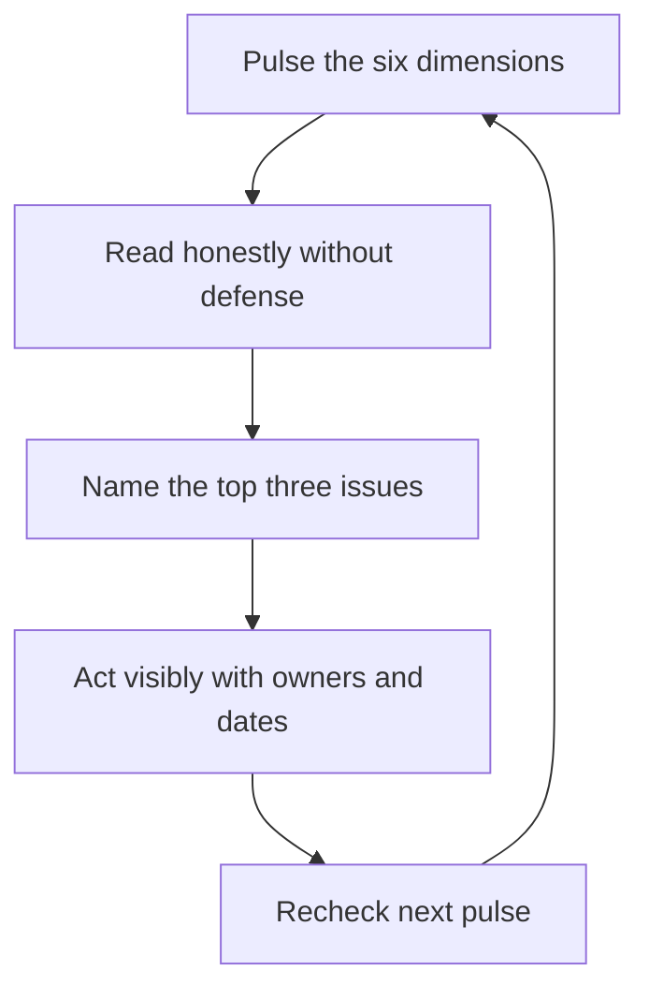

# Team Health Metrics and Surveys

> **Core skill:** Measuring team health honestly — engagement, energy, attrition risk, safety, clarity, growth — and acting on results visibly, including on the manager's own bottlenecks.

## Why This Matters

Team health is the leading indicator for everything the manager cares about. Delivery numbers tell you what happened last quarter; health tells you what happens next. A team that is engaged, safe, and clear ships through disruption; a team that is burned out, silent, and confused will miss its next deadline no matter what the roadmap says. The manager who does not measure health is flying on anecdotes — usually the loudest voice's anecdotes.

Measurement also changes the conversation. A survey result is discussable; a feeling is not. When the team sees its own data, problems stop being personal accusations and become shared problems with shared fixes. The discipline is honesty in both directions: reading the results without defensiveness, and acting on them visibly or not asking at all.

## What to Measure

| Dimension | The question it answers | Signals |
|-----------|-------------------------|---------|
| Engagement | Do people care about the work? | Energy, initiative, voluntary effort |
| Energy | Is the team sustainably loaded? | Burnout signs, overtime patterns, recovery |
| Attrition risk | Who is thinking about leaving? | Disengagement, quiet behavior, market signals |
| Safety | Can people speak up? | Dissent, questions, failure handling |
| Clarity | Does everyone know what and why? | Mission recall, decision speed, rework |
| Growth | Is capability compounding? | Learning activity, stretch, promotion readiness |

Six dimensions, one question each. The manager picks the three that matter most for the current stage — a forming team measures clarity and safety; a post-delivery team measures energy and growth.

## Survey Design

| Choice | Default | Why |
|--------|---------|-----|
| Length | Five to ten questions | Short surveys get honest answers; long ones get fatigue |
| Cadence | Quarterly pulse, plus one annual deep dive | Frequent enough to trend, rare enough to respect |
| Anonymity | Anonymous by default, optional identity | Honesty requires safety; trends do not need names |
| Format | Scaled questions plus one open question | Scales trend; open text explains |
| Ownership | The team sees its own results first | The team's data, the team's conversation |

The survey is a pulse, not a research program. Its value is the trend and the conversation it starts, not the statistical sophistication of the instrument.

## Reading Results Honestly

| Defensive reaction | What it really signals | The honest read |
|--------------------|------------------------|-----------------|
| "The scores are fine" | Fear of what the data says | Read the open text; the numbers hide the story |
| "Only the disgruntled answered" | Dismissing the signal | Low response is itself a signal about safety |
| "They don't understand the constraints" | Deflecting to the team | The constraint may be the problem |
| "Let me explain why it's like this" | Defending instead of learning | "What changed" beats "why it is justified" |

The manager's first move on seeing bad results is not to explain them but to sit with them. Every defensive reading teaches the team that honesty is wasted; every curious reading teaches them that it works.

## Acting on Results Visibly

```markdown
## This-Quarter Health Actions
- [ ] Share the results with the team, including the low scores
- [ ] Pick the top three issues the team names
- [ ] For each: one action, one owner, one date
- [ ] Say what will NOT change and why
- [ ] Review the actions at the next quarter's pulse
- [ ] Report back what the previous actions changed
```

The rule that keeps surveys honest: every survey produces visible action or is the last survey. The team does not need every issue fixed — they need to see that answering changed something. One fixed issue, visibly owned, is worth more than ten acknowledged ones.

## The Team Health Review Format

| Cadence | Format | Who is there |
|---------|--------|--------------|
| Quarterly | Pulse survey + results review | Team, together |
| Quarterly | One-to-one health check per report | Manager and report |
| Monthly | Health signals in the manager's own review | Manager, alone |
| Annually | Deep dive: all six dimensions | Team workshop |

The review is a meeting with a purpose: read the data, name the three issues, assign actions. It is not a retro about delivery and not a performance review — it is the team's conversation about how it feels to be this team.

## The Manager's Own Health Signals

| Question | What it reveals |
|----------|-----------------|
| Am I the bottleneck for decisions? | Autonomy and clarity are failing |
| Do reports bring problems or only solutions? | Coaching and trust are working |
| How much of my week is firefighting? | The system or the team is fragile |
| What did the team do while I was away? | Maturity, delegation, dependency |
| Whose energy am I draining, and how? | The manager's own load lands on the team |

The manager is part of the team's health system. A team that is healthy everywhere except in its relationship to the manager has a manager problem — and the survey will show it if the manager is brave enough to read their own questions.

## When Metrics Lie

| Failure | What it looks like | The fix |
|---------|--------------------|---------|
| Survey fatigue | Scores flatline; open text goes empty | Shorten, space out, or rest the survey |
| Gaming | Scores rise after visible punishment | The survey is only as safe as the response culture |
| Pacing the pulse | Energy dips between surveys go unseen | Pair pulses with continuous signals: retros, one-to-ones |
| Anecdote inflation | One loud voice outweighs the trend | Read trends and distributions, not highlights |

Metrics are a lens, not a truth. The manager triangulates: survey trends, one-to-one themes, meeting behavior, and delivery outcomes. When the lens disagrees with lived experience, the manager trusts the pattern across all four — and says so.

## The Health Loop



## Practical Applications

- [ ] Run a short pulse quarterly; pair it with an annual deep dive
- [ ] Measure the three dimensions that matter for the current stage
- [ ] Share results with the team before anyone else
- [ ] Convert the top three issues into owned, dated actions
- [ ] Review the previous actions at the next pulse
- [ ] Audit the manager's own bottleneck signals quarterly
- [ ] Triangulate surveys with one-to-ones, retros, and delivery data

## Common Pitfalls

| Pitfall | Why It Is a Problem | Better Approach |
|---------|---------------------|-----------------|
| **Survey theater** | Asking without acting kills trust faster than not asking | Visible actions or no survey |
| **Defensive reading** | Explanations teach the team to stop answering | Sit with the data first; curiosity over justification |
| **Measuring everything** | Long instruments fatigue and die | Six dimensions, three at a time, five to ten questions |
| **Anonymity broken** | Identifiable responses poison the well | Anonymous by default; trends never need names |
| **Only the loud voice** | Anecdotes drown the distribution | Read trends and distributions; name the pattern |
| **Forgetting the manager** | The team is healthy except around the manager | Include manager-specific questions and read them |

## Success Indicators

- The team discusses its own health data without defensiveness
- Every pulse produces visible, owned actions that get done
- Trends move in the right direction across quarters
- Open-text responses are specific and actionable, not silent
- The manager's own bottleneck signals are read and acted on

## Related Topics

- [[02_Psychological_Safety_in_Practice]]: safety is the dimension that decides survey honesty
- [[01_Team_Lifecycle_and_Formation]]: which dimensions matter depends on the stage
- [[04_Delivery_Leadership_for_Managers/00_overview|Delivery Leadership for Managers]]: health metrics explain delivery outcomes
- [[career-path/05_Tech_Lead/06_Process_and_Quality_Stewardship/06_Continuous_Improvement_Rhythm|Continuous Improvement Rhythm (Tech Lead)]]: the retro rhythm that feeds health signals

## Summary

Team health metrics turn feelings into trends: short, regular, anonymous pulses across engagement, energy, attrition risk, safety, clarity, and growth — read without defensiveness, shared with the team, and converted into visible, owned actions. The manager is part of the system they measure, and the loop closes only when the next pulse shows what the last actions changed. Measured honestly, health becomes the leading indicator that protects delivery, retention, and the manager's own sanity.
