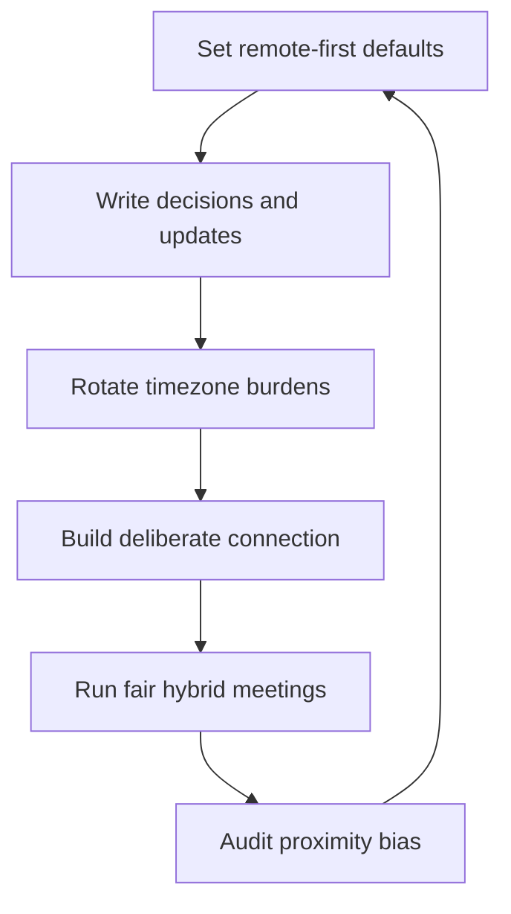

# Managing Remote and Hybrid Teams

> **Core skill:** Creating cohesion, fairness, and trust across distance and time zones — through async discipline, deliberate connection, and meeting norms that do not favor the room.

## Why This Matters

Distance changes how teams fail. In an office, trust is built by proximity — overheard conversations, shared lunches, the hallway after the meeting. Distributed, none of that exists, and the substitutes must be built deliberately or the team fragments into a center and a periphery: those in the room with the manager, and those watching from a tile. Fragmentation shows up as silent remote members, decisions made before the call, and quiet attrition of the people farthest from the office.

Remote work is not a degraded version of office work; it is a different operating system. Teams that run on written decisions, recorded meetings, and deliberate connection outperform office teams on focus and fairness — but only if the manager runs the system on purpose. Hybrid is the hardest case of all, because the office keeps quietly re-asserting itself.

## Remote-First vs Office-First Defaults

| Decision | Office-first (default) | Remote-first (deliberate) |
|----------|------------------------|---------------------------|
| Where decisions are made | In the room, after the call | In writing, on the record |
| Meeting posture | Remote people join the room | Everyone joins as remote, room included |
| Information flow | Hallway talk is real news | Written updates are the real news |
| Career visibility | Presence in the office is noticed | Contribution, not presence, is noticed |
| Meeting time | The office's working hours | Rotated, timezone-aware |

The choice is binary: the default decides everything downstream. Remote-first does not mean everyone is remote — it means the office never has an information or career advantage over the remote.

## Async Communication Discipline

| Practice | What it looks like | Why it matters |
|----------|--------------------|----------------|
| Written decisions | Decisions recorded with reasons, in a decision log | The absent read them; the present can be challenged |
| Good questions | Requests that include context and a deadline | Async turns are expensive; one round-trip is the goal |
| Documentation | Docs updated as part of the work, not after | The team's memory lives in writing, not in heads |
| Explicit handoffs | Named owner, state, and next step in every handoff | Work does not stall between time zones |
| Response norms | Agreed SLA for async replies, with urgency levels | "Fast enough" is defined, not felt |

Async discipline is writing quality: the distributed team's conversations happen in text, and text that lacks context, decision, or next step is a broken handoff. The manager models it by writing the context others would have gotten in the hallway.

## Timezone Fairness

| Practice | What it looks like |
|----------|--------------------|
| Meeting rotation | Recurring meetings rotate through time zones, not just the convenient hour |
| Recorded decisions | Every decision is written; attendance never decides access |
| Async-first agendas | Material is read before the meeting, so the meeting is a decision, not a briefing |
| Offset collaboration | Pairing and reviews are structured across offsets, not confined to overlap |
| Compressed core hours | A small overlap window for sync, protected and respected |

The fairness test: can the person in the worst timezone fully participate without staying up late or losing information? If the answer is no, the design is wrong, not the person.

## Building Trust Without Hallway Contact

| Deliberate connection | What it looks like |
|-----------------------|--------------------|
| Structured one-to-ones | Weekly, protected — the distributed replacement for daily presence |
| Written check-ins | Brief async updates that make progress visible across time zones |
| Virtual social, light touch | Occasional, optional, low-pressure — games, demos, show-and-tell |
| Pairing across distance | Deliberate pairing that mixes the team, not just the co-located |
| Team rituals | Retros and demos that work identically for every participant |

Trust without proximity is built on reliability: promises kept, responses arriving, presence in the record. The manager deliberately creates the moments of connection that the office used to produce by accident — and keeps them optional enough that nobody feels surveilled.

## Onboarding Remotely

```markdown
## Remote Onboarding Checklist
- [ ] Buddy assigned before day one; they own the first month
- [ ] Written map of the system, the team, and the rituals
- [ ] Daily check-ins for the first two weeks, then tapering
- [ ] First small task with a named reviewer and fast feedback
- [ ] Introduction meetings scheduled, not left to chance
- [ ] Access and permissions done before the start date
- [ ] The newcomer presents their work in a demo by week four
- [ ] Check the newcomer's connection at week two and week six
```

Remote onboarding fails by silence: the newcomer who cannot see the room does not know they are missing anything. The checklist replaces the accidental absorption of office life with a deliberate ramp.

## Hybrid Meeting Fairness

| Norm | What it enforces |
|------|------------------|
| One remote, all remote | If anyone joins remotely, everyone joins remotely — no room advantage |
| Camera and name | Remote participants are seen and named; no tiles as audience |
| Round-robin speaking | The facilitator draws out the remote voices explicitly |
| Decision on record | Decisions and dissents are written, whoever was present |
| No hallway decisions | Nothing decided in the room is final until it is written |

The one-remote-all-remote norm is the single most powerful hybrid rule: it makes the remote experience the shared experience and kills the room's structural advantage. Every other norm defends the same principle — the meeting works for the people on the tiles or it is not a good meeting.

## Proximity Bias Watch

| Signal | What it means | The move |
|--------|---------------|----------|
| Office people get the visible work | Presence is being mistaken for contribution | Allocate work from the written record, not the hallway |
| Remote members are quiet in meetings | The room is eating the airtime | Round-robin; ask the remote first, sometimes |
| Promotion and review talk favors the co-located | Bias in evaluation | Write the evidence; evaluate the record |
| Remote members learn news late | Information flows by proximity | Written updates as the official channel |
| The manager's favorites are in their timezone | Familiarity bias | Calibrate with peer managers; check your own allocation |

Proximity bias is the default; fairness is the maintenance. The manager audits their own behavior quarterly: who got the last three visible assignments, and was the record the reason?

## The Distributed Loop



## Practical Applications

- [ ] Declare remote-first explicitly; the office never has an information advantage
- [ ] Record every decision with its reasons in a decision log
- [ ] Rotate meeting times; protect the worst timezone
- [ ] Assign buddies and written maps for every remote onboarding
- [ ] Enforce one-remote-all-remote for every hybrid meeting
- [ ] Audit work allocation and promotion talk for proximity bias quarterly
- [ ] Keep virtual social optional, light, and genuinely social

## Common Pitfalls

| Pitfall | Why It Is a Problem | Better Approach |
|---------|---------------------|-----------------|
| **Room privilege** | The co-located decide; the remote comply | One-remote-all-remote; decisions on record |
| **Meeting-heavy culture** | Sync eats the day; timezone victims burn out | Async-first; meetings decide, never brief |
| **Hallway information** | The remote learn news last | Written updates are the official channel |
| **Proximity promotion bias** | The visible get the growth; the remote leave | Evaluate the written record, not the presence |
| **Forced fun** | Mandatory social events breed resentment | Light touch, optional, varied formats |
| **Onboarding silence** | The remote newcomer flounders invisibly | Buddy, map, check-ins, first demo by week four |

## Success Indicators

- Decisions are made on the record; remote members have equal access to information
- Meeting times rotate fairly; no timezone consistently carries the burden
- Remote newcomers reach productivity within a quarter
- Hybrid meetings work for the tiles first; the room adapts to them
- Promotion and allocation patterns show no proximity bias in review

## Related Topics

- [[04_Team_Charter_and_Working_Agreements]]: distributed norms must be written, not assumed
- [[02_Psychological_Safety_in_Practice]]: safety is harder to see and build at a distance
- [[05_Team_Health_Metrics_and_Surveys]]: pulses must reach the remote voices
- [[07_Manager_Communication/00_overview|Manager Communication]]: the written communication craft distance demands

## Summary

Managing remote and hybrid teams is a deliberate operating system: remote-first defaults, written decisions, timezone rotation, structured connection, and meeting norms that give the tiles the same voice as the room. The manager builds trust through reliability instead of proximity, ramps newcomers with a checklist instead of absorption, and audits their own behavior for proximity bias. Done deliberately, the distributed team gains focus and fairness — and loses nothing but the commute.
