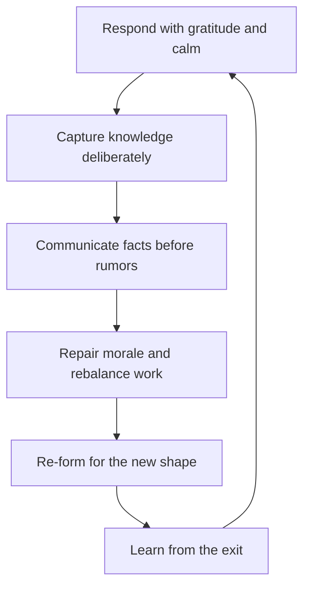

# Team Transitions and Exits

> **Core skill:** Managing departures, involuntary exits, and re-orgs with process fairness, honest communication, and attention to the team's morale — including the manager's own emotions.

## Why This Matters

People leave. The measure of a manager is not preventing all exits — that is neither possible nor desirable — but handling them so the team stays stable, the leaver keeps their dignity, and the knowledge stays behind. A botched exit is expensive twice: the departing engineer takes knowledge and goodwill, and the remaining team watches how the manager treats people and updates their own plans accordingly.

Exits are also the team's hardest moments emotionally. Resignations trigger loss and sometimes guilt; involuntary exits trigger fear; re-orgs trigger grief for a team that is being dissolved. The manager who treats transitions as administrative events misses that the team is processing a change in its own identity — and that processing happens whether the manager leads it or not.

## Responding to a Resignation

| Step | What it looks like |
|------|--------------------|
| First response | Gratitude and calm, not panic or guilt — the relationship survives this moment |
| Retention conversation | Only if genuinely wanted: why they are leaving, what would change it — and only if the change is real |
| Knowledge capture | Plan the handover before the announcement; the leaver is the best documenter of their own work |
| Communication | The team hears it from the manager, with the leaver's blessing, before the rumor mill |
| Exit interview | Listen for the real reasons and the system's lessons; no defensiveness |
| Send-off | A real goodbye: the leaver's contribution named, the relationship kept |

The retention conversation is the classic trap: the manager offers a counteroffer they cannot sustain, or nothing changes and the engineer leaves anyway, having burned the trust of their honesty. The rule: only counter if the answer to "what would keep you" is something the manager can genuinely deliver — and even then, most leavers have already left in their own minds.

## Knowledge Capture

```markdown
## Knowledge Capture Checklist
- [ ] Written handover: owned systems, open threads, decision context
- [ ] Runbooks and docs updated by the leaver, not reconstructed later
- [ ] Key contacts and dependencies named
- [ ] Unfinished work triaged: finish, reassign, or kill — explicitly
- [ ] Access revoked on the last day, gracefully
- [ ] One deep-dive session with the successor while the leaver is still here
- [ ] The leaver's unwritten knowledge named: who knows what, who to ask
```

Knowledge capture is a plan, not a hope. The last two weeks of a resignation are the cheapest documentation the team will ever buy; the manager schedules the capture before the announcement, while the leaver still has goodwill and context.

## Involuntary Exits

| Principle | What it means in practice |
|-----------|---------------------------|
| Process fairness | Expectations, feedback, and plans documented before any decision — the arc from performance management |
| Consistency | The same bar and the same process for everyone, defensible in review |
| Dignity | Private, respectful, final — no public shaming, no drawn-out agony |
| Support | Outplacement, references, and a fair transition period where the company can afford it |
| Legal care | HR leads; the manager never improvises termination law |

Involuntary exits are the end of a documented process, not a decision in a room. The manager who has run feedback, plans, and check-ins honestly can hold the exit conversation with a clear conscience — the person may disagree, but they cannot say they were surprised.

## Communicating After an Exit

| Audience | What to say | When |
|----------|-------------|------|
| The team | The fact, the date, the plan for the work — and what the leaver contributed | Immediately, before rumors |
| The leaver's close collaborators | The personal angle, privately, with room for feeling | Same day, individually |
| Stakeholders | The impact on delivery and the plan | Same day, briefly |
| The wider org | Only what is needed, professionally | As needed, no gossip |
| Nobody | The reasons, if personal or sensitive | Never — some things stay private |

The communication rules: facts first, gratitude included, rumors preempted, and privacy respected. What the manager says about the leaver after they leave is what the remaining team hears about their own possible future.

## Morale Repair After Exits

| Step | What it looks like |
|------|--------------------|
| Acknowledge | Name the loss openly; the team does not need cheerleading, it needs honesty |
| Rebalance | Redistribute the work visibly; nobody silently inherits a dead colleague's load |
| Reassure | Clarity on the plan and the team's future, without false promises |
| Reconnect | A team moment that is not about the exit — the work, the mission, a win |
| Watch | Energy and mood for weeks; exits echo longer than expected |

Morale repair is not distraction; it is honesty plus structure. The team that knows what happens next, and that its loss was acknowledged, settles faster than the team that is told to stay positive.

## Re-Org Transitions

| Phase | What the manager does |
|-------|----------------------|
| Announcing | The news first, in person, with what is known and what is not — no spin |
| Reframing | What the change enables, honestly; why the org chose it, if the reasons are real |
| Grieving | Space for what died: the old team, rituals, identity — named, not denied |
| Re-forming | Treat the new team as a formation, not a continuation |
| Stabilizing | Early wins, quick clarity on roles, and a visible path forward |

Re-orgs are the hardest transitions because they are both loss and demand: the team must grieve the old team and form the new one at the same time. The manager who skips the grieving step gets a new team that never quite forms — still mourning, still comparing.

## The Manager's Own Emotions

| Feeling | Where it comes from | Processing |
|---------|---------------------|------------|
| Guilt | "I should have prevented this" | Review the record honestly: was the process fair? Then let it go |
| Relief | A difficult exit is finally over | Normal — but never shown before the exit is complete |
| Loss | A good person is leaving | Acknowledge it; the relationship can outlive the employment |
| Fear | "Who will do the work" | Plan the coverage; fear with a plan is just work |

Managers feel exits too, and the feelings leak into the team if unexamined. The discipline: process the emotion away from the team, with peers or a mentor, so the team gets steadiness — and the manager gets the honest processing the team cannot provide.

## The Exit Sequence



## Practical Applications

- [ ] Plan knowledge capture before the announcement, while goodwill is high
- [ ] Hold retention conversations only when the change is real and deliverable
- [ ] Run involuntary exits through the documented arc with HR from the start
- [ ] Communicate exits to the team first, with facts, gratitude, and a plan
- [ ] Acknowledge the loss; rebalance the work visibly
- [ ] Treat re-orgs as grief plus formation, not just announcement
- [ ] Process your own emotions with peers; give the team steadiness

## Common Pitfalls

| Pitfall | Why It Is a Problem | Better Approach |
|---------|---------------------|-----------------|
| **Panic counteroffers** | Retaining someone who has left in their mind, at any cost | Only counter what is genuine; accept most exits gracefully |
| **Knowledge by hope** | The leaver walks out with everything unwritten | Schedule capture before the announcement |
| **Surprise exits** | The team hears from Slack; trust in the manager drops | The manager tells the team first, in person |
| **Gossip and spin** | Reasons leak; the team learns what not to say | Facts, gratitude, privacy — nothing more |
| **Cheerleading after loss** | Forced positivity denies the team's real response | Acknowledge the loss; then move to the plan |
| **Unprocessed manager emotions** | Guilt and fear leak into decisions and tone | Process with peers; keep the team's experience steady |

## Success Indicators

- Knowledge is captured and work continues without a collapse after exits
- The team hears about departures from the manager, not the rumor mill
- Involuntary exits follow the documented arc; no one is surprised
- Morale recovers within weeks, measured, not assumed
- Leavers keep the relationship; some return or refer

## Related Topics

- [[01_Team_Lifecycle_and_Formation]]: every exit restarts part of the lifecycle
- [[05_Team_Health_Metrics_and_Surveys]]: pulse the team after every transition
- [[01_People_Development/00_overview|People Development]]: exits are the endpoint of people management done right
- [[05_Organizational_Awareness_and_Influence/00_overview|Organizational Awareness and Influence]]: re-org context and HR process

## Summary

Team transitions and exits are managed with process fairness and emotional honesty: gratitude and calm on resignation, knowledge captured before the announcement, involuntary exits run through the documented arc with dignity, communication that reaches the team before the rumors, morale repaired with acknowledgment and structure, and re-orgs treated as grief plus formation. The manager processes their own emotions away from the team — because how the team watches the manager handle an exit is exactly how they will expect to be handled themselves.
