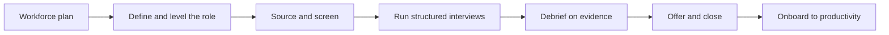

# Hiring and Staffing

> **Core capability:** The engineering manager builds the team's capability from the outside in — defining roles, running a fair and effective hiring process, onboarding deliberately, and planning the workforce the team will need.

## Why This Matters

Hiring is the highest-leverage, least-reversible decision a manager makes. A strong hire compounds for years; a mis-hire costs months of management attention, team morale, and re-hiring. Yet most managers inherit a broken process: inconsistent interviews, vibes-based decisions, and candidates who experience the company at its worst.

The EM owns the whole funnel: workforce plan, role definition, sourcing, interview design, decision discipline, closing, and the onboarding that turns an accepted offer into a productive teammate. Staffing is the same skill applied internally — moving people where the work and their growth intersect.

## Topics in This Capability Area

| Topic | Core Skill | When It Matters |
|-------|------------|-----------------|
| [[01_Workforce_Planning]] | Forecasting capability needs and team shape | Budget cycles, roadmap shifts, growth phases |
| [[02_Job_Definition_and_Leveling]] | Writing role definitions leveled honestly | Every open requisition |
| [[03_Sourcing_and_Pipeline]] | Building candidate pipelines beyond reactive posting | Continuous; before vacancies bite |
| [[04_Interview_Design_and_Running]] | Designing interviews that predict performance | Every loop; process overhauls |
| [[05_Hiring_Decisions_and_Debriefs]] | Making evidence-based, low-bias decisions | Every debrief; calibration |
| [[06_Closing_and_Offers]] | Closing candidates with respect, not gimmicks | Every offer stage; competing offers |
| [[07_Onboarding_Design]] | Turning accepted offers into productive teammates | Every hire's first 90 days |

## The Hiring Funnel

The funnel is a system — weaknesses upstream (vague roles) doom downstream stages (endless loops, declined offers).

## What Changes from Tech Lead to Engineering Manager

| Activity | Tech Lead | Engineering Manager |
|----------|-----------|---------------------|
| Interviews | Runs one interview well | Owns loop design, training, and decision quality |
| Role definition | Consulted on skills | Writes and levels the role |
| Decisions | Gives hire signal input | Owns (or co-owns) the decision and its defense |
| Onboarding | Technical buddy and context | Owns the plan, the experience, and the outcome |
| Staffing | Flags gaps | Plans, requests, and moves people |

## Practical Applications

### Hiring Health Checklist

- [ ] The workforce plan anticipates needs two quarters ahead
- [ ] Every role has a written, leveled definition before sourcing starts
- [ ] Interview loops are structured: same dimensions, trained interviewers
- [ ] Debriefs decide on evidence against the role definition, not consensus vibes
- [ ] Offers close on honesty: the real job, the real team, the real trade-offs
- [ ] Onboarding is a designed 30/60/90 experience with a named buddy
- [ ] Hiring metrics are tracked: pass-through, time-to-productive, quality-of-hire

## Common Pitfalls

| Pitfall | Why It Is a Problem | Better Approach |
|---------|---------------------|-----------------|
| **Waiting for vacancies** | Pipeline starts at zero when you need people most | Sourcing runs continuously |
| **Culture fit as criterion** | Proxy for sameness; kills diversity | Score culture contribution, not similarity |
| **Glowing-or-damning debriefs** | Charisma decides; evidence is optional | Structured evidence first, discussion second |
| **Onboarding as paperwork** | Slow ramp, early doubt, preventable exits | Designed first-week and first-quarter experience |

## Success Indicators

- Loops measure the role's actual dimensions with minimal interviewer variance
- Decisions survive calibration with peer managers
- Accept rates are strong without inflating offers
- New hires reach expected productivity inside their first quarter
- Mis-hires are rare and debriefed for process learning

## Related Capabilities

- [[01_People_Development/00_overview|People Development]]: onboarding ends where development begins
- [[02_Team_Formation_and_Health/00_overview|Team Formation and Health]]: each hire changes team composition and health
- [[04_Delivery_Leadership_for_Managers/00_overview|Delivery Leadership for Managers]]: workforce plans come from delivery demands
- [[career-path/02_Senior_Software_Engineer/09_Promotion_Evidence_and_Capstone/05_Career_Ladders|Career Ladders (Senior)]]: the leveling knowledge honest job definitions require

## Summary

Hiring and staffing is a system the manager owns end to end: plan the workforce, define roles honestly, source ahead of need, run structured interviews, decide on evidence, close with integrity, and onboard deliberately. Every stage is improvable; improving the system beats squeezing any single loop.
