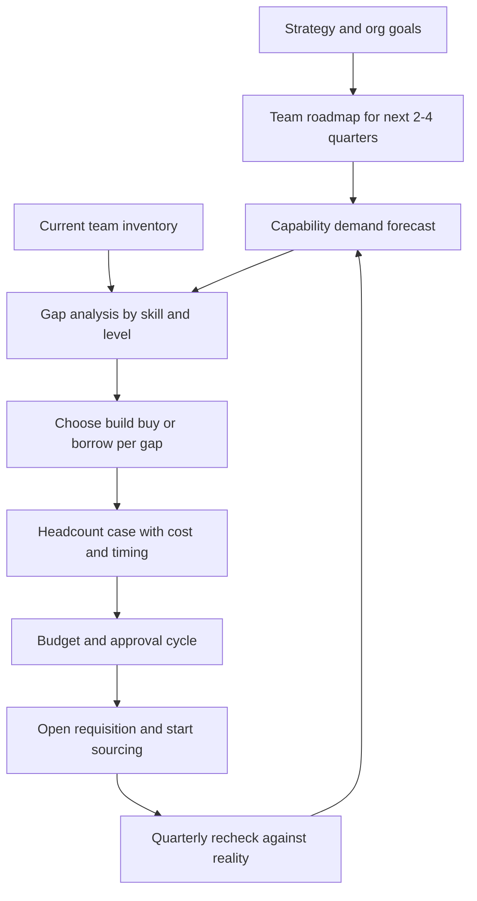

# Workforce Planning

> **Core skill:** Forecasting the capabilities the team will need from the roadmap and strategy, and converting that forecast into a funded, timed headcount plan before the gap becomes urgent.

## Why This Matters

Reactive hiring is always too late. The time from an approved requisition to a productive engineer routinely runs three to six months — sourcing, loops, notice periods, and onboarding all stack up. The team you have in Q3 is the result of decisions made in Q1. A manager who waits for the roadmap to expose a gap has already guaranteed a quarter of missed commitments, borrowed seniors from other teams, and pressure to lower the hiring bar.

Workforce planning is the translation discipline between strategy and staffing. The roadmap says what the team will attempt; the manager converts that into capability demand — which skills, at what depth, in what mix, by when — and then into the internal moves, requisitions, or contractor budget that close the gap. Done well, it is boring: gaps surface in a spreadsheet two quarters early, not in a crisis meeting two weeks late.

Planning the count is only half the job; planning the shape matters as much. A team of clones has single points of failure and a hard ceiling. The junior/mid/senior mix, the balance of specialists and generalists, and the growth path for the people already on the team are all workforce planning outputs.

## From Roadmap to Capability Demand

The forecast starts from committed and likely work, not from headcount arithmetic like "ten percent growth."

| Roadmap Signal | Capability Question | Planning Action |
|----------------|--------------------|-----------------|
| New platform migration committed | Who here has done a migration of this shape? | Identify internal candidates; open a senior requisition with migration experience |
| Mobile app launching next year | Is mobile a durable need or a project? | Durable: hire; project: contractor plus one permanent owner |
| Data product on the roadmap | Do we need a data engineer or a data-literate backend engineer? | Write both role definitions; decide by dependency analysis |
| Team doubling in size | Who onboards, mentors, and interviews? | Manager capacity plan; senior hire before the junior wave |
| Support load rising | Is this a volume problem or a defect problem? | Platform investment before support headcount |
| Key person single point of failure | What happens if they leave tomorrow? | Backfill plan and deliberate knowledge spreading now |

Each row converts a business fact into a staffing consequence. If a roadmap item has no capability translation, either the roadmap is wishful or the plan is incomplete.

## Team Shape Evolution

The mix of levels and skill types determines throughput, resilience, and growth capacity — not just the headcount number.

| Dimension | Options | Trade-offs | Planning Guidance |
|-----------|---------|------------|-------------------|
| Level mix | Junior-heavy, balanced, senior-heavy | Juniors need mentoring capacity; seniors cost more and stall without scope | Healthy steady state for a product team: roughly one senior per two mid, juniors added only with named mentors |
| Specialist vs generalist | Deep specialists per domain vs full-stack generalists | Specialists go deeper but create bus factors and handoffs; generalists flex but plateau on hard problems | Specialists where the domain is deep and durable (ML, security, performance); generalists elsewhere |
| Growth vs steady state | Hiring ahead of demand vs hiring at demand | Hiring early wastes money if plans shift; hiring late misses commitments | Hire one quarter ahead for committed work only; never ahead for speculative work |
| Contractor share | Core employees plus contractors vs all employees | Contractors add speed and flexibility but carry knowledge-off-the-cliff risk | Cap contractors at the share of work that is genuinely temporary |

Shape also changes on its own: people grow, people leave, interests shift. The plan revisits shape quarterly, not annually.

## Build, Buy, Borrow

Every capability gap has three closure routes, and the cheapest is often not hiring.

| Route | Best When | Typical Lead Time | Risks |
|-------|-----------|-------------------|-------|
| **Build internally** | Gap is one level of skill, not talent; motivated person exists | 1-2 quarters | Learning curve while committed work continues; person may not progress |
| **Buy — hire** | Gap is depth or volume of experience; need is durable | 3-6 months to productive | Cost, onboarding drag, mis-hire risk |
| **Borrow — contract** | Need is time-boxed or highly specialized | 2-6 weeks | Knowledge leaves with the contract; rate shock |

The test is durability: a need that survives two planning cycles deserves a permanent answer; a need tied to a project with an end date can be borrowed. Building internally doubles as retention — the growth conversation is the plan.

## Backfill vs Growth Headcount

They compete for the same budget pool and are won with different arguments.

| Aspect | Backfill | Growth |
|--------|----------|--------|
| Trigger | A departure | New scope or capacity demand |
| Business case | Continuity of committed delivery | Expansion of delivery |
| Urgency framing | Every open week is uncovered risk already funded | Every open week is delayed revenue or roadmap |
| Risk if delayed | Team absorbs the gap with overtime and quality erosion | Roadmap slips silently into next year |
| Common mistake | Treating it as automatic and skipping the case | Justifying with headcount arithmetic instead of outcomes |

A backfill is not automatic. If a departure creates an opportunity to reshape — a generalist leaving might justify a specialist requisition — the backfill decision gets the same rigor as a growth request, on a faster clock.

## The Headcount Case

Headcount is bought with a business argument, not a plea for help. A strong case is short, quantitative, and honest about alternatives.

| Case Element | What It Contains | Common Failure |
|--------------|------------------|----------------|
| Business rationale | What outcome the role unlocks, tied to committed roadmap or measured pain | "The team is overloaded" with no outcome attached |
| Cost | Fully loaded salary band, recruiting cost, onboarding drag on the team | Forgetting the mentorship tax existing engineers pay |
| Timing | When the requisition must open to have the person productive by the need date | Opening at the need date instead of two quarters before |
| Alternatives considered | Build and borrow options and why they lose | Presenting hiring as the only option |
| Consequence of decline | What specifically does not happen; which commitment slips | Vague doom instead of a named trade-off |

## The Planning Cycle



The loop matters more than the artifact: the quarterly recheck is where forecast error gets caught while it is still cheap to correct.

## Planning Horizons

| Horizon | Cadence | Activity | Output |
|---------|---------|----------|--------|
| Annual | Once a year, with budget cycle | Directional demand from strategy; big bets and likely shape changes | Headcount envelope and level mix targets |
| Quarterly | Every quarter, 2-3 hours | Recheck demand against actual roadmap; attrition risk; internal moves | Updated requisition list with need-by dates |
| Continuous | Monthly scan | Attrition signals, single points of failure, contractor end dates | Early warnings that trigger the quarterly review early |

## Responding to a Hiring Freeze

Freezes convert a staffing plan into a resourcefulness plan. The manager's job is to protect delivery and people by choosing trade-offs deliberately instead of absorbing them silently.

| Lever | What It Looks Like | Trade-off |
|-------|--------------------|-----------|
| Stretch scope redistribution | Re-slice roadmap so committed items fit reduced capacity | Some goals move out; say so early |
| Automation and toil removal | Invest current capacity in removing the most expensive recurring work | Short-term velocity dip for permanent capacity gain |
| Scope cuts negotiated upward | Present leadership the explicit list of what will not happen | Requires the courage to name consequences |
| Internal mobility | Borrow capability from adjacent teams with clear end dates | Debt that must be tracked and repaid |
| Contractor conversion freeze discipline | Do not backfill departing contractors with new ones | Knowledge gaps surface honestly |

## Practical Applications

**Quarterly workforce planning checklist:**

- [ ] Roadmap for the next two quarters is written down, not oral tradition
- [ ] Current team inventory maps skills, levels, and growth trajectories
- [ ] Every gap has a route chosen: build, buy, or borrow
- [ ] Backfills triggered by attrition risk have a plan, not a hope
- [ ] The headcount case states outcome, cost, timing, alternatives, and consequence of decline
- [ ] Requisitions are opened two quarters before the need date
- [ ] Single points of failure are named and being de-risked

**Headcount case template:**

```markdown
## Headcount Case: [Role, Level]

Business rationale: [Outcome this role unlocks, tied to committed roadmap or measured pain]
Need-by date: [When the person must be productive]
Requisition open by: [Need-by minus hiring and ramp lead time]

Cost: [Fully loaded comp band, recruiting, onboarding drag]
Alternatives considered: [Build: who and timeline; Borrow: source and end date]

If declined: [Named commitment that slips or toil that continues at measured cost]
```

## Common Pitfalls

| Pitfall | Why It Is a Problem | Better Approach |
|---------|---------------------|-----------------|
| **Hiring at the moment of need** | Lead time guarantees a quarter of uncovered demand | Plan two quarters ahead on committed work only |
| **Headcount arithmetic as rationale** | "Ten percent growth" is not a business case | Tie every requisition to an outcome or measured pain |
| **Clone hiring** | Team of similar profiles has single points of failure and no growth paths | Hire complementary profiles against a written team inventory |
| **Treating backfill as automatic** | Misses the chance to reshape; finance treats it as negotiable later | Argue backfills on continuity risk with the same rigor as growth |
| **Annual plan, annual attention** | Roadmaps shift faster than annual cycles | Quarterly recheck keeps the forecast honest |
| **Absorbing a freeze silently** | Overtime and quality erosion follow; the cost stays invisible | Choose and communicate the trade-offs explicitly |

## Success Indicators

- Requisitions open two or more quarters before the need date for committed work
- No capability gap has ever surprised the roadmap mid-quarter
- Team shape is documented and every hire changes it deliberately
- Headcount cases win approval without renegotiation of their logic
- Freeze responses were chosen trade-offs, not silent absorption

## Related Topics

- [[02_Job_Definition_and_Leveling]]: an approved requisition becomes a role definition
- [[03_Sourcing_and_Pipeline]]: the forecast tells you what to build a pipeline for
- [[04_Delivery_Leadership_for_Managers/00_overview|Delivery Leadership for Managers]]: delivery commitments are the primary input to capability demand
- [[01_People_Development/00_overview|People Development]]: build-internally is half workforce planning, half growth conversation
- [[career-path/02_Senior_Software_Engineer/09_Promotion_Evidence_and_Capstone/05_Career_Ladders|Career Ladders (Senior)]]: the level mix in the plan is written in ladder language

## Summary

Workforce planning converts strategy into staffing before the gap becomes urgent: forecast capability demand from the committed roadmap, compare it to a written team inventory, choose build, buy, or borrow per gap, and win headcount with a case built on outcomes, cost, and timing. Recheck quarterly, treat shape as seriously as count, and when freezes come, choose the trade-offs out loud. The manager's test is simple: nothing on next quarter's roadmap should be surprised by who is on the team.
