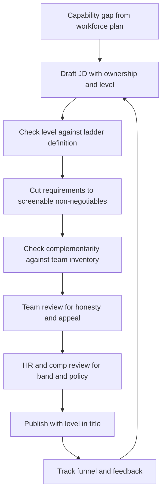

# Job Definition and Leveling

> **Core skill:** Turning a capability gap into a role definition that is honest about the work, precise about the level, and written to attract the candidates you actually want.

## Why This Matters

The job description is the first interview. Candidates read it as a signal of how the company thinks: a list of thirty requirements says "we have not decided what this job is"; a level-free title says "leveling here is negotiable, which means it is political"; a hype-filled pitch attracts people who like hype. The JD does not just describe the job — it filters the audience before a single screening call happens.

For the manager, the JD is also a commitment device. A role defined as "senior backend engineer, owns the payments domain, mentors one junior" gives the interview loop its dimensions, the debrief its bar, the offer its level, and the new hire's first performance conversation its expectations. A role defined as "rockstar ninja, 10x engineer" gives nothing to any of those stages and forces every later decision to be improvised.

Leveling is where honesty matters most. "Senior" that means "five years and some Kubernetes" devalues the ladder for everyone already on it, sets a mis-hire up to fail at a level they were never assessed for, and creates a pay-equity problem the day a current senior compares notes. The manager writes the level from the ladder, not from the market pressure of the moment.

## From Capability Gap to Role Definition

The workforce plan names the gap; the role definition makes it hireable.

| Workforce Plan Says | Role Definition Answers | Example |
|---------------------|-------------------------|---------|
| Payments domain uncovered | What will this person own in 90 days? | The payout retry service, including its on-call rotation |
| Mentoring capacity exhausted | Who will they mentor, on what? | One junior engineer, code review and design reviews |
| Migration experience missing | What decision will they make in month one? | Choose the strangler-pattern order for the billing extract |
| Support load too high | Is this a support role or a platform role? | Platform: reduce ticket volume, not answer tickets |

If the role definition cannot state what the person will own and decide, the gap is not understood well enough to hire for.

## Writing the Job Description

The JD attracts by honesty, not by superlatives. The candidates you want are choosing between offers, and the credible ones are reading for the real job.

| JD Section | What It Should Contain | Common Failure |
|------------|------------------------|----------------|
| Mission | Two sentences: what the team does and why it matters to the business | Marketing copy detached from the actual work |
| Responsibilities | 4-6 ownership statements — what they will own, decide, and be accountable for | Task lists ("write code, attend standups") that describe any job anywhere |
| Requirements | 3-5 non-negotiables you will actually screen for | Fifteen bullets that no living candidate fully matches |
| Preferences | Nice-to-haves that differentiate, clearly separated | Requirements and preferences merged into one intimidating blob |
| Team context | Size, shape, how the team works, who they report to | Omitted because it feels mundane — it is the most-read part |
| Growth path | What this role grows into | Silence, signaling a dead-end |
| Compensation | Band, or at least a process promise | "Competitive" — which filters out exactly the people who ask |

The level goes in the title. "Software Engineer (Senior)" or "Senior Software Engineer" — not "Software Engineer II" requiring decoder ring, and not level hidden until offer to preserve "flexibility." Level hiding is a trust tax paid in declined offers.

## Requirements vs Preferences

The discipline that makes a JD readable is the discipline of knowing what you will actually screen for.

| Test | Requirement | Preference |
|------|-------------|------------|
| Would we reject a strong candidate who lacks it? | Yes | No |
| Can the gap be closed in one quarter on the job? | No | Yes |
| Does the loop have a dimension for it? | Yes | Not necessarily |
| Example | "Experience operating a service in production" | "Experience with our specific stack" |

The classic failure is degree inflation and tool-specific requirements that exclude capable people who use a different name for the same tool. Every requirement should trace to an interview dimension; if the loop cannot assess it, it is a preference or it is decoration.

## Leveling Against the Ladder

The level is not years of experience — it is scope, autonomy, and impact as the ladder defines them.

| Level Question | What the Answer Determines |
|----------------|---------------------------|
| What size problem do they own unsupervised? | A task, a feature, a service, a domain, or multiple domains |
| How much ambiguity can they be handed? | "Implement this design" vs "this area is broken, fix it" |
| Who consumes their judgment? | Their PRs, their team's design reviews, or other teams' plans |
| Do they multiply others? | No, informally, or as an explicit part of the role |

The manager writes the JD with the ladder open in the other window, then runs the reality check: could a current engineer at that level read this JD and say "yes, that is my job"? If not, the JD describes a different level than the title claims.

## Skills vs Potential

Not every requisition buys the same thing, and the JD should declare which one it is buying.

| Hire Type | You Are Buying | JD Signals | Watch Out For |
|-----------|----------------|------------|---------------|
| **Skills hire** | Proven depth, immediate coverage | Explicit domain and level requirements | Overweighting current stack; discounting fast learners |
| **Potential hire** | Trajectory, learning rate, ceiling | Level set one rung lower; growth language | Hiring rawness for a role that needs coverage today |
| **Balanced** | Depth plus demonstrated growth | Requirements on outcomes, not tools | Drifting into either extreme under pipeline pressure |

The honest mix is a portfolio decision: a team of all-skills hires stagnates when the stack shifts; a team of all-potential hires cannot cover today's on-call. State the intent in the JD so the loop assesses the right thing.

## Portfolio of Strengths

Each hire changes the team's shape. The JD is where that change is designed.

| Team Already Has... | The Next JD Should Favor... | Why |
|---------------------|------------------------------|-----|
| Deep specialists | A generalist who connects them | Reduces handoffs and bus factors |
| Senior-heavy bench | A strong mid with growth runway | Mentoring capacity exists; cost and energy balance |
| Fast builders | A quality-and-operations mindset | Prevents the velocity-driven incident spiral |
| Long-tenured domain experts | An outside perspective at senior level | Counteracts "we have always done it this way" |

Hiring a clone of the last successful hire feels safe and produces a monoculture: same blind spots, same ceiling, same single point of failure. The manager reviews the JD against the team inventory before publishing.

## Remote and Work Arrangement Clarity

The work arrangement is a JD fact, not a post-offer surprise. Ambiguity here wastes everyone's loop.

| Arrangement | JD Must State | Failure Mode |
|-------------|---------------|--------------|
| On-site | Days per week expected, relocation support | Candidates assume hybrid; offers die at the finish line |
| Hybrid | Exact anchor days, team norms, remote-work stipend | "Flexible hybrid" means something different to everyone |
| Remote-first | Time zone requirements, async norms, travel cadence | Remote-with-a-time-zone-trap discovered in the screening call |
| Temporary remote | Current policy and any known change window | Policy shift after hire corrodes trust |

## JD Review Before Publishing



The review loop is deliberately short — a JD that takes a month to approve is a requisition aging in a drawer.

## Practical Applications

**JD quality checklist:**

- [ ] Mission states the team's business purpose in two sentences
- [ ] Responsibilities are ownership statements, not task lists
- [ ] Requirements are 3-5, screenable, and traceable to interview dimensions
- [ ] Preferences are clearly separated from requirements
- [ ] Level is in the title and matches the ladder definition
- [ ] Work arrangement is exact: location, days, time zone bounds
- [ ] Comp band or process is stated
- [ ] At least two team members and HR have reviewed it

**Role definition template:**

```markdown
## Role Definition: [Title, Level]

Mission: [What this team does and why it matters]
Owns in 90 days: [Service, domain, or outcome with a name]

Responsibilities:
- [Ownership statement 1]
- [Ownership statement 2]
- [Mentoring or leadership expectation if any]

Requirements (screen for these):
- [Non-negotiable traceable to a loop dimension]

Preferences (differentiators):
- [Nice-to-have closable on the job]

Level evidence: [Scope, autonomy, and impact per ladder]
Complementarity: [What this adds to current team shape]
```

## Common Pitfalls

| Pitfall | Why It Is a Problem | Better Approach |
|---------|---------------------|-----------------|
| **Requirement inflation** | Perfect-on-paper candidates do not exist; capable people self-select out | 3-5 real non-negotiables; everything else is a preference |
| **Level hidden until offer** | Declined offers and pay-equity damage when it surfaces | Level in the title, from the ladder, before publishing |
| **Wish-list JD** | The loop cannot assess fifteen requirements; the bar becomes vibes | Every requirement traces to an interview dimension |
| **Clone hiring** | Monoculture with shared blind spots and a hard ceiling | Check each JD against the team inventory for complementarity |
| **Task-list responsibilities** | Describes any job anywhere; attracts no one specific | Write ownership: what they own, decide, and answer for |
| **Arrangement ambiguity** | Offers collapse at the finish line over hybrid assumptions | State location, days, and time zone bounds exactly |

## Success Indicators

- Candidates reference the JD's specifics in interviews, not just the brand
- Requirements map one-to-one to interview loop dimensions
- Levels on offers survive calibration with peer managers
- JD-to-screen and screen-to-loop pass rates are healthy without bar-lowering
- Team members recognize their own jobs in the ladder language of the JD

## Related Topics

- [[01_Workforce_Planning]]: the capability gap that this role definition operationalizes
- [[04_Interview_Design_and_Running]]: loop dimensions come directly from this definition
- [[05_Hiring_Decisions_and_Debriefs]]: the bar in the debrief is the level stated here
- [[career-path/02_Senior_Software_Engineer/09_Promotion_Evidence_and_Capstone/05_Career_Ladders|Career Ladders (Senior)]]: the ladder definitions the JD levels against
- [[01_People_Development/00_overview|People Development]]: the growth path the JD promises must exist

## Summary

Job definition and leveling turns a capability gap into an honest, hireable role: ownership-based responsibilities, a handful of screenable requirements, a level taken from the ladder and stated in the title, and a work arrangement written exactly enough to survive the offer stage. Each JD is also a portfolio decision — hire complementary strengths, not clones of the last success. The discipline is short: if the loop cannot assess a requirement, it is a preference; if the ladder cannot defend a level, it is not the level.
