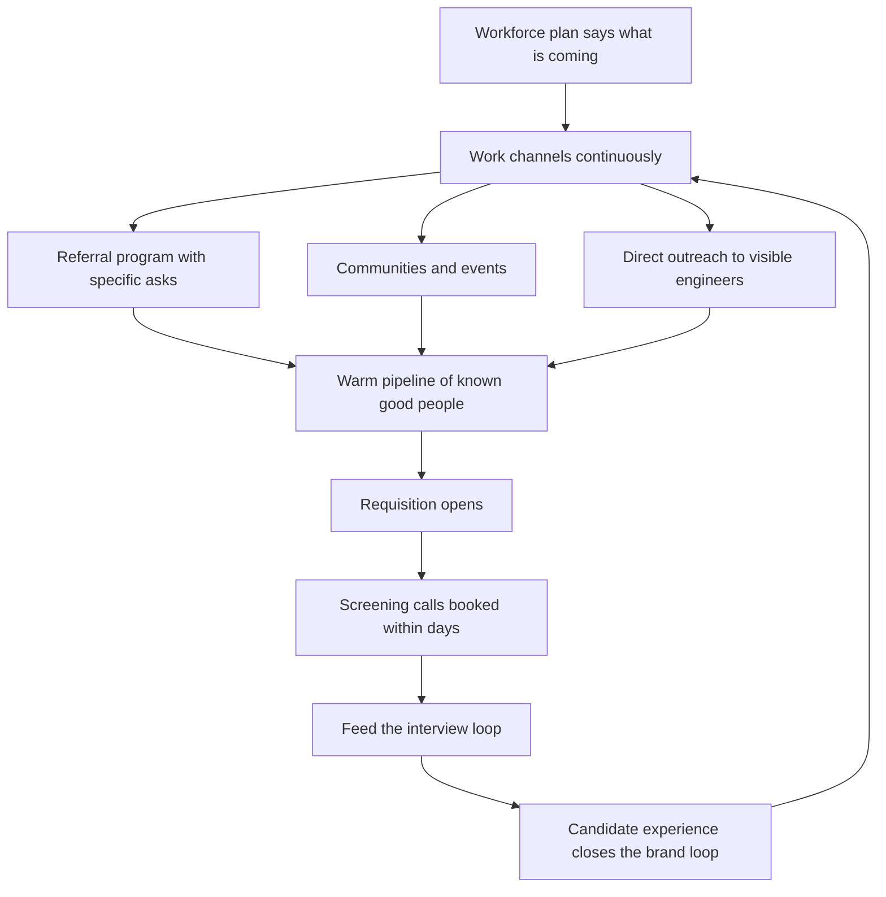

# Sourcing and Pipeline

> **Core skill:** Building a continuous flow of qualified candidates through multiple channels — before vacancies exist — so hiring starts from warmth, not from desperation.

## Why This Matters

A vacancy opened with no pipeline starts a countdown: the manager posts to job boards, waits, watches three weeks evaporate, then panic-lowers the bar or panic-pays an agency. Reactive sourcing hands leverage to the market. The team that has been meeting interesting engineers all year opens a requisition on a Monday and has screening calls booked by Wednesday.

Sourcing is also a quality lever, not just a speed lever. The best engineers are rarely actively looking; they are visible in open source, speaking at meetups, and known by your own team. Job boards reach the subset that is actively looking — a fine subset, but a narrow one. Multi-channel sourcing changes who you get to choose from, and who you get to choose from changes who you hire.

Finally, sourcing is a brand activity whether managed or not. Every candidate — including every rejected one — walks away with a story about what it is like to be considered by your company. That story either compounds into a reputation that sends more candidates, or into a warning that sends them elsewhere.

## Channels Beyond Job Boards

| Channel | How to Work It | Yield Profile | Cost |
|---------|---------------|---------------|------|
| **Referrals** | Program with bonuses, plus specific asks: "who is the best debugger you have worked with" | High quality, high culture-add, fast | Bonus cost; homogeneity risk if unmanaged |
| **Communities** | Meetups, conferences, Discords, Slack groups where practitioners talk shop | Medium volume, high engagement, slow burn | Time; authenticity required |
| **Direct outreach** | Manager or TL contacts engineers whose work is visible | Low response rate, high fit when it lands | Time; personalization is the price of entry |
| **University relations** | Internships, thesis projects, campus talks | Junior pipeline with a one-year lag | Program overhead; mentorship demand on team |
| **Agencies** | Engage for hard, senior, or niche searches with a clear brief | Fast, expensive, quality varies wildly | 15-30 percent of first-year comp |
| **Open source presence** | Your team's visible work attracts inbound interest | Small volume, exceptional fit | Requires real OSS activity, not performative |

No single channel is sufficient; the design principle is redundancy. When one channel dries up — a referral drought, a community gone quiet — the others carry the load.

## Working the Referral Channel

Referrals deserve their own discipline because they are the highest-yield channel and the highest homogeneity risk.

| Practice | What It Looks Like | Why |
|----------|--------------------|-----|
| Specific asks | "Who is the best person you debugged with at your last job" beats "know anyone looking?" | Specific prompts surface non-obvious names |
| Fast payouts | Bonus paid at start, not at six-month mark | The delay kills motivation more than the amount |
| Guaranteed look | Every referral gets a real screening decision, with feedback to the referrer | Referrers stop referring when their contacts vanish into a queue |
| Public gratitude | Named thanks in team channels for every referral, hired or not | Makes referring socially normal |
| Homogeneity watch | Track referral sources and demographics against goals | Referral networks mirror the team; unmanaged, they clone it |

## Agency Decisions

Agencies are a scalpel, not a default. They earn their fee on searches where your channels structurally cannot reach the candidates.

| Situation | Agency Worth It | Better Alternative |
|-----------|-----------------|--------------------|
| Senior niche role, passive market (staff security, ML platform) | Yes — with exclusivity and a written brief | — |
| Volume hiring of common profiles | No | Referrals plus job boards plus community |
| Confidential search (replacing someone) | Often yes | Direct manager outreach if network covers it |
| Time-boxed spike, two weeks to fill | Sometimes — as bridge, not strategy | Re-examine why the pipeline is empty |

The brief given to an agency is the JD from [[02_Job_Definition_and_Leveling]] plus the must-have screen. Without a written brief, the agency optimizes for submittal volume, and the team pays in wasted loops.

## The Pipeline as an Asset

A warm pipeline is a list of engineers the team already knows: past silver-medalists, met-at-conference contacts, people who asked to be kept in mind. It is built in good times and spent in bad ones.

| Pipeline Asset | How It Accumulates | How It Is Spent |
|----------------|--------------------|-----------------|
| Silver-medalist list | Every rejected strong candidate flagged "hire later" | First calls when a requisition opens |
| Conference and meetup contacts | Manager and TL actually follow up within a week | Direct outreach with shared context |
| Intern alumni | Interns returned to school with an offer or a keep-in-touch | Conversion at graduation |
| Past decliners | Candidates who declined offers for timing, not fit | Re-approach when their constraint changes |

Maintaining the pipeline is a calendar habit, not a system: a recurring hour a week for outreach, and a rule that no strong candidate exits the process without a "keep in touch" note where appropriate.

## Employer Brand Basics

Brand is what candidates hear about you when you are not in the room. Three levers dominate for engineering teams.

| Brand Lever | What It Requires | What It Attracts |
|-------------|------------------|------------------|
| Engineering blog | Honest technical posts, including failures and migrations | Engineers who value learning cultures |
| Open source presence | Real maintained projects, good first-issue experience | Engineers who read code before applying |
| Interview reputation | Fast, respectful, feedback-rich process | Everyone; this is the highest-bandwidth lever |

The interview reputation cuts both ways and is the fastest to damage: a candidate who waited three weeks for a rejection tells the story for years. Candidate experience is brand work, and it is free.

## Diverse Sourcing by Design

Diverse hiring is an architecture of channels, not a statement of intent. Pipelines mirror their sources.

| Design Principle | Implementation |
|------------------|----------------|
| Multiple channels, always | Every requisition works at least three channels in parallel |
| Referral homogeneity management | Referrals are one input among several, never the majority of any loop |
| Community breadth | Sponsor and attend communities beyond the team's current demographics |
| JD language audit | Strip exclusionary boilerplate; requirements honest, not inflated |
| Structured screening | Same screen for every candidate regardless of source |

A pipeline that is 80 percent referrals will produce loops that are 80 percent similar, and no amount of debrief-stage diligence fixes a homogeneous input.

## Candidate Experience as Brand

| Touchpoint | Standard | Cheap Win |
|------------|----------|-----------|
| Application acknowledgment | Within 48 hours, automated is fine | A human sentence in the template |
| Screening decision | Within one week of the call | Decision plus one line of real feedback |
| Loop scheduling | Total process under three weeks | Offer scheduling flexibility for employed candidates |
| Rejection | Personal, prompt, with a reason where legal | An invitation to stay in contact for strong candidates |
| Offer stage | A named human, a clear timeline | Manager call before paperwork |

## The Sourcing System



## Practical Applications

**Sourcing health checklist:**

- [ ] Every open requisition is worked through at least three channels
- [ ] Referral program has specific ask patterns and fast payouts
- [ ] A silver-medalist list exists and is contacted when requisitions open
- [ ] The team ships at least one visible artifact a quarter: blog post, talk, or OSS release
- [ ] Every candidate gets a decision and communication inside stated SLAs
- [ ] Agency usage is a decision with a written brief, not a reflex
- [ ] Pipeline sources are tracked so homogeneity is visible

**Outreach message template:**

```markdown
Subject: [Specific thing they built or wrote]

Hi [Name] — [one specific sentence about their work and why it caught my eye].

I run the [team] at [company]. We are [one honest sentence about the problem space].
No pitch — mostly wanted to connect. If you are ever curious about what we are building,
I would be glad to share context. Either way, [genuine closing specific to their work].
```

## Common Pitfalls

| Pitfall | Why It Is a Problem | Better Approach |
|---------|---------------------|-----------------|
| **Posting and praying** | One channel, passive, reaches only active lookers | Work three or more channels per requisition |
| **Pipeline starts at the vacancy** | Cold sourcing is slow; desperation lowers the bar | Build warmth continuously; spend it when reqs open |
| **Referral monoculture** | Networks clone the team; diversity collapses by construction | Cap referral share; keep other channels structurally alive |
| **Agency as default** | Expensive submittals that your channels could have sourced | Agency only for niche, senior, or confidential searches, with a brief |
| **Ghosting candidates** | Rejected candidates broadcast the experience for years | Decision plus feedback inside SLA, always |
| **Brand as poster** | Career-page copy no engineer believes | Ship visible engineering work; fix the interview experience |

## Success Indicators

- Requisitions open with screening calls booked inside the first week
- At least three channels contribute candidates to every loop
- A maintained silver-medalist list produces hires each year
- Referral share of loops stays a minority share
- Time-to-fill trends down without bar-lowering
- Rejected candidates refer others — the strongest brand signal there is

## Related Topics

- [[01_Workforce_Planning]]: the forecast that tells sourcing what to look for
- [[02_Job_Definition_and_Leveling]]: the role definition that channels are worked against
- [[04_Interview_Design_and_Running]]: the loop that the pipeline feeds
- [[06_Closing_and_Offers]]: a warm pipeline also softens competing-offer moments
- [[04_Delivery_Leadership_for_Managers/00_overview|Delivery Leadership for Managers]]: pipeline gaps show up first as delivery misses

## Summary

Sourcing and pipeline is the discipline of meeting good engineers before you need them: work multiple channels continuously — referrals with specific asks, communities, direct outreach, university relations, agencies only with a brief — and bank the warmth in a pipeline you spend when requisitions open. Treat candidate experience as brand work, because every rejected candidate is telling your story somewhere. The manager's test: when a vacancy appears, how many interesting people can you call this week?
