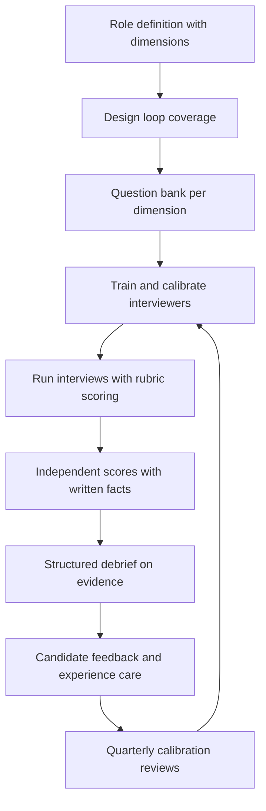

# Interview Design and Running

> **Core skill:** Designing structured interviews — dimensions from the role, question types matched to what they actually predict, rubrics anchored to levels — and running them so the best evidence, not the most charismatic interviewer, decides.

## Why This Matters

Unstructured interviews feel insightful and predict almost nothing. Two interviewers meet the same candidate, one sees brilliance and the other sees arrogance, and the debrief resolves it by seniority or volume. The fix is not harder interviews — it is structure: every candidate assessed on the same dimensions, with the same question types, against a written rubric, by interviewers trained to separate observation from interpretation.

Structure is also the fairness mechanism. When questions are improvised, they drift toward the interviewer's comfort zone, which is rarely the job's requirements and often the interviewer's trivia. When they are designed, the loop measures the role definition from [[02_Job_Definition_and_Leveling]] — the same dimensions, stated in the JD, assessed in the loop, referenced in the debrief.

The manager owns this system: defining dimensions, choosing interview types, training interviewers, calibrating scoring, and designing loops that respect the candidate's time. A well-run loop is a prediction instrument; a badly run one is a coin flip that also damages the employer brand.

## Define Dimensions from the Role

Every interview in the loop maps to dimensions — the capabilities the role definition says the job needs. No dimension, no interview.

| Role Definition Says | Loop Dimension | Assessed By |
|----------------------|----------------|-------------|
| "Owns the payments domain" | Systems design for their domain area | Design interview |
| "Mentors one junior" | Explanation and feedback quality | Behavioral interview, paired exercise |
| "Operates services in production" | Debugging and operational thinking | Practical debugging scenario |
| "Works across teams" | Influence without authority | Behavioral interview, past cross-team stories |
| "Raises the quality bar" | Code review judgment | Code review exercise |

If two interviews assess the same dimension, one is redundant and the candidate's time was spent on nothing. The loop design table (below) is the artifact that prevents this.

## Interview Types and What They Predict

No single interview type predicts everything. Each has a real signal and a real blind spot, and the loop is a portfolio of them.

| Interview Type | What It Predicts | What It Misses | Design Notes |
|----------------|------------------|----------------|--------------|
| **Behavioral (STAR)** | Past behavior under real constraints; ownership, conflict, learning | Novel-problem reasoning; candidates with thin stated history | Past behavior predicts future behavior better than hypotheticals |
| **System design** | Structural thinking, trade-off reasoning, ambiguity handling | Hands-on correctness; day-to-day discipline | Anchor to a problem near the team's real domain |
| **Coding / practical** | Fluency with code, testing habits, iteration under feedback | Design taste, cross-team behavior | Work-sample style beats algorithm trivia for most roles |
| **Values / motivation** | Alignment on how the team works; authentic interest | Skill, entirely | Misused as a skill or sameness screen |
| **Pairing exercise** | Collaboration, communication while thinking | Individual depth unobserved | Strong single predictor for team-based roles when run well |

The evidence rule: weight what the interview type actually measures, not what it felt like. A brilliant design interview says little about mentoring; a quiet coding interview says little about influence.

## Question Design: Past Behavior over Hypotheticals

"Tell me about a time you..." outperforms "what would you do if..." because hypotheticals measure eloquence about imaginary situations, while past-behavior questions measure what the candidate actually did under real constraints.

| Weak Question | Stronger Version | Why Stronger |
|---------------|------------------|--------------|
| "How do you handle tight deadlines?" | "Walk me through the last time a deadline moved up on you. What did you do?" | Forces a real episode with real constraints |
| "Would you push back on a PM?" | "Tell me about a time you disagreed with a PM. How did it end?" | Hypothetical courage vs actual behavior |
| "Are you a good mentor?" | "Who was the last engineer you mentored, and what changed for them?" | Verifiable specifics over self-assessment |
| "How would you scale this API?" | "Tell me about a system you scaled. What did you measure first?" | Past decisions carry more signal than whiteboard imagination |

Probe pattern for depth: situation, their specific action, the outcome, and what they would change. Candidates who stay in "we" through three probes describe the team's work, not theirs.

## Scoring Rubrics Anchored to Levels

A rubric converts observations into comparable scores. Scores anchor to the ladder level of the requisition — the same performance scores differently at mid versus senior.

| Dimension | 1 — Below Bar | 2 — At Bar for Level | 3 — Above Bar |
|-----------|---------------|------------------------|----------------|
| System design | Components listed without trade-offs | Clear structure, named trade-offs, asked for constraints | Trade-offs quantified; adapted design when requirements shifted |
| Code fluency | Working solution but no tests, no iteration | Clean solution, tested, responded to feedback | Tested, refactored under changing requirements, explained choices |
| Ownership (behavioral) | Blamed circumstances | Named own actions and outcome | Drove outcome across teams or through ambiguity |
| Communication | Monologue or silence | Clear, checked understanding | Adjusted explanation to audience; made complex simple |

Interviewers score each dimension immediately after the interview, write two supporting facts per score, and do not see others' scores before the debrief. Independent scoring first is what makes the debrief a calibration instead of an anchoring exercise.

## Interviewer Training and Calibration

| Training Element | What It Covers | Cadence |
|------------------|----------------|---------|
| Question bank walkthrough | The dimensions, the questions, the probes | Before first interview |
| Rubric scoring practice | Score recorded mocks, compare, discuss divergence | Before first interview |
| Bias briefing | First-impression anchoring, similarity bias, halo from polish | Before first interview, annual refresh |
| Shadow and reverse-shadow | New interviewer observes, then is observed | First two loops |
| Periodic calibration | All re-score the same recording, discuss spread | Quarterly |

Interviewer variance is the system's noise floor. Two interviewers scoring the same performance two points apart is a training failure, not a talent difference.

## Loop Design

The loop is the portfolio of interviews, designed so dimensions are covered once, in the right order, by the right people.

| Slot | Interviewer | Dimension Focus | Duration |
|------|-------------|-----------------|----------|
| 1 | EM (hiring manager) | Motivation, role fit, expectations both ways | 45 min |
| 2 | Senior engineer | Coding / practical, code quality | 60 min |
| 3 | Staff engineer or TL | System design in team's domain | 60 min |
| 4 | Peer EM or cross-team partner | Collaboration, influence, communication | 45 min |
| 5 | Optional deep-dive | Domain dimension from the JD | 45 min |

Design rules: no interviewer appears twice across a candidate's loop; the tech lead covers technical dimensions the EM cannot; total loop time stays under four hours, respecting that employed candidates interview on their own time.

## The Interview Loop System



## Candidate Experience in the Loop

| Touchpoint | Standard | Why It Matters |
|------------|----------|----------------|
| Pre-loop communication | Schedule, interviewers, topics, and format shared in advance | Reduces anxiety noise that contaminates the signal |
| Interviewer conduct | Genuine interest, no gotchas, time for questions | The candidate is interviewing you too |
| Breaks and logistics | Breaks between sessions, water, good pacing | Fatigue reads as incompetence in scoring |
| Post-loop | Decision inside SLA, whatever it is | Silence is brand damage that compounds |
| Remote adjustments | Extra time for technical setup, collaborative docs over whiteboards | Remote penalizes some signals unfairly |

## Remote Interview Adjustments

| In-Person Default | Remote Adjustment | Reason |
|-------------------|-------------------|--------|
| Whiteboard design | Shared doc or digital canvas, candidate drives | Camera-on-whiteboard penalizes legibility over thinking |
| Live coding in room | Shared editor with execution, syntax help allowed | Testing reasoning, not memory of APIs |
| Reading the room | Explicit pauses and verbal check-ins | Silence on video is ambiguous; normalize thinking time |
| Full-day loop | Split across two days | Screen fatigue degrades late-loop scores |

## Practical Applications

**Interview system checklist:**

- [ ] Every loop dimension traces to a line in the role definition
- [ ] Each dimension is covered exactly once — no duplicated coverage
- [ ] Question bank favors past-behavior probes over hypotheticals
- [ ] Rubric is anchored to the requisition's level
- [ ] Interviewers score independently before any debrief discussion
- [ ] New interviewers shadow twice before scoring solo
- [ ] Loop respects candidate time: under four hours, remote-adjusted
- [ ] Decision communicated inside the stated SLA

**Interview feedback form template:**

```markdown
## Interviewer: [Name] — Dimension: [Dimension]

Observations:
- [Fact 1: what the candidate said or did, verbatim where possible]
- [Fact 2: second supporting fact]

Score: [1 / 2 / 3] — anchored at [level]
One-line justification: [Why this score on these facts]

Concerns: [Disconfirming evidence, if any]
```

## Common Pitfalls

| Pitfall | Why It Is a Problem | Better Approach |
|---------|---------------------|-----------------|
| **Unstructured conversations** | Feelings substitute for evidence; charisma decides | Same dimensions, same question bank, rubric scoring |
| **Hypothetical-heavy questions** | Measures eloquence about imaginary situations | Past-behavior probes with follow-ups for specifics |
| **Duplicate coverage** | Two interviews, one dimension, wasted candidate time | Loop design table enforces coverage once |
| **Anchored debriefs** | First spoken score drags the room | Independent written scores before discussion |
| **Level-blind scoring** | Brilliant mid-level candidates fail a staff bar silently | Rubric anchored to the requisition's level |
| **Gotcha questions** | Measures interviewer ego, generates bad brand stories | Questions the job actually poses, at real difficulty |

## Success Indicators

- Interviewer score variance on shared recordings shrinks quarter over quarter
- Every debrief references written facts against dimensions, not impressions
- Loop pass rates stay in a healthy band without rubric drift
- Candidates — hired or not — report a respectful process
- Mis-hire retrospectives find the signal was collectable but uncovered

## Related Topics

- [[02_Job_Definition_and_Leveling]]: the dimensions come straight from the role definition
- [[05_Hiring_Decisions_and_Debriefs]]: the evidence discipline that scoring feeds
- [[03_Sourcing_and_Pipeline]]: interview reputation is the brand lever sourcing rides on
- [[01_People_Development/00_overview|People Development]]: calibrated judgment about capability is the same skill post-hire
- [[career-path/02_Senior_Software_Engineer/09_Promotion_Evidence_and_Capstone/05_Career_Ladders|Career Ladders (Senior)]]: rubric anchors are ladder language

## Summary

Interview design and running is a measurement discipline: derive dimensions from the role definition, pick interview types for what each actually predicts, write past-behavior questions with level-anchored rubrics, train and calibrate interviewers, and design loops that cover every dimension once while respecting the candidate's time. Structure is what makes hiring both accurate and fair — and the manager owns the structure, not just a slot in the loop.
