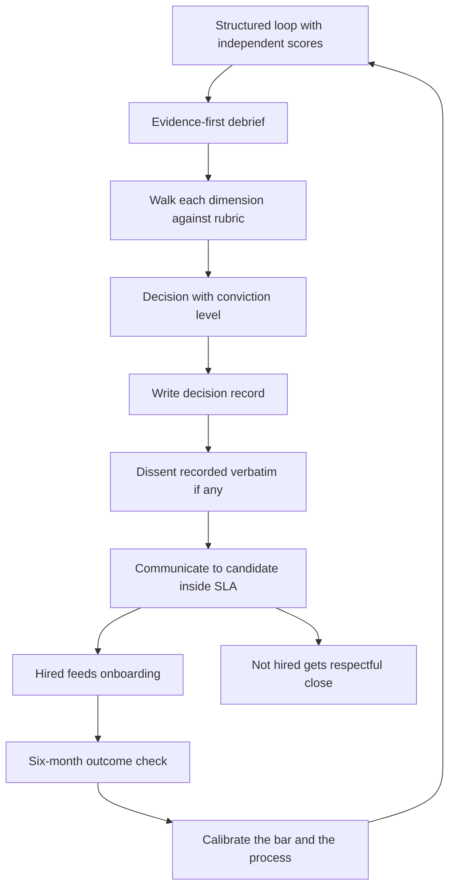

# Hiring Decisions and Debriefs

> **Core skill:** Running debriefs where written evidence against defined dimensions decides — before discussion, before seniority, before enthusiasm — and owning the bar over time.

## Why This Matters

The debrief is where the entire hiring system converges or collapses. A structured loop with independent scoring can still be undone by a debrief that goes around the room asking "so, what did everyone think?" — the first confident speaker anchors the room, the most senior opinion becomes the decision, and the written evidence is never consulted. The structured loop produced evidence; the unstructured debrief threw it away.

The manager owns the debrief format because the manager owns the decision and its consequences. A mis-hire costs the team months of drag, a probation conversation, and a re-hire; a false negative costs a strong engineer an opportunity and the company a hire — and nobody ever sees it happen. Discipline in the debrief is the only defense both ways.

The debrief is also where the bar lives. Every decision either holds the level defined in the JD or quietly renegotiates it under pipeline pressure. Managers who let urgency move the bar discover that the bar becomes a memory: each compromise becomes the precedent for the next one.

## Evidence First, Then Discussion

The format is strict: facts against dimensions, in writing, before any open discussion.

| Phase | What Happens | Time | Rules |
|-------|--------------|------|-------|
| 1. Evidence read-in | Each interviewer reads their written observations per dimension — facts only, no interpretation | 2-3 min each | No interruptions, no reactions, no early verdicts |
| 2. Clarification | Interviewers may ask each other about facts, not conclusions | 5 min | Questions about what was observed, not what it means |
| 3. Dimension walk | The group addresses each dimension: where does the evidence land on the rubric? | 10-15 min | Conflicts are resolved by weight of written evidence |
| 4. Decision | Each interviewer states hire / no-hire / strong-hire with conviction level | 5 min | The hiring manager decides; dissent is recorded, not suppressed |

The order is the mechanism. When verdicts come before evidence, the debrief measures the room's politics; when evidence comes before verdicts, it measures the candidate.

## Decision Options with Conviction Levels

A binary hire/no-hire loses information. Decisions carry conviction, and conviction shapes the next step.

| Decision | Conviction | Meaning | Typical Next Step |
|---------|------------|---------|-------------------|
| **Strong hire** | High, consistent evidence across dimensions | Would fight for this candidate | Fast-track offer; consider level conversation |
| **Hire** | Solid evidence, no material concerns | Meets the bar with margin | Standard offer process |
| **Lean hire** | Bar met, but one dimension thin | Evidence gap, not a red flag | Targeted follow-up interview on the thin dimension |
| **No-hire** | Evidence falls below bar on a weighted dimension | Not this role, maybe not this level | Prompt, respectful rejection |
| **Strong no-hire** | Disconfirming evidence on a core dimension | Do not reconsider for this role family | Prompt rejection; document reason for the record |

A "lean hire" that proceeds to offer without closing the evidence gap is a bet the manager is making silently. Make it a follow-up interview or make it consciously.

## The Bar and Its Trade-offs

The bar is not a constant; it is a managed tension between quality and velocity.

| Pressure | What It Tempts | Actual Trade-off | Discipline |
|----------|----------------|------------------|------------|
| Long vacancy, team hurting | Lower the bar "just this once" | A weak hire extends the pain — now you carry both the gap and the drag | The vacancy is temporary; a mis-hire is a year |
| Amazing pipeline | Raise the bar, keep interviewing | Marginal gain shrinks; time-to-fill grows; strong candidates accept elsewhere | If evidence clears the bar, decide |
| Urgent deadline | Skip a dimension or an interviewer | Undersampled dimensions produce mis-hires that the deadline then pays for | The loop is the minimum; compress scheduling, not coverage |
| Market downturn | Wait for perfect candidates | False negatives accumulate; employer brand absorbs the story | Hold the bar, hold the speed, decide on evidence |

Raising the bar is legitimate when the level definition says so — not when anxiety says so. Lowering it under pressure is how teams accumulate the mediocrity they later blame on "the market."

## Disconfirming Evidence Weighs More

Negative evidence is more predictive than positive evidence. Charisma, polish, and a great story can carry a candidate through positive impressions; a demonstrated failure at a core dimension rarely redeems itself after hire.

| Positive Signal | Weight | Negative Signal | Weight |
|-----------------|--------|-----------------|--------|
| Great system design discussion | Moderate | Could not explain their own past architectural decisions | Heavy |
| Warm, communicative | Low-moderate | Blamed every failure on others across all behavioral answers | Heavy |
| Solved the coding exercise | Moderate | Dismissive or hostile when challenged on a decision | Heavy |
| Impressive resume brands | Low | Interviewer caught exaggerating their contribution | Decisive |

The debrief explicitly asks: what is the strongest disconfirming evidence, and does the positive evidence outweigh it? A loop with no discussed negatives is usually a loop that did not probe, not a loop with a perfect candidate.

## Calibration Across Loops and Time

| Calibration Practice | What It Does | Cadence |
|----------------------|--------------|---------|
| Cross-manager debrief audits | A peer EM sits in on debriefs; compares bar application | Monthly |
| Mis-hire and false-negative review | What did the loop evidence actually say? | Every mis-hire |
| Score distribution review | Are some interviewers systematically harsher or softer? | Quarterly |
| Silver-medalist re-review | Would we hire them today? Did the bar drift? | Annually |

Calibration is what makes "the bar" a real, shared object rather than each manager's private mood.

## Disagree-and-Commit for Dissenters

| Situation | Handling |
|----------|----------|
| Interviewer has a strong no-hire, group leans hire | The concern is read into the record verbatim; the manager decides; the dissenter commits |
| Manager overrules a unanimous no-hire from interviewers | Requires written rationale; peer manager review — this is a red-flag pattern, not a right |
| Dissenter cannot commit | Escalate to the manager's manager or HR before the offer — never after |
| Dissent was right (retro discovered) | The mis-hire retro revisits whether dissent handling suppressed signal |

Disagree-and-commit is not disagree-and-stay-silent: the dissent goes on the record, with the dissenter's name, before the decision stands.

## Post-Decision Documentation



The decision record is short: decision, conviction, evidence summary per dimension, dissent if any, and the one-line rationale. It is the input to every later calibration and mis-hire retrospective.

## Mis-Hire Retrospectives

When a hire does not work out, the retro asks what the process missed — not who to blame.

| Retro Question | What It Uncovers |
|----------------|------------------|
| Which dimension did we under-assess? | Loop design gap |
| Was disconfirming evidence present and discounted? | Debrief discipline gap |
| Did urgency move the decision? | Bar management gap |
| Was the level wrong for the person? | Leveling gap in the JD |
| Did onboarding fail a capable hire? | Not a hiring failure — a [[07_Onboarding_Design]] failure |

## Practical Applications

**Debrief facilitation checklist:**

- [ ] All independent scores and written facts collected before the debrief starts
- [ ] Evidence read-in happens before any open discussion
- [ ] Every dimension is addressed explicitly against the rubric
- [ ] Strongest disconfirming evidence is named and weighed
- [ ] Decision recorded with conviction level and one-line rationale
- [ ] Dissent recorded verbatim where present
- [ ] Candidate communication sent inside the stated SLA
- [ ] Outcome check scheduled for the six-month mark

**Decision record template:**

```markdown
## Hiring Decision Record: [Candidate] — [Role, Level]

Decision: [Strong hire / Hire / Lean hire / No-hire / Strong no-hire]
Conviction: [High / Moderate / Split]

Evidence by dimension:
- [Dimension 1]: [Score and strongest fact]
- [Dimension 2]: [Score and strongest fact]

Strongest disconfirming evidence: [Fact and why it was outweighed, or why it decided]
Dissent: [Verbatim concern and dissenter name, or none]
Rationale: [One sentence]
```

## Common Pitfalls

| Pitfall | Why It Is a Problem | Better Approach |
|---------|---------------------|-----------------|
| **Round-robin verdicts first** | First speaker anchors; evidence never gets read | Evidence read-in before any discussion |
| **Seniority decides** | The most senior opinion substitutes for the weight of evidence | Manager synthesizes evidence; rank does not vote harder |
| **No-hire dissent silenced** | Suppressing dissent deletes the most predictive signal | Record dissent verbatim; disagree-and-commit |
| **Urgency-lowered bar** | Every compromise becomes precedent; the bar erodes silently | Compress scheduling, never coverage; decide on the level defined |
| **Ignoring negative evidence** | Charm carries the loop; the failure pattern surfaces post-hire | Disconfirming evidence gets explicit weight |
| **Undocumented decisions** | No calibration input; mis-hire retros start from memory | Short decision record for every loop |

## Success Indicators

- Debriefs open with evidence read-in, every time, without exception
- Decision records exist for every loop and feed quarterly calibration
- Mis-hire retros find process gaps, not scapegoats
- The bar holds across quarters regardless of pipeline pressure
- Dissent is present in the record when it existed in the room

## Related Topics

- [[04_Interview_Design_and_Running]]: independent scored evidence is the debrief's raw material
- [[02_Job_Definition_and_Leveling]]: the bar is defined here, not reinvented per debrief
- [[06_Closing_and_Offers]]: the decision record sets the level and frame for the offer
- [[07_Onboarding_Design]]: a strong decision becomes a strong hire only through onboarding
- [[01_People_Development/00_overview|People Development]]: mis-hires that are development failures, not selection failures

## Summary

Hiring decisions and debriefs is evidence discipline: written facts against defined dimensions before any discussion, decisions with conviction levels, disconfirming evidence weighted heavily, dissent recorded verbatim, and every decision documented for calibration. The bar is a managed tension — hold it under vacancy pressure, raise it only when the level definition says so. The manager's test: could an outside reader reconstruct why this decision was made from the record alone?
