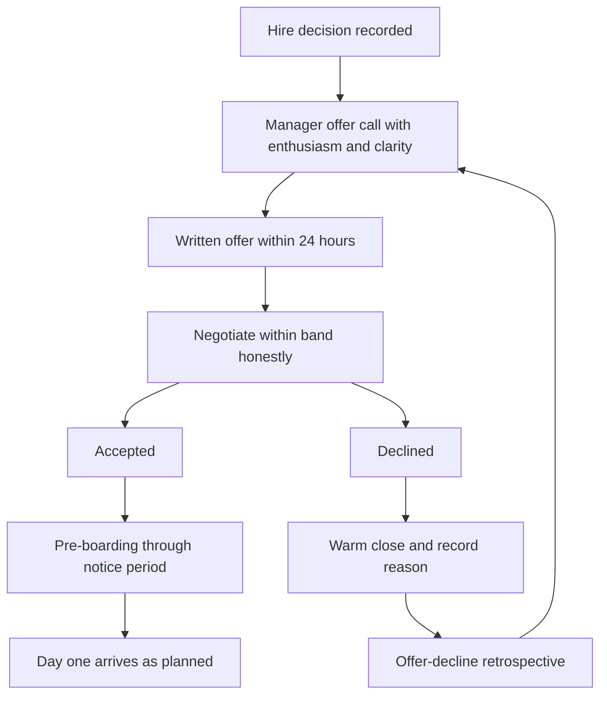

# Closing and Offers

> **Core skill:** Closing candidates by selling honestly throughout the process, constructing offers that survive scrutiny, and managing the offer-to-start window so accepted offers become day-one arrivals.

## Why This Matters

Teams celebrate the signed offer and stop working. But between "yes" and the first commit sits the abandonment window: counter-offers land, competitors call, doubt grows in silence, and start dates slide until they dissolve. A close that only begins at the offer stage is a close that begins too late — the candidate decided how it feels to join this team during the loop, in every interaction, long before the number arrived.

The offer itself is a trust test. A well-constructed offer — level stated, band explained, equity made comprehensible, timeline clear — reads as a company that has its act together. A lowballed-then-negotiated offer reads as a company where you must fight for every dollar, and the candidate carries that frame into the job.

And the manager's tone in the close sets the employment relationship. Managers who bid desperately produce hires who know they were bid for; managers who decline to enter bidding wars they would resent produce hires who joined for the work. The close is the first week of the relationship, not the end of the process.

## Selling Honestly Throughout the Loop

The close starts at the first screening call. Every interviewer is selling, and the only durable selling is honest selling.

| Stage | What the Candidate Is Deciding | Honest Sell Move |
|-------|-------------------------------|------------------|
| Screening call | Is this worth my PTO days? | Name the real problem space and the real team shape |
| Interviews | Do I respect these people? | Interviewers share what they genuinely work on, hard parts included |
| Manager conversation | Will I grow and be treated fairly? | Describe the growth path and the last hard quarter honestly |
| Debrief-to-offer gap | Did they forget about me? | Same-day or next-day updates; silence is where doubt grows |
| Offer stage | Should I change my life? | The offer call, manager-led, with enthusiasm and clarity |

The rule: never let a candidate discover a negative post-hire that they could have learned pre-offer. The hard parts of the job — on-call load, legacy systems, a rebuild in progress — belong in the sell. Candidates who accept knowing the truth stay; candidates who discover it in week three become churn statistics.

## Offer Construction

| Element | What to Decide Before the Call | Common Failure |
|---------|-------------------------------|----------------|
| Level | From the decision record — not inflated to close | Level creep that unravels in the first calibration |
| Base salary | Position within band: entry, mid, or top, justified by evidence | Anchoring at band minimum as an opening gambit |
| Equity | Grant size, vesting, and an honest explanation of value and risk | Handing over a number with no comprehension behind it |
| Bonus and refresh | How performance converts to comp over time | Omitting the refresh policy — candidates assume the worst |
| Start date flexibility | What is genuinely needed vs preferred | Fake urgency that erodes trust on day one |

Pay positioning is a fairness decision. The candidate hired at the top of the band for the same level as an incumbent at mid-band creates the equity problem that surfaces in every future compensation conversation.

## Navigating the Comp Band

| Situation | Manager's Move |
|-----------|----------------|
| Candidate expects above band, evidence supports band | Explain the band structure honestly; show the growth path to the next band |
| Candidate is genuinely exceptional, above band | Escalate for an exception with evidence — do not inflate level to fit the number |
| Pressure to lowball as an opening | Refuse; offers that open low read as adversarial and set the relationship tone |
| Band is uncompetitive for the market | Feed the data to HR and finance — a hiring-side problem, not a candidate-side negotiation |

## The Offer Call

The offer call is the manager's call — not HR's paperwork follow-up.

| Call Segment | Content | Why |
|-------------|---------|-----|
| Enthusiasm opener | "We want you on the team, and here is why" in specific terms | The decision to hire is a personal welcome, not a transaction |
| The offer itself | Level, comp structure, equity in plain terms | Numbers without context create anxious re-reading, not decisions |
| Expectations both ways | What success looks like in 90 days; what they can expect from you | Converts an abstract offer into a concrete future |
| Timeline | When you need a decision; what happens next on both sides | Respect plus momentum; open-ended offers decay |
| Questions | Genuine space for doubts and unfiltered questions | Doubts surfaced now are retentions saved later |

Written offer follows within 24 hours of the call. The gap between the verbal and the written is where doubt compounds.

## Competing Offers and Counter-Offer Dynamics

| Dynamic | Healthy Response | Trap |
|---------|------------------|------|
| Candidate has a competing offer at higher comp | Re-state your value honestly; use band flexibility you can live with | Entering a bidding war you will resent and remember |
| Current employer counters | Acknowledge it neutrally; ask what changed for them | Disparaging the counter reads as insecurity |
| Candidate asks you to match | Decide against your ceiling, not against panic | Matching "just this once" sets the relationship's negotiation frame |
| Candidate using your offer to lever theirs | Stay warm, hold your deadline, accept the outcome | Chasing — the resentment is mutual and durable |

The principle: never pay a price you will resent. Resentment survives the signature and surfaces in every future interaction — comp reviews, promotion cycles, and retention conversations.

## Rejections With Grace

The candidate who declines is a future pipeline member, a referral source, and a brand storyteller.

| Action | Standard |
|--------|----------|
| Response to decline | Same-day acknowledgment, warm, no guilt-tripping |
| Door open | "Stay in touch" with a real follow-up action where genuine |
| Ask why | One respectful question about what drove the decision |
| Record it | The decline reason feeds the offer-decline retro |

## Pre-boarding: The Abandonment Window

The weeks between acceptance and day one are the highest-risk window in the process.

| Risk | Pre-boarding Move |
|------|-------------------|
| Counter-offer pressure from current employer | Manager check-in at week one and week three |
| Doubt growing in silence | Weekly lightweight contact: team news, a coffee with a future teammate |
| Paperwork delays creating cold feet | HR process completes before the notice period ends, not during week one |
| Start-date slippage | Confirm the date at acceptance and again two weeks out |
| Buyer's remorse on big life changes | Normalize it; share what the first week actually looks like |

## The Closing System



## Offer Decline Retrospectives

Every decline is process data. A quarterly review of declines and abandonments answers: are we losing candidates at offer stage for comp, for role clarity, for speed, or for how the loop felt? Patterns in declines are cheaper to fix than empty requisitions.

## Practical Applications

**Closing checklist:**

- [ ] Every interviewer sells honestly — including the hard parts of the job
- [ ] Level and pay position decided before the offer call, justified by evidence
- [ ] Offer call is manager-led: enthusiasm, clarity, timeline, questions
- [ ] Written offer arrives within 24 hours of the call
- [ ] No bidding beyond what you can live with comfortably
- [ ] Declines get a warm same-day response and a recorded reason
- [ ] Pre-boarding contact scheduled: week one and week three check-ins
- [ ] Start date confirmed twice — at acceptance and two weeks out

**Offer call opening template:**

```markdown
We are delighted — the team wants you to join as [role, level].
Specifically, [interviewer name] was struck by [specific evidence from the loop].

The offer: [level] at [comp structure in plain terms].
The equity: [grant, vesting, and one honest sentence about risk and upside].

In your first 90 days you would [concrete expectation].
From me you can expect [manager commitment].

We would like your decision by [date]. What questions do you have — including
the ones that feel awkward to ask?
```

## Common Pitfalls

| Pitfall | Why It Is a Problem | Better Approach |
|---------|---------------------|-----------------|
| **Close starts at the offer** | The candidate's decision formed during the loop | Sell honestly in every stage, hard parts included |
| **Lowball-then-negotiate** | Sets an adversarial frame that outlives the signature | Open at the position the evidence justifies |
| **Bidding wars entered resentfully** | Resentment surfaces in every later comp conversation | Decide your ceiling; decline gracefully beyond it |
| **Abandoning the abandonment window** | Counter-offers and doubt win in silence | Scheduled pre-boarding contact through the notice period |
| **Hiding the job's hard parts** | Week-three discovery becomes churn | Honest sell: on-call, legacy, and rebuilds named up front |
| **HR-only offer communication** | Transactional tone at the most personal moment | Manager makes the call; HR handles the mechanics |

## Success Indicators

- Accept rates are strong without offers drifting above justified band positions
- Candidates cite the honest picture of the job in their acceptance reasons
- Start dates hold — abandonment is rare, and declines are declining quarter over quarter
- Decline reasons show no dominant fixable pattern
- Pre-boarding check-ins happen on schedule for every accepted offer

## Related Topics

- [[05_Hiring_Decisions_and_Debriefs]]: the decision record sets the level and frame the offer delivers
- [[03_Sourcing_and_Pipeline]]: declined candidates are next year's pipeline
- [[07_Onboarding_Design]]: the close hands off to a designed first 90 days
- [[04_Interview_Design_and_Running]]: the loop experience is most of the sell
- [[01_People_Development/00_overview|People Development]]: growth-path promises made in the close must be kept after

## Summary

Closing and offers is honest selling from the first call to the start date: sell the real job including its hard parts, construct offers that read as competence — level justified, band explained, equity comprehensible — lead the offer call personally, refuse bidding wars you would resent, and work the abandonment window with scheduled warmth until day one. Every decline is recorded data, every accepted offer is actively protected. The manager's test: does the new hire say later that the job was what they were told it would be?
