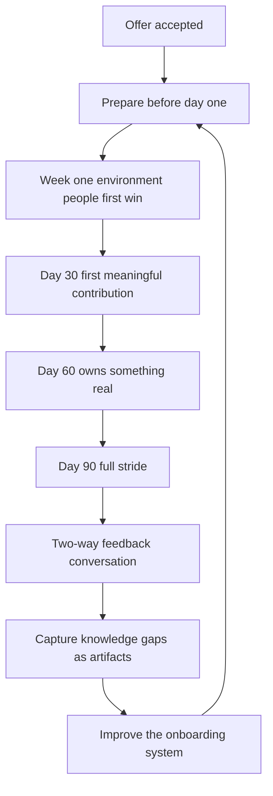

# Onboarding Design

> **Core skill:** Designing a deliberate 30/60/90 arc — environment, first win, first ownership, full stride — with a named buddy and a feedback loop that runs both ways.

## Why This Matters

The first ninety days decide more about a hire's trajectory than the ninety interviews before them. A new engineer who spends week one fighting laptop provisioning, week three still unsure who to ask about deploys, and week eight without anything shipped starts constructing a story: maybe this was a mistake. That story hardens fast, and "regretted attrition inside six months" is almost always an onboarding failure wearing a hiring costume.

Onboarding is also the manager's cheapest quality-improvement window. New eyes see what veterans have stopped noticing — the undocumented tribal step, the broken dashboard, the meeting that serves no one. A designed onboarding captures those observations deliberately; an accidental one lets them evaporate by week three as the newcomer normalizes.

And onboarding compounds. Every gap in the checklist is paid for by every future hire, plus every onboarding teammate who answers the same question for the tenth time. Designing it once, as a system, converts onboarding from a manager tax into an asset.

## The 30/60/90 Arc

| Phase | Theme | The New Hire Is... | The Manager Ensures... |
|-------|-------|--------------------|------------------------|
| Week 1 | Environment and people | Set up, oriented, introduced, and shipping something tiny | Access works, buddy is active, first win is queued and landable |
| Day 30 | First meaningful contribution | Owning a real, scoped piece of delivered work | Work is meaningful but bounded; feedback has happened at least weekly |
| Day 60 | Owning something | The named owner of a service, area, or recurring responsibility | Ownership is real but recoverable; the hire is in the normal team rhythm |
| Day 90 | Full stride | Operating at the level they were hired for | Two-way feedback: performance input given, onboarding input received |

The arc's logic is compounding confidence: tiny win, real contribution, real ownership. Each stage makes the next one credible. A hire given nothing real until month three has been given three months of doubt instead.

## Week One: Environment, People, First Tiny Win

| Element | Standard | Failure Mode |
|---------|----------|--------------|
| Environment | Laptop, accounts, repo access, and dev environment working by day two | "IT ticket is pending" consuming week one |
| People | Intro meetings scheduled in advance, not improvised | A month of nodding at strangers on calls |
| First win | A small, real change shipped to production inside week one | "Read the docs" as the entire first-week plan |
| Manager time | Daily 15-minute check-ins, first week only | Manager availability "when things settle down" |
| Documentation | A written first-week path the hire can follow alone at 3am | Oral tradition requiring a person online |

The first tiny win matters disproportionately: it proves the pipeline works, produces a first contribution visible to the team, and converts the hire from observer to participant. A typo fix in the README is a fine first PR; the point is the passage, not the size.

## Day 30 and Day 60: Contribution to Ownership

| Milestone | What It Looks Like | Manager's Role |
|-----------|--------------------|----------------|
| First meaningful contribution (by day 30) | A feature, fix, or improvement of real value, delivered with review | Scope it personally: meaningful but landable |
| First design or proposal (by day 45) | The hire writes or reviews a design and defends it in review | Create the opening; do not rescue too early |
| Named ownership (by day 60) | A service, rotation, or area carries the hire's name | Make ownership explicit in team artifacts |
| Normal rhythm (by day 60) | Planning, on-call shadowing, code review participation | Verify participation is actually happening |

## Day 90: Full Stride and the Two-Way Feedback Loop

By day 90 the hire is operating at their hired level, and two conversations happen. First, the manager gives a real performance signal — early, specific, corrective while it is still cheap. Second, the manager asks for the onboarding retrospective: what was confusing, what was missing, what should change for the next hire. Both directions, same meeting is fine; both directions, always.

## The Buddy System

| Buddy Responsibility | Standard |
|----------------------|----------|
| Day-one breakfast or coffee | The first human anchor |
| All the "dumb questions" | Explicitly invited: how deploys work, who to ask about X |
| First-PR walkthrough | The local workflow rituals the docs never capture |
| Weekly sync | Scheduled, 30 minutes, for four weeks minimum |

The buddy is not the mentor and not the manager — the buddy is the safe channel. Rotate the role; buddy duty is onboarding experience that compounds into team capability.

## The Manager's Onboarding Role

| Cadence | Content |
|---------|---------|
| Before day one | Paperwork done, equipment ordered, buddy briefed, first-week calendar built, team announced |
| Daily, week one | 15-minute check-in: unblock, orient, listen |
| Weekly, through day 90 | Check-in on work, integration, and energy; feedback both directions |
| Day 30 / 60 / 90 | Milestone conversations against the arc: is the trajectory holding? |

Expectation setting is the manager's job alone: what success looks like at 30, 60, and 90 days, stated in week one, written down. A hire who discovers expectations at the first performance review was managed by surprise.

## Onboarding as Knowledge Capture

The new hire's confusion is a map of the team's undocumented knowledge.

| New Hire Notices | Convert Into |
|------------------|--------------|
| "The deploy doc skips a step" | A doc fix PR in week one |
| "Nobody knows why this job runs" | An ownership decision or a deletion |
| "This dashboard is broken" | A ticket with fresh context attached |
| "Why does this meeting exist?" | A meeting audit item |

Institute the rule: every onboarding friction becomes a written artifact within the first month, while it still feels strange. After month one, the newcomer is a veteran and the knowledge is gone.

## Measuring Onboarding Success

| Metric | Definition | Healthy Signal |
|--------|------------|----------------|
| Time-to-first-commit | Day one to first merged PR | Under five working days |
| Time-to-first-meaningful-contribution | To first delivered feature or fix | Under 30 days |
| Time-to-productive | To operating at hired level | Inside 90 days |
| 90-day retention | Hires still present and engaged at day 90 | Effectively all of them |
| Onboarding retro completion | Every hire completes the two-way retro | Every single one |

## The Onboarding System



## Practical Applications

**Onboarding checklist:**

- [ ] Equipment, accounts, and access requested before day one
- [ ] Buddy assigned, briefed, and scheduled
- [ ] First-week calendar built: intros, norms, daily manager check-ins
- [ ] First tiny win queued and landable in week one
- [ ] 30/60/90 expectations written and shared in week one
- [ ] Day-30 meaningful contribution scoped in advance
- [ ] Ownership conversation scheduled for day 60
- [ ] Day-90 two-way retro on the calendar from day one

**Day-90 retro template:**

```markdown
## Onboarding Retro: [Hire] — [Date]

What worked:
- [Practice to keep]

What was confusing or missing:
- [Friction point] — [artifact it should become]

What we will change for the next hire:
- [Change] — [owner]

Manager signal to hire:
- [One specific strength] — [one specific adjustment]
```

## Common Pitfalls

| Pitfall | Why It Is a Problem | Better Approach |
|---------|---------------------|-----------------|
| **Onboarding as paperwork** | Week one burns on IT tickets; doubt starts early | Environment ready before day one; first win queued |
| **Nothing real for a month** | Competence never demonstrated; confidence erodes | Tiny win in week one, meaningful contribution by day 30 |
| **Expectations discovered at review time** | The hire was managed by surprise; correction is expensive | Written 30/60/90 expectations in week one |
| **Manager ghosting after week one** | Drift with no early correction, for either side | Weekly check-ins through day 90, without exception |
| **New eyes ignored** | Team's undocumented gaps stay invisible | Every friction becomes an artifact within the first month |
| **Onboarding rebuilt per hire** | Every hire pays the same discovery tax again | A maintained system that each retro improves |

## Success Indicators

- New hires ship something in week one, every time
- Time-to-productive trends down quarter over quarter as the system improves
- 90-day retention is effectively perfect
- Onboarding retros produce artifacts, not just sentiments
- Buddies rotate and the buddy role is sought, not dodged

## Related Topics

- [[06_Closing_and_Offers]]: the close hands off to onboarding; promises made there are kept here
- [[01_Workforce_Planning]]: onboarding drag is a real cost in the headcount case
- [[05_Hiring_Decisions_and_Debriefs]]: mis-hire retros must distinguish selection failures from onboarding failures
- [[01_People_Development/00_overview|People Development]]: day 90 is where development conversations formally begin
- [[02_Team_Formation_and_Health/00_overview|Team Formation and Health]]: each onboarded hire changes team dynamics

## Summary

Onboarding design is a deliberate 30/60/90 arc — environment and a first tiny win in week one, a meaningful contribution by day 30, real ownership by day 60, full stride and a two-way retro at day 90 — supported by a named buddy, weekly manager check-ins, and written expectations from week one. New eyes are the cheapest process-improvement instrument the team has; capture their observations while they still feel strange. The manager's test: did the hire reach the level they were hired for, with confidence intact and feedback given in both directions?
