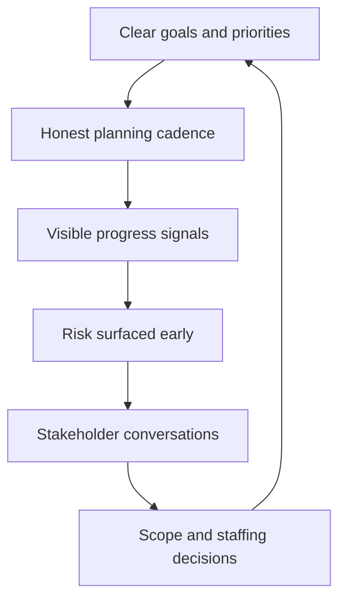

# Delivery Leadership for Managers

> **Core capability:** The engineering manager creates the conditions for delivery — clear goals, honest scope decisions, visible progress, and managed risk — without becoming the team's project manager or its bottleneck.

## Why This Matters

The EM is accountable for the team delivering, but achieves it through the team, not by running the plan personally. The failure modes are symmetric: the absentee manager (no clarity, no priorities, team drifts) and the micromanager (every ticket inspected, every estimate renegotiated, team infantilized).

The middle path is a delivery system: goals the team understands, a planning cadence that produces honest commitments, progress signals the manager reads without interrogating, and escalation paths that surface trouble while it is still cheap. The tech lead runs the technical delivery; the EM owns the delivery conditions — staffing, clarity, priorities, and stakeholder reality.

## Topics in This Capability Area

| Topic | Core Skill | When It Matters |
|-------|------------|-----------------|
| [[01_Goal_Setting_and_Priorities]] | Translating strategy into clear team goals | Quarterly planning; strategy shifts |
| [[02_Planning_Cadences_and_Commitments]] | Running planning that produces honest commitments | Sprint, quarterly, and ad-hoc planning |
| [[03_Scope_and_Priority_Management]] | Making scope decisions visible and honest | Every change request; capacity crunches |
| [[04_Progress_Visibility_and_Reporting]] | Reading delivery health without interrogating | Weekly; stakeholder updates |
| [[05_Delivery_Risk_Ownership]] | Owning the team's delivery risk posture | Planning; mid-cycle drift; escalations |
| [[06_Stakeholder_Relationship_Management]] | Managing the delivery conversation with partners | Continuously; expectation resets |
| [[07_Delivery_Interrupts_and_Firefighting]] | Protecting delivery from chaos and triage load | Support spikes; production fires; ad-hoc requests |

## The Manager's Delivery System

## EM vs Tech Lead in Delivery

| Aspect | Tech Lead owns | Engineering Manager owns |
|--------|----------------|--------------------------|
| Estimation | The team's estimation practice | Whether commitments are honest and staffed |
| Scope | Technical scope of features | Business scope and priority trade-offs |
| Progress | Delivery flow and blockers | Progress signals and stakeholder reporting |
| Risk | Technical delivery risk | Staffing, dependency, and commitment risk |
| Escalation | Unblocking technical work | Escalating to management; negotiating scope |

## Practical Applications

### Delivery Conditions Checklist

- [ ] Team goals exist, connect to strategy, and everyone can state them
- [ ] Planning produces commitments the team actually believes
- [ ] Scope changes are decisions, not drift — visible and owned
- [ ] Progress is visible without the manager asking status questions
- [ ] Top delivery risks have owners and mitigation plans
- [ ] Stakeholders hear progress and problems from the manager first
- [ ] Interrupt and firefight load is measured and bounded

## Common Pitfalls

| Pitfall | Why It Is a Problem | Better Approach |
|---------|---------------------|-----------------|
| **Status collector** | Manager becomes reporting bottleneck; team stops owning progress | Self-updating signals; exceptions-only reporting |
| **Commitment theater** | Promises made to please; broken quietly later | Commit to what the evidence supports |
| **Invisible scope creep** | Team absorbs requests; capacity mysteriously vanishes | Scope board; every change gets a decision |
| **Hero-mode normalization** | Crunch becomes the plan; burnout follows | Plan sustainably; protect the runway |

## Success Indicators

- The team can explain why the current work is the priority
- Commitments are met or renegotiated early and openly
- Stakeholders trust the team's signals without private channels
- Risk conversations happen before risks become incidents
- Firefighting is exceptional, not structural

## Related Capabilities

- [[06_Technical_Context_for_Managers/00_overview|Technical Context for Managers]]: enough technical depth to read delivery honestly
- [[05_Organizational_Awareness_and_Influence/00_overview|Organizational Awareness and Influence]]: priorities and scope land in org reality
- [[career-path/05_Tech_Lead/04_Team_Delivery_and_Execution_Leadership/00_overview|Delivery and Execution Leadership (Tech Lead)]]: the technical delivery layer this pairs with
- [[career-path/12_Technical_Program_Manager/00_overview|Technical Program Manager]]: the specialist path for cross-team program delivery

## Summary

Delivery leadership for managers means owning the conditions, not the plan: clear goals, honest commitments, visible progress, owned risk, straight stakeholder conversations, and bounded chaos. The manager's test is simple — the team delivers reliably, and nobody had to be interrogated to find that out.
